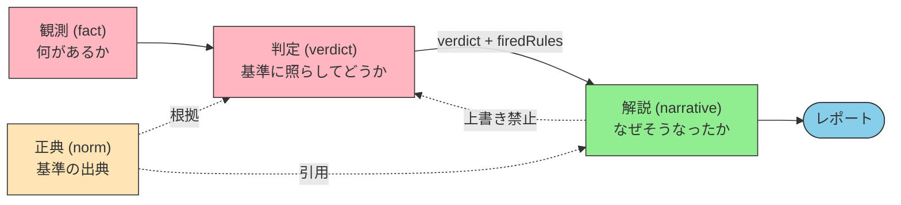
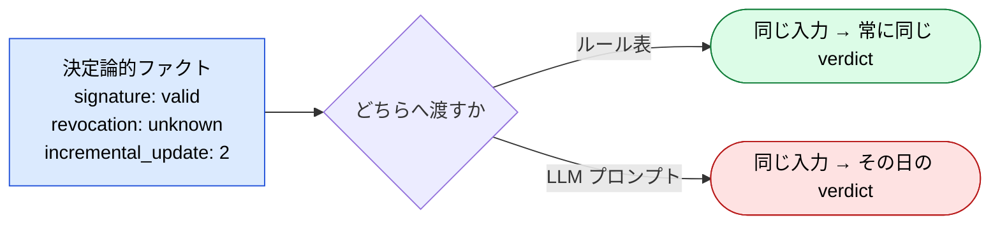

# 判定の決定論性 — 観測 / 判定 / 解説の三段分離

> 「これは信用してよいか」に確率的な答えを返すシステムは、実務では使えない。

## このドキュメントについて

[MCP Family](./mcp-family) では「ジャッジはコード、ナラティブは LLM」を **族の内部規律** として述べた。本ページはそれを **族を跨いだ一般規律** に昇格させる。

扱うのは 4 つである。(1) 観測・判定・解説をどこで割るか、(2) どの MCP が判定層を持つべきかの判断、(3) 基準を明文化できない領域をどう扱うか、(4) 時間軸の故障モード（判定ドリフト）にどう備えるか。

::: warning このページの位置づけ
[MCP Family](./mcp-family) が「一つのドメインを **どこで割るか**」を扱うのに対し、本ページは「割った先の **判定層をどう設計するか**」を扱う。誰に何の権限を渡すかという境界の外側の話は [permission-vs-authority](./permission-vs-authority)、判定器そのものの品質（弱い Judge 問題）は [routing-vs-cascading](./routing-vs-cascading) を参照。
:::

::: details メタ情報

|                              |                                                                                                                          |
| ---------------------------- | ------------------------------------------------------------------------------------------------------------------------ |
| **このページで固定するもの** | 三段分離の定義、判定層の帰属判断、四値判定、ルール表の書式、再現性の担保手順、回帰監視                                     |
| **扱わないこと**             | 個別ドメインの判定基準、単一 MCP の実装手順（→ [mcp/development](../mcp/development)）、非決定性が生じる機構（→ 姉妹サイト） |
| **依存**                     | [mcp-family](./mcp-family)、[permission-vs-authority](./permission-vs-authority)、[mcp/what-is-mcp](../mcp/what-is-mcp)     |
| **誤用ポイント**             | LLM に verdict を出させること、`temperature=0` で決定論になったと考えること、欠測を「問題なし」に丸めること                 |

:::

> [!TIP]
> **3 行で言うと**
>
> - **判定 (verdict) は観測とも解説とも別の層である。** 三つを一つのプロンプトに混ぜた瞬間、監査可能性が消える。
> - 判定層をコードに置けるかは、ドメインの難しさではなく **基準が事前に書けるか** で決まる。書けない基準は LLM に丸投げするのではなく、「判定不能」として返す。
> - どうしても LLM に判定させるなら、再現性は自力で作るしかない。`temperature=0` は必要条件にすぎず、しかも廃止されつつある。

## 三段分離



| 段 | 問い | 出力 | 実装 | 揺れてよいか |
| --- | --- | --- | --- | --- |
| **観測** | 何があるか | 事実・測定値 | コード（MCP） | ❌ |
| **判定** | 基準に照らしてどうか | verdict + 発火ルール | **コード（ルール表）** | ❌ |
| **解説** | なぜその判定か / 次に何をすべきか | 自然言語 | LLM（Skill） | ✅ 表現のみ |

> [!IMPORTANT]
> 三段の見分け方は **「揺れてよいか」** の一点で決まる。解説は揺れてよい。同じ判定に対して今日と明日で言い回しが違っても、下流の意思決定は変わらないからである。**verdict は下流に取り込まれる 1 ビットであり、解説は人間が読む文章である。** この非対称性が分離の根拠であり、それ以上の理由は要らない。

### なぜ混ぜてはいけないか

検証結果は 1 か 0 である。署名は有効か、増分更新が本文を書き換えているか、失効確認が取れたか ── いずれも嘘のない離散値として得られる。

その離散値の列を LLM に渡して「総合的に判断して」と言った瞬間、**1/0 の列が確率分布に変換される**。ここで情報は一切増えていない。増えたのは分散だけで、失われたのは再現性である。これを **決定論的ファクトの確率的まるめ** と呼ぶ。



> [!CAUTION]
> 症状は「たまに違う答えが返る」という形では現れない。**大半の入力では正しく、判断が最も難しい境界事例だけが割れる。** 抜き取り確認では見えず、一番人間が確認したいところで壊れる。「何度か試したが問題なかった」は反証にならない。

## 判定層をどこに置くか — 族横断の判断

「観測を返す MCP」を作ると、次に必ず「で、これは OK なのか」を聞かれる。そのときどこに判定を置くかは、ドメインごとに答えが違うように見えて、実際は一つの問いに還元できる ── **基準を事前に書けるか**。

| 族 | 観測層が返すファクト | 判定に要る基準 | 基準は事前に書けるか | 判定層の置き場所 |
| --- | --- | --- | --- | --- |
| **PDF** | 署名検証、veraPDF verdict、増分更新履歴 | 受入プロファイル | ✅ ISO / ETSI / 社内規程 | **コード** — `evaluate_policy` として実装済み |
| **翻訳品質** | XCOMET スコア、エラースパン | 納品閾値 | ✅ 数値閾値 | **コード** — 未実装（`xcomet_evaluate` は観測まで） |
| **Web 互換性** | BCD 対応データ | 対象ブラウザ・シェア閾値 | ✅ Baseline 定義 | **コード** — `compat_get_baseline` が近い |
| **座標系** | CRS 定義、変換パラメータ、精度 | 用途ごとの許容誤差 | ✅ 精度要件 | **コード** — `validate_crs_usage` が近い |
| **会計** | 仕訳、試算表、税区分 | 勘定科目の割当規則、税務上の扱い | ✅ 勘定科目表 + 通達 | **コード** — 未実装 |
| **法令** | 条文原文、通達、裁決事例 | 当該事案への当てはめ | ⚠️ **要件は書けるが事実認定は書けない** | **コード（要件充足）+ 判定不能の明示** |

> [!IMPORTANT]
> 表を分けているのは **ドメインの難しさではない**。「この PDF は信用できるか」は書ける。「この経費は損金算入できるか」も、要件の充足までは書ける ── 書けないのは「この支出が事業関連か」という事実認定の部分である。**書けない部分は LLM に渡すのではなく、書けなかったこと自体を判定結果として返す。**

### 二値ではなく四値にする

pass / fail の二値しか持たないルール表は、書けない部分を必ずどちらかに押し込む。そして押し込む方向は、実装者の気分か、その日の LLM の気分で決まる。

| verdict | 意味 | 下流の扱い |
| --- | --- | --- |
| `trust_and_use` | すべてのルールが充足 | 自動処理へ流す |
| `use_with_caution` | 軽微な逸脱あり。用途を限れば使える | 用途制限つきで流す |
| `human_review_required` | **判定に必要なファクトが欠けている / 基準が書けない領域** | 人間へエスカレーション |
| `reject` | 決定的な違反 | 止める |

> [!IMPORTANT]
> 四値の要点は 3 番目にある。**「判定できなかった」を判定結果として持つこと** が、LLM への漏出を塞ぐ唯一の設計である。これが無いと、判定不能なケースは必ず「LLM に聞いてみよう」に流れる。

## ルール表の書き方

判定層をコードに置くとき、守るべき書式は 5 つしかない。

1. **入力は観測層のファクトのみ。** 自然言語（文書本文・利用者の説明）を入力に取らない。取った瞬間、判定基準が入力内容に条件付けられる。
2. **ルールは順序付きで、勝敗規則を一つに固定する。** 「最初に発火したものが勝つ」か「最も重い verdict が勝つ」か、どちらかに決める。両方混ぜると同じ入力で結果が変わる。
3. **発火したルール ID を必ず出力する。** これが解説層の入力になる。`firedRules` の無い verdict は、監査に耐えない。
4. **欠測は欠測として持つ。既定値で埋めない。**
5. **プロファイルを差し替え可能にする。** 同じファクトでも、用途によって受入基準は違う。基準を切り替えても判定ロジックは変えなくて済む形にする。

```ts
// 疑似コード: ファクト → verdict
type Fact = { signature: 'valid' | 'invalid'; revocation: 'ok' | 'revoked' | 'unknown'; /* ... */ };

const rules: Rule[] = [
  { id: 'SIG-01', when: f => f.signature === 'invalid',      verdict: 'reject' },
  { id: 'REV-01', when: f => f.revocation === 'revoked',     verdict: 'reject' },
  // 「確認できなかった」は「問題なし」ではない
  { id: 'REV-02', when: f => f.revocation === 'unknown',     verdict: 'human_review_required' },
];
```

> [!WARNING]
> 最も多い実装ミスは、**取得できなかったことを「問題なし」に丸める** ことである。「失効確認サーバがタイムアウトした」は「失効していない」ではない。欠測をどちらかの側に既定値として倒すと、システムは静かに甘くなる。**欠測は欠測として verdict に伝播させる。**

## 解説層に何を渡すか

| 渡すもの | 理由 |
| --- | --- |
| verdict と発火ルール ID | 解説の対象。これを説明するのが仕事 |
| 観測層のファクト | 「なぜ」を具体的に書くための材料 |
| 正典への参照（条項・規格番号） | 根拠の引用に使う |
| **渡さないもの: 判定を変える権限** | プロンプトに「再評価してよい」と読める余地を残さない |

> [!TIP]
> 役割の言い換えが有効である。LLM は **裁判官ではなく、判決文を書く書記官** である。判決主文は先に確定していて、LLM が書くのは理由の部分だけ。この比喩を Skill の冒頭に置いておくと、実装が迷いにくい。

## 再現性の担保 — LLM を判定に使わざるを得ないとき

判定層をコードに落とせない段階では、暫定的に LLM に判定させることになる。そのときは、再現性を **自力で作る** 必要がある。

| # | 手順 | 効果 |
| --- | --- | --- |
| 1 | 呼び出し箇所で `temperature=0` を **明示** する | プロバイダ既定（多くは 1.0）が黙って適用されるのを防ぐ |
| 2 | `seed` を指定し、実行メタデータに記録する | 対応プロバイダでのみ有効 |
| 3 | 判定を複数回実行し、点推定ではなく **分散** を報告する | パラメータ廃止に耐える唯一の手段 |
| 4 | 判定の不一致率を **一級のヘルスメトリクス** として出す | 不一致の高い項目はルール表へ昇格させる候補 |
| 5 | 実効設定（モデル識別子・解決済みバージョン・温度・シード・**解決された API エンドポイント**）を成果物に記録する | 事後の説明責任 |
| 6 | 境界事例の固定テストセットで回帰を継続監視する | 次節のドリフト検知 |

> [!CAUTION]
> **`temperature=0` は必要条件であって十分条件ではない。** 強制 greedy デコード（`top_k=1`）でも判定は割れる。非決定性はサンプリング段階より前、forward pass の内部で発生しているためである。さらに Claude Opus 4.7 / 4.8 は temperature の指定自体を HTTP 400 で拒否する。**「つまみを固定する」戦略には寿命がある。** 機構の詳細は姉妹サイトの [判定ドリフト](https://shuji-bonji.github.io/understanding-llm-through-claude-code/ja/appendix/judgment-drift) を参照。

## 判定ドリフト — 時間軸の故障モード

判定を LLM に置いた系には、実行ごとの揺れとは別に、もう一つの故障モードがある。**プロンプトもコードも変えていないのに、ある日から判定が変わる。**

原因は提供モデルの差し替えである。これが厄介なのは次の 3 点による。

- **diff に現れない。** リポジトリにも設定ファイルにも変化がない
- **改善として起きる。** 提供側は性能向上のために更新している。「賢くなった」結果、以前は機械的に `reject` していたケースに気を利かせて `use_with_caution` を返すようになる
- **方向が読めない。** 厳しくなるか甘くなるかはタスクごとに違う

**対処は 3 点セットになる。**

1. **ゴールデンセット** — 境界事例だけを集めた固定入力と期待 verdict の対を持つ
2. **CI での回帰監視** — 依存を何も変えていない状態で定期実行し、verdict が変わったら落とす
3. **判定ログの保存** — 過去の判定を再現できる形（入力ファクト + プロファイル + 実効設定）で残す

> [!IMPORTANT]
> **判定層をコードに置いた族は、この故障モードに構造的な免疫を持つ。** ルール表は誰かの都合で勝手に更新されないからである。再現性・監査可能性と並んで、これが「判定はコード」という規律の最大の実利である。逆に言えば、LLM に判定を置いたまま長期運用する系は、**自分の管理外にある変更に判定基準を握られている**。

## 設計チェックリスト

- [ ] 観測・判定・解説が **別の層** として分かれているか（同じプロンプトに同居していないか）
- [ ] 判定層の入力は **ファクトのみ** か（文書本文などの自然言語が混ざっていないか）
- [ ] verdict は **四値** で、「判定できなかった」を表現できるか
- [ ] 発火ルール ID (`firedRules`) を出力しているか
- [ ] **欠測を既定値で埋めていない** か（「確認できなかった」を「問題なし」にしていないか）
- [ ] 受入基準は **プロファイル** として差し替え可能か
- [ ] 解説層のプロンプトに「判定を再評価してよい」と読める余地が無いか
- [ ] LLM 判定が残っている箇所について、`temperature=0` の明示・複数回実行・不一致率の可視化を行っているか
- [ ] **境界事例のゴールデンセット** があり、CI で回帰監視しているか
- [ ] 判定を再現できる形（入力ファクト + プロファイル + 実効設定）でログを残しているか

## 関連ドキュメント

- [mcp-family](./mcp-family) — 一つのドメインを複数 MCP に割る。「ジャッジはコード、ナラティブは LLM」の初出
- [permission-vs-authority](./permission-vs-authority) — 行為の裁量を渡す話（本ページは判定の権限を渡す話）
- [routing-vs-cascading](./routing-vs-cascading) — 弱い Judge がカスケードを壊す問題。判定器の品質側
- [loop-engineering](./loop-engineering) — 外側ループの工学。判定層は閉ループの採点器にあたる
- [concepts/05-solving-ai-limitations](../concepts/05-solving-ai-limitations) — 確率的推論と決定論的検証の分離
- [mcp/semantic-layer](../mcp/semantic-layer) — 確率的解釈と決定的コンパイルの分業。同型の別ドメイン適用
- [skills/conversation-to-skill](../skills/conversation-to-skill) — 再現性のスペクトラム（LLM 判断を挟む箇所は少ないほどよい）

## 🔗 さらに深く: なぜ LLM の判定は再現しないのか

本ページは判定層の **設計 (What/How)** を扱った。「**なぜ** LLM の判定が揺れるのか」「なぜ `temperature=0` では足りないのか」を LLM の構造的制約から理解したい場合は、姉妹サイトを参照。

- [understanding-llm / 判定ドリフト](https://shuji-bonji.github.io/understanding-llm-through-claude-code/ja/appendix/judgment-drift) — 非再現性の 3 層（推論基盤・評価バイアス・モデル更新）と、緩和策の限界
- [understanding-llm / Sycophancy](https://shuji-bonji.github.io/understanding-llm-through-claude-code/ja/01-llm-structural-problems/sycophancy/) — 自己レビューが機能しない理由。判定バイアスの源泉
- [understanding-llm / Authority と LLM の構造的制約](https://shuji-bonji.github.io/understanding-llm-through-claude-code/ja/appendix/authority-and-llm-constraints) — 持続的な権限委譲が難しい構造的理由

---

> **前へ**: [MCP Family](./mcp-family.md)
> **次へ**: [ローカル LLM 環境への 5 層モデルの写像](./local-llm-workspace-mapping.md)

**最終更新**: 2026 年 7 月
