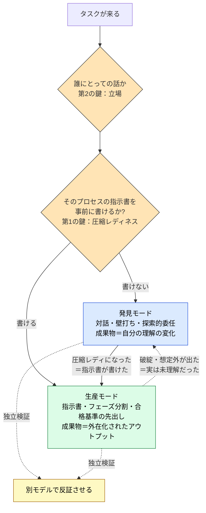

# Discovery vs Production — LLM 協働のモード選択

> 「テンプレは死んだ／生きている」を争っても永遠に振り子が往復するだけ。問うべきは、そのタスクが**発見**なのか**生産**なのか、だ。

## このドキュメントについて

> [!NOTE]
> 本ページは、LLM との協働を **発見モード（discovery）** と **生産モード（production）** という単一の軸で整理する。プロンプト/テンプレート論争が噛み合わない理由を診断し、いつ・誰にとってモードを切り替えるべきかを、LLM の構造的制約から逆算して示す。

この軸は、本サイトの [Loop Engineering](./loop-engineering)（外側ループの自動化）が前提とする**人間側の判断枠組み**にあたる。発見/生産が「人の頭の中」のモード選択を扱うのに対し、Loop Engineering はその分離を**インフラに固定**する工学を扱う。

> [!TIP]
> **3 行で言うと**
>
> - AI 活用の議論が噛み合わないのは「どちらのやり方が万能か」を争い、**発見か生産かという軸**を欠いているから。万能なやり方は存在しない。
> - **発見モード**＝理解を育てる局面、**生産モード**＝再現可能な成果を出す局面。優劣ではなく**適合**。
> - 切り替えの第 1 の鍵は **圧縮レディネス**（「指示書を書けるか」）、第 2 の鍵は **立場**（誰にとって圧縮済みか）。

> [!WARNING]
> **このページの位置づけ**
> [Doctrine と Intent](../concepts/07-doctrine-and-intent)（何を基準に判断するか）→ **本ページ（発見/生産のモード選択）**→ [Loop Engineering](./loop-engineering)（生産モードの外側ループをシステムに固定する）という鎖の中央に位置する。

## プロンプト論争が噛み合わない理由

AI 活用の言説は、いま二つの極の間で振れている。一方には「保存必須のプロンプト 100 選」「完全攻略テンプレート」があり、もう一方にはその反動で「プロンプト集を捨てろ、対話力だけでいい」「最新 AI が意図を補完するからプロンプトを学ぶ時間は無駄」がある。

どちらも一理あるのに噛み合わないのは、**両者が「どちらの単一のやり方が万能か」を争っているから**だ。そもそも万能なやり方は存在しない。やり方を決めるのは、タスクが**発見**なのか**生産**なのかという別の軸である。この軸を持たないまま「テンプレは死んだ／生きている」を議論しても、振り子が往復するだけになる。

## 二つのモード

| | 発見モード（discovery） | 生産モード（production） |
| --- | --- | --- |
| **いつ** | まだ何を作るか分かっていない | 作るものの形が分かっている |
| **やり方** | 雑な考えを投げて壁打ち・探索 | 指示書・フェーズ分割・合格基準の先出し |
| **成果物** | **自分の理解の変化** | **出力そのもの** |
| **反復性** | 一回性 | 反復する＝型にする価値がある |

この二つは優劣ではない。答えの形が分かっている仕事に発見モードを使えば、ただ遅くて再現性がない。逆に、まだ何も分かっていない段階で生産モードの型を強制すれば、理解する前に構造を固めてしまう。**どちらも、間違った局面で使うと失敗する。**

## なぜ分けるのか — 根拠は LLM の構造的制約

「なんとなくのベストプラクティス」では弱い。この使い分けは、LLM の構造的性質から論理的に導ける。特に効くのは次の 3 つだ。

- **Context Rot** — コンテキストが長くなるほど出力品質が落ちる。
- **Instruction Decay** — 長いセッションでは、最初に渡した指示の影響力が薄れる。
- **Sycophancy** — 明確な合格基準がないと、LLM は「一応動いているので大丈夫です」と甘い判断に流れる。

発見モードは、この制約と**相性が良い**。探索は一回性で、コンテキストが汚れても捨てればいい。理解が育つことが目的だから、出力の厳密さは二の次でいい。

一方、生産モードはこの制約に**正面からぶつかる**。だから対策が要る。

| 生産モードの「型」 | 対策する制約 |
| --- | --- |
| 一括依頼せずフェーズに分ける | Context Rot |
| 指示を成果物ファイルに外在化しパスで渡す | Instruction Decay |
| 合格基準を実装前に決めておく | Sycophancy |

ここが肝心だ。**生産モードの「面倒な型」は、LLM の構造的制約から逆算された必然であって、儀式ではない。** 同じ道具に対して、局面によって必要な規律が変わる。これが「使い分け」の根拠だ。

## 第 1 の鍵：いつ切り替えるか — 圧縮レディネス

発見から生産へ、いつ移ればいいのか。判定基準はひとつ、**「指示書を書けるか」**だ。

| 問い | 発見 | 生産 |
| --- | --- | --- |
| 合格基準を**事前に**書けるか | 書けない（やって初めて分かる） | 書ける |
| 出力の**形**は既知か | 未知 | 既知 |
| 価値はどこに宿るか | 自分の理解の変化 | 成果物そのもの |
| 反復するか | 一回性 | 反復する＝型にする価値がある |
| **指示書を書けるか** | まだ書けない | 書ける |

歩いて分解した結果、そのプロセスが「指示書（Claude Code でいう CLAUDE.md に相当するもの）に畳めるほど理解された」と感じた瞬間 —— そこが切り替え点だ。これを **圧縮レディネス**と呼ぶ。理解が、再利用可能な手順に圧縮できる状態になったか、ということである。

重要なのは、切り替えの鍵が「プロジェクトの局面（探索期か構築期か）」ではなく、**「そのプロセスが圧縮可能になったか」という認識状態**だという点だ。同じプロジェクトの中でも、理解済みの部分は生産モードで、未理解の部分は発見モードで、と混在する。

### 圧縮レディネスの具体指標

「指示書を書けるか」は有用だが主観に流れやすい。**観察可能で検証しやすい指標**として、4 つのレイヤーで具体化する。

**① 自己診断チェックリスト（大半が「はい」なら到達の目安）**

- 合格基準（acceptance criteria）を、事前に具体的・検証可能な形でリスト化できるか？
- 主要ステップ・必要なツール/コマンド・入出力の形を、順序立てて記述できるか？
- よくある失敗パターン（エッジケース、制約違反、セキュリティリスク）と回避策を事例付きで挙げられるか？
- 「なぜこの設計を選ぶのか」を自分の言葉で説明できるか？（AI の提案をそのまま繰り返していない）
- 過去の長い対話履歴なしで、新しいセッションに同等品質を出させる「最小限の指示書」を書けるか？

**② 指示書ドラフトの粒度（AGENTS.md / CLAUDE.md 実践）**

Ready の閾値は、Markdown の見出し＋箇条書き＋コードブロックで、**理想的に 100〜150 行程度以内**（長すぎると Context Rot を招く）。主要セクション（役割定義 / セットアップ・テストコマンド / Do・Don't ＋具体例 / 構造ヒント / 確認が必要なアクション / 良い例・悪い例 / レビューチェックリスト / 不確実時の対応）が**具体的に書ける**状態を指す。

Not Ready のサインは、「AI が適切に判断して…」「文脈を踏まえて…」といった**曖昧で依存的な記述**が目立ち、非目標や例外処理が書けず、ドラフトだけでは「なぜそのルールが必要か」を補完できないこと。

**③ 最も客観的な検証テスト（ゴールドスタンダード）**

ドラフトを完成させ、**完全に新しいセッション**を開始し、ドラフト（またはファイルパス参照）＋最小限のタスク記述だけを与え、代表的な小タスクを実行させる。品質が高くフォローアップが少なければ Ready、重要な文脈が抜ける／勝手な判断が頻発するなら Not Ready で、即座に発見モードへ後退させる。

**④ 補完次元（チーム・長期）**

反復可能性（別の人・別タイミングでも一定品質か）、進化可能性（変化に合わせて更新しやすいか）、そして移送の観点（他人がこの指示書を**自分の発見モードの出発点**にできるか）。

> [!TIP]
> 最初から完璧を目指さない。圧縮レディネスは「到達する瞬間」ではなく**徐々に高まる状態**だ。粗いドラフトから始め、生産モードで回しながら不足を発見し、指示書を洗練していくのが現実的である。

## 第 2 の鍵：誰にとって発見/生産か — 圧縮は移送できない

ここがこの軸で最も重要な部分だ。**モードは、タスク単体の属性ではない。タスクと「人」の関係で決まる。**

先輩が試行錯誤の末に、ある業務の最適なプロンプトを生み出したとする。先輩にとって、それは生産物だ（圧縮済み）。ところが、それを渡された後輩にとって、同じプロンプトは「答えのファイル」ではあっても「畳まれた理解」ではない。だから後輩は、漠然と使うことになる。これは後輩の怠慢ではなく、構造的にそうなる。

> [!IMPORTANT]
> **圧縮された成果物は、受け取った人にとっては未圧縮のまま届く。圧縮は、人ごとにやり直す必要がある。**

指示書（手順）は移送できる。だが、理解は移送できない。だから後輩は、他人が生産済みのものに対して、**自分の発見モードをもう一度踏む**ことになる。これは本サイトの語彙では **harness（外在化・移送可能な制約）と doctrine（内在化・移送できない原理）の区別**にあたる。先輩は harness を渡せるが、doctrine は渡せない（→ [Permission と Authority](./permission-vs-authority)）。

**だから「一人で使うとき」と「チームで使うとき」で、発見と生産の配分は必ず変わる。** チームでは、誰かの生産物が、別の誰かにとっては発見の出発点になる。

## ルーティング

二つの鍵をまとめると、こうなる。

2 本の方向に意味がある。**発見 → 生産（前進）**は、圧縮レディになった瞬間に移送する。**生産 → 発見（後退）**は、生産モードで回していて破綻したときに踏む経路で、それは「そのプロセスが実は理解されていなかった」という信号だ。この後退路を持っておくことが、**早すぎる圧縮**に対する保険になる。

そして、どちらのモードでも**独立検証**を挟む。実装したモデルと同じモデルにレビューさせると、自分の出力を肯定しやすい（Sycophancy の一種）。少しでも違う推論をする別モデルに見せると、別の視点からのチェックが入る。

## 各モードの失敗モード

使い分けの実益は、それぞれ固有の失敗を避けられることにある。

**発見モードの失敗**

- **先送り** — 圧縮レディになっているのに歩き続ける（終わらない散歩）。
- **過剰委任** — 「もう全部任せていい」への滑り。実感のないまま任せる範囲を広げる。
- **自分の圧縮の再発見** — 過去に自分が出した答え（指示書・記事）を忘れ、ゼロから歩き直す。
- **同調ドリフト** — 単一モデルとの対話に閉じ、外部検証なしに結論が甘くなる。

**生産モードの失敗**

- **早すぎる圧縮** — 理解する前に型を強制する。
- **テンプレ硬直** — 汎用テンプレートが状況に合わないのに無理に当てはめる。
- **名目化** — harness（チェックや承認）がラバースタンプと化し、形だけ残って実質が抜ける。
- **発見の混入** — 探索のやり取りを生産のコンテキストに残したまま進め、Context Rot を招く。

## モードを、システムに固定する

ここまでは頭の中のモード切り替えの話だった。最後に、これをシステムとして外在化する方向に触れる。

発見と生産を、**別の主体に割り当てる**ことができる。発見を高性能な対話モデル（クラウドの大型モデル）に、生産を手元の軽量モデル（ローカル LLM）に分ける。コスト最適化として語られがちだが、本質は「モードの分離をインフラに固定する」ことだ。個人の頭の中の往復を、システムの役割分担に落とす（→ [Routing vs Cascading](./routing-vs-cascading) / [ローカル LLM 環境への写像](./local-llm-workspace-mapping)）。

これは複数エージェントの協調設計でも同じ形で現れる。顧客と対話して要件を探る「窓口」（発見的・対話的）と、確定した手順を粛々と実行する「実務」（生産的・定型的）を分ける —— これは人間の頭の中の発見/生産の分離と構造的に同じものだ。そして**生産モードの外側ループまで自走させる**のが [Loop Engineering](./loop-engineering) である。

## これは新しい話ではない

正直に書くと、「理解されたものと、まだ理解されていないものは扱いを変えなければならない」という考え方そのものは新しくない。むしろ古い。ソフトウェアやプロダクトの世界では、何度も別の名前で結晶化してきた —— 探索と構築を二本立てにする発想（Dual-track）、探索と活用のトレードオフ（exploration–exploitation）、思考の発散と収束（Double Diamond）。発見/生産の区別は、その系譜の最新の項にすぎない。

付け加えているのは、せいぜい次の 2 点だ。

1. 切り替えの鍵を「プロジェクトの局面」ではなく **「圧縮レディネス（指示書が書けるか）」**に置いたこと。
2. それを LLM 協働に適用し、各モードの失敗を **Context Rot / Instruction Decay / Sycophancy** という構造的制約に接地させたこと。

おそらくこれらの先行概念は「同じ根」から各分野が独立に到達したものだ。だから本ページは発明の主張ではなく、**「あなたも無意識に切り替えているこの軸を、一度言葉にしてみないか」という提案**である。

## 🔗 さらに深く: なぜ生産モードに「フェーズ分割」「指示書の外在化」「合格基準」が要るのか

本ページはモード選択の **基準 (What/How)** を扱った。「**なぜ** これらの対策が構造的に不可避なのか」を LLM の制約から理解したい場合は、姉妹サイトを参照。

- [understanding-llm / Part 1: 構造的問題](https://shuji-bonji.github.io/understanding-llm-through-claude-code/ja/01-llm-structural-problems/) — Context Rot / Instruction Decay / Sycophancy の定義
- [understanding-llm / 付録: Harness と LLM の構造的制約](https://shuji-bonji.github.io/understanding-llm-through-claude-code/ja/appendix/harness-and-llm-constraints) — ハーネス各要素 ⇔ 8 問題の対応

## 関連ドキュメント

- [Loop Engineering](./loop-engineering) — 生産モードの外側ループをシステムに固定する工学
- [Permission と Authority](./permission-vs-authority) — harness（移送可能）と doctrine（移送不可）の区別
- [Routing vs Cascading](./routing-vs-cascading) / [ローカル LLM 環境への写像](./local-llm-workspace-mapping) — 発見/生産をインフラに割り当てる
- [Doctrine と Intent](../concepts/07-doctrine-and-intent) — 何を基準に判断するか

## 参考文献

- Anthropic (2024). "Building Effective Agents." Anthropic Engineering. [anthropic.com/engineering](https://www.anthropic.com/engineering/building-effective-agents) — workflows（決定的）vs agents（自律）の二分、合格基準と評価役の必要性
- Hong, K., Troynikov, A., & Huber, J. (2025). "Context Rot: How Increasing Input Tokens Impacts LLM Performance." Chroma Research. [research.trychroma.com](https://research.trychroma.com/context-rot) — 長文脈での品質劣化（発見モードがコンテキストを捨てる根拠）

---

> **前へ**: [エージェントループのパターン](./agent-loop-patterns.md)
> **次へ**: [Loop Engineering](./loop-engineering.md)

**最終更新**: 2026 年 6 月
