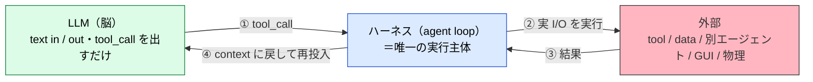
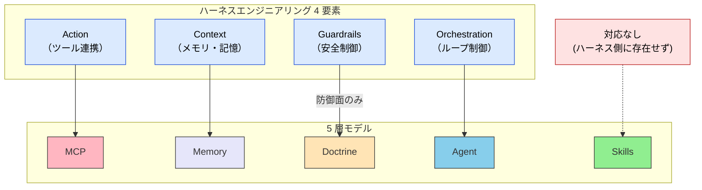
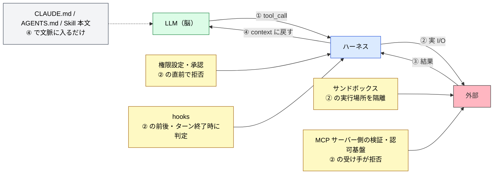
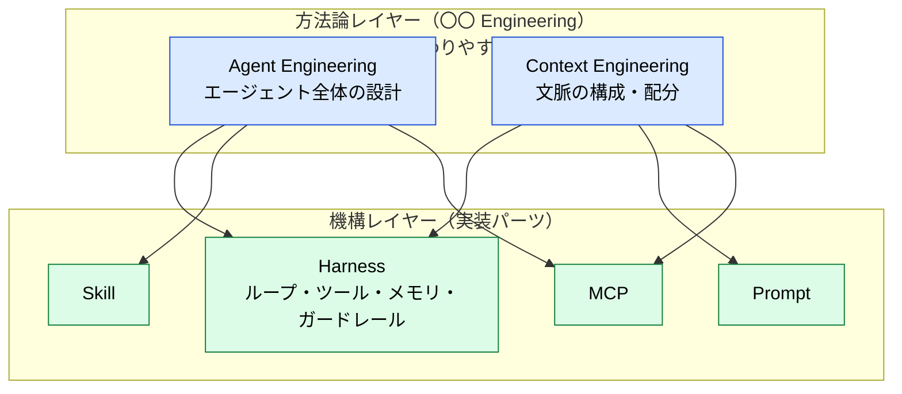
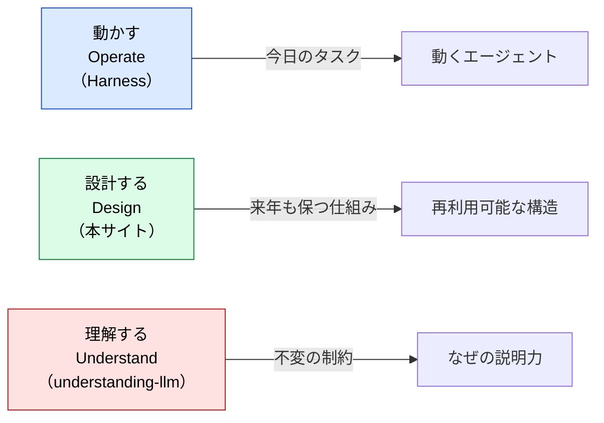

# Harness Engineering との対応関係

> [ハーネス](../glossary#harness) 4 要素を 5 層モデルに写像し、ハーネスが扱う領域と扱わない領域を明確化する。

## このドキュメントについて

> [!NOTE]
> 「ハーネスエンジニアリング (Harness Engineering)」は 2025〜2026 年に注目されている、LLM を **動かす** ための実装機構の整理である。本サイトは LLM エージェントを **設計する** ための地図を提供するため、両者の関係を明示する。

ハーネスエンジニアリングを調べて本サイトに来た読者向けに、ハーネスの 4 要素が本サイトの 5 層モデルにどう対応し、**ハーネスが扱わない領域**（Skills 層・Doctrine 層の一部・Why の説明）がなぜ別途必要かを整理する。

> [!TIP]
> **3 行で言うと**
>
> - ハーネスは「動かす」ための機構名、5 層モデルは「設計する」ための地図。階層が違う。
> - ハーネス 4 要素は MCP・Memory・Agent・Doctrine（防御面のみ）に写像できる。
> - **Skills 層と Doctrine 層の攻め（規範強度の明文化）はハーネスに含まれない** ので、本サイトで補う。

## 大原則 — LLM は脳、ハーネスが唯一の実行主体

4 要素に入る前に、**ハーネスとは何か** を一段下げて定義する。LLM 本体は **text in / text out** の関数で、`tool_call`（どのツールをどの引数で呼ぶか、という構造化[トークン](../glossary#token)）を出力するに過ぎない。**外部に触れる（HTTP・ファイル・別エージェント・GUI・物理）のは、すべて LLM を取り囲む実行層＝ハーネス** が行う。

「①〜④を停止条件まで回す」ループそのものがハーネスであり、**この区別が「LLM」と「エージェント」を分ける**。

> [!IMPORTANT]
> **MCP・直接 HTTP・A2A・プラグインは「外部接続の種類」に見えて、すべて ② の実装差に過ぎない。** どれを選んでも、モデルが ① で `tool_call` を出し、ハーネスが ② で実 I/O を行い、③④ で文脈に戻す、という骨格は変わらない。本ページが後段で 4 要素を 5 層モデルへ写像できるのも、この単一の骨格が前提にあるからである。

外部接続を「種類」として一段の棚に並べた一覧（接続先 × I/F × 主体）、勝ち組プロトコルが MCP と A2A の 2 枚に集約される理由、MCP だけ ② が 2 段通信になる配管は、[mcp/what-is-mcp](../mcp/what-is-mcp) の「外部接続 I/F カタログ」節で扱う。本ページは「すべて ② の中身である」という骨格までを範囲とする。

## ハーネスエンジニアリングとは

> [!NOTE]
> 本ドキュメントでは、ハーネスエンジニアリングを以下の 4 要素から成る実装機構の総称として扱う。これらは上記の大原則における **② の実行主体が担う 4 つの責務** に対応する。

| 要素 | 説明 |
| --- | --- |
| **Action（ツール連携）** | 外部の API・データベース・ファイルシステム・ブラウザ等にアクセスさせるための接続口 |
| **Context（メモリ・記憶）** | 過去の文脈・業務の経緯・エージェントの行動履歴を保持し、必要な時に LLM へ引き渡す仕組み |
| **Guardrails（安全制御）** | 機密情報の漏洩や、暴走によるシステム破壊を防ぐ安全装置（サンドボックス等） |
| **Orchestration（ループ制御）** | タスクを細かく分解し、LLM 自身に考えさせ・実行させ・結果を評価して次の行動を決定するまでの連続ループ |

「ハーネス」という語は、ロケットや登山具のハーネスと同じく「**装具・固定具**」のメタファーで、Agent Engineering / Context Engineering といった上位方法論の **実装機構** として使われる。

## 5 層モデルへの写像

### 対応表

| ハーネス要素 | 5 層モデル | 役割の対応 |
| --- | --- | --- |
| **Action（ツール連携）** | **MCP** | 外部システムとの接続口。プロトコル層。 |
| **Context（メモリ・記憶）** | **Memory** | 永続化された記憶・関係性。Knowledge Graph 等。 |
| **Guardrails（安全制御）** | **Doctrine**（防御面のみ） | 制約・禁止事項・サンドボックス。**規範強度の明文化（MUST/SHOULD/MAY）や攻めの設計指針は含まない**。実装部品は [Guardrails の分解](#guardrails-breakdown) で扱う。 |
| **Orchestration（ループ制御）** | **Agent** | タスク分解・実行・評価のループ主体。 |
| ❌ 対応なし | **Skills** | 静的知識・ガイドライン・progressive disclosure。ハーネス側に対応概念が存在しない。 |

## Guardrails の分解 {#guardrails-breakdown}

4 要素の表では、Guardrails を「サンドボックス等」の一語で済ませた。本節では Guardrails を、次の 4 つの問いに分けて整理する。

- モデルへの効き方は、読ませるのか、止めるのか
- CLAUDE.md / AGENTS.md はどちらに入るのか
- どの権限を制限するのか
- どの部品が、どこで、何を基準に合否を決めるのか

### 読ませる部品と、止める部品

Guardrails に数えられる部品は、モデルへの効き方で 2 つに分かれる。

| 効き方 | 部品の例 | モデルが守らなかったとき |
| --- | --- | --- |
| **読ませる**（文脈に入れる） | CLAUDE.md / AGENTS.md、Skill の本文、システムプロンプト | 何も止まらない。違反した `tool_call` はそのまま ② に進む |
| **止める**（ハーネスが実行を拒否する） | 権限設定（allow / deny）、サンドボックス、承認、hooks、MCP サーバー側の検証 | ② の手前、または ② の実行中に拒否される |

プロンプトに「顧客データを外部 API に送らないこと」と書くのは、読ませる側である。モデルがその 1 行を読み落とせば（[Instruction Decay](../glossary#structural-problems)）、送信は実行される。送信先がネットワーク設定で遮断されていれば、モデルが何を出力しても送信は起きない。本ページで Guardrails の実装と呼ぶのは、止める側の部品である。

> [!IMPORTANT]
> 禁止を読ませる側にだけ書いた場合、守られる確率が上がるだけで、実行は止まらない。MUST（しなければならない）と書いた規則のうち、破られると困るものは、止める側の部品にも置く。

### CLAUDE.md / AGENTS.md の位置づけ {#claude-md-agents-md}

ハーネスを扱う記事では、CLAUDE.md や AGENTS.md を「ポリシーレイヤー」としてハーネスの部品に数えることがある。本サイトでは、ファイルを扱う機構と、ファイルに書かれた中身を分けて扱う。

| 対象 | 置き場 | 実行を止めるか |
| --- | --- | --- |
| ファイルを探して起動時に文脈へ読み込む **機構** | ハーネス | 止めない |
| ファイルに書かれた目的・禁止・優先順位という **中身** | Doctrine 層（[III.3 Doctrine](../part-3/doctrine)） | 止めない（読ませる側） |

CLAUDE.md に書いた禁止事項は、Guardrails の実装ではない。技術的に止めたい禁止は、権限設定・hooks・サンドボックスに移す。CLAUDE.md には、禁止する理由と、機械では止められない判断（優先順位やトレードオフ）を残す。

### 制限する権限の種類

| 権限 | 何を制限するか | 例 |
| --- | --- | --- |
| **ファイルシステム** | 読み書きできるパス | 作業ディレクトリの外への書き込みを禁止する。`.env` の読み取りを禁止する |
| **ネットワーク** | 通信してよい宛先 | 外部への通信を遮断する。許可したドメインにだけ通信させる |
| **実行** | 実行してよいコマンドと、その実行場所 | コマンドを allowlist / denylist で絞る。使い捨てのコンテナの中で実行する |
| **データアクセス（認可）** | 参照・更新してよいデータ | 依頼したユーザーのロールで許される範囲を超えるデータは返さない |

ファイルシステム・ネットワーク・実行の 3 つは、ハーネスの設定とサンドボックスで制限できる。データアクセスの認可は、ハーネスの外にある業務システム・MCP サーバー・ID 基盤で決まることが多い。エージェントに誰の権限を持たせるかは [エージェント ID](../agents/agent-identity) で扱う。

### 実装部品の一覧

冒頭のループ図（①〜④）のどこで効くかで並べる。

| 部品 | ループのどこで効くか | 制限する権限 | 効き方 |
| --- | --- | --- | --- |
| **実行ランタイムの権限設定**（Claude Code、Codex CLI などの permission mode、allow / deny） | ② の直前 | ファイルシステム・ネットワーク・実行 | 止める |
| **承認**（Human-in-the-Loop） | ② の直前 | 危険な操作全般。人間が承認するまで実行しない | 止める |
| **hooks** | ② の前後、ターン終了時 | 特定の操作。Lint やテストが通らなければ差し戻す | 止める |
| **サンドボックス**（Docker などのコンテナ、E2B などの隔離実行サービス） | ② の実行場所 | 実行・ファイルシステム・ネットワーク。破壊的な操作も使い捨ての環境の中で終わる | 止める |
| **MCP サーバー側の検証** | ② の受け手（サーバー内） | サーバーが公開する操作とデータ。スキーマ外の入力や書き込みを拒否する | 止める |
| **認可基盤**（RBAC など） | ② の受け手（業務システム） | データアクセス | 止める |
| **CLAUDE.md / AGENTS.md、Skill の本文** | ④ で文脈に入る | なし | 読ませる |

permission mode を段階として並べ、どこまで委ねるかを決める考え方は [Permission と Authority](./permission-vs-authority) で扱う。

> [!NOTE]
> MCP は上の対応表では Action（接続口）に対応する。同じ MCP サーバーが入力の検証や書き込みの拒否を実装すると、Guardrails の部品にもなる。接続口であることと、制限をかける場所であることは両立する。サーバー側で実装する対策は [MCP 開発時のセキュリティ考慮](../mcp/security) を参照。

### 合否をどの部品が決めるか

止める部品は、「進めてよいか」の合否を決める。部品ごとに、合否の基準と、その基準を書く人が違う。

| 部品 | 合否の基準 | 基準を書く人 | 合否は再現するか |
| --- | --- | --- | --- |
| **hooks** | Lint・型チェック・テストなど、外部コマンドの終了コード | 開発者 | する |
| **MCP サーバー** | 入力スキーマ、操作の許可範囲、ルール表 | サーバーの作者 | する |
| **権限設定・サンドボックス** | パス・宛先・コマンドのパターン | 運用者 | する |
| **承認** | 人間の判断 | 承認者 | 承認者による |
| **Skill のチェックリスト** | チェック項目。照合するのはモデル自身 | Skill の作者 | しない |

Skill のチェックリストは、照合するのがモデル自身なので、同じ入力でも合否が変わりうる。自分の出力を自分で検証させると [Sycophancy](../glossary#structural-problems) の影響も受ける。合否を再現させたい基準は、hooks か MCP サーバー側に移す。観測・判定・解説を分ける設計は [判定の決定論性](./deterministic-verdicts)、hooks の置き場の決め方は [Hooks（実行時フック）](./hooks) を参照。

## ハーネスが扱わない 3 つの領域

### 1. Skills 層（静的知識の参照モデル）

ハーネス 4 要素には **「静的知識をどう構造化し、どう発動させるか」** の概念が存在しない。Skills 層は以下を扱う:

- `SKILL.md` フォーマットと progressive disclosure
- description ベースのオートトリガー
- Skills と MCP の使い分け（[サブエージェント vs Skills](../agents/subagent-vs-skill) 参照）
- Skill 同士の重ね合わせ

これらは Context（メモリ）でも Action（ツール）でもなく、**LLM の直近[コンテキスト](../glossary#context)に条件付きで注入される判断基準** であり、独立した層として扱う必要がある。

> [!NOTE]
> ハーネスを扱う記事によっては、Skills をハーネスの部品に数える。その場合に指しているのは、SKILL.md を探し、発動条件に合えば文脈へ読み込む **機構** である。この機構はハーネス側にある。本サイトが「対応なし」とするのは、Skill の **中身**（判断基準と手順）のほうである。中身をどう構造化し、いつ発動させるかを決める概念は、ハーネス 4 要素にはない。CLAUDE.md / AGENTS.md も同じ分け方で扱う（[CLAUDE.md / AGENTS.md の位置づけ](#claude-md-agents-md)）。

> [!IMPORTANT]
> Skills を Context に押し込めて扱うと、トークン肥大と [Priority Saturation](../glossary#structural-problems) を招く。Skills は「呼ばれた時だけ展開する」設計が肝で、これは [II.1 五層](../part-2/layers) で詳述される。

### 2. Doctrine 層の攻め（規範強度の明文化）

ハーネスの Guardrails は「**漏洩防止・暴走防止**」という **防御的** 機能に閉じる。一方 Doctrine 層は以下を扱う:

- **目的の明文化**（何のためにエージェントが存在するか）
- **判断基準**（トレードオフが発生した時の優先順位）
- **規範強度ラダー**（MUST / SHOULD / MAY、RFC 2119）
- **役割境界**（このエージェントが扱う領域・扱わない領域）

これらは「攻めの設計指針」であり、ハーネスの語彙には対応物がない。詳しくは [III.3 Doctrine](../part-3/doctrine) 参照。

### 3. なぜそうなのか（Why の説明）

ハーネスは「メモリを持たせよ」「ループを組め」と処方するが、**なぜ** その対策が必要かは説明しない。たとえば:

- なぜ Context を外部化するのか？ → [Context Rot](../glossary#structural-problems), [Lost in the Middle](../glossary#structural-problems)
- なぜループ制御で指示を再注入するのか？ → [Instruction Decay](../glossary#structural-problems), Priority Saturation
- なぜサンドボックスが要るのか？ → [Hallucination](../glossary#structural-problems), [Sycophancy](../glossary#structural-problems)

これらの **構造的制約** は姉妹サイト [understanding-llm-through-claude-code](https://shuji-bonji.github.io/understanding-llm-through-claude-code/ja/) で扱う。

## 「足りる / 足りない」判定表

読者の問いに応じてハーネスで足りるかを判定する:

| 読者の問い | ハーネスで足りる？ | 不足分はどこへ |
| --- | --- | --- |
| 「ツールを LLM に持たせたい」 | ✅ 足りる | — |
| 「メモリを設計したい」 | ⚠️ 部分的 | Why（Context Rot, Lost in the Middle）→ understanding-llm |
| 「Skills と MCP どちらに置くか」 | ❌ 足りない | [II.1 五層](../part-2/layers)、[skills/what-is-skills](../skills/what-is-skills) |
| 「サブエージェントの分割基準」 | ❌ 足りない | [agents/subagent-vs-skill](../agents/subagent-vs-skill)、[agents/subagent-quality-gate](../agents/subagent-quality-gate) |
| 「何を MUST／SHOULD で書くか」 | ❌ 足りない | [III.3 Doctrine](../part-3/doctrine) |
| 「長期タスクで指示が劣化する」 | ⚠️ 対症療法のみ | Why（Instruction Decay）→ understanding-llm |
| 「ガードレールの粒度設計」 | ⚠️ 防御のみ | 部品の選び方は [Guardrails の分解](#guardrails-breakdown)、攻めの規範は Doctrine |
| 「複数 MCP・複数 Skill の協調」 | ❌ 足りない | [strategy/composition-patterns](./composition-patterns) |

## 用語の階層 — Harness は機構、Engineering は方法論

- **Harness** = 名詞・モノ。ロケットや登山具のハーネスと同じく「固定する装具」のメタファー → **機構として残る**。
- **〇〇 Engineering** = 方法論ラベル。Agent Engineering / Context Engineering 等が上位の枠組み名として流行する／入れ替わる → **使い捨て可能**。

本サイトの 5 層モデルと姉妹サイトの 8 問題は **用語非依存の抽象** として設計されているため、新しい方法論ラベルが流行るたびに本ページのような対応関係ドキュメントを追加することで対応する。

## 3 つの動詞で位置づけを再確認

| 動詞 | 目的 | 成果物 | 時間軸 |
| --- | --- | --- | --- |
| **Operate（動かす）** | LLM を制御してタスクを完遂させる | 動くエージェント（実行系） | 今日 |
| **Design（設計する）** | 再利用可能な構造と判断基準を作る | 設計の地図（5 層モデル + Doctrine） | 来年も保つ |
| **Understand（理解する）** | なぜそうなるのか構造的制約を把握する | 原理の本棚（8 問題） | 不変 |

> [!IMPORTANT]
> 3 者は **置換関係ではなく層が違う補完関係**。ハーネスで「動かす」、本サイトで「設計する」、姉妹サイトで「理解する」を扱う。

## さらに深く: なぜハーネスの各要素が必要なのか

本ページはハーネスと 5 層モデルの **構造的な対応関係 (What)** を扱った。「**なぜ** ハーネスの各要素が必要なのか」を LLM の構造的制約から理解したい場合は、姉妹サイトを参照。

- [understanding-llm / 付録: Harness と LLM の構造的制約](https://shuji-bonji.github.io/understanding-llm-through-claude-code/ja/appendix/harness-and-llm-constraints) — ハーネス 4 要素 ⇔ 8 問題の対応、処方の前の診断
- [understanding-llm / Part 1: 構造的問題](https://shuji-bonji.github.io/understanding-llm-through-claude-code/ja/01-llm-structural-problems/) — 8 問題の全体像

## 関連ドキュメント

- [II.1 五層](../part-2/layers) — 5 層モデルの構造
- [III.3 Doctrine](../part-3/doctrine) — Doctrine 層の詳細
- [skills/what-is-skills](../skills/what-is-skills) — Skills 層がハーネスに含まれない理由
- [strategy/composition-patterns](./composition-patterns) — 複数 MCP・複数 Skill の協調パターン
- [strategy/proposal-and-binding](./proposal-and-binding) — ①〜④ループを「拘束するか」の軸で切り直した四層の座標系（本ページの続編）
- [strategy/permission-vs-authority](./permission-vs-authority) — ハーネス型とドクトリン型が境界で求めるもの
- [Hooks（実行時フック）](./hooks) — ハーネス側の、動作の節目への割り込み
- [strategy/deterministic-verdicts](./deterministic-verdicts) — 合否を再現させるための、観測・判定・解説の分離
- [agents/agent-identity](../agents/agent-identity) — エージェントに誰の権限を持たせるか
- [mcp/security](../mcp/security) — MCP サーバー側で実装する検証と認可
