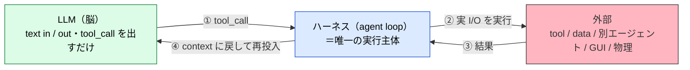
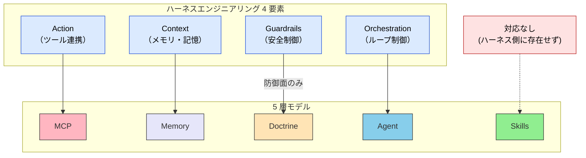
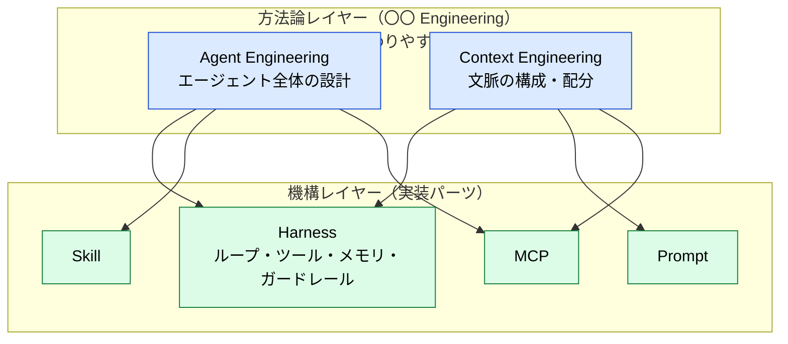
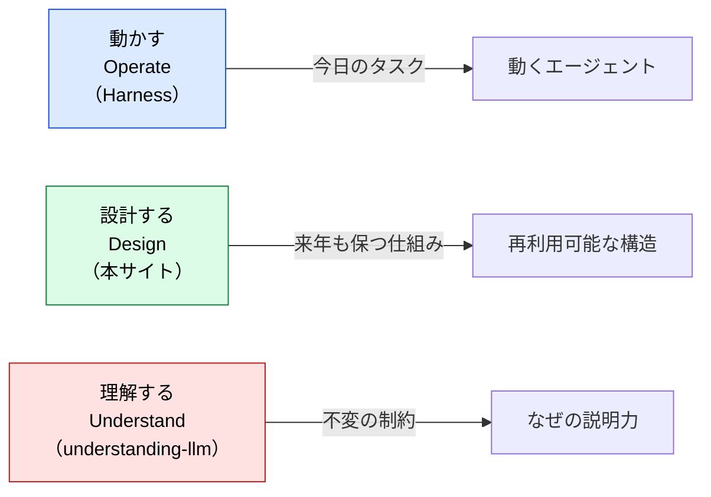

# Harness Engineering との対応関係

> [ハーネス](../glossary#harness) 4 要素を 5 層モデルに写像し、ハーネスが扱う領域と扱わない領域を明確化する。

## このドキュメントについて

> [!NOTE]
> 「ハーネスエンジニアリング (Harness Engineering)」は 2025〜2026 年に注目されている、LLM を **動かす** ための実装機構の整理である。本サイトは LLM エージェントを **設計する** ための地図を提供するため、両者の関係を明示する。

ハーネスエンジニアリングを調べて本サイトに来た読者向けに、ハーネスの 4 要素が本サイトの 5 層モデルにどう対応し、**ハーネスが扱わない領域**（Skills 層・Doctrine 層の一部・Why の説明）がなぜ別途必要かを整理する。

> [!TIP]
> **3 行で言うと**
>
> - ハーネスは「動かす」ための機構名、5 層モデルは「設計する」ための地図。階層が違う。
> - ハーネス 4 要素は MCP・Memory・Agent・Doctrine（防御面のみ）に写像できる。
> - **Skills 層と Doctrine 層の攻め（規範強度の明文化）はハーネスに含まれない** ので、本サイトで補う。

## 大原則 — LLM は脳、ハーネスが唯一の実行主体

4 要素に入る前に、**ハーネスとは何か** を一段下げて定義する。LLM 本体は **text in / text out** の関数で、`tool_call`（どのツールをどの引数で呼ぶか、という構造化[トークン](../glossary#token)）を出力するに過ぎない。**外部に触れる（HTTP・ファイル・別エージェント・GUI・物理）のは、すべて LLM を取り囲む実行層＝ハーネス** が行う。

「①〜④を停止条件まで回す」ループそのものがハーネスであり、**この区別が「LLM」と「エージェント」を分ける**。

> [!IMPORTANT]
> **MCP・直接 HTTP・A2A・プラグインは「外部接続の種類」に見えて、すべて ② の実装差に過ぎない。** どれを選んでも、モデルが ① で `tool_call` を出し、ハーネスが ② で実 I/O を行い、③④ で文脈に戻す、という骨格は変わらない。本ページが後段で 4 要素を 5 層モデルへ写像できるのも、この単一の骨格が前提にあるからである。

外部接続を「種類」として一段の棚に並べた一覧（接続先 × I/F × 主体）、勝ち組プロトコルが MCP と A2A の 2 枚に集約される理由、MCP だけ ② が 2 段通信になる配管は、[mcp/what-is-mcp](../mcp/what-is-mcp) の「外部接続 I/F カタログ」節で扱う。本ページは「すべて ② の中身である」という骨格までを範囲とする。

## ハーネスエンジニアリングとは

> [!NOTE]
> 本ドキュメントでは、ハーネスエンジニアリングを以下の 4 要素から成る実装機構の総称として扱う。これらは上記の大原則における **② の実行主体が担う 4 つの責務** に対応する。

| 要素 | 説明 |
| --- | --- |
| **Action（ツール連携）** | 外部の API・データベース・ファイルシステム・ブラウザ等にアクセスさせるための接続口 |
| **Context（メモリ・記憶）** | 過去の文脈・業務の経緯・エージェントの行動履歴を保持し、必要な時に LLM へ引き渡す仕組み |
| **Guardrails（安全制御）** | 機密情報の漏洩や、暴走によるシステム破壊を防ぐ安全装置（サンドボックス等） |
| **Orchestration（ループ制御）** | タスクを細かく分解し、LLM 自身に考えさせ・実行させ・結果を評価して次の行動を決定するまでの連続ループ |

「ハーネス」という語は、ロケットや登山具のハーネスと同じく「**装具・固定具**」のメタファーで、Agent Engineering / Context Engineering といった上位方法論の **実装機構** として使われる。

## 5 層モデルへの写像

### 対応表

| ハーネス要素 | 5 層モデル | 役割の対応 |
| --- | --- | --- |
| **Action（ツール連携）** | **MCP** | 外部システムとの接続口。プロトコル層。 |
| **Context（メモリ・記憶）** | **Memory** | 永続化された記憶・関係性。Knowledge Graph 等。 |
| **Guardrails（安全制御）** | **Doctrine**（防御面のみ） | 制約・禁止事項・サンドボックス。**規範強度の明文化（MUST/SHOULD/MAY）や攻めの設計指針は含まない**。 |
| **Orchestration（ループ制御）** | **Agent** | タスク分解・実行・評価のループ主体。 |
| ❌ 対応なし | **Skills** | 静的知識・ガイドライン・progressive disclosure。ハーネス側に対応概念が存在しない。 |

## ハーネスが扱わない 3 つの領域

### 1. Skills 層（静的知識の参照モデル）

ハーネス 4 要素には **「静的知識をどう構造化し、どう発動させるか」** の概念が存在しない。Skills 層は以下を扱う:

- `SKILL.md` フォーマットと progressive disclosure
- description ベースのオートトリガー
- Skills と MCP の使い分け（[サブエージェント vs Skills](../agents/subagent-vs-skill) 参照）
- Skill 同士の重ね合わせ

これらは Context（メモリ）でも Action（ツール）でもなく、**LLM の直近[コンテキスト](../glossary#context)に条件付きで注入される判断基準** であり、独立した層として扱う必要がある。

> [!IMPORTANT]
> Skills を Context に押し込めて扱うと、トークン肥大と [Priority Saturation](../glossary#structural-problems) を招く。Skills は「呼ばれた時だけ展開する」設計が肝で、これは [II.1 五層](../part-2/layers) で詳述される。

### 2. Doctrine 層の攻め（規範強度の明文化）

ハーネスの Guardrails は「**漏洩防止・暴走防止**」という **防御的** 機能に閉じる。一方 Doctrine 層は以下を扱う:

- **目的の明文化**（何のためにエージェントが存在するか）
- **判断基準**（トレードオフが発生した時の優先順位）
- **規範強度ラダー**（MUST / SHOULD / MAY、RFC 2119）
- **役割境界**（このエージェントが扱う領域・扱わない領域）

これらは「攻めの設計指針」であり、ハーネスの語彙には対応物がない。詳しくは [III.3 Doctrine](../part-3/doctrine) 参照。

### 3. なぜそうなのか（Why の説明）

ハーネスは「メモリを持たせよ」「ループを組め」と処方するが、**なぜ** その対策が必要かは説明しない。たとえば:

- なぜ Context を外部化するのか？ → [Context Rot](../glossary#structural-problems), [Lost in the Middle](../glossary#structural-problems)
- なぜループ制御で指示を再注入するのか？ → [Instruction Decay](../glossary#structural-problems), Priority Saturation
- なぜサンドボックスが要るのか？ → [Hallucination](../glossary#structural-problems), [Sycophancy](../glossary#structural-problems)

これらの **構造的制約** は姉妹サイト [understanding-llm-through-claude-code](https://shuji-bonji.github.io/understanding-llm-through-claude-code/ja/) で扱う。

## 「足りる / 足りない」判定表

読者の問いに応じてハーネスで足りるかを判定する:

| 読者の問い | ハーネスで足りる？ | 不足分はどこへ |
| --- | --- | --- |
| 「ツールを LLM に持たせたい」 | ✅ 足りる | — |
| 「メモリを設計したい」 | ⚠️ 部分的 | Why（Context Rot, Lost in the Middle）→ understanding-llm |
| 「Skills と MCP どちらに置くか」 | ❌ 足りない | [II.1 五層](../part-2/layers)、[skills/what-is-skills](../skills/what-is-skills) |
| 「サブエージェントの分割基準」 | ❌ 足りない | [agents/subagent-vs-skill](../agents/subagent-vs-skill)、[agents/subagent-quality-gate](../agents/subagent-quality-gate) |
| 「何を MUST／SHOULD で書くか」 | ❌ 足りない | [III.3 Doctrine](../part-3/doctrine) |
| 「長期タスクで指示が劣化する」 | ⚠️ 対症療法のみ | Why（Instruction Decay）→ understanding-llm |
| 「ガードレールの粒度設計」 | ⚠️ 防御のみ | Doctrine（攻めの規範） |
| 「複数 MCP・複数 Skill の協調」 | ❌ 足りない | [strategy/composition-patterns](./composition-patterns) |

## 用語の階層 — Harness は機構、Engineering は方法論

- **Harness** = 名詞・モノ。ロケットや登山具のハーネスと同じく「固定する装具」のメタファー → **機構として残る**。
- **〇〇 Engineering** = 方法論ラベル。Agent Engineering / Context Engineering 等が上位の枠組み名として流行する／入れ替わる → **使い捨て可能**。

本サイトの 5 層モデルと姉妹サイトの 8 問題は **用語非依存の抽象** として設計されているため、新しい方法論ラベルが流行るたびに本ページのような対応関係ドキュメントを追加することで対応する。

## 3 つの動詞で位置づけを再確認

| 動詞 | 目的 | 成果物 | 時間軸 |
| --- | --- | --- | --- |
| **Operate（動かす）** | LLM を制御してタスクを完遂させる | 動くエージェント（実行系） | 今日 |
| **Design（設計する）** | 再利用可能な構造と判断基準を作る | 設計の地図（5 層モデル + Doctrine） | 来年も保つ |
| **Understand（理解する）** | なぜそうなるのか構造的制約を把握する | 原理の本棚（8 問題） | 不変 |

> [!IMPORTANT]
> 3 者は **置換関係ではなく層が違う補完関係**。ハーネスで「動かす」、本サイトで「設計する」、姉妹サイトで「理解する」を扱う。

## さらに深く: なぜハーネスの各要素が必要なのか

本ページはハーネスと 5 層モデルの **構造的な対応関係 (What)** を扱った。「**なぜ** ハーネスの各要素が必要なのか」を LLM の構造的制約から理解したい場合は、姉妹サイトを参照。

- [understanding-llm / 付録: Harness と LLM の構造的制約](https://shuji-bonji.github.io/understanding-llm-through-claude-code/ja/appendix/harness-and-llm-constraints) — ハーネス 4 要素 ⇔ 8 問題の対応、処方の前の診断
- [understanding-llm / Part 1: 構造的問題](https://shuji-bonji.github.io/understanding-llm-through-claude-code/ja/01-llm-structural-problems/) — 8 問題の全体像

## 関連ドキュメント

- [II.1 五層](../part-2/layers) — 5 層モデルの構造
- [III.3 Doctrine](../part-3/doctrine) — Doctrine 層の詳細
- [skills/what-is-skills](../skills/what-is-skills) — Skills 層がハーネスに含まれない理由
- [strategy/composition-patterns](./composition-patterns) — 複数 MCP・複数 Skill の協調パターン
- [strategy/proposal-and-binding](./proposal-and-binding) — ①〜④ループを「拘束するか」の軸で切り直した四層の座標系（本ページの続編）
- [strategy/permission-vs-authority](./permission-vs-authority) — ハーネス型とドクトリン型が境界で求めるもの
- [Hooks（実行時フック）](./hooks) — ハーネス側の、動作の節目への割り込み

---

> **前へ**: [ローカル LLM 環境への 5 層モデルの写像](./local-llm-workspace-mapping.md)
> **次へ**: [Hooks（実行時フック）](./hooks)
