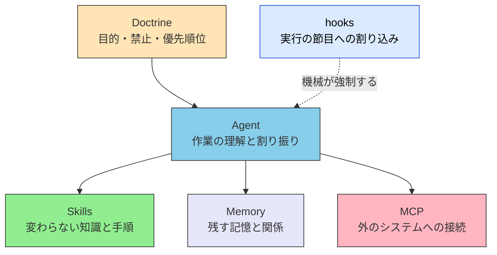

# Hooks（実行時フック）

> [!NOTE] このページの位置づけ
> hooks は五層のどれでもない。ハーネス（実行境界）の機構である。いつ使うか、何と混ぜないかを決める。製品の API 一覧は書かない。

「公開する訳は xCOMET 0.85 を下回ってはならない」と Doctrine に書いた。手順は Skills にある。それでも、エージェントがスコアを見ずに「できた」と言って先へ進むことがある。宣言は読まれる。読まれないこともある。

hooks は、その穴を、実行の節目で機械が塞ぐ仕組みである。

## 定義

hooks は、エージェントの動作の節目に、処理を自動で走らせ、進めてよいかを機械が決める仕組みである。モデルが次の文を書く前、ツールを呼ぶ直前、ターンが終わるときなどに割り込む。

判断の中身を、その場のプロンプトに足すのではない。実行を止める、記録する、決まった後処理をする。読むかどうかは、モデルに任せない。

製品によって名前は違う。あるホストでは Hooks、別のホストでは lifecycle hook、CI では gate と呼ぶ。名前は例である。操作手順ではない。

## 五層との関係

五層は担当の分け方である。hooks は担当を増やさない。既にある担当を、実行時に機械が強制できるかどうかを足す。

| | 五層 | hooks |
| --- | --- | --- |
| 何か | 誰が何を担当するか | 実行の節目への割り込み |
| 置くもの | 知識、記憶、接続、物差し | いつ走るか、何を強制するか |
| 動く主体 | モデルが読む。Agent が組み合わせる | ハーネスが必ず走らせる |
| 守らせ方 | 読ませる | 止める、記録する、後処理する |

第六層にしない。層を増やすと、置く場所の判定がまた増える。hooks の置き場はハーネスである。担当の地図は五層のままにする。

> [!IMPORTANT]
> hooks は Doctrine / Skills の一部を、実行時に機械で強制する手段になり得る。hooks 自体が物差しではない。物差しは Doctrine に残る。

## 何と違うか

| 仕組み | 役割 |
| --- | --- |
| Skills | 変わらない知識・手順（読まれる） |
| MCP | 外のシステムへの接続 |
| Sub-agent 品質ゲート | 別コンテキストへの委任と検証 |
| hooks | 同一実行のライフサイクルへの割り込み |
| Doctrine | 目的・禁止・優先順位（物差し） |

品質ゲートは、別の役割へ渡して見てもらう。hooks は、同じ実行の途中に割り込む。どちらも「止める」ことができる。止めた主体が違う。混ぜると、どちらが止めたのか分からなくなる。

Permission の線をコードで引くのは hooks の得意である。Authority（まだ正しいか）は Doctrine に残る。切り分けは [Permission と Authority](./permission-vs-authority) を見る。

## いつ使うか

宣言だけでは守らせきれないときに使う。

| 使うとき | 例 |
| --- | --- |
| 危険な操作の阻止 | 本番への破壊的な変更を、確認なしでは通さない |
| 監査 | どのツールを、どの引数で呼んだかを残す |
| 合格線の機械測定 | スコアが線を下回ったら、先へ進ませない |
| 定型の後処理 | フォーマット、テストの起動、成果物の置き場 |

人が毎回見なくてよい確認は、hooks に置くのがよい（**SHOULD** / するのがよい）。測れる線は、モデルの「できた」に任せてはならない（**MUST NOT** / してはならない）。判定をコードに置く話は [判定の決定論性](./deterministic-verdicts) を見る。

## いつ使わないか

| 使わないこと | 代わり |
| --- | --- |
| 知識の置き場にする | Skills |
| 外部システムの本体接続を hooks だけで済ませる | MCP |
| 目的と禁止の全文をスクリプトに埋める | Doctrine |
| 品質の判定そのものを、hooks から別のモデルへ聞く | 決定論の判定はコードへ。役割の分離は品質ゲートへ |

知識と接続と物差しを、hooks に集めてはならない（**MUST NOT** / してはならない）。集めると、ハーネスの設定が、層の地図になる。地図は五層に残す。

> [!WARNING]
> hooks に長い手順を書くと、Skills の複製になる。読まれない宣言の代わりに、保守されないスクリプトが残る。

## 近接するページ

| 知りたいこと | ページ |
| --- | --- |
| ハーネスと五層の対応 | [Harness Engineering との対応関係](./harness-engineering-mapping) |
| 外側ループをシステムへ移す | [Loop Engineering](./loop-engineering) |
| 権限と地位 | [Permission と Authority](./permission-vs-authority) |
| 別コンテキストでの検証 | [品質ゲートとしての活用](../agents/subagent-quality-gate) |
| 物差しそのもの | [III.3 Doctrine](../part-3/doctrine) |

## 要約

hooks はハーネス側の割り込みである。層ではない。宣言で足りない強制と、監査と、定型の後処理に使う。知識は Skills、接続は MCP、物差しは Doctrine に残す。hooks は、それを実行時に機械で強制する手段である。

## 関連ドキュメント

- [II.1 五層](../part-2/layers) — 担当の分け方。hooks はここに入らない
- [Harness Engineering との対応関係](./harness-engineering-mapping) — 実行主体はハーネスである
- [Loop Engineering](./loop-engineering) — 外側ループの停止と衛生
- [判定の決定論性](./deterministic-verdicts) — 測れる線はコードへ
- [IV.2 限界](../part-4/limits) — つなげる限界と、機械で確かめること

---

> **前へ**: [Harness Engineering との対応関係](./harness-engineering-mapping)
>
> **次へ**: [提案と拘束](./proposal-and-binding)
