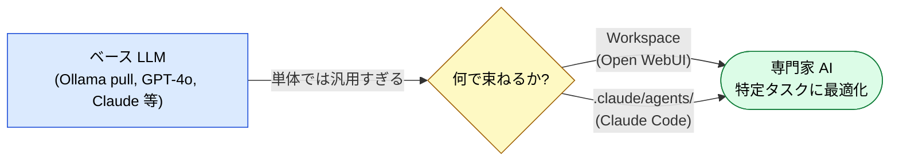
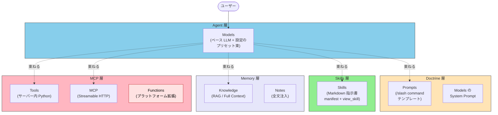
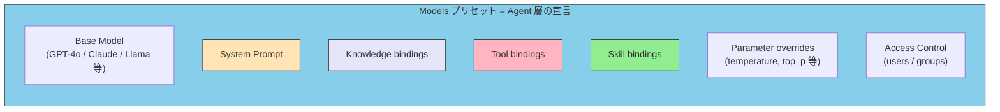
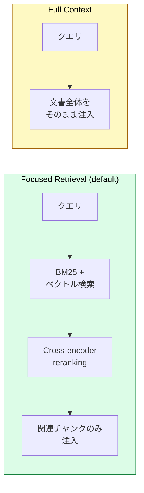
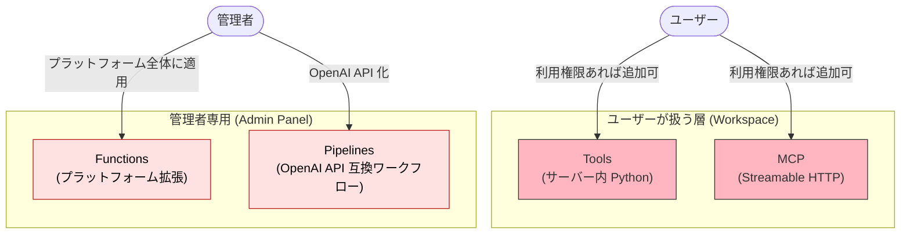
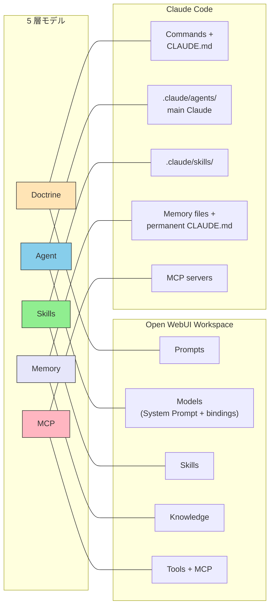

# ローカル LLM 環境への 5 層モデルの写像 — Open WebUI Workspace と Claude Code の対比

> 「専門家 AI を再利用可能な単位として束ねる」という同じ課題に、Open WebUI と Claude Code は驚くほど似た構造で答えている。

## このドキュメントについて

ローカル LLM 環境（Ollama などで pull したベースモデル）をそのまま使うだけでは、「特定の業務に特化したエージェント」は実現できない。System Prompt・参照ドキュメント・ツール・ガイドラインを毎回手動で組み立てる必要があるからだ。

[Open WebUI](https://docs.openwebui.com/features/workspace/models) はこの問題に対し **Workspace** という単位で回答している。Models・Prompts・Knowledge・Skills・Tools・MCP を一元管理し、それらを束ねた「専門家 AI」を Web UI 上で構築・共有できる。

本ドキュメントは、この Workspace を本サイトの 5 層モデル（Doctrine / Agent / Skills / Memory / MCP）に写像し、Claude Code の `.claude/agents/` + `CLAUDE.md` + Skills + MCP の構成と機能単位で対比する。**「2026 年現在、エージェントを束ねる単位として何が事実上のデファクトになりつつあるか」** を理解するための地図として読んでほしい。

::: warning このページの位置づけ
本ページは [II.1 五層](../part-2/layers) を**実装プラットフォームに写像する**戦略レイヤーのドキュメントである。[composition-patterns](./composition-patterns) が「どう組み合わせるか」を扱うのに対し、本ページは「どこに置くか」を扱う。
:::

::: details メタ情報

|                              |                                                                                                                                                                              |
| ---------------------------- | ---------------------------------------------------------------------------------------------------------------------------------------------------------------------------- |
| **このページで固定するもの** | 5 層モデルと Open WebUI Workspace / Claude Code 構成要素の対応関係                                                                                                           |
| **扱わないこと**             | Open WebUI のインストール手順、各機能のチュートリアル（→ 一次情報の [docs.openwebui.com](https://docs.openwebui.com/) を参照）                                               |
| **依存**                     | [II.1 五層](../part-2/layers)、[III.3 Doctrine](../part-3/doctrine)、[III.4 Memory](../part-3/memory) |
| **誤用ポイント**             | Open WebUI Tools と MCP を同一視すること。両者は配置場所・実行モデル・配信形態が異なる（後述）                                                                               |

:::

## なぜ Workspace 単位が登場したのか



ベースモデルは汎用であり、「コードレビュー担当」「翻訳担当」「法令調査担当」のような**役割**を持たない。役割を持たせるには、System Prompt・参照知識・許可ツール・判断基準を**1 つの単位で束ねる**必要がある。

::: tip 開発者向けアナロジー
Workspace は Web 開発における **`package.json` ＋ ESLint config ＋ tsconfig ＋ README の束**に近い。それぞれ単体でも機能するが、束ねて初めて「このプロジェクトの開発環境」になる。AI エージェントにとっての「プロジェクトの開発環境」が Workspace である。
:::

## 5 層モデルへの写像

Open WebUI Workspace の各機能を、本サイトの 5 層モデルに写像すると以下のようになる。



> [!IMPORTANT]
> **Models は「Agent 層」だけではなく、他の 4 層を統合する「束ね役」でもある**。Open WebUI 公式は Models を _"a thin wrapper: pick a base model, configure it, and share it with your team"_ と表現している（[Models docs](https://docs.openwebui.com/features/workspace/models)）。これは Claude Code における `.claude/agents/<name>.md` がフロントマターで MCP・Skills・モデル設定を宣言する構造と同型である。

### 対応一覧

| 5 層モデル   | Open WebUI Workspace                                        | Claude Code                                                | 役割                               |
| ------------ | ----------------------------------------------------------- | ---------------------------------------------------------- | ---------------------------------- |
| **Doctrine** | Prompts（`/command` テンプレート）、Models の System Prompt | スラッシュコマンド（`.claude/commands/*.md`）、`CLAUDE.md` | 制約・目的・判断基準               |
| **Agent**    | Models（プリセット束）、Base Model 選択                     | `.claude/agents/<name>.md`、メインの Claude                | タスク理解・オーケストレーション   |
| **Skills**   | Skills（Markdown + `view_skill`）                           | `.claude/skills/<name>/SKILL.md`                           | 静的知識・ガイドライン             |
| **Memory**   | Knowledge（RAG / Full Context）、Notes                      | Memory ファイル、ユーザー編集の `CLAUDE.md` 永続部分       | 永続化された記憶・参照ドキュメント |
| **MCP**      | MCP（Streamable HTTP, v0.6.31+）、Tools（Python）           | MCP サーバ（stdio / HTTP）                                 | 外部システム接続                   |
| **対象外**   | Functions（プラットフォーム拡張）、Pipelines                | プラグイン（マーケットプレース、`.claude/plugins`）        | プラットフォーム機能の拡張         |

## 各機能の詳細写像

### Doctrine 層 — Prompts と System Prompt

Open WebUI の **Prompts** は `/summarize` のようなスラッシュコマンドとして発火し、入力変数を持つフォームを生成する。System Prompt は Models プリセットに紐づき、<code v-pre>{{ USER_NAME }}</code> <code v-pre>{{ CURRENT_DATE }}</code> <code v-pre>{{ USER_GROUPS }}</code> などの動的変数を持つ（[Prompts docs](https://docs.openwebui.com/features/workspace/prompts), [Models docs](https://docs.openwebui.com/features/workspace/models)）。

これは Claude Code における 2 つの構造に対応する。

| Open WebUI                  | Claude Code                                                | 共通する役割                                     |
| --------------------------- | ---------------------------------------------------------- | ------------------------------------------------ |
| **Prompts**（`/command`）   | スラッシュコマンド（`.claude/commands/*.md`）              | 「いつ・どう振る舞うか」をユーザーが起動する単位 |
| **Models の System Prompt** | `CLAUDE.md`、`.claude/agents/<name>.md` のフロントマター下 | 「常に守るべき制約・目的」を宣言的に固定         |

> [!TIP]
> Open WebUI Prompts は <code v-pre>{{title | select:options=["High","Medium","Low"]:required}}</code> のような型付き入力変数を持つ点で、Claude Code のスラッシュコマンドより構造化されている。これは Web UI 上の非エンジニアユーザーを対象としているからで、CLI 前提の Claude Code との設計思想の違いが端的に表れている。

### Agent 層 — Models プリセットの束ね方

Open WebUI Models の構成要素を見ると、「Agent 層が他の 4 層を束ねる」構造が明確に現れる。



これは Claude Code の `.claude/agents/<name>.md` のフロントマターに直接対応する。

```markdown
name: translation-specialist
description: 技術文書の翻訳と品質評価を行う専門エージェント
tools: deepl:translate-text, xcomet:xcomet_evaluate
model: sonnet

---

あなたは技術翻訳の専門家です。
translation-workflow スキルを参照してください。
```

| 構成要素         | Open WebUI Models              | Claude Code Sub-agent                 |
| ---------------- | ------------------------------ | ------------------------------------- |
| ベースモデル選択 | `Base Model` フィールド        | `model:` フロントマター               |
| System Prompt    | `System prompt` フィールド     | フロントマター直下の本文              |
| ツール束縛       | `Tools` / `MCP` バインディング | `tools:` フロントマター               |
| Skills 束縛      | `Skills` バインディング        | 本文中の `<skill> を参照` 指示        |
| Knowledge 束縛   | `Knowledge` バインディング     | `CLAUDE.md` から参照、または MCP 経由 |
| アクセス制御     | RBAC（users / groups）         | Git のブランチ・PR 権限で代替         |

> [!IMPORTANT]
> **「Agent 層が他の層を宣言的に束ねる」というパターンは両者で完全に一致している**。これは偶然ではなく、[II.1 五層](../part-2/layers) で示した「Agent 層がオーケストレーションを担う」という分離原則が、UI 設計の出発点に押し戻された結果である。

### Skills 層 — 同名・同モデルの収束

Open WebUI は v0.6.x 系で **Skills** を正式機能として導入した（[Skills docs](https://docs.openwebui.com/features/workspace/skills)）。注目すべきは実装モデルが Claude Code Skills とほぼ一致している点である。

| 観点                     | Open WebUI Skills                                                     | Claude Code Skills                   |
| ------------------------ | --------------------------------------------------------------------- | ------------------------------------ |
| **形式**                 | Markdown + YAML frontmatter（`name`, `description`）                  | Markdown + YAML frontmatter（同じ）  |
| **インポート**           | `.md` ファイルから直接                                                | `SKILL.md` 配置                      |
| **発動方式（ユーザー）** | `$` mention でフルコンテンツ注入                                      | スキル名の明示参照                   |
| **発動方式（自動）**     | Model にバインド → manifest のみ注入、`view_skill(name)` で本体ロード | manifest が常駐、`Read` で本体ロード |
| **コンテキスト効率**     | Lazy loading（必要時のみ本体読み込み）                                | 同じ（Lazy loading）                 |
| **依存条件**             | Native function calling が必須                                        | ツール使用が必須                     |

::: tip 二者の収束は「正しい設計」の合図
別々のチームが独立に同じ「manifest 注入 + on-demand 本体ロード」モデルに到達したという事実は、これが LLM のコンテキスト制約に対する **正しい解** であることを強く示唆する。詳細は [Skills の構造](../skills/what-is-skills) と姉妹サイトの [Part 5: オンデマンドコンテキスト](https://shuji-bonji.github.io/understanding-llm-through-claude-code/ja/05-on-demand-context/) を参照。
:::

> [!WARNING]
> Open WebUI Skills の Lazy loading は **Native function calling が有効** な場合にのみ動作する。無効化されている場合は manifest のみが注入され、本体は読まれない（[Skills docs / Limitations](https://docs.openwebui.com/features/workspace/skills#lazy-loading-requires-function-calling)）。同様の依存は Claude Code でも `Read` ツールが無効化されると Skills が機能しないことに対応する。

### Memory 層 — Knowledge の二モード

Open WebUI **Knowledge** は RAG ベクトル検索を中心とした永続化記憶機能で、9 種類のベクトル DB（ChromaDB、PGVector、Qdrant、Milvus 等）と 5 種類の抽出エンジン（Tika、Docling、Azure、Mistral OCR、custom）をサポートする（[Knowledge docs](https://docs.openwebui.com/features/workspace/knowledge)）。

検索モードは 2 種類ある。



| モード                | 注入方式                                                    | 適した用途                                               | コンテキスト消費     |
| --------------------- | ----------------------------------------------------------- | -------------------------------------------------------- | -------------------- |
| **Focused Retrieval** | Hybrid Search（BM25 + ベクトル）→ Rerank → 関連チャンク注入 | 大規模文書セット、特定セクションのみ必要な場合           | 低（チャンク数依存） |
| **Full Context**      | 文書全体をそのまま注入                                      | 短いリファレンス、スタイルガイドなど常に全体が必要なもの | 高（文書サイズ依存） |

::: warning Native function calling 時の挙動変化
Native function calling が有効な場合、Knowledge は **自動注入されない**。モデルが `list_knowledge` / `query_knowledge_files` / `view_file` 等のツールを能動的に呼び出して取得する **Agentic Retrieval** モードになる。攻撃的に文書を探索できる反面、System Prompt で「Knowledge を必ず参照せよ」と指示しないとモデルが Knowledge の存在を無視することがある（[Knowledge docs / Agentic Knowledge Tools](https://docs.openwebui.com/features/workspace/knowledge#agentic-knowledge-tools)）。
:::

#### Claude Code との対応

| Open WebUI Knowledge    | Claude Code                            | 共通点                   |
| ----------------------- | -------------------------------------- | ------------------------ |
| Focused Retrieval       | MCP 経由の RAG（外部ベクトル DB）      | 関連チャンクのみ動的注入 |
| Full Context            | `CLAUDE.md` の常駐部分、`@<path>` 参照 | 全文常駐                 |
| Agentic Knowledge Tools | `Read` ツールでの能動的探索            | モデル主導の文書探索     |

> [!TIP]
> Open WebUI が Knowledge を「Memory 層」に置く設計は、姉妹サイト [understanding-llm / Part 8: Memory Layer](https://shuji-bonji.github.io/understanding-llm-through-claude-code/ja/08-memory-layer/) で論じる「scatter-gather 問題」への自然な回答である。ベース LLM の知識制約を、外部の永続化されたベクトル DB で補完する設計だ。

### MCP 層 — Tools・Functions・MCP の三段階

ここが Open WebUI で最も誤解されやすい部分である。**Tools / Functions / MCP は全て別物** であり、配置場所・実行モデル・配信形態がそれぞれ異なる。



| 種別          | 配置                  | 実行モデル                            | 配信                               | 本サイト 5 層モデル                    |
| ------------- | --------------------- | ------------------------------------- | ---------------------------------- | -------------------------------------- |
| **Tools**     | Workspace             | Open WebUI サーバー内で Python 実行   | コミュニティ Hub または手動 import | **MCP 層**（独自実装版）               |
| **MCP**       | Workspace（v0.6.31+） | リモート MCP サーバへ Streamable HTTP | サーバ URL + OAuth 2.1 / Bearer    | **MCP 層**（標準準拠）                 |
| **Functions** | Admin Panel           | サーバー内で Python 実行              | 管理者のみ                         | **5 層対象外**（プラットフォーム拡張） |
| **Pipelines** | 別プロセス            | OpenAI API 互換のワークフロー         | エキスパート向け                   | **5 層対象外**（インフラ層）           |

> [!CAUTION]
> Open WebUI **Tools** は「Python コードをサーバー内で直接実行する」モデルである。これは MCP のプロトコル分離とは根本的に異なる設計で、コミュニティ製 Tool を import する場合は[公式ドキュメントの警告](https://docs.openwebui.com/features/extensibility/plugin/)が示すように **任意コード実行のリスク** がある。標準準拠の Streamable HTTP MCP を優先すべき。

#### MCP ネイティブサポートの意義

Open WebUI が v0.6.31 で MCP（Streamable HTTP）をネイティブサポートしたことは、本サイトの構造論にとって決定的な意味を持つ。

- **transport は Streamable HTTP のみ**（stdio / SSE は `mcpo` プロキシ経由）
- **認証**: None / Bearer / OAuth 2.1 (DCR) / OAuth 2.1 (Static)
- **Resource Indicators (RFC 8707) 自動対応**
- **RBAC で MCP ツール単位の認可**

> [!IMPORTANT]
> 「Web UI なローカル LLM 環境でも MCP がデファクトの外部接続規約になりつつある」という事実は、[II.2 配置基準](../part-2/placement) で述べた「MCP 化されたソースの蓄積こそが資産」という主張を補強する。Claude Code 専用に開発した MCP サーバが、設定変更だけで Open WebUI からも使えるようになる時代に入った。

## 全体対応マトリクス



## Projects とエージェント設計

Open WebUI における **Projects**（フォルダベースのワークスペース束ね）は、Models プリセット・Prompts・Knowledge・Skills を**1 つのプロジェクト単位**にまとめる仕組みである。これは Claude Code における**プロジェクトルートの `.claude/` ディレクトリ**と意味論的に同じである。

| 要素             | Open WebUI Project                  | Claude Code プロジェクト   |
| ---------------- | ----------------------------------- | -------------------------- |
| 単位の境界       | フォルダ                            | Git リポジトリのルート     |
| エージェント定義 | Models プリセット群                 | `.claude/agents/*.md`      |
| 共通指示         | Project レベルの System Prompt 共有 | `CLAUDE.md`                |
| 共通知識         | Knowledge collection の共有         | `CLAUDE.md` 内の参照 + MCP |
| 共通コマンド     | Prompts の共有                      | `.claude/commands/*.md`    |
| 配布             | export → import（JSON）             | `git clone`                |

> [!TIP]
> Project 単位での持ち運びを設計するとき、本サイトの [composition-patterns](./composition-patterns) で示した「複数 MCP + 複数 Skill の協調」パターンがそのまま適用できる。Open WebUI でも Claude Code でも、**「専門家 AI = 1 Agent + N Skills + M MCPs + Doctrine」** という構造は変わらない。

## 設計上の示唆

ここまでの写像から、3 つの示唆が得られる。

### 1. 5 層モデルはプラットフォーム独立

別個に進化した Open WebUI と Claude Code が**ほぼ同じ層分離に到達した**事実は、5 層モデルが特定プラットフォームに依存しない **構造的な必然** であることを示す。これは [II.1 五層](../part-2/layers) で「層は責務の分離であり、デプロイ構成ではない」と述べたことの裏付けでもある。

### 2. Skills の Lazy Loading が事実上の標準に

Claude が先行して導入した「manifest + on-demand 本体ロード」モデルが、Open WebUI でもネイティブの **`view_skill` ツール** として実装された。これにより、**Markdown ベースの Skills を別プラットフォーム間で持ち運ぶ** ことが現実的になる（frontmatter の `name` と `description` フィールドが共通仕様）。

### 3. MCP がローカル LLM 環境にも届いた

Streamable HTTP MCP のネイティブサポートは、「shuji-bonji 製の各種 MCP サーバ（[rfcxml-mcp](https://github.com/shuji-bonji/rfcxml-mcp), [xcomet-mcp](https://github.com/shuji-bonji/xcomet-mcp-server), [pdf-reader-mcp](https://github.com/shuji-bonji/pdf-reader-mcp) 等）」を Web UI 上のローカル LLM からも利用できることを意味する。MCP の投資は **Claude Code 専用ではなく、エコシステム全体への投資** だと位置付けてよい。

## 関連ドキュメント

- [II.1 五層](../part-2/layers) — 五層の基本構造
- [III.3 Doctrine](../part-3/doctrine) — Doctrine 層の詳細
- [III.4 Memory](../part-3/memory) — Memory 層と Knowledge Graph
- [composition-patterns](./composition-patterns) — MCP × Skill × Agent の組み合わせ設計
- [Skills の構造](../skills/what-is-skills) — Claude Code Skills の仕様
- [MCP とは](../mcp/what-is-mcp) — Model Context Protocol の基本

## さらに深く: なぜこの構造に収束するのか

本ページは Open WebUI と Claude Code の **構造的写像（What/How）** を扱った。「**なぜ** プラットフォームが独立に同じ層分離に収束するのか」を LLM の構造的制約から理解したい場合は、姉妹サイトを参照。

- [understanding-llm / Part 2: コンテキストウィンドウ](https://shuji-bonji.github.io/understanding-llm-through-claude-code/ja/02-context-window/) — Lazy Loading が必然な理由
- [understanding-llm / Part 5: オンデマンドコンテキスト](https://shuji-bonji.github.io/understanding-llm-through-claude-code/ja/05-on-demand-context/) — Skills の manifest 設計
- [understanding-llm / Part 6: ツールコンテキスト — MCP](https://shuji-bonji.github.io/understanding-llm-through-claude-code/ja/06-tool-context/) — MCP がコンテキスト分離に必要な理由
- [understanding-llm / Part 8: Memory Layer](https://shuji-bonji.github.io/understanding-llm-through-claude-code/ja/08-memory-layer/) — Knowledge / RAG の構造的位置づけ

## 参考文献

- Open WebUI (2026). "Models — Wrap any model with custom instructions, tools, and knowledge to build specialized agents." [docs.openwebui.com](https://docs.openwebui.com/features/workspace/models) — Models プリセットの公式仕様
- Open WebUI (2026). "Skills — Teach your AI how to approach a task with plain-text instructions." [docs.openwebui.com](https://docs.openwebui.com/features/workspace/skills) — `view_skill` Lazy Loading の仕様
- Open WebUI (2026). "Knowledge — Give your AI access to your documents and let it find what matters." [docs.openwebui.com](https://docs.openwebui.com/features/workspace/knowledge) — RAG の二モードと Agentic Retrieval
- Open WebUI (2026). "Prompts — Reusable slash commands that turn complex instructions into one-click forms." [docs.openwebui.com](https://docs.openwebui.com/features/workspace/prompts) — Doctrine 相当の宣言的指示
- Open WebUI (2026). "Tools & Functions (Plugins)." [docs.openwebui.com](https://docs.openwebui.com/features/extensibility/plugin/) — Python サーバ実行モデル
- Open WebUI (2026). "Model Context Protocol (MCP)." [docs.openwebui.com](https://docs.openwebui.com/features/extensibility/mcp) — v0.6.31+ の MCP ネイティブサポート

---

> **前へ**: [判定の決定論性](./deterministic-verdicts)
> **次へ**: [開発フェーズ](../workflows/development-phases)

**最終更新**: 2026 年 6 月
