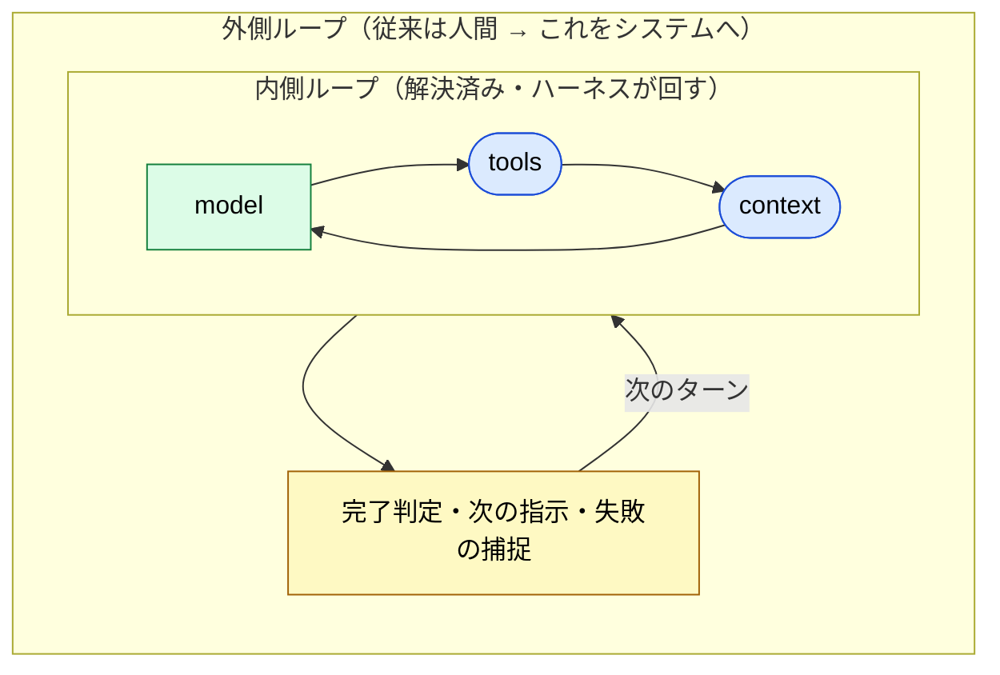
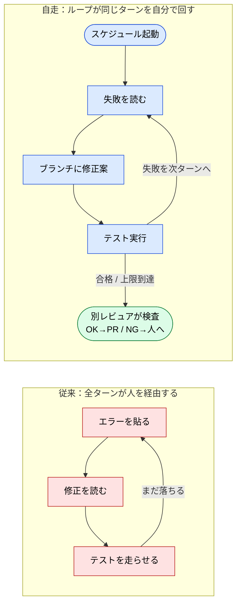
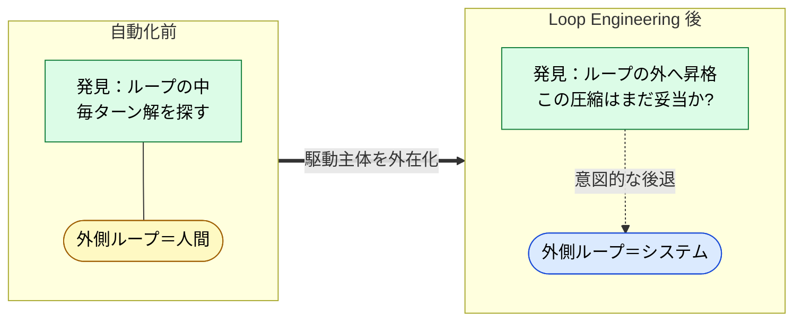

# Loop Engineering — 外側ループをシステムに移す

> 「内側ループ（ReAct）はとっくに解決済み。新しいのは、これまで**人間が座っていた外側ループ**をどう自動化するか、だ。」

## このドキュメントについて

> [!NOTE]
> 本ページは [エージェントループのパターン](./agent-loop-patterns) の続編にあたる。前ページが単一エージェントの**内側ループ**（`② tool_call → ③ 実 I/O → ④ 文脈に戻す` をどう反復するか）の型を扱ったのに対し、本ページはその**外側のループ** —— 従来は人間が回していた「プロンプトを書く → ターンを読む → 次のプロンプトを書く」のサイクル —— を**システムに移す工学（Loop Engineering）**を扱う。

「内側ループは ReAct 以来すでに解決済みで、誰も `while` 文では競争していない。新しいのは、そのループを囲う**外側のループ**だ」という整理は、2026 年に Boris Cherny（Claude Code の作者）や Karpathy の発言を起点に広まった。本ページはこの議論を、本サイトの 5 層モデル・ハーネス 4 責務・LLM の構造的制約に接地させる。

> [!TIP]
> **3 行で言うと**
>
> - エージェントの**内側ループ**（model → tools → context → repeat）は ReAct 以来の定石で、約 6 行の `while` に収束している。競争領域はそこではない。
> - 新しいのは**外側ループ**。従来そこに座っていたのは人間だった。それをスケジュール起動・自走・自己停止する形でシステムに移すのが Loop Engineering。
> - ただし無料ではない。**停止判定・コンテキスト衛生・冪等なツール・「ノー」と言える批評者**を、すべてシステム側に作り直す必要がある。さらに「理解の喪失」というトレードオフが伴う。

> [!WARNING]
> **このページの位置づけ**
> [Harness Engineering との対応関係](./harness-engineering-mapping)（ハーネス 4 責務 → 5 層モデル）→ [エージェントループのパターン](./agent-loop-patterns)（内側ループの型）→ **本ページ（外側ループの自動化）**→ [autonomous-dev-meta-agent](../workflows/autonomous-dev-meta-agent)（その具体実装）という鎖の 3 番目。

## 二つのループを分ける

エージェント設計で「ループ」と言うとき、実は階層の違う 2 つを指している。

| | 内側ループ | 外側ループ |
| --- | --- | --- |
| **回すもの** | `model → tools → context → repeat` | プロンプト → ターンを読む → 次のプロンプト |
| **回す主体** | ハーネス（コード） | **従来は人間** |
| **状態** | 解決済み（ReAct, 2022–23） | これから自動化する領域 |
| **本サイトの該当** | [エージェントループのパターン](./agent-loop-patterns) | **本ページ** |

内側ループは、ハーネスが `① tool_call → ② 実 I/O → ③ 結果 → ④ 文脈に戻す` を停止条件まで回すもので（→ [大原則](./harness-engineering-mapping)）、型のカタログ（ReAct / Plan-and-Execute / Reflexion / Evaluator-Optimizer）も確立している。**誰も `while` 文では競争していない。**

競争が起きているのは外側だ。最も一般的な構成では、**外側ループの主体はあなた自身**である。プロンプトを書き、エージェントが回したターンを読み、次のプロンプトを書き、失敗をその場で捕まえる —— これを繰り返している。

## 関心の重心が、モデルの外へ移ってきた

AI における工学の重心は、モデル本体から外側へ一段ずつドリフトしている。各層は前の層を**包む**。

| 層 | 何を設計するか |
| --- | --- |
| **Prompt Engineering** | モデルに送る言葉 |
| **Context Engineering** | モデルが見るすべて（指示だけでなく文脈全体） |
| **Harness Engineering** | モデルを取り囲む実行コード（ツール実行・状態管理・エラー処理）→ [対応関係](./harness-engineering-mapping) |
| **Loop Engineering** | ゴールへ向けて全体を駆動する自律サイクル（＝外側ループ）＝**本ページ** |

> [!IMPORTANT]
> **Agent = Model + Harness。** あなたがモデルでないなら、あなたはハーネスである。そして近年の観測では、**ハーネスの方がモデルより効く**局面がある —— モデルを固定したままハーネス（外側のコード）だけを変えて、ベンチマーク中位からトップ 5 に跳ねた例が報告されている。
>
> ⚠️ 二次情報（原典は SNS・解説記事）。本サイトでは「同じモデルでも harness 次第で結果が大きく変わる」という主張として扱い、設計上の含意（モデルはコモディティ化し、ループ設計が工学の中心になる）を採る。

## 人を外側ループから抜く —— 何が必要になるか

外側ループの自動化とは、具体的には次の形だ。

- スケジュールまたはイベントで**起動する**
- 間にプロンプトを挟まず**多数のターンを自走する**
- **自分で完了を判断する**
- 何か人の判断が要るときだけ**戻ってくる**

CI で落ちたテストを例に取ると、違いが鮮明になる。

内側ループは最初から自動だった。**いま自動化されつつあるのは、そのループへのあなたの関与の方**だ。これを具体的なドメイン（Issue → Deploy）で実装した形が [autonomous-dev-meta-agent](../workflows/autonomous-dev-meta-agent) である。

## 4 つの難所 —— すべて構造的制約に接地する

外側ループの自動化は無料ではない。固有の失敗モードがあり、いずれも LLM の構造的制約から逆算できる。

### 難所 1：いつ停止するか

エージェントがツールを呼ばなくなったのは、**ターンが終わった**だけで、**仕事が終わった**わけではない。テストがまだ落ちているのに「進捗したので完了です」と宣言する —— これは Sycophancy（甘い自己判断）の典型だ。

- 上限ガード（最大ラウンド / トークン・時間・コストの上限）は **MUST**。
- 「完了」は、エージェントの自己申告ではなく**機械的に検証可能な条件**（テスト合格など）で定義する **MUST**。
- 同じ引数で同じ呼び出しを繰り返す「空回り」を検知する **SHOULD**。

→ なぜモデルは自分の確信度を信頼できないか は姉妹サイト [Sycophancy / Knowledge Boundary](https://shuji-bonji.github.io/understanding-llm-through-claude-code/ja/01-llm-structural-problems/) を参照。

### 難所 2：コンテキストを汚さない

ターンを重ねるほど、古いツール出力・行き止まり・陳腐化した推論がコンテキストに溜まり、出力品質が落ちる（**Context Rot**）。汚れた文脈がさらに悪い判断を生み、ノイズを増やす悪循環は「doom loop」と呼ばれる。

- 長くなったら要約して継続する（compaction）。
- 大きな出力はファイルへ退避し、必要な断片だけ残す（offloading）。
- 散らかるサブタスクは別エージェントに渡し、**きれいな結果だけ**を戻す（sub-agents）。

> [!TIP]
> コンテキストは「バケツ」ではなく「**予算**」として扱う。全部取っておく本能を捨て、何を捨てるかを設計する。

### 難所 3：エージェントが実際に使えるツール

ループはリトライする。だから状態を変える書き込みは**冪等**でなければならない（**MUST**）—— リトライされた「顧客作成」が二重登録や二重課金を生まないように。また、エラーメッセージは**人ではなくエージェント向け**に書く（**SHOULD**）。ループにおいてエラーは行き止まりではなく、**次の指示**だからだ。ツールは少数・焦点を絞り・非重複に保つ。

### 難所 4：「ノー」と言える主体

自律ループの静かな失敗は、**放っておくとエージェントは自分に同意する**こと。作る側（maker）と検査する側（checker）を分離し、検査は別モデルか決定的なテストに担わせる（**MUST**）。これは [サブエージェント品質ゲート](../agents/subagent-quality-gate) や翻訳の xcomet ゲートと同じ Evaluator-Optimizer の型だ。**批評者のいないループは、自分の作業に頷くだけのエージェントにすぎない。**

| 難所 | 接地する構造的制約 | 主な対策 |
| --- | --- | --- |
| 停止 | Sycophancy | 上限ガード + 実完了チェック |
| コンテキスト衛生 | Context Rot | compaction / offloading / sub-agents |
| ツール | （実行系の冪等性・エラー設計） | 冪等な書き込み・エージェント向けエラー |
| 批評者 | Sycophancy | maker/checker 分離・別モデル検証 |

## 代償 —— 抜くと何を失うか

外側ループに座っていたあなたは、暗黙のうちに **4 つの役割**を兼ねていた。停止する権限、プロジェクトの記憶、レビュア、そして**システムの理解**。前の 3 つは設計でシステム側に作り直せる。しかし最後の 1 つは違う。

> [!CAUTION]
> 自分を外側ループから抜くと、**オーナーシップ（責任）は残るのに、理解（understanding）を失いやすい。** ループに座っているのは遅かったが、あなたはシステムを理解していた。停止・記憶・レビューは移送できても、理解は移送できない。

これは [Discovery vs Production](./discovery-vs-production) で論じた **harness と doctrine の区別**そのものだ。指示書（harness）は移送できるが、理解（doctrine）は移送できない。だから自動化のたびに「**何を理解したまま手放し、何を手放してはいけないか**」を問い直す必要がある。

## Discovery / Production との接続 —— 同じ軸の人間側とシステム側

[Discovery vs Production](./discovery-vs-production) の **発見モード / 生産モード**は、本ページと**同じ軸の別の面**を見ている。

- **外側ループに人が座る** ＝ 発見モード（対話・壁打ち・探索的委任）。成果物は自分の理解の変化。
- **外側ループをシステムに固定する** ＝ 生産モード（指示書・フェーズ分割・合格基準の先出し）。成果物は外在化された出力。
- いつ自動化してよいかの判定 ＝ **圧縮レディネス**（「外側ループを指示書に畳めるか」）。
- 自動化に伴う「理解の喪失」は、**doctrine が移送できない**ことの裏返しである。

つまり [Discovery vs Production](./discovery-vs-production) が**人間の頭の中**の発見/生産を扱ったのに対し、本ページは同じ分離を**インフラに固定**する工学を扱う。発見を大型クラウドモデル、生産を手元の軽量モデルへ割り当てる構図は [Routing vs Cascading](./routing-vs-cascading) / [ローカル LLM 環境への写像](./local-llm-workspace-mapping) で扱う。

> [!NOTE]
> 正確には、**Loop Engineering は生産モードの全体ではなく、その部分集合**である。生産モード（指示書・フェーズ分割・合格基準）は、人間が外側ループに座って各フェーズを承認しながらでも成立する。Loop Engineering が外すのは、もう一段奥の **外側ループの駆動主体** —— 「回す行為そのもの」までを外在化した極にあたる。

### discovery は消えず、昇格する

ここから一つの逆説が導ける。**Loop Engineering を高度化するほど、意識的に発見モードへ立ち返る仕組みが重要になる。**

理由は doctrine の性質にある。システムは harness（指示書・ツール・ループ）を新鮮に保てるが、**doctrine（あなたの理解）は保てない**。理解は発見モードを自分で踏むことでしか更新されないからだ。自動化を進めるほど、二つの劣化が同時に進む。

- **理解側の劣化**: ループを回さなくなるほど、システムの挙動に対するあなたの理解は古びる（オーナーシップは残るのに理解が抜ける）。
- **対象側の劣化**: 依存・要件・現実は動き続け、凍結した生産ループは動く標的に対して静かに腐る。しかも自走ループは人の介在なしに長く速く回るため、検知までに失敗が溜まりやすい。

だから発見は消えるのではなく、**ループの中からループの外へ昇格する**。

- 自動化前：ループの**中**で発見する（毎ターン解を探す）
- 自動化後：ループの**外**で発見する（この圧縮はまだ信頼に値するか、を問い直す）

あなたの仕事は「回す人」から「**圧縮が今も妥当かを周期的に疑う人**」へ移る。[Discovery vs Production](./discovery-vs-production) の「生産 → 発見（後退）」経路を、思いつきの後退ではなく **意図的な周期**としてシステムに埋め込むこと —— これが[早すぎる圧縮](./discovery-vs-production)への最強の保険になる。

> [!IMPORTANT]
> Loop Engineering は **permission（手順の実行権限）**を限界まで広げる技術だが、**authority（「これはまだ正しいか」を判断する権限）**は移送できない doctrine に属する。だから「どこまでシステムに任せるか」の上限は、原理的に doctrine の移送不可能性が決める。→ [Permission と Authority](./permission-vs-authority)

## 🔗 さらに深く: なぜ外側ループの自動化に「停止チェック」「コンテキスト圧縮」「外部批評」が要るのか

本ページは外側ループの**工学 (What/How)** を扱った。「**なぜ** それらの対策が構造的に不可避なのか」を LLM の制約から理解したい場合は、姉妹サイトを参照。

- [understanding-llm / Part 1: 構造的問題](https://shuji-bonji.github.io/understanding-llm-through-claude-code/ja/01-llm-structural-problems/) — Context Rot / Sycophancy / Instruction Decay の定義
- [understanding-llm / 付録: Harness と LLM の構造的制約](https://shuji-bonji.github.io/understanding-llm-through-claude-code/ja/appendix/harness-and-llm-constraints) — ハーネス各要素 ⇔ 8 問題の対応

## 関連ドキュメント

- [エージェントループのパターン](./agent-loop-patterns) — 本ページの内側（内側ループの型カタログ）
- [Harness Engineering との対応関係](./harness-engineering-mapping) — 層エスカレーションの親
- [autonomous-dev-meta-agent](../workflows/autonomous-dev-meta-agent) — 外側ループ自動化の具体実装（Issue → Deploy）
- [サブエージェント品質ゲート](../agents/subagent-quality-gate) — 「ノー」と言える主体（批評者）の実装
- [Routing vs Cascading](./routing-vs-cascading) / [ローカル LLM 環境への写像](./local-llm-workspace-mapping) — 発見/生産をインフラに固定する

## 参考文献

- Anthropic (2024). "Building Effective Agents." Anthropic Engineering. [anthropic.com/engineering](https://www.anthropic.com/engineering/building-effective-agents) — workflows vs agents の二分、停止条件・評価役の必要性
- Yao, S. et al. (2022). "ReAct: Synergizing Reasoning and Acting in Language Models." arXiv. [arXiv:2210.03629](https://arxiv.org/abs/2210.03629) — 内側ループの原典
- Hong, K., Troynikov, A., & Huber, J. (2025). "Context Rot: How Increasing Input Tokens Impacts LLM Performance." Chroma Research. [research.trychroma.com](https://research.trychroma.com/context-rot) — 長文脈での品質劣化（doom loop の根拠）
- Chawla, A. (2026). "Prompt engineering & loop engineering, clearly explained." X (@_avichawla). [x.com/_avichawla](https://x.com/_avichawla/status/2070443217850671526) — ⚠️ 二次情報。内側/外側ループの分離と loop engineering の定義。Boris Cherny / Karpathy の発言、「harness > model」のベンチ事例もここに依拠（原典未確認の参考情報）

---

> **前へ**: [Discovery vs Production](./discovery-vs-production.md)
> **次へ**: [開発フェーズ](../workflows/development-phases.md)

**最終更新**: 2026 年 6 月
