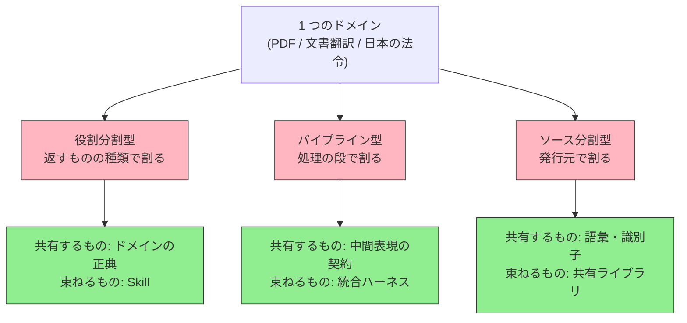
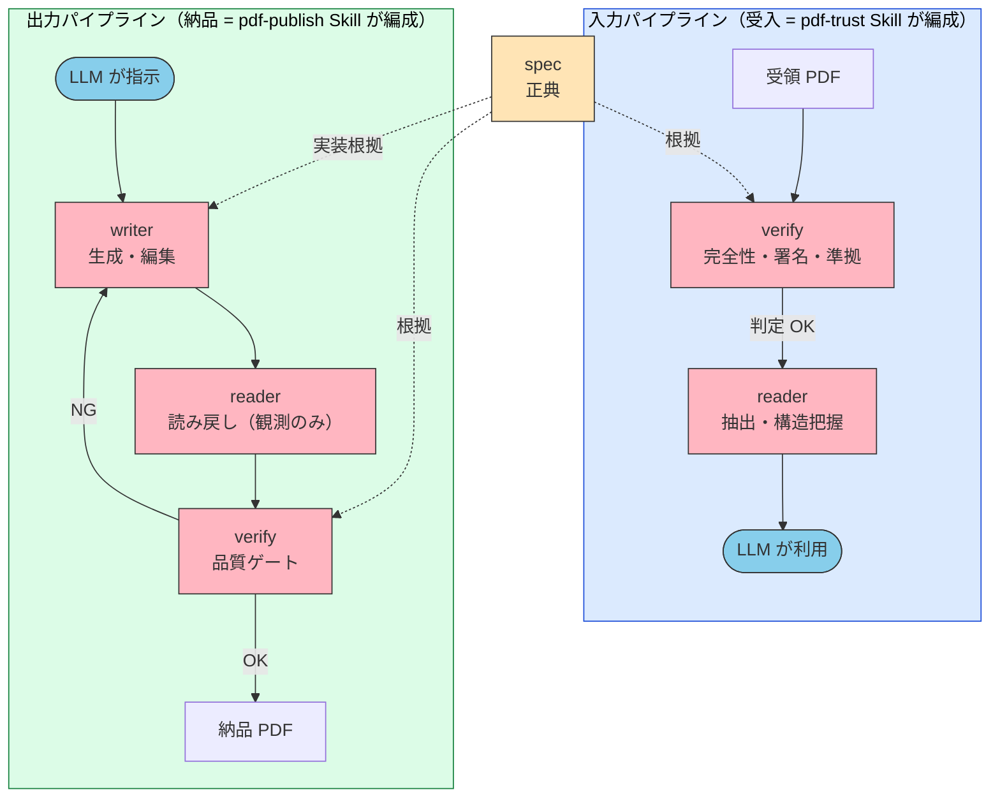
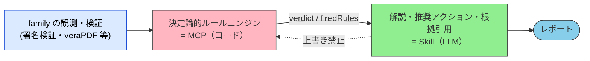

# MCP Family — 一つのドメインを複数の MCP に割る

> 難しいのは「MCP を作るか」ではない。一つのドメインを **どこで割り、何で束ねるか** である。

## このドキュメントについて

MCP の議論はたいてい「一つのサーバをどう設計するか」で止まる。しかし一つのドメインを本気で扱おうとすると、サーバは必ず複数になる。PDF なら「仕様を引く」「中身を読む」「本物か判定する」「書く」は、依存も利用者も寿命も違う。これを一つに詰めれば巨大サーバになり、無計画に分ければ責務が滲む。

本ページは、単一ドメインを複数 MCP に分割して **族（family）** として設計するときの判断軸を扱う。要点は二つ ── **どこで割るか（分割軸）** と、**何で束ねるか（結合子）**。

::: warning このページの位置づけ
本ページは [composition-patterns](./composition-patterns) の延長にある。あちらが **異なるドメインの MCP・Skill を横に組む**（翻訳 MCP × 品質評価 MCP など）話であるのに対し、本ページは **同じドメインを縦に割る** 話を扱う。単一 MCP の内部設計は [mcp/development](../mcp/development)、専門性を重みに宿らせるか文脈に宿らせるかは [specialization-weights-vs-context](./specialization-weights-vs-context) を参照。
:::

::: details メタ情報

|                              |                                                                                                             |
| ---------------------------- | ----------------------------------------------------------------------------------------------------------- |
| **このページで固定するもの** | 3 つの分割軸、相互非依存の原則、MCP / Skill / ライブラリの帰属判断、閉ループの型、責務の漏出への対処          |
| **扱わないこと**             | 単一 MCP のツール設計・実装手順（→ [mcp/development](../mcp/development)）、個別ドメインの仕様知識             |
| **依存**                     | [composition-patterns](./composition-patterns)、[mcp/what-is-mcp](../mcp/what-is-mcp)、[skills/vs-mcp](../skills/vs-mcp) |
| **誤用ポイント**             | MCP サーバ間に実行時依存を張ること、判定を LLM に委ねること、ツールの成功終了を成果の証拠と見なすこと          |

:::

> [!TIP]
> **3 行で言うと**
>
> - 一つのドメインを複数 MCP に割る軸は 3 つ ── **役割**（返すものの種類）、**パイプライン**（処理の段）、**ソース**（発行元）。何を共有するかで軸が決まる。
> - **MCP 同士に実行時依存を張ってはならない。** 各サーバは単独で価値が完結し、束ねるのは Skill（編成）か契約（中間表現）か共有ライブラリ（語彙）である。
> - 族の真価は **閉ループ** にある。writer → reader → verify を回すと、判定器が **検証可能な報酬** を生み、それがそのまま学習データになる。

## なぜ「族」という単位が要るのか

MCP を一つ作ると、次に必ず「隣」が欲しくなる。仕様を引けるようになれば、実ファイルがその仕様に適っているか見たくなる。読めるようになれば、書きたくなる。この増殖は自然だが、放置すると二つの失敗のどちらかに落ちる。

| 失敗 | 症状 |
| --- | --- |
| **詰め込みすぎ** | 20 を超えるツールが 1 サーバに同居し、ツール定義だけで文脈を圧迫する。読取しかしないユーザにも暗号ライブラリや重い検証器が同梱される |
| **割りっぱなし** | サーバは分かれているのに責務が滲む。「観測」を返すはずのサーバに合否判定ツールが生え、同じ判断が 2 か所に実装される |

族として設計するとは、この二つの間で **境界を明文化し、境界を跨ぐ道具を用意する** ことである。

## 分割軸 — どこで割るか

何を共有しているかによって、割り方は決まる。

| 軸 | 割り方 | 共有するもの | 結合子 | 実例 |
| --- | --- | --- | --- | --- |
| **役割分割型** | 返すものの種類で割る（正典 / 観測 / 判定 / 生成） | ドメインの正典 | **Skill**（編成手順） | PDF family |
| **パイプライン型** | 処理の段で割る（read → transform → write） | **中間表現の契約** | 統合ハーネス（別リポジトリ） | DTIR family |
| **ソース分割型** | 発行元・所管で割る | 語彙・識別子 | **共有ライブラリ**（npm） | houki-hub family |

> [!IMPORTANT]
> 3 軸は排他ではない。同じ族が二つの軸を併せ持つこともある。重要なのは **「この族は何を共有しているのか」を一文で言えること**。それが言えないなら、まだ族ではなく単なる MCP の寄せ集めである。

### 役割分割型 — 返すものの種類で割る

同じ対象（PDF ファイル）に対して、**返す情報の性質** で層を分ける。

| 層 | サーバ | 一行定義 | 返すもの |
| --- | --- | --- | --- |
| 正典 (norm) | `pdf-spec-mcp` | 仕様は何を要求するか | 規格条文・要求事項 |
| 実体 (fact) | `pdf-reader-mcp` | 中身に何があるか | **観測結果。合否を言わない** |
| 判定 (judgment) | `pdf-verify-mcp` | それは本物で、規格に適っているか | pass / fail 判定 |
| 生成 (production) | `pdf-writer-mcp` | 仕様どおりに書けるか | 新規 PDF・編集済 PDF |

> [!TIP]
> **境界ルールは一行で書ける。** 規格に照らした compliant / valid / pass-fail を返すなら判定層、観測を返すだけなら実体層。
>
> この一行があるかどうかで、族の寿命が変わる。ルールが無い族は、便利なツールが「置きやすい場所」に置かれ続け、半年後に同じ判断が 2 か所に実装される。

### パイプライン型 — 中間表現を契約にする

処理の段で割る場合、サーバ間で流れるデータ形式が実質的な API になる。ここで **中間表現（IR）だけを固定し、各サーバの内部実装は自由にする** のがパイプライン型の要点である。

DTIR family（混在言語の `.docx` を書式を崩さず翻訳する族）では、`reader → 言語解決 → 翻訳 → 品質検証 → writer` の各段を別 MCP にし、段の間を流れる形式だけを `@shuji-bonji/doc-translation-ir` という契約パッケージに固定している。各 MCP は **契約だけに依存** し、隣のサーバを知らない。

> [!IMPORTANT]
> パイプライン型で最も守るべきは、**「全部に依存する場所」を一箇所に隔離する** ことである。DTIR family では統合ハーネスを別リポジトリ（`dtir-docx-pipeline`）に置き、個別 MCP に兄弟依存を持ち込ませていない。これを怠ると、reader のテストを回すために writer をビルドする羽目になる。

### ソース分割型 — 発行元で割り、語彙を共有する

同じ「日本の法令」というドメインでも、e-Gov・国税庁・厚生労働省は取得経路も更新周期も HTML 構造も違う。ここを一つのサーバに詰めると、どこかのサイトのリニューアルで族全体が落ちる。発行元ごとに割るのが自然である。

ただしユーザーは「消法」「労基法」「電帳法」といった **略称** で呼ぶ。この解決辞書を各サーバが独自に持つと、必ず食い違う。houki-hub family では `@shuji-bonji/houki-abbreviations` として npm パッケージに一元化し、各 MCP がそれを参照している。

> [!NOTE]
> 語彙の共有は **MCP ではなくライブラリ** で行う。略称解決は決定論的な写像であり、ツール呼び出し 1 往復を消費する価値がない。族の共通部分をどこに置くかは、次節の帰属判断に従う。

## 帰属判断 — MCP か Skill かライブラリか

族を設計していると「この機能はどこに置くべきか」を何度も問うことになる。判断は 1 行で決まる。

| 性質 | 置き場所 | 理由 |
| --- | --- | --- |
| 決定論的計算・暗号・外部 I/O | **MCP** | LLM に確率的に再現させてはいけない。同じ入力に同じ出力が返る必要がある |
| 手順・知識・複数ツールの編成 | **Skill** | 判断の順序と分岐は自然言語で書いたほうが保守できる |
| 複数サーバが使う再利用ロジック | **npm ライブラリ** | ツール呼び出しを消費せず、族の中で一意性を保てる |

> [!WARNING]
> よくある誤りは、**編成そのものを MCP にしてしまう** ことである。「trust」や「publish」のような編成は手順であり、手順は Skill の担当である。編成を MCP に落とすと、サーバ間に実行時依存が生まれ、分割の利点（単独テスト・単独導入・単独進化）を全部失う。

## 相互非依存 — 族は依存グラフではない

族の設計原則で最も重要なのはこれである。

> [!CAUTION]
> **MCP サーバ間に実行時依存を作らない。** 各サーバは単独で価値が完結し、他のサーバが接続されていなくても動く。編成は Skill と LLM が担う。

なぜここまで強く言うか。統合したくなる誘惑は常にあるからである。PDF family でも「reader と verify は統合すべきか」は繰り返し検討され、**統合しない** という結論が出ている。

| 観点 | 統合した場合 | 分離を維持した場合 |
| --- | --- | --- |
| ツール数 | 20 超の巨大サーバがツール定義で文脈を圧迫する | 用途別に選んで接続できる |
| 依存の重さ | 暗号ライブラリと検証器が読取だけのユーザにも同梱される | 重い依存は判定層だけが背負う |
| **A2A 耐性** | 読取のようなコモディティ化しやすい機能と、構造的に残る機能が運命を共にする | それぞれ独立に生存戦略を取れる |
| 報酬信号としての信頼性 | 判定が他の関心と混ざる | **判定専業だからテストオラクルとして信頼できる** |

曖昧さの解消は統合ではなく、**境界ルールの徹底とツールの移管** で行う。

## 閉ループ — 族が単なる寄せ集めと分かれる点

族の分割が正しくできていると、**入口と出口の両方に判定層を立てる** という構図が自然に出てくる。ここが、便利ツールの集まりと設計された族との分かれ目である。

- **入力側（受入）**: 判定してから読む。信用できないものを先に読むと、LLM の文脈に汚染された情報が入る
- **出力側（納品）**: 書いたら読み戻し、機械採点する。NG なら書き直す
- **正典層は両方に根拠を供給する**。ただし実行時依存ではなく、Skill が「逸脱時に条項を引く」ために呼ぶ

> [!IMPORTANT]
> 出力側のループは、**「LLM が生成し、決定論的な検証器が採点する」** という構造をしている。これは Loop Engineering でいう外側ループを、ドメイン固有の合否基準で閉じたものである。詳細は [Loop Engineering](./loop-engineering) を参照。

### ジャッジはコード、ナラティブは LLM

閉ループを成立させる最重要の規律がこれである。

判定は固定ルール表による決定論的な処理として MCP 側に置く。同じ入力・同じプロファイルなら常に同じ判定が出る。LLM の仕事は **「なぜその判定になったか」の解説・推奨アクションの文章化・根拠の引用** であって、判定の上書きではない。

> [!CAUTION]
> LLM に verdict を出させると、族は監査可能性を失う。「この PDF は信用できるか」に確率的な答えを返すシステムは、法務・医療・行政の文脈では使えない。**判定の再現性は、族が実務に耐えるかどうかの分水嶺である。**

この規律は PDF family に固有のものではなく、判定を伴うすべての族に適用できる。ルール表の書式、判定不能をどう表現するか、判定層をコードに置けるかの見極め、そしてモデル更新による判定ドリフトへの備えは [判定の決定論性](./deterministic-verdicts) で扱う。

### 閉ループが生む副産物 — 検証可能な報酬

判定層が pass / fail を返し続けると、そこには **入力とラベルの対** が蓄積する。これは重み特化（ファインチューニング）の学習データそのものである。

> [!IMPORTANT]
> [specialization-weights-vs-context](./specialization-weights-vs-context) では、専門性を **重み（ルート B）** に宿すか **文脈・ツール（ルート A）** に宿すかを扱った。族の閉ループは、その両者を繋ぐ。**ルート A で組んだ族が、ルート B の燃料（検証可能な報酬）を生産する。** ドメイン特化 LLM を将来つくるつもりがあるなら、判定層に判断を集約するほど報酬信号の質が上がる。

## 族を運用すると必ず起きること

族は作った瞬間が完成形ではない。実際に運用すると、以下は例外なく発生する。あらかじめ対処を決めておく。

### 責務の漏出

「便利だから」という理由で、観測層に合否判定ツールが生える。PDF family でも reader 側に `validate_tagged` / `validate_metadata` が生え、判定層の責務と重複した。

**対処**: 境界ルールに照らして移管する。ただし即削除はしない ── 説明文で移管先へ誘導し、次のメジャーバージョンで削除する、という段階的 deprecation を取る。

### 仕様と実装の乖離

仕様書が Tier A から始まっているのに、実装は仕様のどの Tier にも無い機能（新規生成）から始まっていた、ということが起きる。悪いのは実装ではなく、仕様が実態に追いついていないことが多い。

**対処**: 仕様側に **Tier 0** を追記して実装を体系に位置づける。実装を仕様に合わせて捨てるのは、動いているものを壊すだけになりがちである。

### 名称の衝突

`verify` のような一般的な語は、複数の意味を引き寄せる。「原本の真正性検証」と「AI 抽出結果の照合」は、名前が同じでも入力も利用者層も別系統である。

**対処**: 別パッケージに分ける。判定層を小さく保つことが A2A 耐性の源泉であり、そこに異質な関心を同居させない。

### ツールの成功終了は成果の証拠にならない

これは族に限らないが、閉ループを組むと露わになる。writer が `exit 0` かつ warnings なしで終了しても、要求した内容が出力に入っているとは限らない。実測では、Markdown のインライン装飾処理で `snake_case` の `_` が消え、識別子が別物になっていた。

**対処**: 読み戻しで **入力と機械的に突き合わせる**。識別子・固有名詞・数値が残っているか、見出しの件数が一致するかを確認する。「やったつもり」になれる操作（添付・しおり付与など）は、出力側でその痕跡の実在を確認する。

> [!WARNING]
> もう一つ。**前段が失敗したら、後段は「失敗」ではなく「スキップ」と記録する。** 直列化された操作は前段の出力を入力に取るため、前段の失敗が後段を巻き添えにする。両者を混ぜると、レポートを読む人が原因を誤る。

## いつ族にするか / しないか

| 族にする | 単一 MCP に留める |
| --- | --- |
| 依存の重さが層ごとに大きく違う（暗号・検証器・モデル） | 依存が均質 |
| 利用者層が層ごとに違う（読むだけの人 / 判定したい人） | 利用者が単一 |
| 「観測」と「判定」を分ける必要がある（監査・法令・規格） | 合否の概念が無い |
| 単独でも価値が完結する切り口が見つかる | 分けると全部が半端になる |
| ツール数が 20 を超えそう | 10 前後で収まる |

> [!TIP]
> 迷ったら **「このサーバは、隣のサーバが無くても価値があるか」** を問う。答えが No なら、それは別サーバではなく同じサーバのツールである。

## 設計チェックリスト

- [ ] この族が **共有しているもの** を一文で言えるか（正典 / 契約 / 語彙）
- [ ] 分割軸は 3 つのどれか、明示したか
- [ ] 境界ルールを **一行** で書けるか（例: 合否を返すなら判定層、観測なら実体層）
- [ ] MCP サーバ間に **実行時依存** が無いか
- [ ] 編成は Skill に、再利用ロジックはライブラリに置いたか
- [ ] 「全部に依存する場所」を一箇所に隔離したか
- [ ] **判定は決定論的なコード側** にあり、LLM が上書きできない構造か
- [ ] 出力側に **読み戻し + 機械採点** のゲートがあるか
- [ ] ツールの成功終了ではなく、**出力の観測** で成果を確認しているか
- [ ] 責務が漏出したときの **移管手順（段階的 deprecation）** を決めてあるか

## 関連ドキュメント

- [deterministic-verdicts](./deterministic-verdicts) — 「ジャッジはコード」を族横断の規律に一般化。ルール表の書式、四値判定、判定ドリフトへの備え
- [composition-patterns](./composition-patterns) — 異ドメインの MCP・Skill を横に組む（本ページは縦に割る側）
- [specialization-weights-vs-context](./specialization-weights-vs-context) — 族の閉ループが生む検証可能な報酬と、重み特化の関係
- [loop-engineering](./loop-engineering) — 外側ループをシステムに移す工学。閉ループの一般形
- [mcp/development](../mcp/development) — 単一 MCP の設計・ツール粒度・実装手順
- [mcp/catalog](../mcp/catalog) — 構築済み MCP カタログ
- [mcp/verifiable-mcp](../mcp/verifiable-mcp) — MCP 出力の出典忠実性を検証可能にする設計
- [skills/vs-mcp](../skills/vs-mcp) — Skill と MCP の使い分け
- [skills/showcase](../skills/showcase) — Skill の実例

## 🔗 さらに深く: なぜツール定義が文脈を圧迫するのか

本ページは族の **分割と結合（What/How）** を扱った。「**なぜ** ツール定義の量が性能を落とすのか」「**なぜ** 長い文脈の中間が読まれなくなるのか」を LLM の構造的制約から理解したい場合は、姉妹サイトを参照。

- [understanding-llm / Part 6: MCP のコンテキストコスト](https://shuji-bonji.github.io/understanding-llm-through-claude-code/ja/06-tool-context/mcp-context-cost) — ツール定義が常時消費するトークンの実態。族を分けて選択接続する根拠
- [understanding-llm / Context Rot](https://shuji-bonji.github.io/understanding-llm-through-claude-code/ja/01-llm-structural-problems/context-rot/) — 入力トークンが増えるほど性能が落ちる現象。巨大サーバを避ける根拠
- [understanding-llm / Lost in the Middle](https://shuji-bonji.github.io/understanding-llm-through-claude-code/ja/01-llm-structural-problems/lost-in-the-middle/) — 文脈中央の情報が参照されにくくなる問題

---

> **前へ**: [構成パターン](./composition-patterns.md)
> **次へ**: [判定の決定論性](./deterministic-verdicts.md)

**最終更新**: 2026 年 7 月
