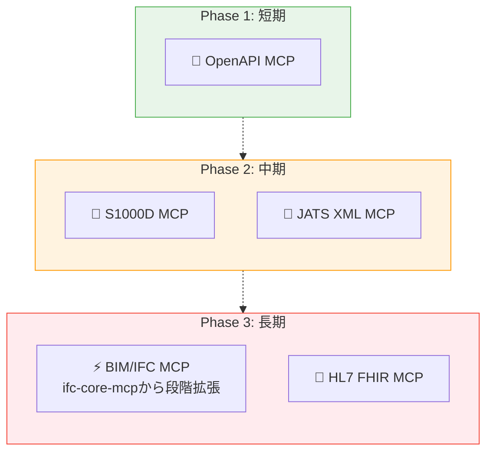

# MCP構築ロードマップ

> 構築済み・構想中のMCPを評価し、優先度と構築計画を整理する。

## このドキュメントについて

本ドキュメントは、[Discussion #19](https://github.com/shuji-bonji/ai-agent-architecture/discussions/19)（MCP構築戦略マップ v2）をプロジェクト正式ドキュメントとして整理したものである。

MCPの構築候補を5軸で評価し、構築状況と優先度ロードマップを示す。Skillの構築戦略は [skill-roadmap.md](./skill-roadmap)、MCP×Skillの複合構成は [composition-patterns.md](./composition-patterns) を参照。

## MCP評価の5軸

新規MCP候補は、以下の5軸で実現可能性を評価する。この評価は [02-reference-sources.md](../concepts/02-reference-sources) の「ブレない参照先」5つの性質と対応している。

| 軸           | 意味                                                |
| ------------ | --------------------------------------------------- |
| 管理団体     | 明確な標準化団体が存在するか                        |
| オープン性   | 仕様が無料で公開されているか                        |
| 機械可読性   | XML Schema / DTD / JSON Schema 等が提供されているか |
| 構造の明確さ | セクション/モジュール単位でクエリ可能な構造か       |
| 実用場面     | 実際に使われている産業・規模                        |

## 構築状況

### 構築済みMCP

| MCP               | npm                           | 分類       |
| ----------------- | ----------------------------- | ---------- |
| rfcxml-mcp        | `@shuji-bonji/rfcxml-mcp`     | 標準規格   |
| w3c-mcp           | `@shuji-bonji/w3c-mcp`        | 標準規格   |
| pdf-spec-mcp      | `@shuji-bonji/pdf-spec-mcp`   | 標準規格   |
| pdf-reader-mcp    | `@shuji-bonji/pdf-reader-mcp` | ツール実行 |
| epsg-mcp          | `@shuji-bonji/epsg-mcp`       | 専門領域   |
| rxjs-mcp-server   | `rxjs-mcp-server`             | ツール実行 |
| xcomet-mcp-server | `xcomet-mcp-server`           | ツール実行 |
| pwa-mcp           | 🔒 Private                    | 開発支援   |

### 構想中MCP — 5軸評価

| MCP候補      | 管理団体              | オープン性  | 機械可読性    | 構造 | 実用場面        | 総合  |
| ------------ | --------------------- | ----------- | ------------- | ---- | --------------- | ----- |
| **OpenAPI**  | ✅ OpenAPI Initiative | ✅ 無料     | ✅ JSON/YAML  | ✅   | ✅ API設計全般  | **◎** |
| **S1000D**   | ✅ ASD/AIA/ATA        | ✅ 無料     | ✅ XML Schema | ✅   | ✅ 防衛・重工業 | **◎** |
| **JATS XML** | ✅ NISO               | ✅ 無料     | ✅ XML DTD    | ✅   | ✅ 学術出版     | **◎** |
| **BIM/IFC**  | ✅ buildingSMART      | ✅ 無料     | ✅ EXPRESS    | ⚠️   | ✅ 建設DX       | **○** |
| **HL7 FHIR** | ✅ HL7                | ✅ 無料     | ✅ JSON/XML   | ✅   | ✅ 医療情報     | **◎** |
| **DICOM**    | ✅ NEMA               | ⚠️ 一部有償 | ✅ 独自形式   | ⚠️   | ✅ 医用画像     | **△** |

### 候補別の詳細

#### S1000D MCP

> **注**: 当初「仕様書は有償」と評価していたが、これは誤り。S1000Dの仕様はs1000d.orgから**無料でダウンロード可能**（利用規約への同意は必要）。

rfcxml-mcp / w3c-mcp と同等の条件が揃っている。仕様は3,500ページ以上（51.8MB）と巨大だが、チャプター/データモジュール型で構造が明確であり、rfcxml-mcpと同じ「必要なセクションだけを検索・取得する」設計パターンが適用できる。

特筆すべき点：

- **サプライチェーンの品質ゲートキーピング**: AIが「このデータモジュールはS1000D Issue 6に準拠しているか？」を仕様参照で検証できる
- **国際的な相互運用性**: 各国の防衛産業が共通規格で技術文書を交換できる基盤
- **「知識の民主化」との整合**: 無料公開であることを知らない人も多く、MCP化してアクセスしやすくすること自体に価値がある

#### JATS XML MCP

rfcxml-mcpの設計パターンが直接適用可能。学術論文の構造化参照、引用関係の解析、メタデータ抽出などをMCPツールとして提供できる。

#### BIM/IFC MCP

> 中国の大学が既にBIM MCPを提供しているが、本プロジェクトでは [ifc-core-mcp](https://github.com/shuji-bonji/ifc-core-mcp) をコアとしてボトムアップで構築していく方針をとる。

構築戦略：

- **ifc-core-mcp**（IFC4.3スキーマ定義・エンティティ検索・継承関係・PropertySet）をコアとして先行構築
- その上に、検証ツール・変換ツールなどを段階的に積み上げるボトムアップ方式

## 優先度ロードマップ

> Skill側のロードマップは [skill-roadmap.md](./skill-roadmap) を参照。ハイブリッド構成（MCP + Skill）の設計指針は [composition-patterns.md](./composition-patterns) を参照。

## 関連ドキュメント

- [Discussion #19: MCP構築戦略マップ v2](https://github.com/shuji-bonji/ai-agent-architecture/discussions/19) — 本ドキュメントの元となったDiscussion
- [skill-roadmap.md](./skill-roadmap) — Skill構築ロードマップ
- [composition-patterns.md](./composition-patterns) — 複合構成パターン
- [concepts/03-architecture.md](../concepts/03-architecture) — MCP / Skill / Agent のレイヤー構造
- [mcp/catalog.md](../mcp/catalog) — 構築済みMCPカタログ
