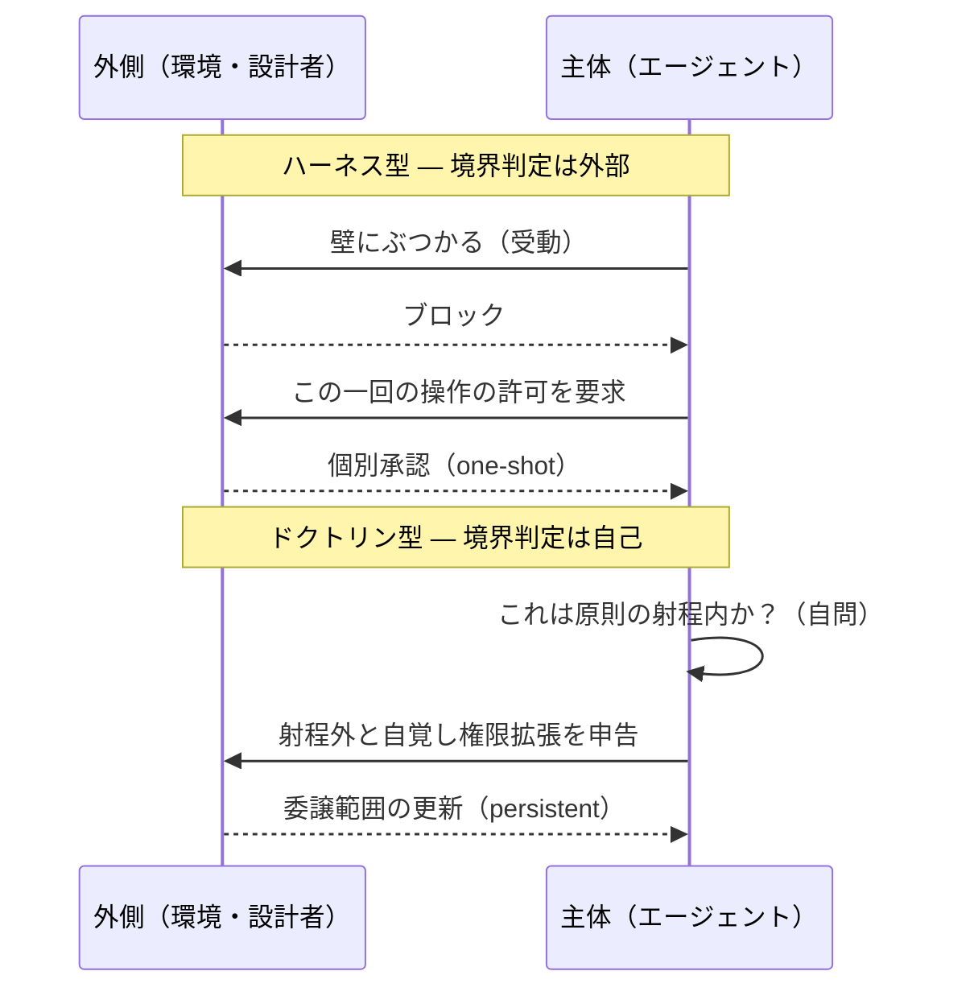
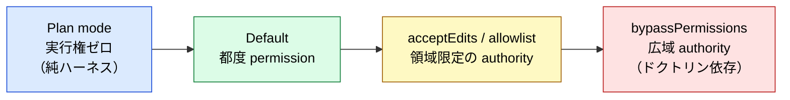
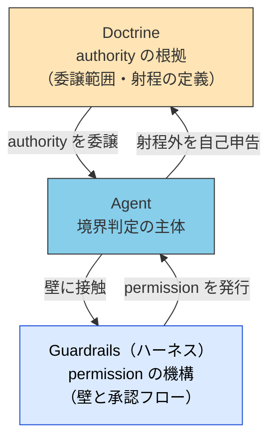

# Permission と Authority — 境界で何を求めるか

> [ハーネス](../glossary#harness)型は許可 (permission) を求め、ドクトリン型は権限 (authority) を求める。求めるものの粒度・境界判定の所在・故障モードが、すべて対称的に逆転する。

## このドキュメントについて

> [!NOTE]
> [Harness Engineering との対応関係](./harness-engineering-mapping) は、ハーネスと 5 層モデルの **静的な構造対応** を扱った。本ページはその続編として、外部制約で動くハーネス型と、内面化された原則で動くドクトリン型が、**制御境界に達したとき何を要求するか** という動的な振る舞いの違いを扱う。

> **対象読者**: エージェントの自律性レベルを設計する人、Claude Code の permission mode 群を「設定項目の羅列」ではなく設計原理として理解したい人

> [!TIP]
> **3 行で言うと**
>
> - 許可 (permission) は一回限りの個別承認、権限 (authority) は持続的・再帰的な裁量の付与。時間的持続性が違う。
> - ハーネス型は境界判定が外部化される（壁が止める）。ドクトリン型は内部化される（射程を自問する）。
> - 故障モードも逆転する。ハーネス型は許可待ちで硬直し、ドクトリン型は権限を拡大解釈して暴れる。

## 許可と権限 — 時間的持続性が違う

決定的なのは、「許可」と「権限」が **時間的な持続性** で別物だという点である。

- **許可 (permission)** は、その一回の行為に対する個別承認。「いま、この操作をやっていいですか？」承認されても権限は手元に残らない。次も聞く。**one-shot かつ反復的**。
- **権限 (authority)** は、今後その種の判断を自分の裁量でやれる **地位の付与**。「この領域は自分が決めていいことにしてください」。一度通れば **持続的・再帰的** に行使できる。

|                          | 許可 (Permission)             | 権限 (Authority)                       |
| ------------------------ | ----------------------------- | -------------------------------------- |
| 粒度                     | 個別の行為                    | 判断領域                               |
| 持続性                   | one-shot（行為ごとに消費）    | persistent（領域に対して保持）         |
| 反復                     | 毎回要求する                  | 一度の委譲で再帰的に行使する           |
| 境界での問い             | 「この操作をやっていいか」    | 「この領域を自分の裁量にしてよいか」   |
| セキュリティ工学の対応物 | ACL（アクセスごとにチェック） | Capability（保持・委譲可能なトークン） |

> [!IMPORTANT]
> ハーネス型の主体は、構造上ずっと権限を持てない設計になっている。**権限を渡したら外側の壁の意味が薄れる** からである。だから個別承認を反復するしかない。一方ドクトリン型は、原則を与えられた時点で「原則の射程内なら自分で判断してよい」という権限委譲がすでに済んでいる。境界で問うのは、その権限の **更新・拡張** になる。

この区別は思いつきの比喩ではない。セキュリティ設計における ACL と capability-based security の対立、組織論における principal-agent 理論の delegation と同型であり、先行分野で検証済みの構造である。

## 境界判定の所在 — 誰が境界に気づくか

さらに非対称な点がある。**境界に近づいたことを誰が検知するか** である。

- **ハーネス型では境界判断が外部化される**。主体は自分が境界に近いことすら知らなくてよい —— 壁が止めてくれる。境界に対して **受動的** で、ぶつかってから許可プロセスが起動する。
- **ドクトリン型では境界判断が内部化される**。「これは自分の原則の射程内か？」を主体が自問する。境界に対して **能動的** で、超えていると自覚した主体が自ら申告して権限を求める。

「許可を求める」能力自体はハーネス（壁という外部装置が承認フローを発生させる）が与え、「権限を求める」能力自体はドクトリン（原則という内部装置が「自分の射程を測る」メタ判断を発生させる）が与える。**求める行為の質まで、制御の所在に規定されている**。

## 故障モードの対称性

境界判定の所在が逆なので、壊れ方も逆になる。

|      | ハーネス型の故障                                   | ドクトリン型の故障                                                          |
| ---- | -------------------------------------------------- | --------------------------------------------------------------------------- |
| 形態 | 許可待ちで止まる。過剰な萎縮・デッドロック         | 権限を過大に自己解釈する。原則の拡大解釈・逸脱                              |
| 性質 | 安全だが硬直する                                   | 柔軟だが暴れる                                                              |
| 検知 | 容易（止まっているのが見える）                     | 困難（動き続けるため逸脱が見えにくい）                                      |
| 対策 | allowlist による段階的委譲、自律性レベルの引き上げ | 監査ログ、[品質ゲート](../agents/subagent-quality-gate)、原則の射程の明文化 |

> [!WARNING]
> 実務上もっとも重要なのは **検知容易性の非対称** である。ハーネス型の故障（停止）はすぐ気づくが、ドクトリン型の故障（拡大解釈）はタスクが進行し続けるため発見が遅れる。authority を委譲するなら、**検知装置（監査・品質ゲート）をセットで設計する** ことが MUST である。

## 純粋型は存在しない — 委譲スペクトラム

実運用のエージェントは純粋なハーネス型でも純粋なドクトリン型でもなく、両者のあいだの **スペクトラム** 上にある。Claude Code の permission mode 群はその好例で、許可から権限への段階的委譲を UI として実装している。

| Claude Code の機構        | スペクトラム上の位置                       | [07 章の自律性レベル](../concepts/07-doctrine-and-intent) |
| ------------------------- | ------------------------------------------ | --------------------------------------------------------- |
| Plan mode                 | 純ハーネス（提案のみ、実行権ゼロ）         | Level 1（完全監視）                                       |
| Default（都度確認）       | permission の反復                          | Level 2                                                   |
| `acceptEdits` / allowlist | 領域限定の authority                       | Level 3                                                   |
| `bypassPermissions`       | 広域 authority（安全性はドクトリンに依存） | Level 4（完全自律）                                       |

> [!TIP]
> allowlist は「**one-shot 許可の束を持続的権限に変換する装置**」と読める。「この操作を毎回許可する」を選んだ瞬間、permission は当該操作種別に対する authority に変換される。委譲スペクトラム上の移動は、この変換の積み重ねで実現される。

> [!CAUTION]
> スペクトラムの右端（広域 authority）に進むほど、安全性の根拠は **壁からドクトリンへ移転する**。`bypassPermissions` で安全に運用できるかは、Doctrine 層（目的・制約・判断基準・射程の明文化）の品質に直接依存する。ドクトリンが空のまま右端に進むのは、検知装置なしでドクトリン型故障を招く設計である。

## 5 層モデルとの関係

permission の機構はハーネス（Guardrails）が提供し、authority の根拠は Doctrine 層が提供する。境界判定の主体は Agent 層である。

[Harness Engineering との対応関係](./harness-engineering-mapping) で「Guardrails は Doctrine の防御面のみに対応する」と整理したが、本ページの語彙で言い直すと: **Guardrails は permission を管理し、Doctrine は authority を定義する**。ハーネスに Doctrine 層の攻め（規範強度の明文化）が含まれないのは、ハーネスが authority の語彙を持たないからである。

## 関連ドキュメント

- [strategy/proposal-and-binding](./proposal-and-binding) — permission が拘束層、authority が表現層に置かれる要求である理由（本ページの前提となる座標系）
- [strategy/harness-engineering-mapping](./harness-engineering-mapping) — ハーネス 4 要素と 5 層モデルの静的対応
- [concepts/07-doctrine-and-intent](../concepts/07-doctrine-and-intent) — Doctrine 層の詳細、自律性レベル 1〜4 の定義
- [agents/subagent-quality-gate](../agents/subagent-quality-gate) — ドクトリン型故障（拡大解釈）の検知装置としての品質ゲート
- [mcp/security](../mcp/security) — MCP 境界での権限管理
- [strategy/deterministic-verdicts](./deterministic-verdicts) — **「行為の裁量」ではなく「判定を出す権限」** を渡すか。行為は取り消せるが、判定は下流に取り込まれた時点で取り消せない

## 🔗 さらに深く: なぜ LLM に持続的 authority を渡しにくいか

本ページは permission と authority の **構造 (What/How)** を扱った。「**なぜ** LLM への持続的な権限委譲が難しいのか」を LLM の構造的制約から理解したい場合は、姉妹サイトを参照。

- [understanding-llm / 付録: Authority と LLM の構造的制約](https://shuji-bonji.github.io/understanding-llm-through-claude-code/ja/appendix/authority-and-llm-constraints) — Instruction Decay・Sycophancy・Context Rot が「射程の自己判定」を侵食する構造
- [understanding-llm / 判定ドリフト](https://shuji-bonji.github.io/understanding-llm-through-claude-code/ja/appendix/judgment-drift) — 委譲した先で下される **判定** が再現しない 3 層の機構

---

> **前へ**: [提案と拘束](./proposal-and-binding.md)
> **次へ**: [重み特化 vs 文脈特化](./specialization-weights-vs-context.md)

**最終更新**: 2026 年 6 月
