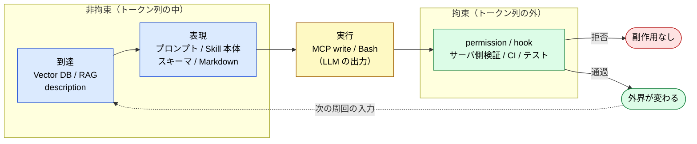

# 提案と拘束 — 到達 / 表現 / 実行 / 拘束の四層

> 拘束力を決めるのは、処理が決定論的かどうかではない。成果物がトークン列に入るかどうかである。

## このドキュメントについて

RAG、Vector DB、MCP、Skills、プロンプト。これらはいずれも最終的に LLM の context window へ文字列として並ぶ。そのため「結局は LLM が読める形にデータを構造化する話だ」という観察が成り立つ。この観察は妥当だが、これだけを設計指針にすると、**成否を決めている層** が視界から外れる。

本ページは、個々の技術を評価する前に置く座標系を定義する。扱うのは 3 つである。(1) 拘束するものとしないものを分ける判定質問、(2) トークン列の内側にある 2 つの別作業（到達と表現）、(3) 四層への配置と、層を取り違えたときに何が起きるか。

> **対象読者**: RAG・MCP・Skills・permission を同じ設計の中に並べて置く人、「プロンプトに書いたのに守られない」の原因を層で説明したい人

::: warning このページの位置づけ
本ページは分類の座標系だけを扱う。座標系の上に載る個別の設計は別ページにある。**拘束層のうち判定をどう設計するか** は [判定の決定論性](./deterministic-verdicts)、**拘束層の境界でエージェントが何を要求するか** は [Permission と Authority](./permission-vs-authority)、**ハーネスと 5 層モデルの静的対応** は [Harness Engineering との対応関係](./harness-engineering-mapping) を参照。
:::

::: details メタ情報

|                              |                                                                                                                              |
| ---------------------------- | ---------------------------------------------------------------------------------------------------------------------------- |
| **このページで固定するもの** | 拘束 / 非拘束の判定質問、到達と表現の区別、四層の定義、技術ごとの層配置、設計時の三点チェック                                 |
| **扱わないこと**             | 判定層の内部設計（→ [deterministic-verdicts](./deterministic-verdicts)）、境界での要求形式（→ [permission-vs-authority](./permission-vs-authority)）、個別 MCP の実装手順（→ [mcp/development](../mcp/development)） |
| **依存**                     | [harness-engineering-mapping](./harness-engineering-mapping)                                                                  |
| **誤用ポイント**             | 検索処理が決定論的だから拘束すると考えること、スキーマ検証を呼び出しの是非に対する拘束と考えること、CLAUDE.md の禁止事項を拘束層に数えること |

:::

> [!TIP]
> **3 行で言うと**
>
> - 拘束するかどうかは **LLM が指示を無視した出力を出したとき、結果が変わるか** で決まる。変わらないものだけが拘束する。処理そのものが決定論的かどうかとは無関係である。
> - トークン列の内側は 2 作業に割れる。**到達**（何を候補にするか）と **表現**（入った後に誤読されないか）。両者は代替しない。
> - 最も起きやすい取り違えは、拘束層のつもりで書いたものが表現層にいることである。プロンプトの禁止事項がこれにあたる。

## 出発点の観察と、その不足

LLM の入力はトークン列 1 本である。RAG の検索結果も、MCP のレスポンスも、Skill 本体も、プロンプトも、そこに並ぶところへ収束する。「全部データの構造化だ」という観察はこの事実を正しく捉えている。

不足しているのは、**その構造化がどれだけ精緻でも、LLM はそれを無視した出力を出せる** という点である。構造化は出力の分布を動かすが、確定はさせない。確定させているものが設計のどこにあるのかは、構造化の議論からは出てこない。

## 分割線 — 何が成否を決めるか

判定は 1 つの質問でできる。

> [!IMPORTANT]
> **LLM が指示を無視する出力を出したとき、結果は変わるか。**
>
> - 変わる → **非拘束**。提案どまりである
> - 変わらない → **拘束**。成否が確定する

| 側                             | 内容                                                                     | 拘束                       |
| ------------------------------ | ------------------------------------------------------------------------ | -------------------------- |
| **トークン列に入るもの**       | RAG の検索結果、プロンプト、Skill 本体、tool description、MCP のレスポンス | しない                     |
| **境界: LLM の出力そのもの**   | どのツールを、どの引数で呼ぶか                                            | ここまでは確率的に決まる   |
| **トークン列の外にあるもの**   | permission、hook、MCP サーバ側の引数検証、型チェック、CI、テスト、人間による承認 | する                       |

「制御機構は構造化とは別物だ」という直感が正しいのは、**3 行目だけ** である。CLAUDE.md の禁止事項もプロンプトの注意書きも tool description の警告も、形式上は制御に見えるが、実体は 1 行目にある。

> [!WARNING]
> **処理そのものが決定論的かどうかは、拘束力とは無関係である。**
>
> Vector DB の検索は決定論的なコードで、同じクエリなら同じ結果を返す。それでも結果は context に入るので、LLM はそれを無視した出力を出せる。逆に permission は LLM の出力を入力に取るが、判定はトークン列の外で完結するため拘束する。決定論的な実装であることと、成否を確定させることは別の性質である。

> [!NOTE]
> **用語の対応**: 本サイトの他ページでは「決定論的な判定層」という呼び方をしている（[判定の決定論性](./deterministic-verdicts)）。あれは本ページの **拘束層** に対応する。本ページで「決定論的」を拘束の同義語として使わないのは、上のとおり決定論的でも拘束しない処理があるためである。

## トークン列の内側 — 到達と表現

「データの構造化」と呼ばれるものの中にも、目的の異なる 2 作業が混在している。

| 区分                 | 問い                                 | 典型                                                      |
| -------------------- | ------------------------------------ | --------------------------------------------------------- |
| **到達 (Reach)**     | 何を context の候補にするか           | Vector DB の検索、Skill の description による発火、tool description |
| **表現 (Expression)** | context に入った後、誤読されない形か | Markdown 構造、スキーマ定義、プロンプト本文、Skill 本体     |

到達が良くても表現が悪ければ誤読する。表現が良くても到達しなければ、そもそも context に入らない。片方を厚くしても、もう片方の代わりにはならない。

## 四層

| 層       | 拘束     | 問い                       | 典型                                              |
| -------- | -------- | -------------------------- | ------------------------------------------------- |
| **到達** | しない   | 何を候補にするか           | Vector DB / RAG、description による選択           |
| **表現** | しない   | 誤読されない形か           | プロンプト、Skill 本体、スキーマ、整形済みレスポンス |
| **実行** | 境界     | 何をどう呼ぶか             | MCP の write 系ツール、Bash                        |
| **拘束** | する     | 通すか、拒否するか         | permission / hook、サーバ側検証、型・CI・テスト、人間による承認 |

実行は二段である。**試みる**ところまでは確率的に決まり、**通るかどうか**は拘束層で決まる。実行層に到達したこと自体は何も保証しない。

人間による承認も、判定がトークン列の外で完結する限り拘束層に属する。ただし承認者が読む材料がエージェントの自己申告だけなら、後述の三点チェックの 3 番目に該当する。

実行の結果は次の周回の到達・表現へ戻る。この周回は [Harness Engineering との対応関係](./harness-engineering-mapping) の①〜④ループと同じものを、拘束の有無という別の軸で切ったものである。

### 技術ごとの配置

| 技術                    | 到達               | 表現                     | 実行           | 拘束                     |
| ----------------------- | ------------------ | ------------------------ | -------------- | ------------------------ |
| Vector DB / RAG         | ◎                  | ○                        | –              | –                        |
| プロンプト              | –                  | ◎                        | –              | –                        |
| Skills                  | ○（description）   | ◎（本体）                | –              | –                        |
| MCP                     | ○（tool description） | ○（レスポンス整形）   | ◎（write 系）  | ○（引数検証・スキーマ）  |
| permission / hook / CI  | –                  | –                        | –              | ◎                        |

**MCP だけが四層にまたがる。** 「MCP はデータ構造化の手段だ」とだけ捉えると、MCP が持つ唯一の拘束部分——サーバ側の引数検証とスキーマ拒否——が設計から抜け落ちる。

> [!WARNING]
> **スキーマ検証が拘束するのは「どう呼ぶか」だけである。**
>
> スキーマは引数の形を拒否できる。呼ぶべきでない場面でそのツールを呼ぶことは拒否できない。後者は permission 側の判定であり、別の機構が要る。→ [Permission と Authority](./permission-vs-authority)
>
> 同じスキーマが 2 つの層に顔を出す点にも注意する。**検証の強制**（サーバ側で拒否すること）が拘束層、**定義の記述**（引数の意味を書き、LLM に読ませること）は表現層である。上の表で MCP が表現と拘束の両方に印を持つのはこのためである。

## よくある取り違え

| 取り違え                             | 実態                                                                     |
| ------------------------------------ | ------------------------------------------------------------------------ |
| CLAUDE.md に禁止事項を書いたから安全 | 表現層。無視されれば結果が変わる                                          |
| プロンプトで「許可するな」と書いた   | 提案側への要請であり、拘束層ではない                                      |
| スキーマ検証があるから安全           | 引数の形しか拒否しない。呼び出しの是非は別の層                            |
| RAG を厚くすれば拘束は不要になる     | 到達と表現の強化であり、許可の所在は動かない                              |
| 別の LLM を許可役にすれば拘束になる  | 主体を分けると相関しない誤りは検出できる。ただし許可判定自体は確率的なまま |

最後の行を否定だけで読まないこと。**主体の分離には効果がある**。提案側と許可側で誤りの相関が切れるので、片方だけが誤っている場合は検出できる。ただし層は上がらず、拘束層の代わりにはならない。

## 提案する主体と、許可する主体

この四層が必要になる理由は、次の一文に集約される。

> [!IMPORTANT]
> 提案する主体が許可可否を同時に決めると、**正しい判断** と **たまたま当たった判断** を区別できない。

提案側がどれだけ根拠を添えても、その根拠は表現層にある。根拠の質が高いことと、許可が下りることは、別の層で決まっている必要がある。両者が同じ主体・同じ層にあると、事後に区別する手段が残らない。

ただし拘束層に置いた判定であっても、その **入力** が提案側に支配されていれば拘束力は落ちる。判定器がエージェントの自己申告だけを読んでいるなら、判定は形式上は外にあっても、実質は提案側にある。判定層の入力と再現性の設計は [判定の決定論性](./deterministic-verdicts) を参照。

## 設計時の三点チェック

新しい仕組みを足すたびに、次の 3 つを問う。

1. それは **到達 / 表現 / 実行 / 拘束** のどれか
2. **LLM が無視したら結果は変わるか**（変わるなら拘束層ではない）
3. 拘束層に置いたなら、その **入力は提案側に支配されていないか**

構造化（到達・表現）は提案の質を上げる。拘束は許可と実行の成否を決める。両方が要り、片方を厚くしてももう片方の代わりにはならない。

## 関連ドキュメント

- [strategy/harness-engineering-mapping](./harness-engineering-mapping) — ハーネス 4 要素と 5 層モデルの静的対応。本ページの前提
- [strategy/permission-vs-authority](./permission-vs-authority) — 拘束層の境界で、ハーネス型とドクトリン型が何を要求するか
- [strategy/deterministic-verdicts](./deterministic-verdicts) — 拘束層のうち判定をどう設計するか。観測 / 判定 / 解説の三段分離
- [strategy/mcp-family](./mcp-family) — 「ジャッジはコード、ナラティブは LLM」を族の内部規律として述べた版
- [mcp/semantic-layer](../mcp/semantic-layer) — 確率的解釈と決定的コンパイルの分業。同型の別ドメイン適用
- [concepts/05-solving-ai-limitations](../concepts/05-solving-ai-limitations) — 確率的推論と決定論的検証の分離

## 🔗 さらに深く: なぜ表現層は拘束できないのか

本ページは層の **分類 (What/How)** を扱った。「**なぜ** context に書いた指示が守られないことがあるのか」を LLM の構造的制約から理解したい場合は、姉妹サイトを参照。

- [understanding-llm / Authority と LLM の構造的制約](https://shuji-bonji.github.io/understanding-llm-through-claude-code/ja/appendix/authority-and-llm-constraints) — Instruction Decay・Context Rot・Sycophancy が「原則の保持」を侵食する構造
- [understanding-llm / 判定ドリフト](https://shuji-bonji.github.io/understanding-llm-through-claude-code/ja/appendix/judgment-drift) — 判定を LLM に置いたとき、再現しない 3 層の機構

---

> **前へ**: [Harness Engineering との対応関係](./harness-engineering-mapping.md)
> **次へ**: [Permission と Authority](./permission-vs-authority.md)

**最終更新**: 2026 年 8 月
