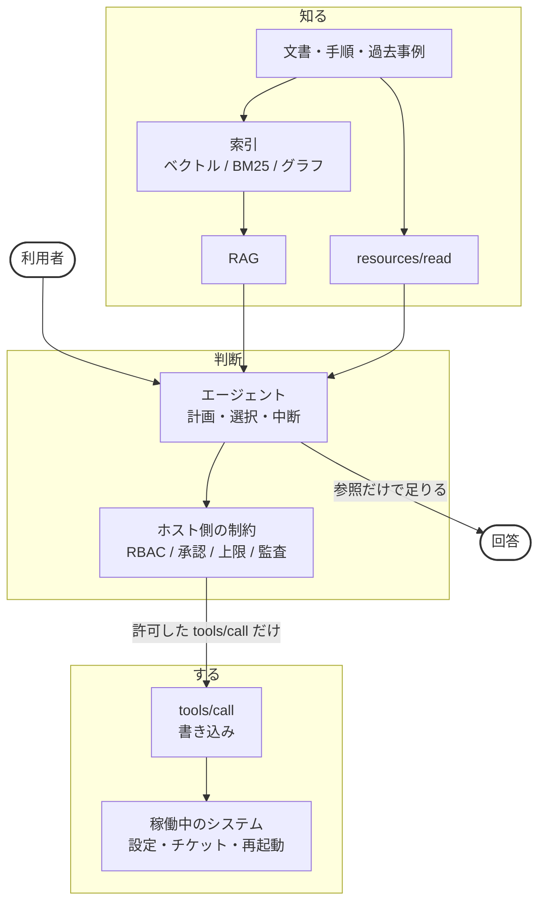
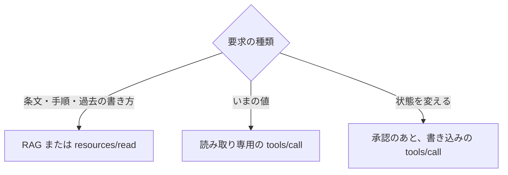
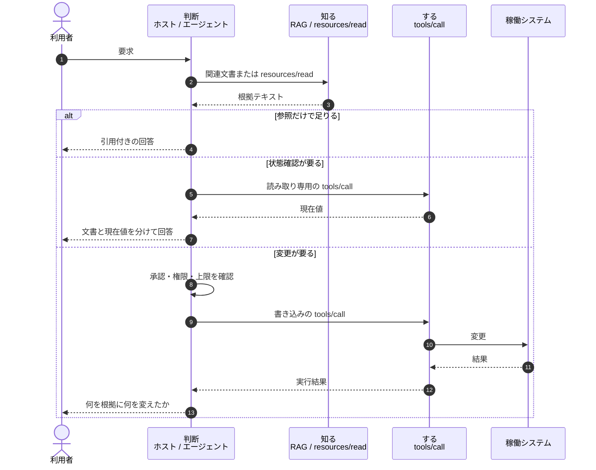

# 知る経路と、する経路

::: tip このページの位置づけ
本ページは、拘束力の理論ではない。何が拘束し、何が拘束しないかの座標系は [提案と拘束](./proposal-and-binding) にある。
ここで決めるのは、一つの要求を、知る経路で済ませるか、する経路へ進めるか、という運用上の規則である。
:::

[IV.1 パターン](../part-4/patterns) の「1.2 RAG と MCP」は、外の知識の取り方を書いた。本ページは、その先にある境界を書く。知るための経路と、状態を変える経路を混ぜない、という話である。

## このページが扱うこと

- RAG が担うことと、担わないこと
- MCP が担うことと、担わないこと
- 参照の結果を、実行の許可と取り違えない理由
- 要求の種類で、先に使う経路を分けること
- 五層のどこに置くか

## このページが扱わないこと

- ベクトル DB の選定、チャンク分割の手順
- MCP サーバーの実装（[III.2 MCP](../mcp/what-is-mcp)、[MCP開発ガイド](../mcp/development)）
- GraphRAG の構築手順（関係の網が仕事の本体なら [III.4 Memory](../part-3/memory) と [IV.1](../part-4/patterns)）
- 認証情報の管理とサーバーの脅威分類（[MCP セキュリティ](../mcp/security)）

## 1. 二つの対比は別物である

[IV.1](../part-4/patterns) の中心は、次の対比だった。

- RAG: 文書を切って、似た文を探す
- MCP: 場所を指して、原文や API から取る

この対比は、知識の取り方としては今も正しい。ただし現場では、別の対比が同時に起きる。

- 知る: 文書や原文や現在値を読んで答える
- する: 設定を変える、チケットを作る、プロセスを再起動する

**RAG 対 MCP は、この第二の対比の別名ではない。** MCP は知るためにも使う。RAG の出力は、実行の許可ではない。

| 見る軸       | RAG                                            | MCP                                                      |
| ------------ | ---------------------------------------------- | -------------------------------------------------------- |
| 何か         | 検索して生成に渡す型                           | ホストとサーバーが能力と文脈をやり取りするプロトコル     |
| 知識の取り方 | 切れ端の類似検索                               | 節・条・API など、場所を指して取る                       |
| 実行         | 持たない                                       | `tools/call` で持てる。`resources/read` は読み取りである |
| 鮮度         | 索引の更新に依存する                           | 呼び出した時点の値を取れる                               |
| 権限         | 文書を読めたことと、変更してよいことは別である | 接続できることと、変更してよいことは別である             |

二者択一ではない。一つの仕事に重ねてよい。

## 2. それぞれが担うこと

### RAG が担うこと

外部の文書から、今の質問に関係する箇所を探し、生成のそばに置く。社内 Wiki の説明、手順の草稿、過去事例の文章に向く。

### RAG が担わないこと

- 稼働システムの「いまの値」を保証すること
- 設定変更、チケット作成、再起動
- 索引に無い改正を、自動で知っていることにすること
- 拾った手順文を、実行許可に変えること
- 元の文書に付いていたアクセス制御を保つこと

最後の一つは見落としやすい。人事部だけが読める文書を索引に入れると、検索の側には権限の区別が残らない。誰が何を読めるかは、索引を作る時点で設計する（**SHOULD** / するのがよい）。

### MCP が担うこと

Model Context Protocol は、ホストとサーバーの間の決まりである。サーバーが出せるものは、主に次の三つである。

| 提供         | 呼び出しの名前                                              | 意味                                         |
| ------------ | ----------------------------------------------------------- | -------------------------------------------- |
| **Tool**     | `tools/list` / `tools/call`                                 | 実行できる操作。読み取りだけの操作も含む     |
| **Resource** | `resources/list` / `resources/read` / `resources/subscribe` | 読めるデータ。ファイル、レコード、仕様の一節 |
| **Prompt**   | `prompts/list` / `prompts/get`                              | 使い方の型                                   |

法令、RFC、いまのレプリカ数、いまの訳のように、場所を指して取る仕事に向く。書き込みの Tool を出せば、状態を変えることもできる。

### MCP が担わないこと

- 「この操作をしてよいか」の最終判断。判断はホストと Doctrine と承認が持つ
- 検索品質そのもの。切れ端検索を Tool の中に入れても、切れ端検索のままである
- サーバーが止まったあとの代替。止まり方は設計に含める

判断が要らない処理まで MCP にしてはならない（**MUST NOT** / してはならない）。普通のプログラムでよい。判断の量で置き場を決める考え方は [II.2 配置基準](../part-2/placement) にある。

## 3. よくある取り違え

「RAG か MCP か」と聞くと、次の取り違えが起きやすい。

1. **MCP を実行専用だと思う。** `resources/read` と、読み取り専用の `tools/call` を忘れている。
2. **RAG を知識そのものだと思う。** RAG は置き場ではなく、探して渡す型である。
3. **RAG を MCP サーバーの中に入れたので、MCP に置き換わったと思う。** 中身は検索のままである。
4. **`tools/list` に載ったことを、実行許可だと思う。** 許可はホスト側の制約が与える。

四つ目には、仕様の側にも補助がある。MCP のツール注釈（`readOnlyHint` / `destructiveHint` / `idempotentHint` / `openWorldHint`）は、サーバーが自分のツールの性質を申告するものである。ただし仕様は、これらがヒットであって動作の保証ではないこと、信頼できないサーバーから受け取った注釈をもとにツール使用を判断してはならないことを明記している。注釈が付いていないツールは、破壊的なものとして扱うのが既定である。

注釈は、読み取りと書き込みを分けて並べるための材料になる。許可の根拠にはならない。詳しくは [MCP セキュリティ](../mcp/security) を見る。

使える組み合わせの例である。

- 説明文は RAG、条文は `resources/read` または参照系 Tool
- 文書検索そのものを `search_docs` のような Tool にする
- 現在値の確認は読み取り専用の Tool、変更は別サーバーの書き込み Tool

## 4. 境界を無視したときの壊れ方

知る経路と、する経路を同じ入口にすると、次が起きる。

| 寄せ方                                         | 起きること                                                   |
| ---------------------------------------------- | ------------------------------------------------------------ |
| RAG で拾った古い手順のまま変更する             | 文書は古い。エージェントは実行する。影響は実システムに出る   |
| 「ポリシーは何か」を書き込み Tool に回す       | 遅くなる。副作用が生じる。実行権限が要らない問いに権限が付く |
| 現在値を、索引済みの設計書だけで答える         | 設計書と稼働がずれていても、気づかない                       |
| 参照用と変更用の Tool を一つの一覧に載せる     | モデルが、近い名前の書き込みを選ぶ余地が残る                 |
| 知る経路が返した本文を、そのまま指示として読む | 文書に書かれた命令文が、書き込みの引き金になる               |

最後の行は、鮮度とは無関係に成立する。索引が最新でも、本文に「以下を実行してください」と書いてあれば同じことが起きる。これは OWASP MCP Top 10 の MCP06（Prompt Injection via Contextual Payloads）に当たる。

境界は実装の好みではない。変更操作がある仕事では、信頼性の制御である。

**参照の結果を、実行の許可にしてはならない**（**MUST NOT** / してはならない）。この命題には兄弟がある。**参照の結果を、指示として読んではならない**（**MUST NOT** / してはならない）。

## 5. 本番で持つ形

三つの担当に分ける。製品名ではない。担当である。

| 担当 | 受け持つもの                     | 置いてはならないもの         |
| ---- | -------------------------------- | ---------------------------- |
| 知る | 文書の断片、原文の一節、いまの値 | 変更操作                     |
| 判断 | 足りるか、古いか、実行してよいか | 検索索引そのもの、接続の設定 |
| する | 許可された `tools/call`          | 手順書の全文、方針文         |

判断は五層では Agent と Doctrine である。する経路の入口は MCP 層である。知る経路は、RAG（多くの場合 Agent の取り方）、Memory、MCP の Resource と読み取り Tool に分かれる。

## 6. 要求の種類で経路を選ぶ

| 質問の例                       | 先に使うもの                          | 先に使わないもの |
| ------------------------------ | ------------------------------------- | ---------------- |
| このサービスの障害時手順は何か | RAG または `resources/read`           | 再起動の Tool    |
| 今のレプリカ数はいくつか       | 読み取り専用の `tools/call`           | 古い設計書だけ   |
| レプリカを 3 に増やしてよいか  | 判断と承認と、書き込みの `tools/call` | RAG が返した一文 |

変更の前に、文書と現在値を分けて確認する方がよい（**SHOULD** / するのがよい）。書き込み Tool の名前、引数、結果は残す方がよい（**SHOULD** / するのがよい）。

一連の流れを、実装の名前に直すと次のようになる。

## 7. 五層との関係

パターンは層の別名ではない。[IV.1 の 1.4](../part-4/patterns) と同じ立場である。

| 五層     | この境界での役割                                                     |
| -------- | -------------------------------------------------------------------- |
| Doctrine | 実行してよい条件、禁止、承認が要る線                                 |
| Agent    | 知るだけで足りるか、読み取りが要るか、変更が要るかを分ける           |
| Skills   | 手順と観点。接続そのものではない                                     |
| Memory   | 自分たちの仕事の関係と履歴。法令や RFC の原文は置かない              |
| MCP      | 外への接続。読み取りと書き込みを、サーバーまたは Tool の単位で分ける |

Skills に「再起動してよい」と書いてあっても、再起動を呼び出す Tool が無ければ実行できない。逆に、再起動の Tool が `tools/list` に載っていても、Doctrine が禁じていれば実行してはならない。この非対称は [Permission と Authority](./permission-vs-authority) で扱っている。

クラウドの Projects に載る RAG も、Messages API の Citations も、知る側の実装である。GraphRAG は、関係をたどって知る型である。する側にはならない。

## 8. 要約

RAG と MCP は競争しない。層が違う。

- 説明文を探すなら RAG
- 条や節やいまの値を指して取るなら MCP の Resource または読み取り Tool
- 状態を変えるなら、承認の先にある書き込み Tool
- 関係の残りなら Memory
- してよいかは Doctrine
- どれを選ぶかは Agent

型の選び方に唯一の正解は無い。実際に起きた失敗を見て、知る経路と、する経路を分ける。

## 関連ドキュメント

- [提案と拘束](./proposal-and-binding) — 何が拘束し、何が拘束しないかの座標系
- [Permission と Authority](./permission-vs-authority) — 拘束層の境界で何を要求するか
- [判定の決定論性](./deterministic-verdicts) — 判定を LLM の外に置く設計
- [構成パターン](./composition-patterns) — 異ドメインの MCP と Skill を横に組む
- [IV.1 パターン](../part-4/patterns) — 知識の取り方の対比
- [III.2 MCP](../mcp/what-is-mcp) — Tool / Resource / Prompt
- [MCP セキュリティ](../mcp/security) — OWASP MCP Top 10 と注釈の扱い
- [III.4 Memory](../part-3/memory) — 関係の残り
- [MCP vs Skills](../faq/mcp-vs-skills) — 接続と手順書
- [II.2 配置基準](../part-2/placement) — 判断が要らない処理はプログラムのまま
- [全体地図](../information/architecture-map) — 資源とアクセスの三軸
