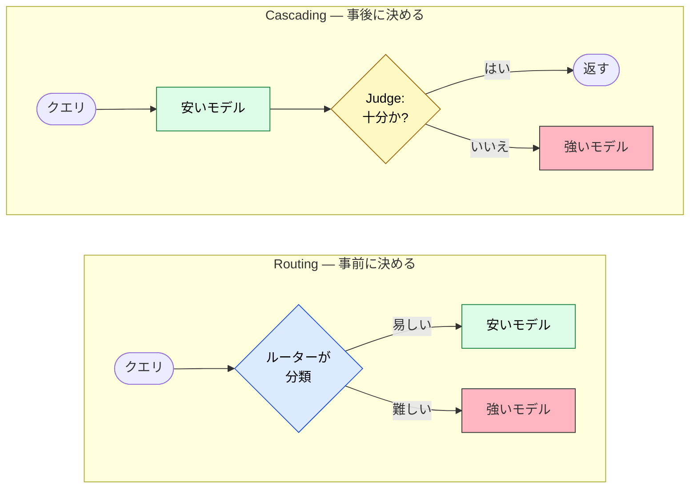
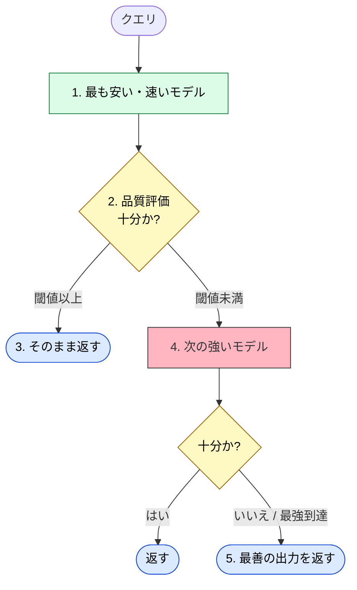
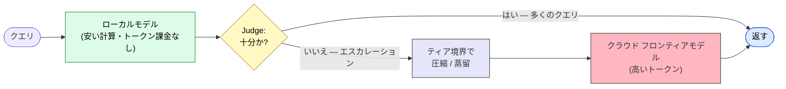

# Routing vs Cascading — コストと品質でクエリをモデルに振り分ける

> Routing はモデルが動く **前** に決め、Cascading は答えた **後** に決める。前者は予測可能なレイテンシを、後者は低い平均コストを買う。

## このドキュメントについて

使えるモデルが 2 つ以上になった瞬間 ── 安いローカルモデルと高いクラウドモデル、あるいは同系列の小さいバリアントと大きいバリアント ── 設計の問いは「どのモデルか」ではなく「**どのクエリにどのモデルか**」に変わる。ここを下手に答えると、些末なクエリにフロンティアモデルを浪費するか、逆に難しいクエリを弱いモデルに回して静かに間違えさせることになる。

基本的な答えは 2 つあり、**判断を下すタイミング** で分かれる。**Routing** はクエリを事前に分類して 1 つのモデルを選ぶ。**Cascading** はまず安いモデルを動かし、出力を評価し、足りなければエスカレーションする。本ページはこの選択を判断軸で決められるようにし、なぜこれが **local + cloud ティア** 構成の自然な制御層になるのかを示す。

::: warning このページの位置づけ
本ページは [03-architecture](../concepts/03-architecture) の三層モデル、[04-ai-design-patterns](../concepts/04-ai-design-patterns) のパターン選択を前提とする戦略レイヤーのドキュメントである。[specialization-weights-vs-context](./specialization-weights-vs-context) が「専門家をどう作るか」を扱うのに対し、本ページは「**すでに手元にある複数モデルへ、クエリをどう振り分けるか**」を扱う。[What is A2A](../agents/what-is-a2a) の上に載るポリシー層である。
:::

::: details メタ情報

| | |
| --- | --- |
| **このページで固定するもの** | 選択軸（事前判断 vs 事後判断）・判断ヒューリスティック・local + cloud ティアへの写像 |
| **扱わないこと** | ルーターの学習レシピ、特定 Judge モデルのハイパーパラメータ（→ 各論文の一次情報を参照） |
| **依存** | [03-architecture](../concepts/03-architecture)、[04-ai-design-patterns](../concepts/04-ai-design-patterns)、[What is A2A](../agents/what-is-a2a) |
| **誤用ポイント** | 「Routing か Cascading か」の二者択一で捉えること、ルーティング判断と圧縮判断を絡めて実験で効果を切り分け不能にすること |

:::

## 一言でいうと

どちらも複数モデルにまたがってクエリあたりのコストを最小化する戦略である。違うのは **振り分け判断をいつ下すか** だけ。

- **Routing** = 「最初から適切なモデルを選ぶ」── 生成 *前* にクエリを分類し、**1 つ** のモデルを動かす。
- **Cascading** = 「まず安いモデルで試し、ダメなら強いモデルへ」── 生成 *後* に出力を評価し、**1 つ以上** のモデルを順次動かす。

### 中心的な違い

| 項目 | **Routing** | **Cascading** |
| --- | --- | --- |
| 判断のタイミング | **クエリを受け取った直後**（生成前） | **生成後に品質を評価**し、必要なら次のモデルへエスカレーション |
| 実際に動くモデル数 | 基本的に **1 つ** | **複数を順次** |
| 基本戦略 | 「このクエリはどのモデルが適切か」を事前に分類 | 「安いモデルで十分か？ → 足りなければ強いモデルへ」 |
| 代表的な手法 | RouteLLM, Semantic Routing | **FrugalGPT**（最も有名） |
| メリット | シンプルで予測しやすいレイテンシ | コスト削減効果が大きい（多くのクエリを安いモデルで処理） |
| デメリット | ルーターの精度が全体品質に直結 | 最悪ケースで複数モデルを呼びレイテンシ＋Judge コストが悪化 |

## Routing — 事前にモデルを選ぶ

**定義**: 入力クエリに対して、**生成前にどの LLM を使うかを決定** する。

### 主なルーティング手法

| 手法 | 内容 | 特徴・難易度 |
| --- | --- | --- |
| **Static / Rule-based** | クエリの種類やユーザー属性で固定ルールで振り分ける | 最もシンプルだが柔軟性に欠ける |
| **Classifier-based** | 小さな分類モデル（または LLM）でクエリの難易度・カテゴリを判定 | 比較的よく使われる |
| **Semantic Routing** | クエリの Embedding と、各モデルの代表的なクエリの Embedding を比較 | 自然言語的な類似性でルーティング |
| **LLM-as-a-Router** | 別の LLM に「このクエリはどのモデルが適切か」と判断させる | 精度は高いがコストがかかる |
| **Learned Router** | RouteLLM のように、過去データでルーターを学習させる | 最も研究が進んでいる領域 |

**メリット**: 不要な高性能モデル呼び出しを減らせる。専門モデル（コーディング特化、検索特化）を活かしやすい。コストと品質のバランスを取りやすい。

**課題**: ルーター自体の精度が決定的 ── 難しいクエリを弱いモデルに誤って回すと品質が大きく落ちる。ルーティング判断自体のオーバーヘッドも発生する。

> [!IMPORTANT]
> ルーターは、選び分ける対象モデル間の **差分よりも安く・速く** **あるべき (SHOULD)**。ルーターが強いモデルを呼ぶのと同じだけのコストを食うなら、ルーティングは差し引きマイナスになる。これは「門番は門より安くあるべき」という普遍則の、ルーティング固有の形である。

## Cascading — 安いモデルで試し、必要時にエスカレーション

**定義**: 安価・高速なモデルから順に試し、**出力品質が不十分と判定されたときだけ、より強力なモデルにエスカレーション** する。

最も有名なのは **FrugalGPT**（Stanford, 2023）。クエリごとにどのモデルのカスケードを使うかを学習し、GPT-4 と同等の品質を最大 **98% のコスト削減** で実現した。

### 典型的なカスケードの流れ

### カスケードのバリエーション

- **Simple Cascade** — 弱いモデル → 強いモデル（固定順）。
- **Confidence-based Cascade** — モデルの出力確信度でエスカレーションを判断。
- **Judge-based Cascade** — 別のモデル（または同じモデル）に「この回答で十分か？」を判定させる（FrugalGPT で採用）。
- **Cascade Routing**（統合型） — Routing と Cascading を組み合わせる。後述。

**メリット**: 多くのクエリが実は *簡単* な場合、安いモデルで処理できる割合が高く、平均コストが大幅に下がる。全体の品質は最強モデルに近づけられる。

**課題**: Judge の精度が決定的。最悪ケースでは複数モデルを呼びレイテンシが悪化。Judge モデル自体の追加コストも発生する。

> [!WARNING]
> カスケードの最難関は **品質評価（Judge）** である。弱い Judge はカスケードがない場合より悪い ── 悪い回答を素通りさせ（品質崩壊）、*かつ* 良い回答を不要にエスカレーションさせる（コスト爆発）。本当の工学的課題はモデルを繋ぐ配線ではなく、**Judge の設計** にある。

## 使い分け

| 状況・目的 | おすすめ | 理由 |
| --- | --- | --- |
| モデルごとに明確な得意分野がある | **Routing** | 最初から最適なモデルを選べる |
| ほとんどのクエリが比較的簡単 | **Cascading** | 安いモデルで処理できる割合が高い |
| 品質を最優先しつつコストも抑えたい | **Cascading** または **Cascade Routing** | 段階的にエスカレーションできる |
| レイテンシを厳しく管理したい | **Routing** | 基本的に 1 モデル呼び出しで済む |
| 複数の専門モデルを組み合わせたい | **Routing** | 専門性に応じた振り分けがしやすい |

> [!TIP]
> 早見ルール: 決め手が **専門性** なら Routing、**難易度** なら Cascading、**両方** なら Cascade Routing。

### Cascade Routing — 統合のフロンティア

近年の研究は、この選択を「Routing *か* Cascading *か*」ではなく単一の最適化として捉える。**Cascade routing**（[Dekoninck ら, 2024](https://arxiv.org/abs/2410.10347)）は両者を理論的に最適な戦略へ統合する ── 事前にルーティングし、*かつ* エスカレーションの選択肢も残し、目標品質に対して期待コストを最小化する経路をクエリごとに選ぶ。論文の実験では、いずれの単独手法も大きく上回る。

## Local + Cloud — これらのパターンの自然な棲家

Routing と Cascading は、**ローカルモデル + クラウドモデル** のティアにほぼ完璧に写像する。安い・速いティアがローカルモデル、強い・高いティアがクラウドのフロンティアモデル。「易しいのはローカル、難しいのはクラウド」がまさにカスケードの判断である。

ハイブリッドティア固有の設計メモが 2 つある。

> [!IMPORTANT]
> **ルーティング判断と圧縮判断は、別々の合成可能なポリシーとして分けること。** 「どのティアがこのクエリを扱うか」（routing/cascading）と「ティア境界を何が越えるか」（[Headroom](https://github.com/chopratejas/headroom) のようなコンテキスト最適化層）は、どちらも Doctrine 層の関心だが、絡めると実験で「効いたのはルーティングか圧縮か」を切り分けられなくなる。先にティアを決め、次に境界を越えるものを圧縮する。

> [!TIP]
> エスカレーション境界は、コンテキスト圧縮が最も効く場所でもある。カスケードがローカルからクラウドへエスカレーションするとき、ローカルモデルはすでに大きな文脈（ツール出力・検索チャンク）を集めていることが多い。それを **境界で** 圧縮すれば、高いクラウドトークンを削りつつ、安いローカル計算が圧縮コストを吸収する。コストは安い側に、便益は高い側に着地する。

## 実装時のポイント

- **Judge 設計が要。** 安易に作ると全体品質が大きく低下する。カスケードを信頼する前に Judge 自体の精度を測ること。
- **Judge コストを見込む。** カスケードでは Judge が毎クエリ走る ── そのコストは無視できず、予算に入れること。
- **デプロイごとに正しい軸を測る。** クラウドティアではクエリあたりコストと品質を、ローカルティアでは代わりに **TTFT・[トークン](../glossary#token)/秒・VRAM** を測る ── トークン課金がない以上「削減したコスト」の数字は無意味。
- **Routing と Cascading は排他ではない。** 2026 年現在、両者を組み合わせる「cascade routing」は活発で有望な方向である。

## 関連ドキュメント

- [04-ai-design-patterns](../concepts/04-ai-design-patterns) — どのパターンをいつ選ぶか（WHICH）
- [What is A2A](../agents/what-is-a2a) — routing/cascading ポリシーが載るエージェント間基盤
- [specialization-weights-vs-context](./specialization-weights-vs-context) — ルーターが振り分ける先の専門モデルを作る
- [local-llm-workspace-mapping](./local-llm-workspace-mapping) — ハイブリッド構成のローカルティアを配置する
- [composition-patterns](./composition-patterns) — 各ティア内での MCP × Skill × Agent の組み合わせ
- [deterministic-verdicts](./deterministic-verdicts) — Judge の判定を LLM から出す設計。合否基準が明文化できるカスケードでは、Judge をルール表に落とせる

## 🔗 さらに深く: なぜ Judge はそれほど信頼しにくいのか

本ページはモデルへのクエリ振り分けの **設計判断（What/How）** を扱った。その最難関 ── モデルが「回答が十分か」を信頼できる形で自己評価すること ── は、LLM の構造的限界に直撃する。「**なぜ** 自己評価が当てにならないのか」を理解したい場合は、姉妹サイトを参照。

- [understanding-llm / Hallucination](https://shuji-bonji.github.io/understanding-llm-through-claude-code/ja/01-llm-structural-problems/hallucination/) — 自信ある回答が正しい回答とは限らない理由
- [understanding-llm / Sycophancy](https://shuji-bonji.github.io/understanding-llm-through-claude-code/ja/01-llm-structural-problems/sycophancy/) — モデルの自己評価が迎合的に歪む理由
- [understanding-llm / Context Rot](https://shuji-bonji.github.io/understanding-llm-through-claude-code/ja/01-llm-structural-problems/context-rot/) — エスカレーション境界での文脈圧縮がクラウドティアに効く理由
- [understanding-llm / 判定ドリフト](https://shuji-bonji.github.io/understanding-llm-through-claude-code/ja/appendix/judgment-drift) — Judge の判定が実行ごと・モデル更新ごとに揺れる 3 層の機構。`temperature=0` では閉じない理由

## 参考文献

- Chen, L., Zaharia, M., & Zou, J. (2023). "FrugalGPT: How to Use Large Language Models While Reducing Cost and Improving Performance." arXiv. [arxiv.org/abs/2305.05176](https://arxiv.org/abs/2305.05176) — LLM カスケードの代表例。GPT-4 同等を最大 98% のコスト削減で実現
- Ong, I., et al. (2024). "RouteLLM: Learning to Route LLMs with Preference Data." arXiv. [arxiv.org/abs/2406.18665](https://arxiv.org/abs/2406.18665) — 選好データで学習したルーター。2 倍以上のコスト削減と転移可能なルーティング
- Dekoninck, J., Baader, M., & Vechev, M. (2024). "A Unified Approach to Routing and Cascading for LLMs." arXiv. [arxiv.org/abs/2410.10347](https://arxiv.org/abs/2410.10347) — 2 戦略を理論的に最適に統合する cascade routing
- chopratejas (2026). "Headroom — the context compression layer for AI agents." GitHub. [github.com/chopratejas/headroom](https://github.com/chopratejas/headroom) — ティア境界で使えるコンテキスト最適化層

---

> **前へ**: [重み特化 vs 文脈特化](./specialization-weights-vs-context.md)
> **次へ**: [エージェントループのパターン](./agent-loop-patterns.md)

**最終更新**: 2026 年 6 月
