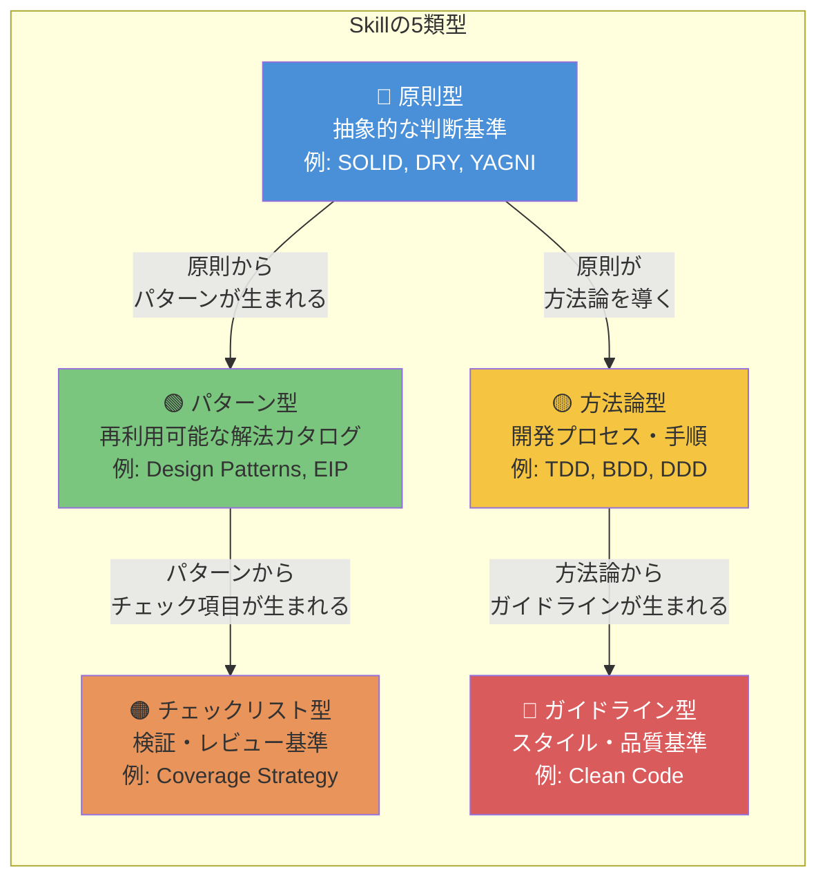

# Skill構築ロードマップ

> Skillの分類体系・評価基準・依存関係・構築計画を整理する。

## このドキュメントについて

本ドキュメントは、[Discussion #20](https://github.com/shuji-bonji/ai-agent-architecture/discussions/20)（Skill構築戦略マップ）をプロジェクト正式ドキュメントとして整理したものである。

MCPが「外部データへのリアルタイムアクセス」を担うのに対し、Skillは「静的な知識・判断基準」を担う（[03-architecture.md](../concepts/03-architecture) 参照）。MCPの構築戦略は [mcp-roadmap.md](./mcp-roadmap)、複合構成は [composition-patterns.md](./composition-patterns) を参照。

## Skillの5類型

Skillは全て「静的知識」だが、知識の種類によって構造が異なる。

| 類型                 | AIへの指示の形                             | 記述量目安             |
| -------------------- | ------------------------------------------ | ---------------------- |
| **原則型**           | 「この原則に違反していないか判断せよ」     | 短い（1-3ページ）      |
| **パターン型**       | 「この状況に適用可能なパターンを選択せよ」 | 長い（パターン数比例） |
| **方法論型**         | 「このプロセスに従って実行せよ」           | 中程度                 |
| **チェックリスト型** | 「全項目をチェックし結果を報告せよ」       | 短い                   |
| **ガイドライン型**   | 「このガイドラインに沿って改善せよ」       | 中程度                 |

## Skill評価の5軸

MCPの5軸（管理団体・オープン性・機械可読性・構造の明確さ・実用場面）に対応する、Skill固有の評価基準。

| 軸                   | 意味                                       |
| -------------------- | ------------------------------------------ |
| **知識の安定性**     | 頻繁に更新されるか（安定 ◎ 〜 変動あり △） |
| **スコープの明確さ** | 他Skillとの境界が明確か                    |
| **発動条件の明確さ** | いつ使うべきかが判断可能か                 |
| **単体完結性**       | 単独で価値を出せるか、他Skillが前提か      |
| **検証可能性**       | 効果を客観的に測れるか                     |

## 各Skillの評価

### 基盤Skill

| Skill          | 類型           | 安定性 | スコープ | 発動条件 | 単体完結性 | 検証可能性 |
| -------------- | -------------- | ------ | -------- | -------- | ---------- | ---------- |
| **SOLID**      | 原則型         | ◎      | ◎        | ◎        | ◎          | ○          |
| **Clean Code** | ガイドライン型 | ◎      | ○        | ◎        | ◎          | △          |
| **TDD**        | 方法論型       | ◎      | ◎        | ◎        | ◎          | ◎          |

### 設計Skill

| Skill                  | 類型       | 安定性 | スコープ | 発動条件 | 単体完結性 | 検証可能性 |
| ---------------------- | ---------- | ------ | -------- | -------- | ---------- | ---------- |
| **Design Patterns**    | パターン型 | ◎      | ◎        | ○        | ○          | ○          |
| **Clean Architecture** | 原則型     | ◎      | ◎        | ○        | ○          | ◎          |
| **DDD**                | 方法論型   | ◎      | △        | △        | △          | △          |

### テストSkill

| Skill                 | 類型             | 安定性 | スコープ | 発動条件 | 単体完結性 | 検証可能性 |
| --------------------- | ---------------- | ------ | -------- | -------- | ---------- | ---------- |
| **Test Patterns**     | パターン型       | ○      | ○        | ◎        | ○          | ◎          |
| **BDD**               | 方法論型         | ◎      | ◎        | ○        | ◎          | ◎          |
| **Coverage Strategy** | チェックリスト型 | ○      | ◎        | ◎        | ○          | ◎          |

### インフラ・アーキテクチャSkill

| Skill             | 類型       | 安定性 | スコープ | 発動条件 | 単体完結性 | 検証可能性 |
| ----------------- | ---------- | ------ | -------- | -------- | ---------- | ---------- |
| **12 Factor App** | 原則型     | ◎      | ◎        | ○        | ◎          | ◎          |
| **Microservices** | パターン型 | ○      | △        | △        | △          | △          |
| **EIP**           | パターン型 | ◎      | ◎        | ○        | ○          | ○          |
| **IaC Patterns**  | パターン型 | ○      | ○        | ○        | ◎          | ○          |

### 品質改善Skill

| Skill           | 類型       | 安定性 | スコープ | 発動条件 | 単体完結性 | 検証可能性 |
| --------------- | ---------- | ------ | -------- | -------- | ---------- | ---------- |
| **Refactoring** | パターン型 | ◎      | ◎        | ◎        | ○          | ○          |

## Skill間の依存関係

Skillには明確な依存階層がある。MCPは独立して構築できるが、Skillは依存関係を考慮した構築順序が必要。

## 発動コンテキスト — いつ使うか

Skillは「どの局面で発動すべきか」が曖昧になりがち。コンテキスト別のSkillセットで整理する。

| コンテキスト           | 発動Skill                             | 組み合わせの意味                                 |
| ---------------------- | ------------------------------------- | ------------------------------------------------ |
| **コード記述**         | Clean Code                            | 命名・関数設計の基準を常時参照                   |
| **コードレビュー**     | SOLID + Clean Code + Refactoring      | 原則違反検出 → 臭い特定 → 改善提案               |
| **アーキテクチャ設計** | DDD + Clean Architecture + 12 Factor  | ドメインモデリング → レイヤー設計 → クラウド対応 |
| **テスト設計**         | TDD + BDD + Test Patterns + Coverage  | プロセス → シナリオ → パターン適用 → 網羅性判断  |
| **リファクタリング**   | Refactoring + Design Patterns + SOLID | 臭い検出 → パターン適用 → 原則準拠確認           |
| **インフラ設計**       | 12 Factor + Microservices + IaC + EIP | クラウドネイティブ → 分割 → 自動化 → 統合        |

> 複数Skillの同時発動パターンの詳細は [composition-patterns.md](./composition-patterns) を参照。

## 「曖昧さ」の課題と対策

Skillの設計にはMCPにない固有の課題がある。

### 課題1: スコープの重複

「SRP（単一責任の原則）」はSOLID Skillか？Clean Code Skillか？

**対策**: 原則の**定義**はSOLID Skillに置き、Clean Codeでは**適用例として参照**する。Skill間で「定義の一次ソース」を決めておく。

### 課題2: 粒度の判断

DDDは1つのSkillにすべきか？戦略パターンと戦術パターンに分けるべきか？

**対策**: 発動コンテキストが同じなら1つ。初期は1つで作り、運用しながら分離を判断する。

### 課題3: 品質の測定

「このSkillは良いSkillか？」をどう測るか？

**対策**: 以下の間接指標で測定する。

| 指標             | 測定方法                                         |
| ---------------- | ------------------------------------------------ |
| AIの判断精度     | Skill適用前後でレビューの指摘が的確になったか    |
| 発動の適切性     | 不要な場面で発動しないか、必要な場面で発動するか |
| コンテキスト効率 | Skill参照のトークン消費に対して得られる効果      |

## 優先度ロードマップ

依存関係と実務直結度を考慮した構築順序。

## 関連ドキュメント

- [Discussion #20: Skill構築戦略マップ](https://github.com/shuji-bonji/ai-agent-architecture/discussions/20) — 本ドキュメントの元となったDiscussion
- [mcp-roadmap.md](./mcp-roadmap) — MCP構築ロードマップ
- [composition-patterns.md](./composition-patterns) — 複合構成パターン
- [concepts/03-architecture.md](../concepts/03-architecture) — Skillの定義とレイヤー構造
- [skills/creating-skills.md](../skills/creating-skills.md) — Skill作成ガイド
