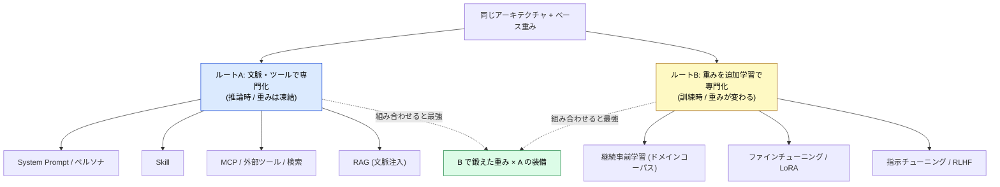
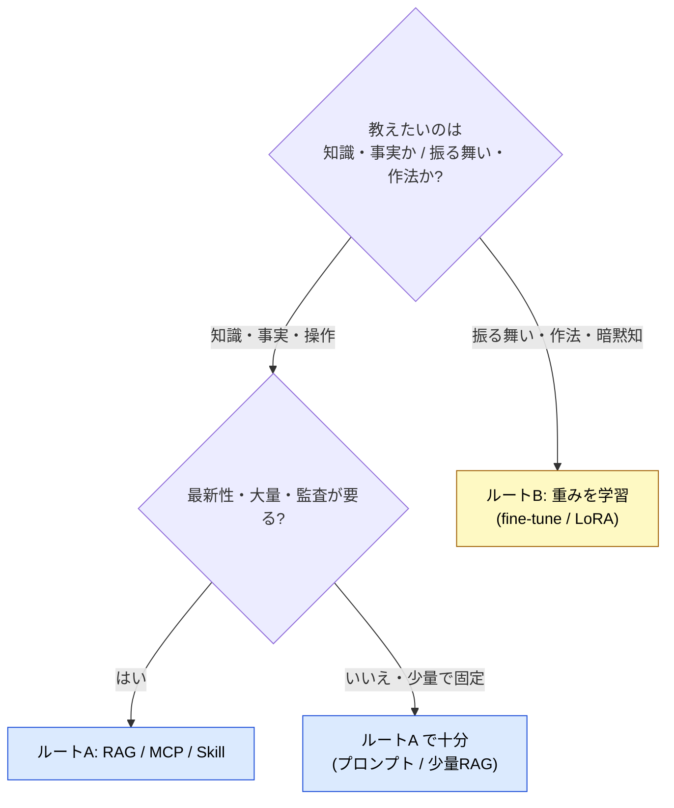

# 専門家エージェントの作り方 — 重み特化 vs 文脈特化

> 同じアーキテクチャ・同じベース重みから、専門家を仕立てる道は 2 本ある。両者は排他ではなく別の軸であり、組み合わせると最も強い。

## このドキュメントについて

「特定業務に特化したエージェントを作る」とき、最初に分かれる設計上の分岐がある。**重みを鍛える（訓練時）** のか、**文脈・ツールで武装する（推論時）** のか。この分岐を意識せずに「とりあえず fine-tuning」「とりあえず RAG」と流行で選ぶと、更新のたびに再訓練する羽目になったり、逆に文脈に延々スタイルを書いて再現性を落としたりする。

本ページは、この選択を **判断軸** で決められるようにする。要点は一つ ── **「専門性をどこに宿らせるか」**。重み（パラメトリック）か、文脈（非パラメトリック）か。

::: warning このページの位置づけ
本ページは [03-architecture](../concepts/03-architecture) の三層モデル、[04-ai-design-patterns](../concepts/04-ai-design-patterns) のパターン選択を前提とする戦略レイヤーのドキュメントである。[composition-patterns](./composition-patterns) が「どう組み合わせるか」、[local-llm-workspace-mapping](./local-llm-workspace-mapping) が「どこに置くか」を扱うのに対し、本ページは **「専門性を重みに焼くか、文脈に差すか」** を扱う。
:::

::: details メタ情報

|                              |                                                                                                       |
| ---------------------------- | ----------------------------------------------------------------------------------------------------- |
| **このページで固定するもの** | 重み特化（訓練時）と文脈特化（推論時）の選択軸・判断ヒューリスティック・ハイブリッド設計               |
| **扱わないこと**             | 個別のファインチューニング手順、特定モデルの学習ハイパーパラメータ（→ 各フレームワークの一次情報を参照） |
| **依存**                     | [03-architecture](../concepts/03-architecture)、[04-ai-design-patterns](../concepts/04-ai-design-patterns)、[08-memory-and-knowledge](../concepts/08-memory-and-knowledge) |
| **誤用ポイント**             | 最新事実を重みに焼こうとすること、暗黙のスタイルをプロンプトに延々書こうとすること（後述のアンチパターン） |

:::

## 一言でいうと

同じアーキテクチャ・同じベース重みから、専門家を仕立てる道は **2 本** ある。両者は排他ではなく **別の軸** であり、組み合わせると最も強い。

## 用語の足場: パラメトリック知識 / 非パラメトリック知識

- **パラメトリック知識**: 訓練を通じて **重みの中に焼き込まれた** 知識・振る舞い。推論時には変えられない（凍結）。
- **非パラメトリック知識**: 推論時に **文脈ウィンドウへ外から差し込む** 知識。検索・ツール・ドキュメントで毎回供給する。

> [!NOTE]
> 「なぜ重みは推論時に凍結されるのか」「なぜ文脈はトークンを消費するのか」という構造的な理由は、姉妹サイト `understanding-llm-through-claude-code` の **Knowledge Boundary / Context Window 予算** に接続する（ページ末尾の導線を参照）。本ページは「その制約を前提に、どう設計するか」を扱う。

## 2 つのルート

### ルート A: 文脈・ツールで専門化（推論時）

重みは一切いじらず、**System Prompt・Skill・MCP・検索・RAG** で推論時に専門家へ仕立てる。頭脳（重み）は汎用のまま、**装備** で専門家化する。いわゆる「カスタム・サブエージェント」「コンテキストエンジニアリング」はここに属する。本サイトの [Skills](../skills/what-is-skills)・[MCP](../mcp/what-is-mcp)・[サブエージェント](../agents/what-is-subagent) は、すべてルート A の手段である。

### ルート B: 重みの追加学習で専門化（訓練時）

同じアーキテクチャのまま **重み自体を追加学習** し、専門性を焼き込む。継続事前学習・ファインチューニング・LoRA・指示チューニングがこれにあたる。`Instruct` / `Code` / `Reasoning` といった **バリアント** は、すべてルート B の産物である。

## 比較表

| 観点         | ルート A（文脈・ツール）                       | ルート B（重みの学習）             |
| ------------ | --------------------------------------------- | ---------------------------------- |
| 何が変わる   | 入力・文脈・使える行動                        | 重みそのもの                       |
| 知識の在りか | 文脈ウィンドウ・外部（**非パラメトリック**）  | 重みの中（**パラメトリック**）     |
| 知識が入る時 | 推論時（毎回）                                | 訓練時（一度きり）                 |
| 鮮度         | 常に最新（ツールが取りに行く）                | 学習時点で凍結                     |
| 更新コスト   | プロンプト/文書差し替えだけ・即時             | GPU・データ・再訓練が必要          |
| 実行時コスト | 毎回トークン消費＋ツール往復の遅延            | 推論時は追加コストなし・低遅延     |
| 透明性       | 何を引いたか追える（監査しやすい）            | 重みに溶けて不透明                 |
| 主リスク     | プロンプトインジェクション・ツール誤り        | 過学習・破滅的忘却                 |
| 得意分野     | **事実・最新情報・操作（API 実行）**          | **振る舞い・作法・口調・暗黙知**   |

## 判断ヒューリスティック

最も効く一文:

> [!TIP]
> 教えたいのが **「事実・最新情報・操作」** ならルート A、**「振る舞い・作法・口調・暗黙知」** ならルート B。

理由:

- 最新の事実（例: 今日の株価・あなたの private リポジトリの現在状態）を重みに焼くのは無理筋。**ツールで取りに行く（A）**。
- 言葉で書き出しにくい暗黙知（例: ハウススタイル・推論フォーマット・ツール使いの流暢さ）は、プロンプトに延々書くより **重み（B）** が向く。

## 組み合わせ（ハイブリッド）

実務で最強なのは両取り ── **B で鍛えた専門バリアント** を、**A の装備（RAG・MCP）** で武装する。

> [!IMPORTANT]
> 重要な依存関係: **tool calling 能力そのものがルート B で鍛えられている**（指示チューニング済みモデルは tool calling 用に訓練されている）。つまり **「B が良いと A がよく回る」**。A と B は競合ではなく、**土台と上物の関係** でもある。ルート A の装備を活かすには、土台モデルの tool calling 適性（B の産物）が前提になる。

## アンチパターン

| よくある誤設計                         | なぜ失敗するか                                       | 正しい選択                |
| -------------------------------------- | --------------------------------------------------- | ------------------------- |
| 最新事実を fine-tuning で覚えさせる     | 学習時点で凍結し、すぐ陳腐化。更新のたび再訓練       | A（RAG / ツール）         |
| 暗黙のスタイルをプロンプトに延々書く    | 文脈を食い、再現性も低い                            | B（少量 fine-tune / LoRA）|
| 振る舞いの矯正を RAG で頑張る           | 例示の検索では一貫した作法は身につかない            | B                         |
| 監査が要る領域を重みに溶かす            | 何を根拠に答えたか追えない                          | A（引いた根拠が残る）     |

## 設計チェックリスト

- [ ] 与えたいのは **知識/操作** か、**振る舞い/作法** か切り分けたか
- [ ] その知識は **最新性・大量・監査** を要するか（要るなら A）
- [ ] 言葉で書き出せない暗黙知か（そうなら B）
- [ ] 更新頻度はどれくらいか（高いなら A、固定なら B も可）
- [ ] B を選ぶなら **破滅的忘却** と再訓練コストを見込んだか
- [ ] A を選ぶなら **文脈予算** と **プロンプトインジェクション** を見込んだか
- [ ] ハイブリッドにする場合、土台モデルの **tool calling 適性（B）** を確認したか

## 関連ドキュメント

- [03-architecture](../concepts/03-architecture) — 三層モデル（ルート A の装備が属する層）
- [04-ai-design-patterns](../concepts/04-ai-design-patterns) — どのパターンをいつ選ぶか（WHICH）
- [08-memory-and-knowledge](../concepts/08-memory-and-knowledge) — パラメトリック / 非パラメトリック知識と Memory 層
- [composition-patterns](./composition-patterns) — ルート A の装備（MCP × Skill × Agent）の組み合わせ設計
- [local-llm-workspace-mapping](./local-llm-workspace-mapping) — ローカル LLM 環境でのバリアント消費とエージェント武装
- [Skills vs MCP](../skills/vs-mcp) — 非パラメトリックな装備の使い分け

## 🔗 さらに深く: なぜ重みは凍結し、文脈は予算を食うのか

本ページは重み特化と文脈特化の **設計判断（What/How）** を扱った。「**なぜ** 重みは推論時に凍結されるのか」「**なぜ** 文脈はトークン予算を消費するのか」を LLM の構造的制約から理解したい場合は、姉妹サイトを参照。

- [understanding-llm / Knowledge Boundary](https://shuji-bonji.github.io/understanding-llm-through-claude-code/ja/01-llm-structural-problems/knowledge-boundary/) — 重みに焼かれた知識の境界とその凍結
- [understanding-llm / Part 2: コンテキストウィンドウ](https://shuji-bonji.github.io/understanding-llm-through-claude-code/ja/02-context-window/) — 非パラメトリック知識がトークン予算を食う理由

---

> **前へ**: [Permission と Authority](./permission-vs-authority.md)
> **次へ**: [Routing vs Cascading](./routing-vs-cascading.md)

**最終更新**: 2026 年 6 月
