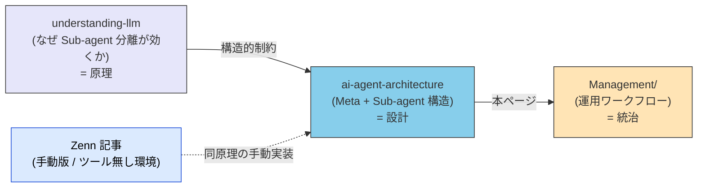
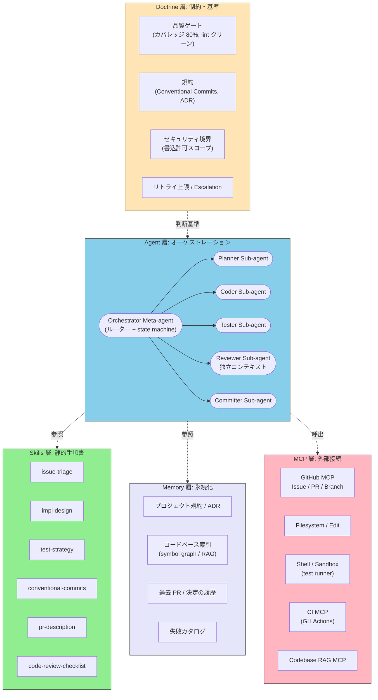
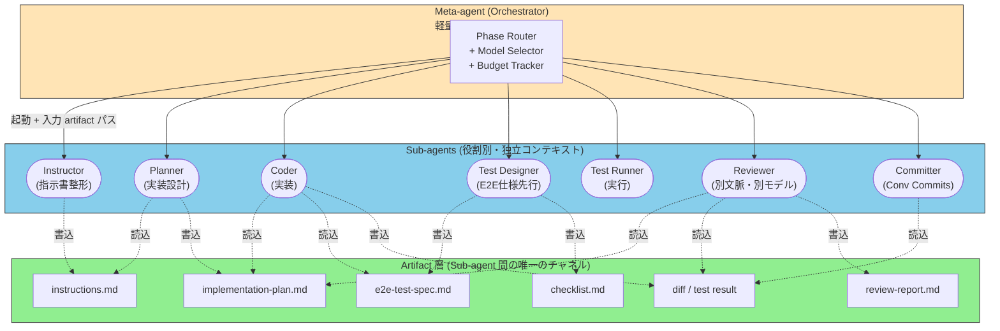
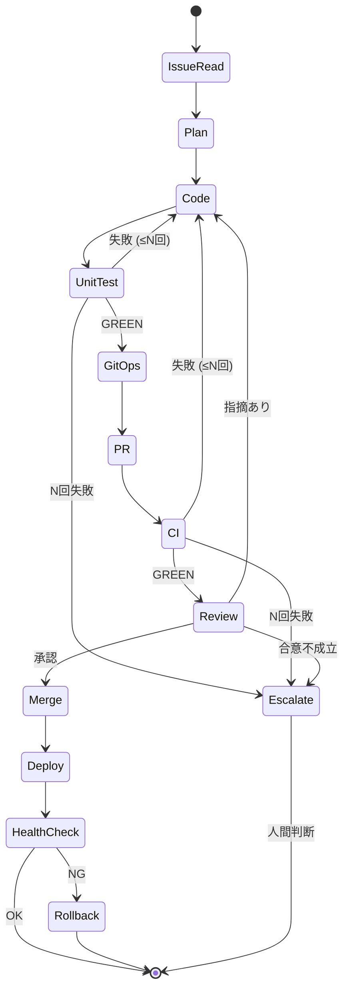
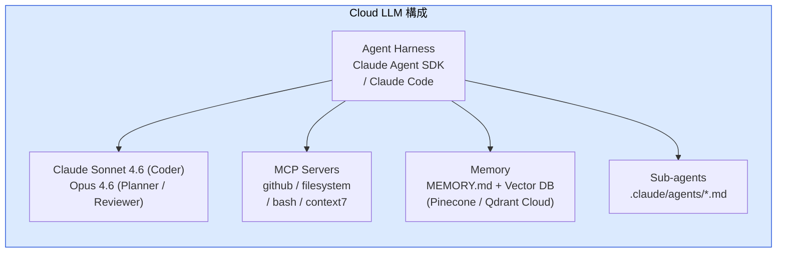
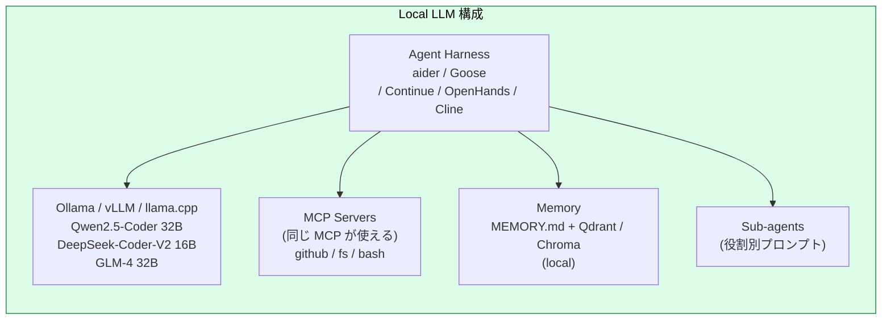
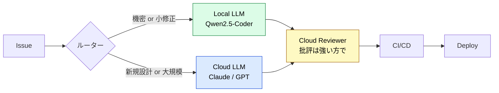
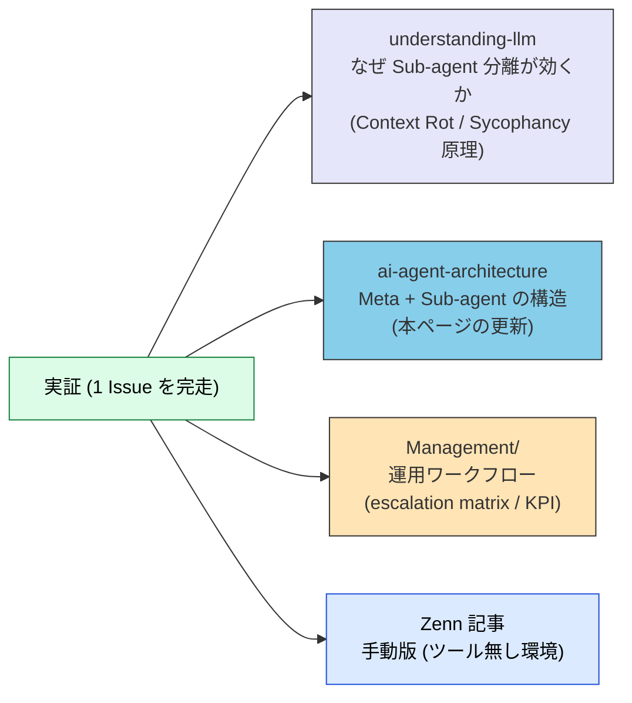

# Issue→Deploy 自律化: Meta-agent + Sub-agent パターン

> Issue から Deploy までを AI が自律駆動する開発パイプラインを、Meta-agent によるオーケストレーション + 役割別 Sub-agent 群として設計する。

## このドキュメントについて

> [!NOTE]
> 本ページは「AI が AI を駆動して Issue → Deploy までを完遂する」自律開発パイプラインの構造を、5 層モデル (Doctrine / Agent / Skills / Memory / MCP) に写像して整理する。クラウド LLM 版とローカル LLM 版の両方を提示する。

このパイプラインは、shuji-bonji の Zenn 記事 [CLAUDE.md がなくても戦える — LLM の構造的制約を踏まえたプロンプト駆動開発](https://zenn.dev/shuji_bonji/articles/c9d325f1fd7646) で述べた **「手動のステップ分割によるプロンプト駆動開発」を、Sub-agent + Meta-agent 構造として自動化** したものに相当する。両者は **同じ原理 (Context Rot / Instruction Decay / Sycophancy への構造的対策) の異なる実装** であり、ツール支援の有無で実装手段が変わるだけで、設計判断は同一である。

> [!TIP]
> **3 行で言うと**
>
> - Zenn 記事の「別チャットに成果物ファイルを渡す」= Sub-agent の独立コンテキスト + artifact handoff
> - Meta-agent は **artifact パスだけ** を扱うルーターに徹し、Sub-agent 出力を要約・統合しない (Context Rot 回避)
> - 1 フェーズ = 1 Sub-agent が粒度の目安。Sub-agent を細かく刻みすぎると起動オーバーヘッドが本体タスクを上回る

## ドキュメントシリーズにおける位置づけ

## 1. 手動プロンプト駆動開発との対応関係

Zenn 記事で論じた「ツール支援が無い環境での手動運用」と、本ページで論じる「Sub-agent + Meta-agent による自動運用」は、同じ構造的制約 (Context Rot / Instruction Decay / Sycophancy) への対策を、異なる実装手段で行ったものである。

| Zenn 記事 (手動) | Sub-agent 自動化 | 対処している構造的問題 |
| --- | --- | --- |
| 「別チャット」で実装を依頼 | Sub-agent の独立コンテキスト | Context Rot |
| 成果物を **ファイル化** して渡す | Sub-agent 間の artifact handoff | Context Rot |
| 別のモデルにレビューさせる | Reviewer Sub-agent (異なる LLM) | Sycophancy |
| フェーズごとにコミット + リセット | Sub-agent 終了で context 自動破棄 | Instruction Decay |
| Premium 消費のモデル使い分け | Meta-agent による model routing | コスト最適化 (副次的) |
| 指示書 → 計画書 → レビュー | Planner → Critic Sub-agent | Sycophancy |
| 指示書テンプレ | Skill (`SKILL.md`) | Knowledge Boundary |

> [!IMPORTANT]
> Sub-agent 化は「便利だからやる」のではなく、**LLM の構造的制約から論理的に導かれる対策の自動化** である。手動でやっていることを機械に任せるだけ。これを見失うと「単なる多重起動」になりコストだけ膨らむ。

## 2. 共通アーキテクチャ (LLM 非依存)

5 層モデルに各ステップを写像すると、どこを差し替えればクラウド版・ローカル版になるかが明確になる。

## 3. Artifact 駆動の Sub-agent 間連携

本パイプラインの核心は、**Sub-agent 間の通信を artifact ファイルだけに限定** すること。これは Zenn 記事の「成果物がコンテキストの代替になる」原則そのものである。

> [!IMPORTANT]
> Meta-agent は **artifact のパスだけ** を Sub-agent に渡す。Sub-agent の出力を Meta-agent に呼び戻して要約・統合してはならない。これをやると Meta-agent のコンテキストに全 Sub-agent の試行錯誤が蓄積し、Meta-agent 自身が Context Rot を起こす。Meta-agent は **state machine + ルーター** に徹し、内容には踏み込まない。

## 4. ステップごとの責務マッピング

| # | ステップ | 担当 Sub-agent | 主な Skills | 主な MCP | 終了条件 (Doctrine) |
|---|---|---|---|---|---|
| 1 | Issue 読解 | Instructor | issue-triage | GitHub MCP, RAG | ラベル / 影響範囲確定 |
| 2 | 実装設計 | Planner | impl-design, ADR | Codebase RAG, FS read | 設計案 + 不確実性リスト出力 |
| 3 | コード作成 | Coder | coding-conventions | FS Edit, type-check | lint / typecheck PASS |
| 4 | テストコード作成 | Test Designer | test-strategy | FS Edit | カバレッジ目標到達 |
| 5 | テスト実行 ① | Test Runner | — | Shell (sandbox) | 全テスト GREEN |
| 6 | Git 操作 | Committer | conventional-commits | Git CLI MCP | branch / commit 整形済 |
| 7 | PR 作成 | Committer | pr-description | GitHub MCP | テンプレ + Issue リンク |
| 8 | テスト ② (統合) | CI | — | CI MCP | CI GREEN |
| 9 | コードレビュー | Reviewer (別文脈) | code-review-checklist | GitHub MCP, RAG | 指摘ゼロ or 修正反映 |
| 10 | テスト ③ (再実行) | CI | — | CI MCP | CI GREEN |
| 11 | CI/CD デプロイ | Orchestrator | release-skill | CI MCP, Deploy MCP | health-check PASS |

> [!CAUTION]
> **Reviewer は MUST 独立コンテキストの Sub-agent** にすること。Coder と同じ文脈だと自己肯定バイアス (Sycophancy) でほぼ指摘が出ない。可能なら **異なる LLM** (例: Coder=Sonnet, Reviewer=Opus / GPT-5) を使う。これが本アーキテクチャの肝。

## 5. ループ構造 (失敗時の自己修復)

各リトライには **上限 N (例: 3)** を設けて、超過したら Human-in-the-Loop に escalate する。この上限が無いと「直らないものを延々試す」コスト破綻を起こす。失敗カタログ (Memory 層) を参照し、**同じ症状が繰り返したら早期に止める** ロジックも有効。

## 6. クラウド LLM 版スタック

| レイヤー | 採用例 |
|---|---|
| Harness | Claude Agent SDK / Claude Code / Cursor Agent / Devin / OpenHands |
| LLM | Claude Sonnet 4.6 (主), Opus 4.6 (設計・レビュー), GPT-5 / Gemini 2.5 でも可 |
| Skills | `.claude/skills/*` (本サイトの方式) |
| MCP | GitHub MCP, Playwright MCP, CI MCP, Codebase RAG |
| Memory | `MEMORY.md` + マネージド Vector DB |
| Sandbox | GitHub Actions / Cloud Run sandbox |

**強み**: 32K〜200K の長文脈、複雑な依存関係の把握、ツール呼び出しの安定性、Sub-agent ネイティブサポート。

**弱み**: 1 Issue あたり $5〜$50 のコスト、コードが外部に出る、レート制限。

## 7. ローカル LLM 版スタック

| レイヤー | 採用例 |
|---|---|
| Harness | aider / Goose (Block 製) / Continue.dev / OpenHands / Cline |
| LLM | Qwen2.5-Coder-32B-Instruct, DeepSeek-Coder-V2-Lite, Codestral-22B, GLM-4-32B |
| Runtime | Ollama (お手軽) / vLLM (本気) / llama.cpp (省メモリ) |
| Skills | プロンプトテンプレ + few-shot examples (Skills 機構を持つ harness は少ない) |
| MCP | クラウド版と同一 (これが MCP の最大の利点) |
| Memory | Qdrant local / Chroma / SQLite-VSS |
| Sandbox | Docker / Firejail / nsjail |
| 最低スペック | RTX 4090 24GB or M2 Max 64GB (32B 量子化を動かす目安) |

**強み**: コードが外に出ない、月額固定、レート制限なし、Sub-agent 化の恩恵がクラウド版より大きい (理由は後述)。

**弱み**: 100K 超の文脈で破綻、ツール呼び出しが不安定 (32B クラスでも JSON 崩れる)、複雑な依存把握が弱い。

> [!IMPORTANT]
> ローカル LLM は **長コンテキストに特に弱い** ため、Sub-agent 分割の恩恵が **クラウド版より大きい**。各 Sub-agent の context を 8〜16K に保てれば、ローカルでも安定稼働の可能性が出てくる。**Meta-agent + Sub-agent パターンは「ローカル LLM 自律化を現実にする鍵」** と言ってもいい。

## 8. 比較表

| 観点 | クラウド LLM | ローカル LLM |
|---|---|---|
| Issue 解読精度 | ◎ | ○ (短文なら) |
| 実装設計 (多ファイル) | ◎ | △ |
| 単一ファイルのコード生成 | ◎ | ○〜◎ |
| テストコード生成 | ◎ | ○ |
| Tool / MCP 呼び出し安定性 | ◎ | △ (JSON 崩壊頻発) |
| 長コンテキスト (>32K) | ◎ | × (実用域は 8〜16K) |
| コスト / Issue | $5〜$50 | 電気代のみ |
| コード機密性 | △ (規約次第) | ◎ |
| レート制限 | あり | なし |
| 自己レビューの厳しさ | ◎ | △ (Sycophancy 強め) |
| 不確実性の自覚 | ○ | × (幻覚に気づきにくい) |
| Sub-agent 化の必要度 | 高 | **最高** |

## 9. ハイブリッド推奨 (2026 年現在のスイートスポット)

- **コード生成は Local**、**設計とレビューは Cloud** の役割分担が 2026 年現在のスイートスポット
- レビューを Cloud にする理由: 「批判的読解」「依存関係の把握」「セキュリティ観点」は 32B クラスでは弱い
- 機密コードを完全にローカルで完結させたい場合は、レビューを **複数の異なるローカルモデル** (Qwen + DeepSeek) で別文脈クロスチェックする

## 10. 効率トレードオフ (正直なところ)

| 観点 | モノリス Agent | Meta + Sub-agent |
|---|---|---|
| トークン総量 | 少 (1 セッション完結) | 多 (各 Sub-agent に role / context) |
| 品質 (Context Rot 耐性) | 低 | **高** |
| Sycophancy 抑止 | × (自己レビュー) | **◎ (Reviewer 別文脈)** |
| モデル使い分け | × | **◎ (役割ごとに最適化)** |
| デバッグ可能性 | △ (1 本のログ) | **◎ (artifact ごとに検証)** |
| レイテンシ | 短 | 長 (直列実行多) |
| 失敗局所化 | △ | **◎ (該当 Sub-agent だけ再実行)** |

トークンとレイテンシは増えるが、その分は **品質と再実行コストの削減で回収** できる。モノリスで「最後の PR レビューで全部やり直し」より、Sub-agent で各フェーズ独立検証する方が総コスト安。

## 11. 自律化を阻む 3 つの落とし穴

> [!WARNING]
> **① 不確実性の自覚なき修正ループ**: 「テスト失敗 → 適当に直す → また失敗」を無限ループ。リトライ上限 + 「失敗パターンが繰り返したら止める」検知器が MUST。
>
> **② Reviewer Sub-agent の同コンテキスト化**: Coder と同じセッションで「レビューして」と頼んでも見つからない。MUST 別プロセス・別文脈・できれば別モデル。
>
> **③ Memory なき開発**: 毎回プロジェクト規約をゼロから読ませる scatter-gather 問題。ADR と過去 PR を Memory に索引化すべき。([記憶と知識統合](../concepts/08-memory-and-knowledge) 参照)

> [!WARNING]
> 加えて **④ Meta-agent の肥大化**: Meta-agent が Sub-agent 出力を要約・統合し始めた瞬間にこのパターンは崩壊する。Meta-agent は state machine + artifact ルーターに徹し、内容に踏み込まないこと。

## 12. 実証 → 形式化への還流

このアーキテクチャは「設計してから動かす」よりも、**「最小単位で動かしてからワークフローに昇格させる」** ことが推奨される。実証で得られた知見の還流先は以下の通り。

Management 側に書くべきは **「ワークフロー (How we manage)」であって「実装 (How it works)」ではない**。実装は実験プロジェクト側に残し、Management にはこんな粒度で落とす:

- どの判断は人間に残すか (escalation matrix)
- 各ステップのリトライ上限 / 中断条件 (governance)
- 計測すべき KPI (成功率、介入率、Issue あたりコスト)
- 失敗の分類カタログ (root cause taxonomy)

## 関連ドキュメント

- [マルチエージェント連携](./patterns/multi-agent.md) — 専門サブエージェント協調の汎用パターン (本ページの基礎パターン)
- [開発フェーズ × MCP対応](./development-phases.md) — 各開発フェーズで利用可能な MCP の整理
- [サブエージェント](../agents/what-is-subagent.md) — Sub-agent の基礎概念
- [サブエージェント vs Skills](../agents/subagent-vs-skill.md) — 役割の使い分け
- [品質ゲートとしてのサブエージェント活用](../agents/subagent-quality-gate.md) — Reviewer Sub-agent の設計指針
- [構成パターン](../strategy/composition-patterns.md) — 複数 MCP・複数 Skill の協調パターン
- [ローカル LLM 環境への 5 層モデルの写像](../strategy/local-llm-workspace-mapping.md) — ローカル LLM 版の詳細
- [記憶と知識統合 (Memory & KG)](../concepts/08-memory-and-knowledge.md) — Memory 層の設計

## 🔗 さらに深く: なぜ Sub-agent 分離が効くのか

本ページは Meta + Sub-agent パターンの **構造 (What / How)** を扱った。「**なぜ** Sub-agent 分離が品質に効くのか」を LLM の構造的制約から理解したい場合は、姉妹サイトを参照。

- [understanding-llm / Part 1: 構造的問題](https://shuji-bonji.github.io/understanding-llm-through-claude-code/ja/01-llm-structural-problems/) — Context Rot / Instruction Decay / Sycophancy の原理
- [CLAUDE.md がなくても戦える — LLM の構造的制約を踏まえたプロンプト駆動開発](https://zenn.dev/shuji_bonji/articles/c9d325f1fd7646) — 本ページの **手動版** (ツール支援なし環境向け)

## 参考文献

- shuji-bonji (2026). "CLAUDE.md がなくても戦える — LLM の構造的制約を踏まえたプロンプト駆動開発." Zenn. [zenn.dev/shuji_bonji](https://zenn.dev/shuji_bonji/articles/c9d325f1fd7646) — 本ページの手動運用版
- Osmani, A. (2025). "agent-skills: Production-grade engineering skills for AI coding agents." [github.com/addyosmani/agent-skills](https://github.com/addyosmani/agent-skills) — Plain Markdown による Skills 体系化
- Hong, K., Troynikov, A., & Huber, J. (2025). "Context Rot: How Increasing Input Tokens Impacts LLM Performance." Chroma Research. [research.trychroma.com](https://research.trychroma.com/context-rot) — Sub-agent 分離が効く構造的根拠

---

> **前へ**: [マルチエージェント連携](./patterns/multi-agent.md)

**最終更新**: 2026年6月
