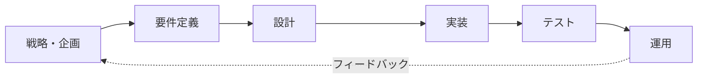
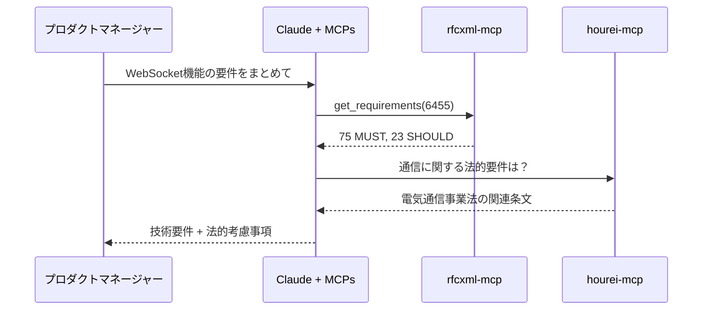
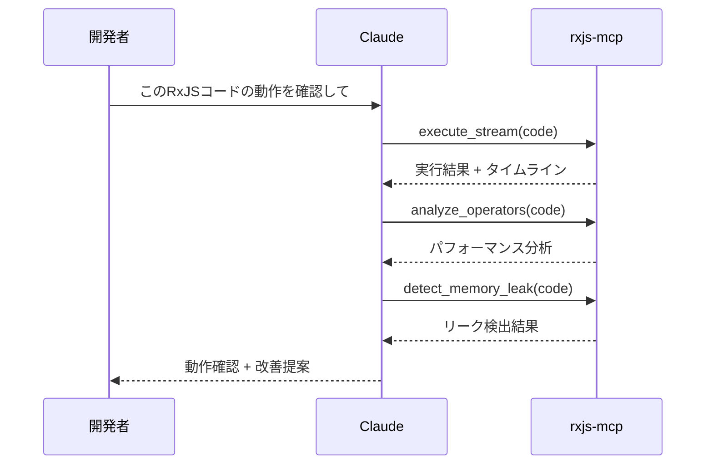
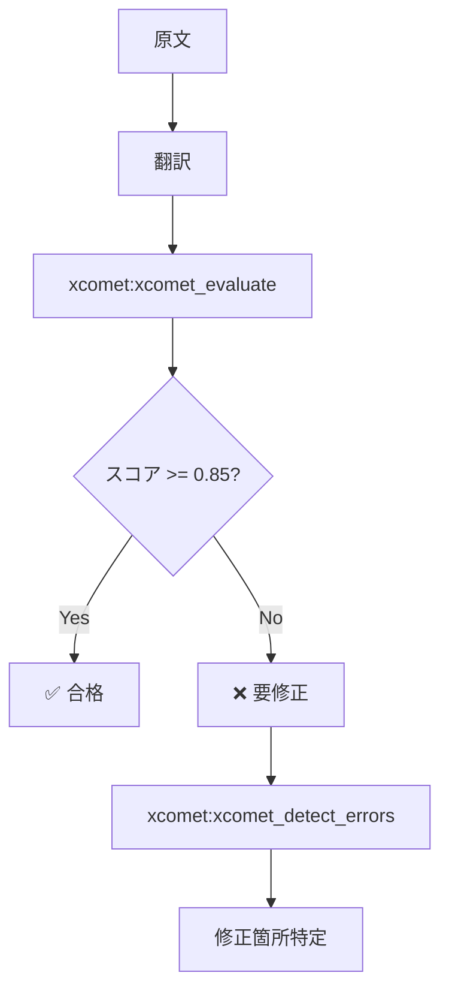
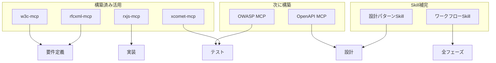
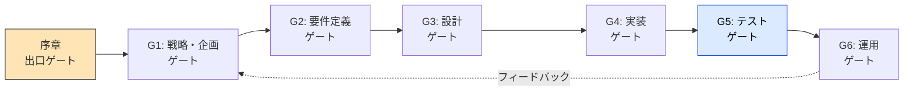

# 開発フェーズ × MCP対応

> システム・アプリケーション開発の各フェーズで活用できるMCPを整理する。

## このドキュメントについて

ソフトウェア開発は「戦略・企画 → 要件定義 → 設計 → 実装 → テスト → 運用」というフェーズで進む。AI駆動開発では、各フェーズで適切なMCPを活用することで、品質と効率の両方を向上させることができる。

このドキュメントでは、各開発フェーズで利用可能なMCP、まだ構築されていない領域、今後の優先構築候補を整理する。「このフェーズでAIを活用したいが、何を使えばいいか」という問いに対する実践的な回答を提供する。

## 開発フェーズ全体像

ソフトウェア開発の各フェーズの流れを以下に示す。



## フェーズ1: 戦略・企画

### 概要

ビジネス目標の設定、実現可能性調査、プロダクト戦略の策定。

### MCP活用

このフェーズで活用できるMCPの状況は以下の通りである。

| タスク   | MCP                     | 機能               | 状況    |
| -------- | ----------------------- | ------------------ | ------- |
| 市場調査 | Market Research MCP     | 市場規模データ取得 | 📋 構想 |
| 競合分析 | Competitor Analysis MCP | 競合製品比較       | 📋 構想 |
| ROI計算  | Financial Modeling MCP  | TCO算出            | 📋 構想 |

### 現状

このフェーズのMCPは未構築。Web検索やClaude自体の分析能力で代替。

## フェーズ2: 要件定義

### 概要

機能要件・非機能要件の収集と整理。

### MCP活用

このフェーズで活用できるMCPの状況は以下の通りである。

| タスク       | MCP            | 機能                  | 状況      |
| ------------ | -------------- | --------------------- | --------- |
| RFC要件確認  | **rfcxml-mcp** | MUST/SHOULD/MAY抽出   | ✅ 構築済 |
| Web標準確認  | **w3c-mcp**    | WebIDL、CSS、HTML仕様 | ✅ 構築済 |
| 法令要件確認 | **hourei-mcp** | 法令条文取得          | ✅ 利用可 |
| API仕様確認  | OpenAPI MCP    | 仕様検証              | 📋 構想   |

### 具体例

要件定義フェーズでのMCP活用例を以下のシーケンス図で示す。



## フェーズ3: 設計

### 概要

アーキテクチャ設計、詳細設計、API設計。

### MCP活用

このフェーズで活用できるMCPの状況は以下の通りである。

| タスク       | MCP                 | 機能                | 状況      |
| ------------ | ------------------- | ------------------- | --------- |
| 設計パターン | Design Pattern MCP  | パターン提案        | 📋 構想   |
| ADR生成      | ADR Generator MCP   | 決定記録生成        | 📋 構想   |
| DB設計       | Schema Designer MCP | ER図生成            | 📋 構想   |
| 図表生成     | **mermaid-mcp**     | Mermaidダイアグラム | ✅ 利用可 |
| API設計検証  | OpenAPI MCP         | 仕様検証            | 📋 構想   |

### 現状

設計パターン系MCPは未構築。Skillとして「設計パターン集」を定義する方が適切かもしれない。

### Skill代替例

設計パターン系のMCPが未構築の場合、Skillとして定義する方法もある。以下はその例である。

```markdown
<!-- .claude/skills/design-patterns/SKILL.md -->

# 設計パターン集

## アーキテクチャパターン

- Clean Architecture
- Hexagonal Architecture
- CQRS + Event Sourcing

## GoFパターン（抜粋）

- Factory Method
- Observer
- Strategy
  ...
```

## フェーズ4: 実装

### 概要

コーディング、API実装、フロントエンド/バックエンド開発。

### MCP活用

このフェーズで活用できるMCPの状況は以下の通りである。

| タスク           | MCP                   | 機能                   | 状況      |
| ---------------- | --------------------- | ---------------------- | --------- |
| ドキュメント検索 | Context7              | ライブラリドキュメント | ✅ 利用可 |
| Svelte開発       | **svelte-mcp**        | Svelte/SvelteKit支援   | ✅ 利用可 |
| UIコンポーネント | **shadcn-svelte-mcp** | UIコンポーネント       | ✅ 利用可 |
| RxJS開発         | **rxjs-mcp-server**   | ストリーム実行・分析   | ✅ 構築済 |
| 座標系参照       | **epsg-mcp**          | EPSG座標系             | ✅ 構築済 |
| Angular開発      | Angular MCP           | Angular支援            | 📋 構想   |

### 具体例：RxJS実装フロー

RxJSの実装支援におけるMCP活用フローを以下に示す。



## フェーズ5: テスト・品質保証

### 概要

単体テスト、統合テスト、品質評価。

### MCP活用

このフェーズで活用できるMCPの状況は以下の通りである。

| タスク       | MCP                   | 機能                   | 状況      |
| ------------ | --------------------- | ---------------------- | --------- |
| 翻訳品質評価 | **xcomet-mcp-server** | 品質スコア、エラー検出 | ✅ 構築済 |
| テスト生成   | Test Generator MCP    | テストコード生成       | 📋 構想   |
| セキュリティ | OWASP MCP             | 脆弱性チェック         | 📋 構想   |
| RFC準拠確認  | **rfcxml-mcp**        | validate_statement     | ✅ 構築済 |

### 具体例：翻訳品質テスト

翻訳品質テストのフローを以下に示す。



## フェーズ6: 運用・保守

### 概要

デプロイ、監視、インシデント対応、継続改善。

### MCP活用

このフェーズで活用できるMCPの状況は以下の通りである。

| タスク       | MCP                    | 機能          | 状況    |
| ------------ | ---------------------- | ------------- | ------- |
| IaC生成      | IaC Generator MCP      | Terraform生成 | 📋 構想 |
| パイプライン | Pipeline Generator MCP | CI/CD設定     | 📋 構想 |
| 監視設定     | Monitoring Config MCP  | 監視設定生成  | 📋 構想 |

### 現状

運用系MCPは未構築。クラウドプロバイダー固有のMCPが存在する場合はそちらを利用。

## 横断的活動

### ドキュメンテーション

開発フェーズを横断して活用できるドキュメンテーション系MCPは以下の通りである。

| タスク   | MCP             | 状況      |
| -------- | --------------- | --------- |
| 図表生成 | **mermaid-mcp** | ✅ 利用可 |
| 翻訳     | **deepl-mcp**   | ✅ 利用可 |
| 品質確認 | **xcomet-mcp**  | ✅ 構築済 |

### セキュリティ

セキュリティ系MCPの状況は以下の通りである。

| タスク    | MCP         | 状況    |
| --------- | ----------- | ------- |
| OWASP確認 | OWASP MCP   | 📋 構想 |
| CVE検索   | CVE/NVD MCP | 📋 構想 |

### 法令遵守

法令遵守に関連するMCPの状況は以下の通りである。

| タスク   | MCP            | 状況      |
| -------- | -------------- | --------- |
| 法令検索 | **hourei-mcp** | ✅ 利用可 |
| GDPR確認 | GDPR MCP       | 📋 構想   |

## フェーズ × MCP マトリックス

各開発フェーズにおけるMCPの構築状況を一覧で整理する。

| フェーズ   | 構築済MCP                  | 構想中MCP                           |
| ---------- | -------------------------- | ----------------------------------- |
| 戦略・企画 | -                          | Market Research, Financial Modeling |
| 要件定義   | rfcxml, w3c, hourei        | OpenAPI                             |
| 設計       | mermaid                    | Design Pattern, ADR Generator       |
| 実装       | rxjs, svelte, shadcn, epsg | Angular, Context7連携強化           |
| テスト     | xcomet, rfcxml             | Test Generator, OWASP               |
| 運用       | -                          | IaC Generator, Pipeline Generator   |

## 優先的に構築すべきMCP

### 現在の強みを活かす

現在の構築済みMCPの強みを活かした、次に構築すべきMCPの優先順位は以下の通りである。

1. **OpenAPI MCP** - API設計・検証（要件定義〜設計〜テスト横断）
2. **OWASP MCP** - セキュリティ（設計〜テスト横断）
3. **Angular MCP** - 専門領域の実装支援

### ギャップを埋める

未構築領域のギャップについては、以下のアプローチで対応する。

1. 設計フェーズのパターン系 → **Skillで代替可能**
2. 運用フェーズのIaC系 → 優先度低（既存ツールで代替）

## 推奨アプローチ

構築済みMCPの活用、Skill補完、次期構築の3層で推奨アプローチを以下に示す。



### 原則

MCP活用における基本原則を以下にまとめる。

1. **構築済みMCPを最大限活用**
2. **静的知識はSkillで補完**
3. **ギャップは優先度を見て順次構築**

## フェーズ別ゲートチェックリスト

各フェーズを「次へ進める状態」にあるかを判定するためのチェックリスト。**前のフェーズのゲートを通過してから次へ進む** ことを推奨する。[本書の問いと範囲](../preface)が対象の理解を確認するのに対し、こちらは各フェーズの実装準備を確認する。



### G1: 戦略・企画 → 要件定義へ進む条件

- [ ] **目標の検証可能化** — ビジネス目標を数値（KPI）と検証期限まで落とし込んだか？
- [ ] **AI 活用範囲の合意** — どの工程で AI を活用するか、ステークホルダーと合意したか？
- [ ] **責任境界の初期合意** — 最終判断者（人間）と、AI に委ねる範囲をチームで一次決定したか？
- [ ] **参照先候補のリストアップ** — プロジェクトで参照する権威ある情報源（RFC・法令・社内規約等）を洗い出したか？

### G2: 要件定義 → 設計へ進む条件

- [ ] **MUST/SHOULD/MAY 分類** — 規範強度ラダー（[III.3 Doctrine](../part-3/doctrine)）に従って要件を分類したか？
- [ ] **権威ある情報源の特定** — 各要件について、rfcxml-mcp / w3c-mcp / hourei-mcp 等で原文を取得・引用したか？
- [ ] **非機能要件の数値化** — 性能・セキュリティ・可用性等の閾値を、後で検証できる形で記述したか？
- [ ] **法令・規格遵守の確認** — 該当する法令・標準規格の最新版を参照し、適用条文を明示したか？

### G3: 設計 → 実装へ進む条件

- [ ] **五層の責務境界** — Doctrine / Agent / Skills / Memory / MCP の担当が設計に反映されているか？
- [ ] **責任境界の設計反映** — 設計時 / 実行時 / 構造的制約の三者の責任が、設計ドキュメントに明示されているか？
- [ ] **検証戦略の確立** — Spec-to-Test 変換の戦略（どの仕様をどう検証に落とすか）が決定したか？
- [ ] **ガードレールと評価指標** — ESLint・型チェック等のガードレールと、xCOMET 等の確率的指標が定義されたか？
- [ ] **Memory 層の判断** — Memory 層導入の必要性を評価し、Stage 1〜2 を選択したか？

### G4: 実装 → テストへ進む条件

- [ ] **MCP/Skill 統合の動作確認** — 設計で予定した MCP/Skill が、実際にエージェントから呼び出せる状態か？
- [ ] **コード品質ガードレール通過** — ESLint エラー = 0、型チェック通過、依存脆弱性スキャン通過、を満たしているか？
- [ ] **AI 出力の出典記録** — AI が参照した MCP の出典・バージョン・取得時刻が、出力に付与される実装になっているか？
- [ ] **テスト容易性の確保** — 主要な振る舞いがユニットテスト・統合テストの単位に分解可能になっているか？

### G5: テスト → 運用へ進む条件

- [ ] **品質ゲートの実測** — xCOMET ≥ 0.85、テストカバレッジ ≥ 80% 等の確率的指標が、設計時の閾値を満たしているか？
- [ ] **規格準拠の検証** — rfcxml-mcp / w3c-mcp の `validate_statement` 等で、規格準拠を客観的に検証したか？
- [ ] **エスカレーション条件の検証** — 人間にエスカレーションする条件が実装され、テストでトリガできているか？
- [ ] **証拠トレイルの動作確認** — AI の判断根拠を事後検索できる仕組み（ログ・出典記録）が、運用負荷を考慮した上で機能しているか？

### G6: 運用 → 改善ループへ進む条件

- [ ] **インシデント対応プロセスの整備** — AI 出力起因のインシデント発生時、誰がどの判断をするかが明文化されているか？
- [ ] **継続評価パイプラインの稼働** — リリース後も品質指標を継続測定し、劣化を検知できる仕組みが動いているか？
- [ ] **参照元の鮮度監視** — 法令・規格の更新を検知し、参照先 MCP のキャッシュやドキュメントに反映する運用が確立しているか？
- [ ] **学習サイクルの確立** — 運用で得られた知見を Skills / Doctrine に還元する仕組みがあるか？

::: tip ゲートの使い方
- 全項目 ✅ で次フェーズへ進むのが原則だが、**未達項目を「リスクとして合意した上で進む」** という運用も可能。ただし未達項目は必ず Issue として残し、後続フェーズで解消する。
- ゲート判定は **チーム合議** が望ましい。一人で「✅ できた」と判断すると、責任境界が曖昧になる。
:::
