# 連携パターン・ワークフロー

> 複数のMCP・Skill・サブエージェントを組み合わせた実践的なワークフローパターンを整理する。

## このドキュメントについて

MCPは単独で使うよりも、複数を組み合わせることで真価を発揮する。このドキュメントでは、実際に効果を確認できた連携パターンを8種類に整理し、それぞれの手順、使用ツール、期待される成果を具体的に記述する。

例えば「RFC日本語訳を高品質で作成する」という目標に対して、deepl-mcp（翻訳）→ xcomet-mcp-server（品質評価）→ 必要に応じて再翻訳、というワークフローを確立することで、従来の翻訳コストの1/100以下で同等以上の品質を実現できる。このような実践知をパターンとして蓄積する。

## ワークフローパターン一覧

本ドキュメントで紹介するワークフローパターンの全体像を以下のマインドマップで示す。

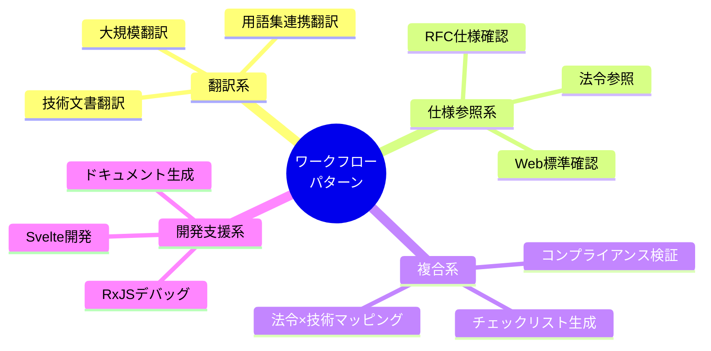

## パターン1: 技術文書翻訳ワークフロー

### 概要

DeepL + xCOMET を組み合わせた高品質翻訳フロー。

### 使用MCP

このワークフローで使用するMCPは以下の通りである。

- `deepl-mcp` - 翻訳実行
- `xcomet-mcp-server` - 品質評価

### フロー図

翻訳から品質評価までの一連のフローを以下に示す。

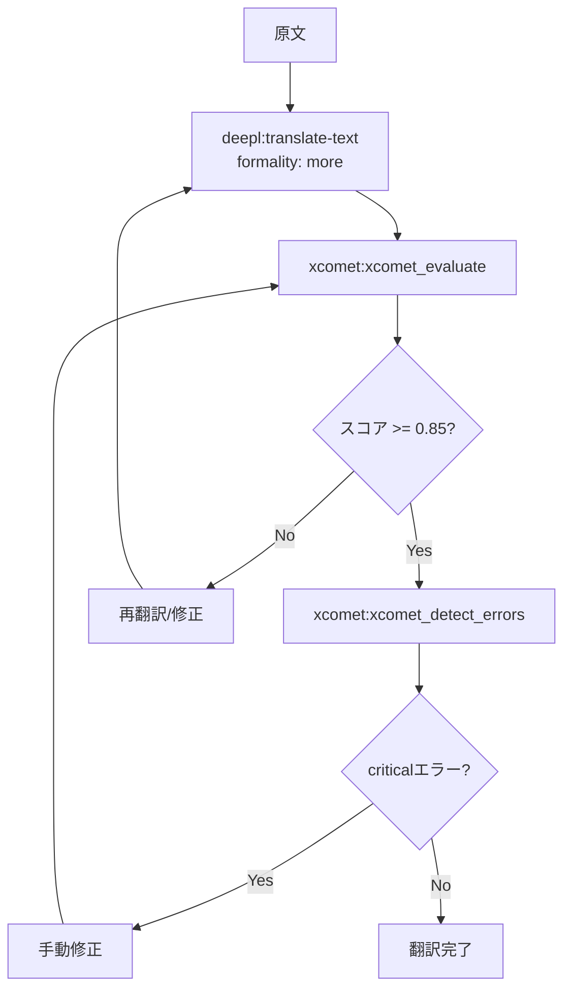

### Skill定義例

このワークフローをSkillとして定義する場合の例を以下に示す。

```markdown
<!-- .claude/skills/translation-workflow/SKILL.md -->

# 技術文書翻訳ワークフロー

## 品質基準

- スコア 0.85以上: 合格
- スコア 0.70-0.85: 要確認
- スコア 0.70未満: 再翻訳

## エラー対応

- critical: 必ず修正（意味の逆転、重大な誤訳）
- major: 修正推奨（不自然な表現、用語不統一）
- minor: 任意（スタイルの問題）

## 翻訳設定

- formality: "more"（技術文書は堅めに）
- 用語集があれば glossaryId を指定
```

### 実績

このワークフローの主な実績は以下の通りである。

- 180ページ技術文書（150万文字）を1日で完了
- コスト: 約$12（従来の1/100以下）

## パターン2: 大規模翻訳ワークフロー（バッチ処理）

### 概要

大量の翻訳ペアを効率的に処理するバッチワークフロー。

### フロー図

大規模文書のバッチ翻訳フローを以下に示す。

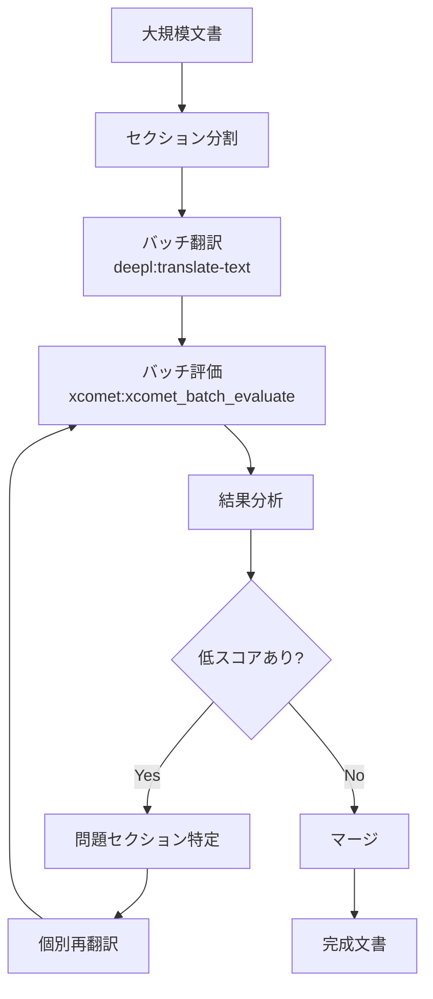

### ポイント

大規模翻訳を効率的に処理するためのポイントは以下の通りである。

- `xcomet:xcomet_batch_evaluate` でまとめて評価
- 問題のあるセクションのみ個別対応
- GPU使用でさらに高速化

## パターン3: RFC仕様確認ワークフロー

### 概要

RFC仕様を構造化して理解・実装確認するフロー。

### 使用MCP

このワークフローで使用するMCPは以下の通りである。

- `rfcxml-mcp` - RFC解析
- `w3c-mcp` - Web API確認（必要に応じて）

### フロー図

RFC仕様の確認から実装検証までのフローを以下に示す。

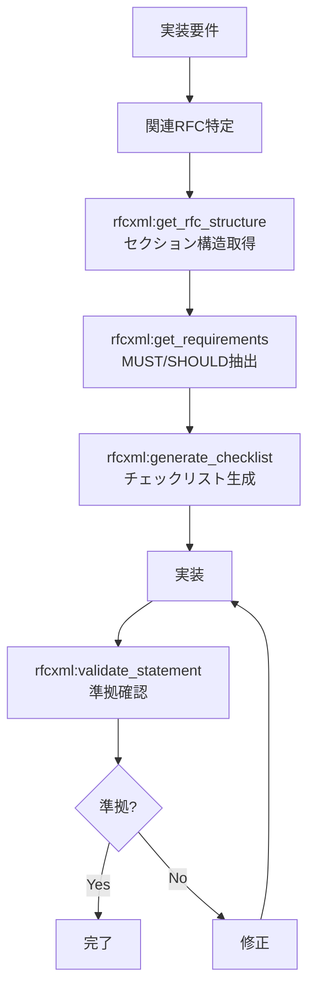

### サブエージェント定義例

RFC仕様確認に特化したサブエージェントの定義例を以下に示す。

```markdown
<!-- .claude/agents/rfc-specialist.md -->

name: rfc-specialist
description: RFC仕様の確認・検証専門。実装がRFCに準拠しているか確認する。
tools: rfcxml:get_rfc_structure, rfcxml:get_requirements, rfcxml:get_definitions, rfcxml:generate_checklist, rfcxml:validate_statement
model: sonnet

あなたはRFC仕様の専門家です。
以下の手順で作業してください。

1. まず get_rfc_structure でRFCの全体像を把握
2. get_requirements でMUST/SHOULD要件を抽出
3. 必要に応じて get_definitions で用語確認
4. generate_checklist で実装チェックリストを生成
5. validate_statement で実装の準拠を確認
```

### 実績

このワークフローの主な実績は以下の通りである。

- RFC 6455（WebSocket）の完全日本語翻訳
- 75個のMUST要件、23個のSHOULD要件を構造化

## パターン4: 法令×技術仕様マッピングワークフロー

### 概要

法的要件と技術仕様の対応関係を明確化するフロー。

### 使用MCP

このワークフローで使用するMCPは以下の通りである。

- `hourei-mcp` - 日本法令参照
- `rfcxml-mcp` - 技術仕様参照

### フロー図

法的要件と技術仕様を対応づけるフローを以下に示す。

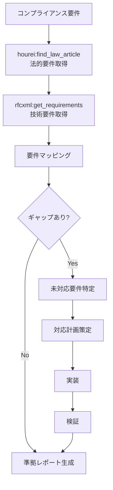

### 具体例：電子署名法 × RFC 3161

電子署名法とRFC 3161の対応関係を以下の図で示す。

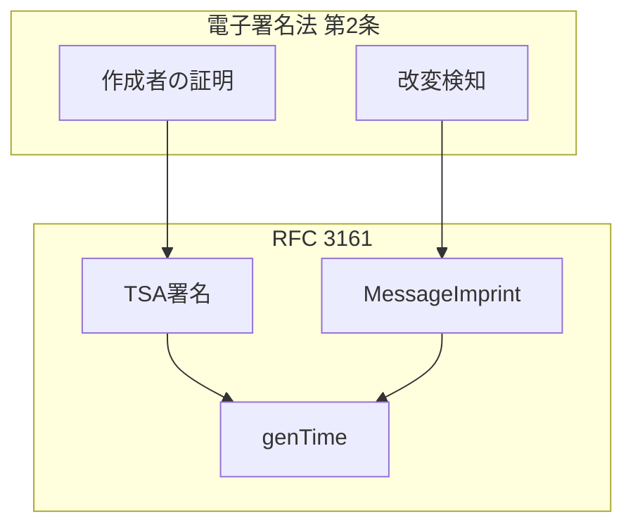

### 実績

このワークフローの主な実績は以下の通りである。

- 電子署名法とRFC 3161の対応表作成
- Notes-about-Digital-Signatures リポジトリに反映

## パターン5: チェックリスト生成ワークフロー

### 概要

仕様から実装チェックリストを自動生成するフロー。

### フロー図

仕様から実装チェックリストを生成するフローを以下に示す。

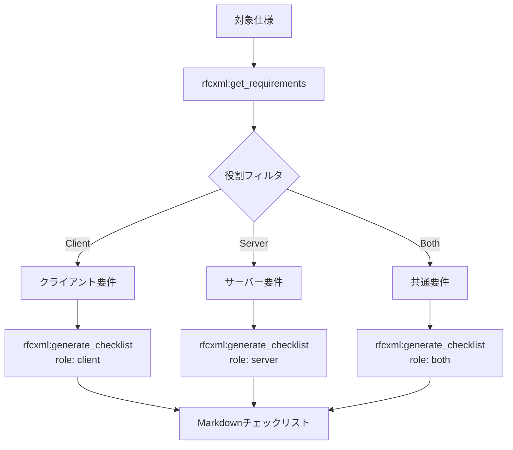

### 出力例

生成されるチェックリストの出力例を以下に示す。

```markdown
# RFC 6455 WebSocket 実装チェックリスト（クライアント）

## MUST要件

- [ ] クライアントはサーバーからのHTTP 101以外の応答を拒否しなければならない
- [ ] Sec-WebSocket-Keyヘッダを送信しなければならない
- [ ] ...

## SHOULD要件

- [ ] 接続失敗時は指数バックオフで再試行すべきである
- [ ] ...
```

## パターン6: RxJSデバッグワークフロー

### 概要

RxJSストリームの動作確認・デバッグフロー。

### 使用MCP

このワークフローで使用するMCPは以下の通りである。

- `rxjs-mcp-server` - ストリーム実行・分析

### フロー図

RxJSコードの分析からリファクタリングまでのフローを以下に示す。

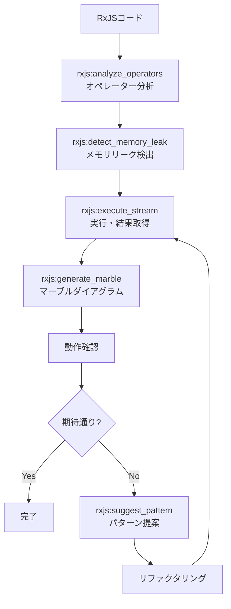

## パターン7: ドキュメント生成ワークフロー

### 概要

複数MCPを組み合わせた技術ドキュメント生成フロー。

### 使用MCP

このワークフローで使用するMCPは以下の通りである。

- `rfcxml-mcp` - 仕様情報
- `mermaid-mcp` - 図表生成
- `deepl-mcp` - 多言語化
- `xcomet-mcp` - 翻訳品質確認

### フロー図

仕様情報の取得からドキュメント公開までのフローを以下に示す。

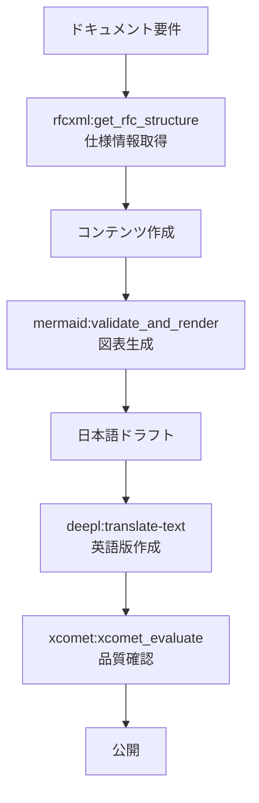

## パターン8: マルチエージェント連携

### 概要

複数のサブエージェントが協調して作業するパターン。

### 構成

メインClaudeと3つの専門サブエージェントの構成を以下に示す。

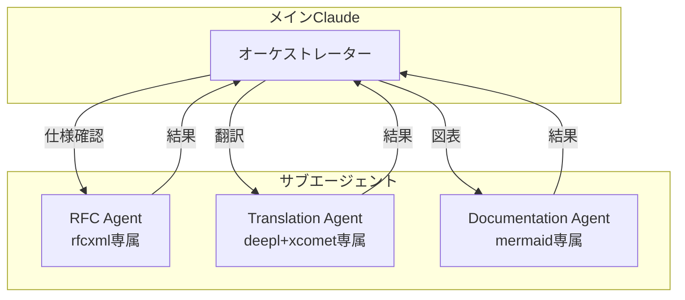

### サブエージェント定義

各サブエージェントの定義例を以下に示す。

```markdown
<!-- agents/rfc-specialist.md -->

name: rfc-specialist
tools: rfcxml:\*
model: sonnet
```

```markdown
<!-- agents/translation-specialist.md -->

name: translation-specialist
tools: deepl:translate-text, xcomet:xcomet_evaluate, xcomet:xcomet_detect_errors
model: sonnet
```

```markdown
<!-- agents/documentation-specialist.md -->

name: documentation-specialist
tools: mermaid:\*
model: sonnet
```

### メリット

マルチエージェント連携の主なメリットは以下の通りである。

- **コンテキスト分離** - 各エージェントは自分のMCPだけ認識
- **専門性向上** - 役割に特化した指示
- **並列処理** - Git worktreesで物理的に分離可能

## パターン9: 用語集連携翻訳ワークフロー

### 概要

仕様書の用語を自動抽出してグロッサリーを構築し、用語統一された翻訳を実現するフロー。パターン1（技術文書翻訳）の発展形であり、**Skillが複数MCPをオーケストレーションする**完全統合パターン。

### 使用MCP / Skill

このワークフローで使用するMCPとSkillは以下の通りである。

- `pdf-spec-mcp` - 仕様書の用語定義を構造的に抽出
- `deepl-mcp` - グロッサリー管理・翻訳実行
- `xcomet-mcp-server` - 翻訳品質評価（オプション）
- `deepl-glossary-translation` Skill - 上記MCPの連携手順を定義

### フロー図

用語抽出からグロッサリー適用翻訳までの一連のフローを以下に示す。

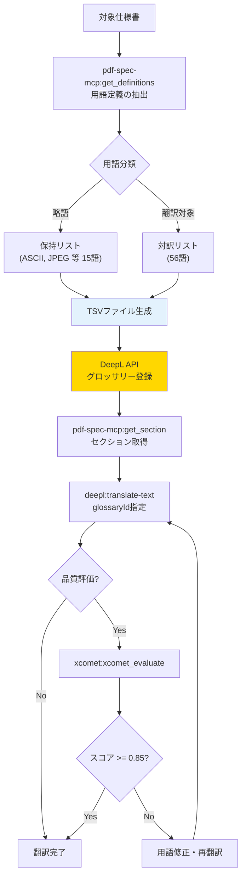

### パターン1との違い

| 観点 | パターン1（基本翻訳） | パターン9（用語集連携） |
|---|---|---|
| 用語の一貫性 | 翻訳ごとにばらつく可能性 | グロッサリーで強制的に統一 |
| 前準備 | 不要 | 用語抽出・分類・登録が必要 |
| 適用場面 | 一般的な技術文書 | **仕様書・規格文書**など用語厳密性が要求される文書 |
| MCP数 | 2（deepl + xcomet） | 3（pdf-spec + deepl + xcomet） |
| Skill | 不要（手動フロー可） | **必須**（複雑な手順のオーケストレーション） |

### 具体例：ISO 32000-2のグロッサリー

用語分類の具体例を以下に示す。

```
保持（略語）: ASCII, CFF, JPEG, PDF, TLS, URI, XML ... (15語)
翻訳対象:
  cross-reference table → 相互参照テーブル
  content stream → コンテンツストリーム
  null object → nullオブジェクト  ← PDF仕様のnullは小文字
  indirect object → 間接オブジェクト
  ... (56語)
```

「null object」が「NULLオブジェクト」や「Nullオブジェクト」ではなく「nullオブジェクト」（PDF仕様のキーワードに準拠した小文字）に統一されるなど、ドメイン固有の用語規則をグロッサリーで強制できる点が最大の価値である。

### リポジトリ

詳細な実装は [shuji-bonji/deepl-glossary-translation](https://github.com/shuji-bonji/deepl-glossary-translation) を参照。Skill実装の具体例として [Skill実例ショーケース](../skills/showcase#deepl-glossary-translation) でも解説している。

## ワークフロー選択ガイド

目的に応じた推奨ワークフローパターンを以下に整理する。

| 目的                 | 推奨パターン | 主要MCP                      |
| -------------------- | ------------ | ---------------------------- |
| 技術文書翻訳         | パターン1/2  | deepl + xcomet               |
| 用語統一翻訳         | パターン9    | pdf-spec + deepl + xcomet    |
| 仕様理解             | パターン3    | rfcxml                       |
| コンプライアンス確認 | パターン4    | hourei + rfcxml              |
| 実装チェック         | パターン5    | rfcxml                       |
| RxJSデバッグ         | パターン6    | rxjs                         |
| ドキュメント作成     | パターン7    | 複合                         |
| 大規模タスク         | パターン8    | 複合 + サブエージェント      |
