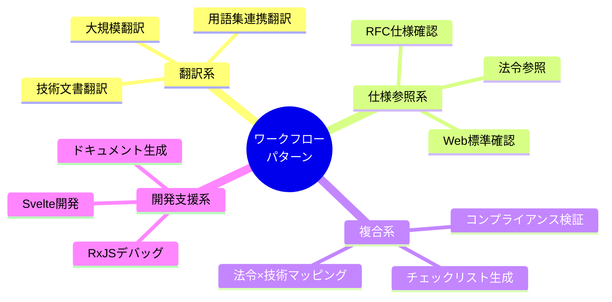

# 連携パターン・ワークフロー

> 複数のMCP・Skill・サブエージェントを組み合わせた実践的なワークフローパターンを整理する。

## このドキュメントについて

MCPは単独で使うよりも、複数を組み合わせることで真価を発揮する。このドキュメントでは、実際に効果を確認できた連携パターンを9種類に整理し、関連するパターンをグループ化して解説する。

例えば「RFC日本語訳を高品質で作成する」という目標に対して、deepl-mcp（翻訳）→ xcomet-mcp-server（品質評価）→ 必要に応じて再翻訳、というワークフローを確立することで、従来の翻訳コストの1/100以下で同等以上の品質を実現できる。このような実践知をパターンとして蓄積する。

## ワークフローパターン一覧

本ドキュメントで紹介するワークフローパターンの全体像を以下のマインドマップで示す。

```mermaid
mindmap
  root((ワークフロー<br/>パターン))
    翻訳系
      技術文書翻訳
      大規模翻訳
      用語集連携翻訳
    仕様参照系
      RFC仕様確認
      Web標準確認
      法令参照
    複合系
      法令×技術マッピング
      チェックリスト生成
      コンプライアンス検証
    開発支援系
      RxJSデバッグ
      Svelte開発
      ドキュメント生成
```

## パターングループ

各パターンは関連するものをグループ化し、段階的に発展するワークフローとして整理している。

### 翻訳ワークフロー

DeepL + xCOMET を中心とした翻訳パイプライン。基本翻訳から大規模バッチ処理、さらに用語集連携による厳密翻訳まで段階的に発展する。

| パターン | 概要 | 主要MCP | ステータス |
| --- | --- | --- | --- |
| パターン1: 技術文書翻訳 | DeepL + xCOMET の基本翻訳フロー | deepl + xcomet | ✅ 実証済み |
| パターン2: 大規模翻訳 | バッチ処理による効率的な大量翻訳 | deepl + xcomet | ✅ 実証済み |
| パターン9: 用語集連携翻訳 | グロッサリーによる用語統一翻訳 | pdf-spec + deepl + xcomet | ✅ 実証済み |

**詳細:** [翻訳ワークフロー](./patterns/translation.md)

### 仕様参照・検証ワークフロー

RFC仕様の構造的理解から実装チェックリスト生成まで、仕様準拠の開発を支援する。

| パターン | 概要 | 主要MCP | ステータス |
| --- | --- | --- | --- |
| パターン3: RFC仕様確認 | RFC仕様の構造化理解・実装確認 | rfcxml (+w3c) | ✅ 実証済み |
| パターン5: チェックリスト生成 | 仕様から実装チェックリストを自動生成 | rfcxml | ✅ 実証済み |

**詳細:** [仕様参照・検証ワークフロー](./patterns/specification-verification.md)

### コンプライアンスワークフロー

法的要件と技術仕様の対応関係を明確化し、コンプライアンスを体系的に管理する。

| パターン | 概要 | 主要MCP | ステータス |
| --- | --- | --- | --- |
| パターン4: 法令×技術マッピング | 法的要件と技術仕様の対応関係を明確化 | hourei + rfcxml | ✅ 実証済み |

**詳細:** [コンプライアンスワークフロー](./patterns/compliance.md)

### 開発支援ワークフロー

RxJSストリームの動作確認・デバッグなど、日常的な開発作業を効率化する。

| パターン | 概要 | 主要MCP | ステータス |
| --- | --- | --- | --- |
| パターン6: RxJSデバッグ | RxJSストリームの分析・デバッグ | rxjs | ✅ 実証済み |

**詳細:** [開発支援ワークフロー](./patterns/development-support.md)

### ドキュメント生成ワークフロー

複数MCPを組み合わせた技術ドキュメントの自動生成。仕様取得から多言語化まで一気通貫で処理する。

| パターン | 概要 | 主要MCP | ステータス |
| --- | --- | --- | --- |
| パターン7: ドキュメント生成 | 仕様情報取得→図表生成→多言語化 | rfcxml + mermaid + deepl + xcomet | ✅ 実証済み |

**詳細:** [ドキュメント生成ワークフロー](./patterns/documentation-generation.md)

### マルチエージェント連携

複数のサブエージェントが協調して大規模タスクに取り組むパターン。コンテキスト分離と並列処理により高い専門性とスループットを実現する。

| パターン | 概要 | 主要MCP | ステータス |
| --- | --- | --- | --- |
| パターン8: マルチエージェント連携 | 専門サブエージェントの協調作業 | 複合 + サブエージェント | ✅ 実証済み |

**詳細:** [マルチエージェント連携](./patterns/multi-agent.md)

## ワークフロー選択ガイド

目的に応じた推奨ワークフローパターンを以下に整理する。

| 目的                 | 推奨パターン | 主要MCP                      | 詳細ページ |
| -------------------- | ------------ | ---------------------------- | --- |
| 技術文書翻訳         | パターン1/2  | deepl + xcomet               | [翻訳](./patterns/translation.md) |
| 用語統一翻訳         | パターン9    | pdf-spec + deepl + xcomet    | [翻訳](./patterns/translation.md) |
| 仕様理解             | パターン3    | rfcxml                       | [仕様参照・検証](./patterns/specification-verification.md) |
| コンプライアンス確認 | パターン4    | hourei + rfcxml              | [コンプライアンス](./patterns/compliance.md) |
| 実装チェック         | パターン5    | rfcxml                       | [仕様参照・検証](./patterns/specification-verification.md) |
| RxJSデバッグ         | パターン6    | rxjs                         | [開発支援](./patterns/development-support.md) |
| ドキュメント作成     | パターン7    | 複合                         | [ドキュメント生成](./patterns/documentation-generation.md) |
| 大規模タスク         | パターン8    | 複合 + サブエージェント      | [マルチエージェント](./patterns/multi-agent.md) |
