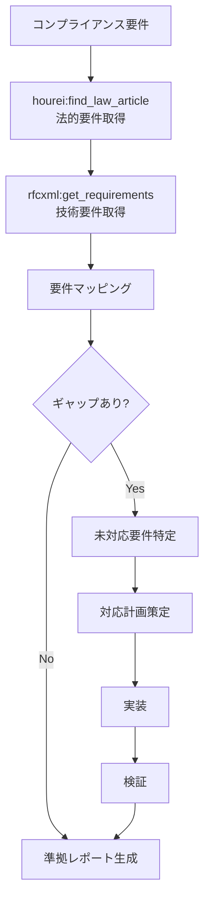
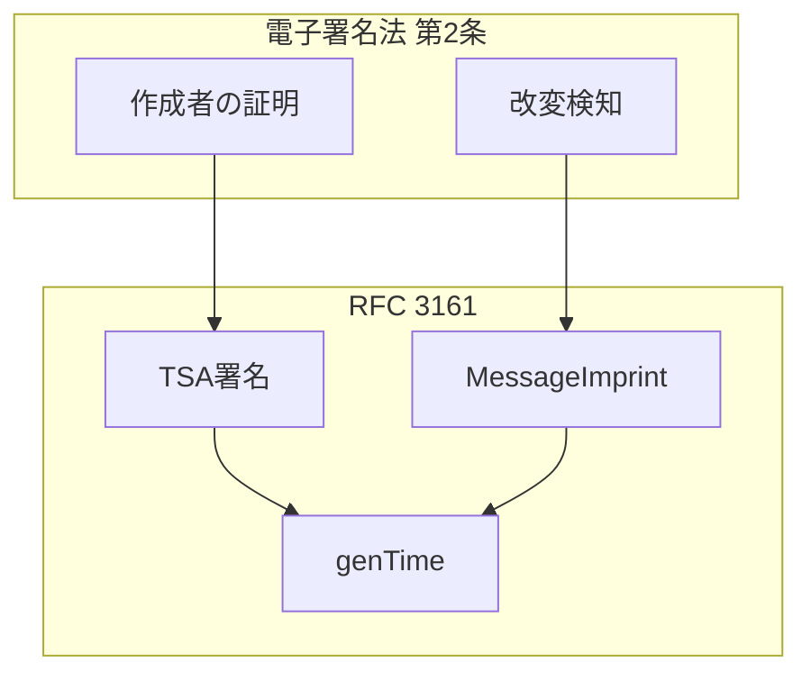

# コンプライアンスワークフロー

> 法的要件と技術仕様の対応関係を明確化し、コンプライアンスを体系的に管理する。

## パターン4: 法令×技術仕様マッピングワークフロー

### 概要

法的要件と技術仕様の対応関係を明確化するフロー。法令と技術仕様という異なるドメインの要件を突き合わせ、ギャップを特定して対応計画を策定する。

### 使用MCP

このワークフローで使用するMCPは以下の通りである。

- `hourei-mcp` - 日本法令参照
- `rfcxml-mcp` - 技術仕様参照

### フロー図

法的要件と技術仕様を対応づけるフローを以下に示す。

### 具体例：電子署名法 × RFC 3161

電子署名法とRFC 3161の対応関係を以下の図で示す。

### 実績

このワークフローの主な実績は以下の通りである。

- 電子署名法とRFC 3161の対応表作成
- Notes-about-Digital-Signatures リポジトリに反映

### 設計判断と失敗ケース

- **マッピングの粒度:** 法令の「条」レベルと技術仕様の「MUST要件」レベルを対応づけるのが実用的。法令の「項」レベルまで細分化すると、技術側の対応が曖昧になりやすい。
- **失敗ケース:** 法令の改正タイミングと技術仕様の更新が非同期であるため、マッピングの時点的な有効性を常に確認する必要がある。`hourei-mcp` の法令データは e-Gov API経由で最新版を取得するが、施行日と公布日の差にも注意が必要。
- **拡張可能性:** 現在は電子署名法 × RFC のみだが、個人情報保護法 × OAuth/OIDC仕様や、電子帳簿保存法 × PDF/A仕様など、法令×技術のマッピングは多くの領域に応用可能である。
