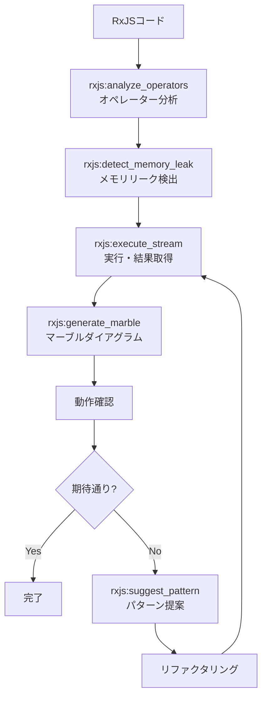

# 開発支援ワークフロー

> RxJSストリームの動作確認・デバッグなど、日常的な開発作業を効率化する。

## パターン6: RxJSデバッグワークフロー

### 概要

RxJSストリームの動作確認・デバッグフロー。コードの静的分析からランタイム実行、可視化まで一気通貫で行う。

### 使用MCP

このワークフローで使用するMCPは以下の通りである。

- `rxjs-mcp-server` - ストリーム実行・分析

### フロー図

RxJSコードの分析からリファクタリングまでのフローを以下に示す。

### 各ステップの詳細

| ステップ | ツール | 目的 |
| --- | --- | --- |
| オペレーター分析 | `analyze_operators` | 使用オペレーターの特定、パフォーマンス問題の検出 |
| メモリリーク検出 | `detect_memory_leak` | サブスクリプション管理の問題を特定 |
| ストリーム実行 | `execute_stream` | 実際のエミッション結果を取得 |
| マーブルダイアグラム | `generate_marble` | タイムライン上でのエミッション可視化 |
| パターン提案 | `suggest_pattern` | ユースケースに適したパターンを推薦 |

### 設計判断と失敗ケース

- **静的分析 → ランタイム実行の順序:** 先に `analyze_operators` と `detect_memory_leak` で静的分析を行い、問題がなければ `execute_stream` で実行する。逆順だとメモリリークのあるコードを実行してしまうリスクがある。
- **失敗ケース:** 非同期タイミングに依存するストリーム（例: `debounceTime` を含むもの）は、`execute_stream` のタイムアウト設定に注意が必要。デフォルトの5秒では不足する場合がある。
- **Angularとの連携:** `detect_memory_leak` の `componentLifecycle: "angular"` オプションを使うと、Angular固有のライフサイクル問題（`ngOnDestroy` でのunsubscribe漏れなど）を検出できる。
