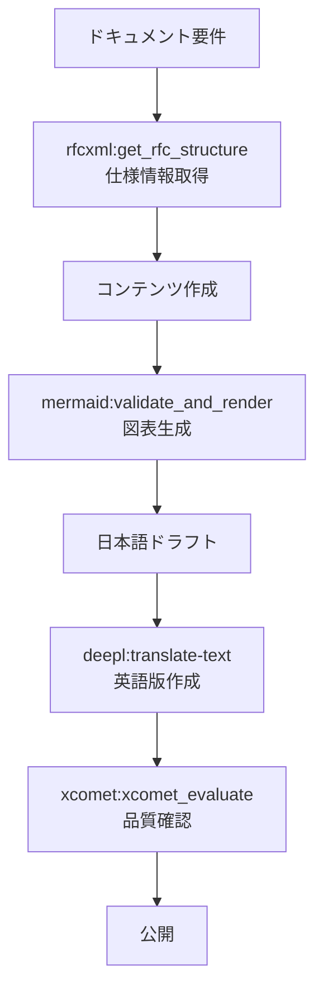

# ドキュメント生成ワークフロー

> 複数MCPを組み合わせた技術ドキュメントの自動生成。仕様取得から多言語化まで一気通貫で処理する。

## パターン7: ドキュメント生成ワークフロー

### 概要

複数MCPを組み合わせた技術ドキュメント生成フロー。仕様情報の取得、図表生成、翻訳、品質確認の4段階を統合し、多言語対応のドキュメントを効率的に作成する。

### 使用MCP

このワークフローで使用するMCPは以下の通りである。

- `rfcxml-mcp` - 仕様情報
- `mermaid-mcp` - 図表生成
- `deepl-mcp` - 多言語化
- `xcomet-mcp` - 翻訳品質確認

### フロー図

仕様情報の取得からドキュメント公開までのフローを以下に示す。

### 各ステージの役割

| ステージ | MCP | 入力 | 出力 |
| --- | --- | --- | --- |
| 仕様取得 | rfcxml-mcp | RFC番号 | セクション構造・要件一覧 |
| 図表生成 | mermaid-mcp | テキスト記述 | SVG/PNG図表 |
| 多言語化 | deepl-mcp | 日本語ドラフト | 英語版ドキュメント |
| 品質確認 | xcomet-mcp | 原文 + 翻訳文 | 品質スコア・エラー報告 |

### 設計判断と失敗ケース

- **日本語→英語の順序:** このプロジェクトでは日本語で思考・執筆し、英語に翻訳するフローを採用している。英語で先に書くより、母語で質の高いコンテンツを作成してから翻訳する方が全体品質が高くなる傾向がある。
- **失敗ケース:** Mermaid図のシンタックスエラーがドキュメント全体の生成を阻害することがある。`mermaid:validate_and_render` で事前にバリデーションを行うことで回避可能。
- **このリポジトリ自体が実例:** ai-agent-architecture リポジトリのドキュメント群は、このワークフローに基づいて作成・翻訳されている。
