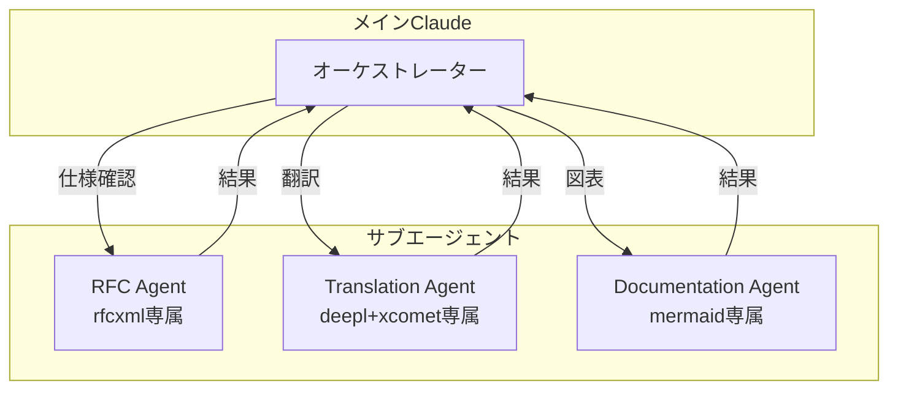

# マルチエージェント連携

> 複数のサブエージェントが協調して大規模タスクに取り組むパターン。コンテキスト分離と並列処理により高い専門性とスループットを実現する。

## パターン8: マルチエージェント連携

### 概要

複数のサブエージェントが協調して作業するパターン。各エージェントが専門領域のMCPのみを担当することで、コンテキストの肥大化を防ぎ、専門性の高い作業を並列実行できる。

### 構成

メインClaudeと3つの専門サブエージェントの構成を以下に示す。



### サブエージェント定義

各サブエージェントの定義例を以下に示す。

```markdown
<!-- agents/rfc-specialist.md -->

name: rfc-specialist
tools: rfcxml:\*
model: sonnet
```

```markdown
<!-- agents/translation-specialist.md -->

name: translation-specialist
tools: deepl:translate-text, xcomet:xcomet_evaluate, xcomet:xcomet_detect_errors
model: sonnet
```

```markdown
<!-- agents/documentation-specialist.md -->

name: documentation-specialist
tools: mermaid:\*
model: sonnet
```

### メリット

マルチエージェント連携の主なメリットは以下の通りである。

- **コンテキスト分離** - 各エージェントは自分のMCPだけ認識。ツール定義によるコンテキスト消費を最小化。
- **専門性向上** - 役割に特化した指示により、各タスクの品質が向上。
- **並列処理** - Git worktreesで物理的に分離可能。独立したタスクを同時実行。

### 設計判断と失敗ケース

- **エージェント分割の基準:** MCP単位での分割が最も自然。1エージェントに3つ以上のMCPを割り当てると、コンテキスト分離のメリットが薄れる。
- **失敗ケース:** エージェント間の情報共有が不足すると、全体の整合性が崩れる。例えば、RFC Agentが抽出した用語をTranslation Agentが知らないまま翻訳すると、用語不統一が発生する。オーケストレーターが中間結果を適切に中継する設計が重要。
- **コスト考慮:** サブエージェントの起動にはそれぞれコンテキストウィンドウを消費する。小規模タスクではオーバーヘッドの方が大きくなるため、並列処理の効果が出る規模感を見極める必要がある。
