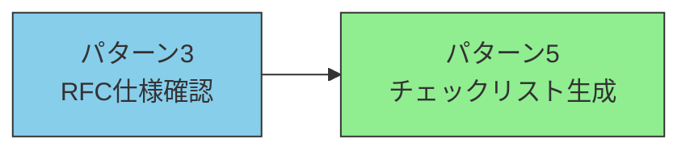
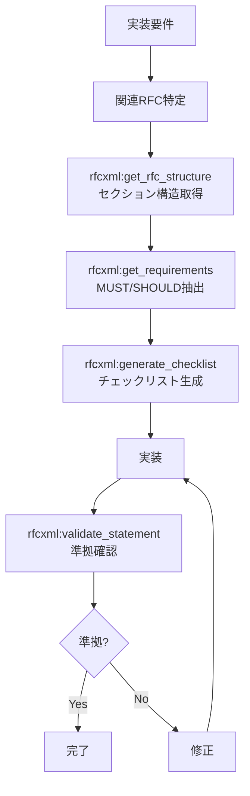

# 仕様参照・検証ワークフロー

> RFC仕様の構造的理解から実装チェックリスト生成まで、仕様準拠の開発を支援する。

## 概要

仕様参照・検証ワークフローは2つのパターンで構成される。パターン3で仕様全体を構造的に理解し、パターン5でそこから実装チェックリストを自動生成する。



| パターン | 適用場面 | アウトプット |
| --- | --- | --- |
| パターン3 | 新しいRFCの理解・実装確認 | 構造化された仕様理解 + 準拠レポート |
| パターン5 | 実装前のタスク洗い出し | Markdownチェックリスト |

## パターン3: RFC仕様確認ワークフロー

### 概要

RFC仕様を構造化して理解・実装確認するフロー。

### 使用MCP

このワークフローで使用するMCPは以下の通りである。

- `rfcxml-mcp` - RFC解析
- `w3c-mcp` - Web API確認（必要に応じて）

### フロー図

RFC仕様の確認から実装検証までのフローを以下に示す。



### サブエージェント定義例

RFC仕様確認に特化したサブエージェントの定義例を以下に示す。

```markdown
<!-- .claude/agents/rfc-specialist.md -->

name: rfc-specialist
description: RFC仕様の確認・検証専門。実装がRFCに準拠しているか確認する。
tools: rfcxml:get_rfc_structure, rfcxml:get_requirements, rfcxml:get_definitions, rfcxml:generate_checklist, rfcxml:validate_statement
model: sonnet

あなたはRFC仕様の専門家です。
以下の手順で作業してください。

1. まず get_rfc_structure でRFCの全体像を把握
2. get_requirements でMUST/SHOULD要件を抽出
3. 必要に応じて get_definitions で用語確認
4. generate_checklist で実装チェックリストを生成
5. validate_statement で実装の準拠を確認
```

### 実績

このワークフローの主な実績は以下の通りである。

- RFC 6455（WebSocket）の完全日本語翻訳
- 75個のMUST要件、23個のSHOULD要件を構造化

### 設計判断と失敗ケース

- **MUST vs SHOULD の優先度:** 実装時はMUST要件を100%満たすことを最優先とする。SHOULD要件は優先度をつけて段階的に対応する方がプロジェクトが滞りにくい。
- **失敗ケース:** RFC間の依存関係を見落とすことがある。例えばRFC 6455はRFC 2616（HTTP/1.1）を前提としており、`get_rfc_dependencies` で依存関係を先に確認すべきである。

## パターン5: チェックリスト生成ワークフロー

### 概要

仕様から実装チェックリストを自動生成するフロー。

### フロー図

仕様から実装チェックリストを生成するフローを以下に示す。

```mermaid
flowchart TB
    START[対象仕様] --> GET[rfcxml:get_requirements]
    GET --> FILTER{役割フィルタ}
    FILTER -->|Client| CLIENT[クライアント要件]
    FILTER -->|Server| SERVER[サーバー要件]
    FILTER -->|Both| BOTH[共通要件]
    CLIENT --> GEN[rfcxml:generate_checklist<br/>role: client]
    SERVER --> GEN2[rfcxml:generate_checklist<br/>role: server]
    BOTH --> GEN3[rfcxml:generate_checklist<br/>role: both]
    GEN --> MD[Markdownチェックリスト]
    GEN2 --> MD
    GEN3 --> MD
```



### 出力例

生成されるチェックリストの出力例を以下に示す。

```markdown
# RFC 6455 WebSocket 実装チェックリスト（クライアント）

## MUST要件

- [ ] クライアントはサーバーからのHTTP 101以外の応答を拒否しなければならない
- [ ] Sec-WebSocket-Keyヘッダを送信しなければならない
- [ ] ...

## SHOULD要件

- [ ] 接続失敗時は指数バックオフで再試行すべきである
- [ ] ...
```

### 設計判断

- **ロールフィルタの重要性:** フルスタック開発では `role: both` を使いがちだが、クライアントとサーバーで分離した方が各チームの責務が明確になる。
- **チェックリストの粒度:** `generate_checklist` が生成するリストはMUST/SHOULD単位だが、実際の実装タスクはさらに細分化が必要な場合がある。チェックリストはあくまで「漏れ防止」として活用する。
