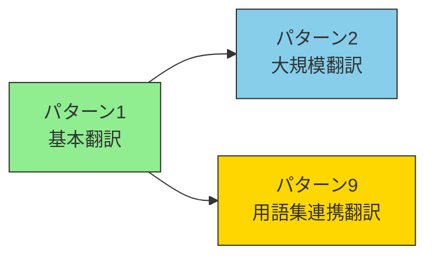
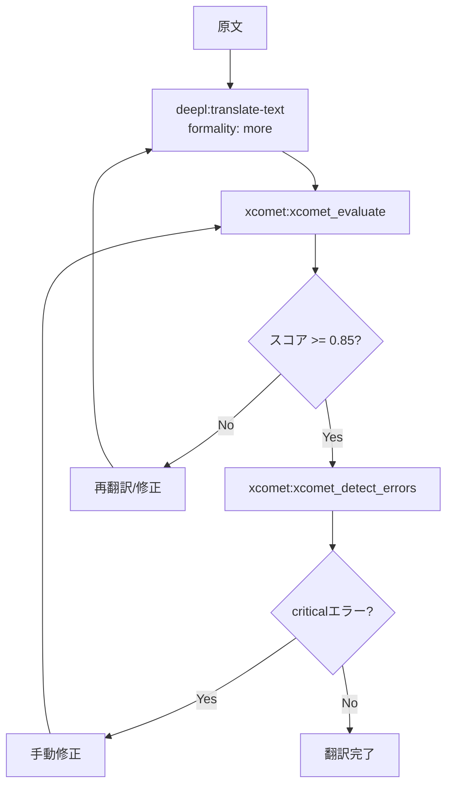
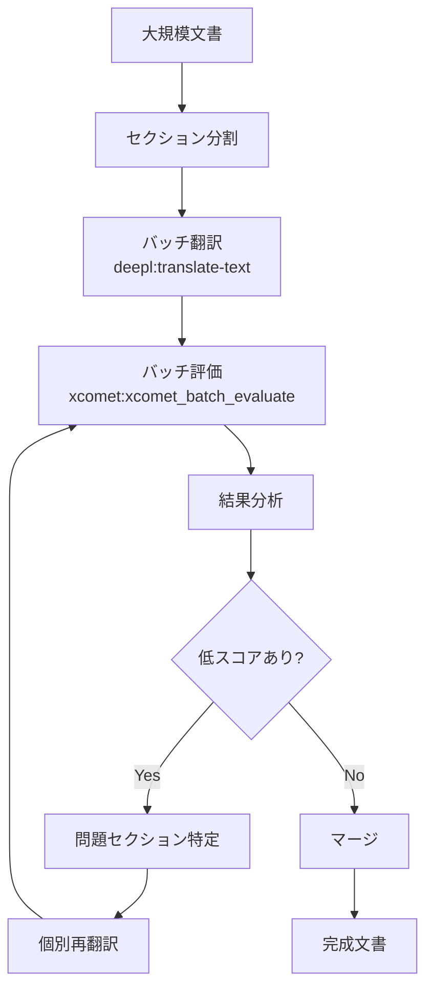
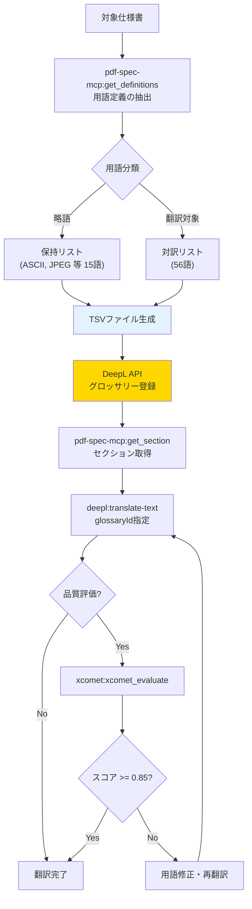

# 翻訳ワークフロー

> DeepL + xCOMET を中心とした翻訳パイプライン。基本翻訳から大規模バッチ処理、用語集連携による厳密翻訳まで段階的に発展する。

## 概要

翻訳ワークフローは3つのパターンで構成され、それぞれが前のパターンを基盤として発展する。



| パターン | 適用場面 | 追加要素 |
| --- | --- | --- |
| パターン1 | 一般的な技術文書 | — |
| パターン2 | 100ページ超の大規模文書 | バッチ処理 |
| パターン9 | 仕様書・規格文書など用語厳密性が必要な文書 | グロッサリー管理 |

## パターン1: 技術文書翻訳ワークフロー

### 概要

DeepL + xCOMET を組み合わせた高品質翻訳フロー。

### 使用MCP

このワークフローで使用するMCPは以下の通りである。

- `deepl-mcp` - 翻訳実行
- `xcomet-mcp-server` - 品質評価

### フロー図

翻訳から品質評価までの一連のフローを以下に示す。



### Skill定義例

このワークフローをSkillとして定義する場合の例を以下に示す。

```markdown
<!-- .claude/skills/translation-workflow/SKILL.md -->

# 技術文書翻訳ワークフロー

## 品質基準

- スコア 0.85以上: 合格
- スコア 0.70-0.85: 要確認
- スコア 0.70未満: 再翻訳

## エラー対応

- critical: 必ず修正（意味の逆転、重大な誤訳）
- major: 修正推奨（不自然な表現、用語不統一）
- minor: 任意（スタイルの問題）

## 翻訳設定

- formality: "more"（技術文書は堅めに）
- 用語集があれば glossaryId を指定
```

### 実績

このワークフローの主な実績は以下の通りである。

- 180ページ技術文書（150万文字）を1日で完了
- コスト: 約$12（従来の1/100以下）

### 設計判断と失敗ケース

品質閾値の設定には注意が必要である。

- **閾値 0.85 の根拠:** xCOMETのスコア分布を分析した結果、0.85以上であれば人間レビューでも「許容品質」と判断される割合が高かった。
- **失敗ケース:** 略語や固有名詞が多い文書では、xCOMETが過剰にペナルティを付与することがある。この場合、用語集連携（パターン9）との併用が有効。

## パターン2: 大規模翻訳ワークフロー（バッチ処理）

### 概要

大量の翻訳ペアを効率的に処理するバッチワークフロー。

### フロー図

大規模文書のバッチ翻訳フローを以下に示す。



### ポイント

大規模翻訳を効率的に処理するためのポイントは以下の通りである。

- `xcomet:xcomet_batch_evaluate` でまとめて評価
- 問題のあるセクションのみ個別対応
- GPU使用でさらに高速化

### 設計判断

- **セクション分割の粒度:** 段落単位が最もバランスが良い。文単位では文脈が失われ、章単位ではバッチ処理のメリットが薄れる。
- **低スコアの閾値:** バッチ全体の平均スコアではなく、個別セクションのスコアで判断する。平均が高くても、1セクションでも0.70未満があれば対応が必要。

## パターン9: 用語集連携翻訳ワークフロー

### 概要

仕様書の用語を自動抽出してグロッサリーを構築し、用語統一された翻訳を実現するフロー。パターン1（技術文書翻訳）の発展形であり、**Skillが複数MCPをオーケストレーションする**完全統合パターン。

### 使用MCP / Skill

このワークフローで使用するMCPとSkillは以下の通りである。

- `pdf-spec-mcp` - 仕様書の用語定義を構造的に抽出
- `deepl-mcp` - グロッサリー管理・翻訳実行
- `xcomet-mcp-server` - 翻訳品質評価（オプション）
- `deepl-glossary-translation` Skill - 上記MCPの連携手順を定義

### フロー図

用語抽出からグロッサリー適用翻訳までの一連のフローを以下に示す。



### パターン1との違い

| 観点 | パターン1（基本翻訳） | パターン9（用語集連携） |
|---|---|---|
| 用語の一貫性 | 翻訳ごとにばらつく可能性 | グロッサリーで強制的に統一 |
| 前準備 | 不要 | 用語抽出・分類・登録が必要 |
| 適用場面 | 一般的な技術文書 | **仕様書・規格文書**など用語厳密性が要求される文書 |
| MCP数 | 2（deepl + xcomet） | 3（pdf-spec + deepl + xcomet） |
| Skill | 不要（手動フロー可） | **必須**（複雑な手順のオーケストレーション） |

### 具体例：ISO 32000-2のグロッサリー

用語分類の具体例を以下に示す。

```
保持（略語）: ASCII, CFF, JPEG, PDF, TLS, URI, XML ... (15語)
翻訳対象:
  cross-reference table → 相互参照テーブル
  content stream → コンテンツストリーム
  null object → nullオブジェクト  ← PDF仕様のnullは小文字
  indirect object → 間接オブジェクト
  ... (56語)
```

「null object」が「NULLオブジェクト」や「Nullオブジェクト」ではなく「nullオブジェクト」（PDF仕様のキーワードに準拠した小文字）に統一されるなど、ドメイン固有の用語規則をグロッサリーで強制できる点が最大の価値である。

### リポジトリ

詳細な実装は [shuji-bonji/deepl-glossary-translation](https://github.com/shuji-bonji/deepl-glossary-translation) を参照。Skill実装の具体例として [Skill実例ショーケース](../../skills/showcase#deepl-glossary-translation) でも解説している。
