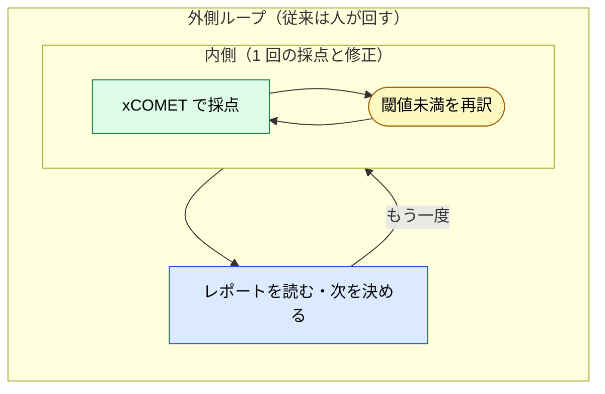
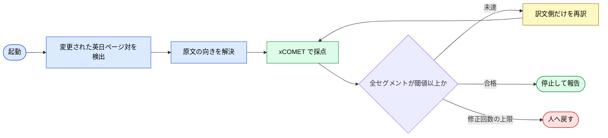

# 翻訳品質ゲートの自走ループ

> 英日 2 言語のドキュメントで、翻訳品質の検査と修正を人の手から外し、決定論的なスコアを停止条件にする。

## このドキュメントについて

> [!NOTE]
> 本ページは [Loop Engineering](../strategy/loop-engineering) の 2 つ目の実装例である。1 つ目の [Issue→Deploy 自律化](./autonomous-dev-meta-agent) が開発パイプライン全体を扱うのに対し、本ページは範囲の狭い 1 本のループ、すなわち翻訳品質ゲートを扱う。範囲が狭いぶん、外側ループの自動化に何が要るかがそのまま見える。

> [!TIP]
> **3 行で言うと**
>
> - 外側ループに座っていたのは人である。`/check-translation` を叩き、レポートを読み、訳文を直し、また叩く。この繰り返しをシステムに移す。
> - 検査役が xCOMET という決定論的な外部の採点者なので、「終わったか」の判定がモデルの自己申告にならない。
> - 設計の中心は、ゲートを動かして合格させることを禁じる点にある。閾値と原文の指定は、ループが触れない場所に置く。

## 何を自動化するのか

翻訳の更新作業は、2 つのループが入れ子になっている。内側は 1 回の採点と修正、外側は「まだ閾値に届かないから、もう一度」の繰り返しである。外側にはこれまで人が座っていた。



自走させたあとの形は次のようになる。



## なぜ翻訳がループ化しやすいのか

自走ループの最大の難所は「いつ止まるか」である。モデルにツールを呼ばせなくなっただけで完了と見なすと、テストが落ちたままの「完了しました」を受け取ることになる。これは [Sycophancy](../glossary#structural-problems)、すなわちモデルが自分の成果を甘く採点する性質から来る。

翻訳品質ゲートでは、この難所が最初から片付いている。**採点するのがモデルではないからである。**

| 検査の担い手 | 停止条件として使えるか |
| --- | --- |
| モデルに「この訳文は良いか」と尋ねる | 使えない。作った本人が採点している |
| 人がレポートを読む | 使えるが、人が外側ループに座り続けることになる |
| **xCOMET のスコア** | **使える。同じ入力に同じ数値を返す外部の採点者である** |

xCOMET は原文と訳文を受け取り、セグメントごとに 0〜1 のスコアを返す。「全セグメントが 0.85 以上」は機械で判定できる条件であり、モデルの言い分が入り込む余地がない。maker（訳す側）と checker（採点する側）が、最初から別の主体になっている。

## 先に決めておくこと

ループを回す前に、判断の余地を設定ファイルへ追い出しておく。本リポジトリでは `.claude/translation.json` が持つ。

| キー | 何を決めるか |
| --- | --- |
| `localeRoots` | 対の作り方。`docs/ja/X` と `docs/X` が対になる。英語版は `docs/` のうち `docs/ja/` を除いた側である |
| `filePairs` | ディレクトリ規則に従わない対。`README.ja.md` ↔ `README.md` など |
| `exclude` | 採点しない範囲。旧 URL のリダイレクトや `.vitepress/` |
| `defaultSource` | どちらを原文とするかの既定。本書は `ja` |
| `sourceOverrides` | 英語を先に書いたページの glob。既定より優先する |
| `threshold` | 合格とみなす最小スコア |
| `maxFixRounds` | 人へ戻すまでに許す修正回数 |

`defaultSource` と `sourceOverrides` を分けているのは、原文がページごとに違うからである。xCOMET は原文と訳文を比べる。訳文の側を原文として渡すと、指標の意味が反転し、出てきた数値は読めなくなる。向きの解決は採点の前に済ませる（**MUST**）。

## 4 つの難所への対応

[Loop Engineering](../strategy/loop-engineering) が挙げた 4 つの難所は、このループでは次の形で片付く。

| 難所 | このループでの対応 |
| --- | --- |
| いつ停止するか | 全セグメントが `threshold` 以上、または `maxFixRounds` に到達。どちらも機械で判定できる |
| コンテキストを汚さない | 1 イテレーションで扱うのは、変更された対だけである。リポジトリ全体を読み込まない |
| ツールが安全か | 書き換えるのは訳文側だけとする。原文が不変なので、同じ入力からは同じ採点をやり直せる |
| 「ノー」と言える主体 | xCOMET が担う。モデルは自分のスコアを決められない |

> [!CAUTION]
> 自走ループに `threshold` や `sourceOverrides` を触らせてはならない（**MUST NOT**）。閾値を下げれば全ページが合格する。設定を緩めて合格させることは、品質を上げることではなく、ゲートを外すことである。届かないなら、届かないと報告して止まるのが正しい。

## 実装

`.claude/loop.md` に、各イテレーションでやること、停止条件、やらないことを書く。Claude Code は、引数なしの `/loop` でこのファイルを既定のプロンプトとして使う。

```
/loop            # 自己ペース。Claude が 1 分〜1 時間の範囲で次回の間隔を選ぶ
/loop 30m        # 30 分の固定間隔
```

`loop.md` の編集は次のイテレーションから反映される。回しながら指示を調整できるため、これは [Instruction Decay](../glossary#structural-problems) への再注入としても働く。

> [!WARNING]
> スケジュール発火で実行できるのは、モデルが自分で呼んでよい Skill だけである。`disable-model-invocation: true` を付けた Skill は、実行されずに平文としてモデルへ届く。検査を人の起動に限定したい場合は、この指定を使う。

## このループが見ないもの

xCOMET が測るのは、セグメント単位での原文と訳文の意味の一致である。次はこのループの担当ではない。

- 用語の統一。専門用語を英語のまま置く、といったサイト全体の規約は、別の検査が要る。
- 文体。日本語版の常体、英語版の技術書としての書き方は、スコアには現れない。
- 対の構造。見出しの数、ナビゲーション、リンク先の対称性は、翻訳品質とは別の軸である。
- 原文の誤り。原文が間違っていれば、訳文をいくら直しても正しくならない。訳文だけを直す設計は、この点で意図的に無力である。

つまりこのループは、外側ループのうち**測れる部分だけ**をシステムへ移している。残りは人が持ち続ける。これは [Loop Engineering](../strategy/loop-engineering) が述べた「理解は移送できない」の、小さな実例にあたる。

## 関連ドキュメント

- [Loop Engineering](../strategy/loop-engineering) — 外側ループの自動化。本ページはその実装例
- [Issue→Deploy 自律化](./autonomous-dev-meta-agent) — もう 1 つの実装例（開発パイプライン全体）
- [翻訳ワークフロー](./patterns/translation) — 人が回す前提での翻訳パターン（本ページの内側）
- [サブエージェント品質ゲート](../agents/subagent-quality-gate) — 「ノー」と言える主体の一般形

## さらに深く: なぜ自走ループに外部の採点者が要るのか

- [understanding-llm / /loop と自走するセッション](https://shuji-bonji.github.io/understanding-llm-through-claude-code/ja/08-session-management/loop-and-self-driving-sessions) — 人のいないループが増幅する制約と、仕様に書かれた歯止め
- [understanding-llm / Sycophancy](https://shuji-bonji.github.io/understanding-llm-through-claude-code/ja/01-llm-structural-problems/sycophancy) — モデルが自分の成果を甘く採点する理由

## 参考文献

- Anthropic. "Run prompts on a schedule." Claude Code Docs. [code.claude.com](https://code.claude.com/docs/en/scheduled-tasks) — `/loop`、`loop.md`、停止とフォールバックの仕様
- Guerreiro, N. M. et al. (2023). "xCOMET: Transparent Machine Translation Evaluation through Fine-grained Error Detection." arXiv. [arXiv:2310.10482](https://arxiv.org/abs/2310.10482) — セグメント単位のスコアとエラー検出
- shuji-bonji. "xcomet-mcp-server." GitHub. [github.com/shuji-bonji/xcomet-mcp-server](https://github.com/shuji-bonji/xcomet-mcp-server) — 本ループが使う採点用 MCP サーバー

---

**最終更新**: 2026年9月
