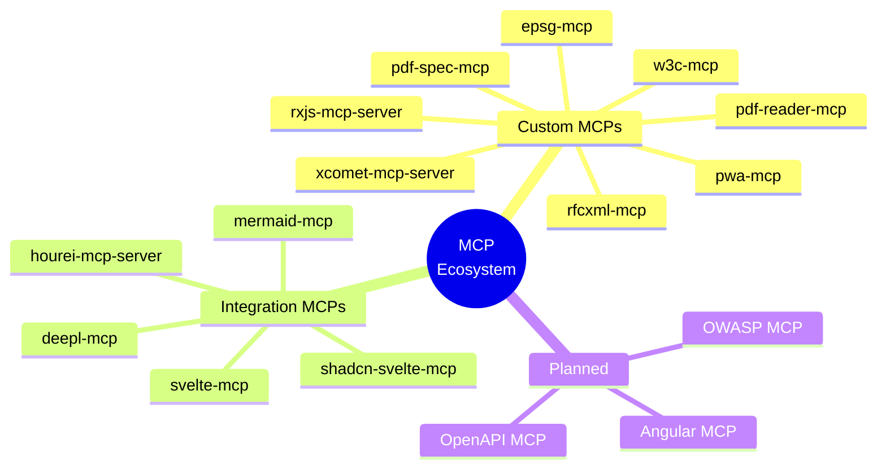
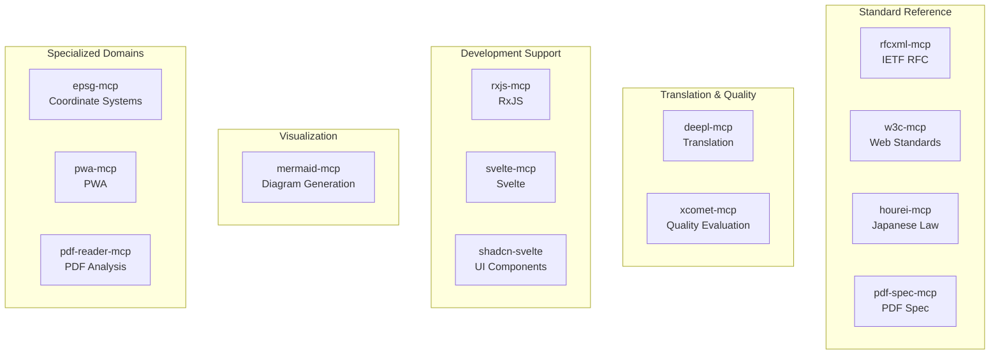
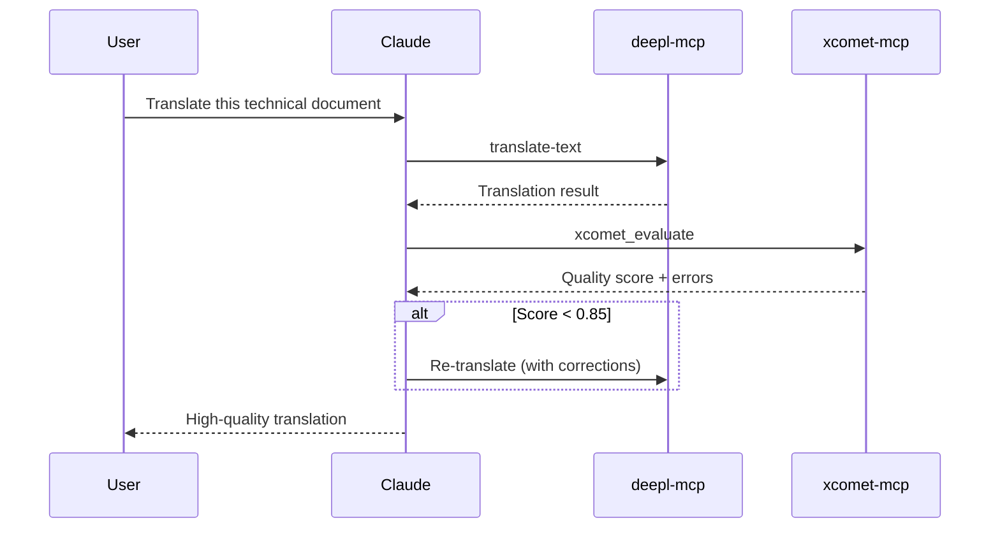
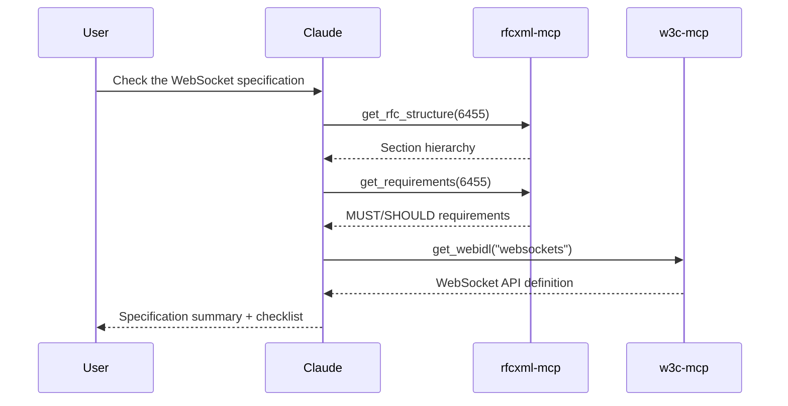
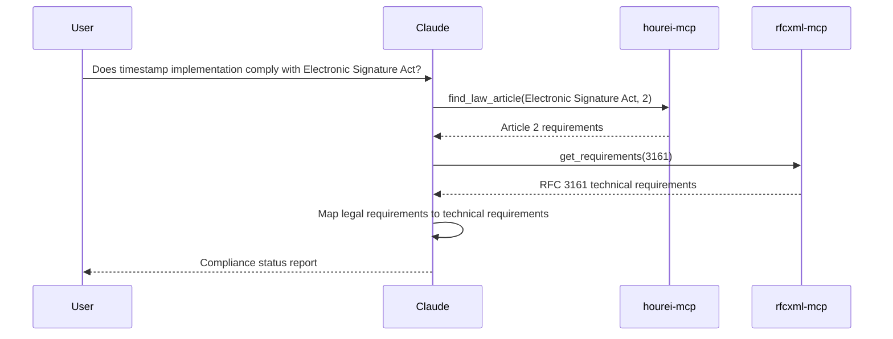

# MCP Catalog

[日本語版 (Japanese)](/ja/mcp/catalog)

> A comprehensive list of MCP servers built and used, along with their features, use cases, and achievements.

## About This Document

This document is a catalog listing the MCP servers currently built and in use. It describes the features, provided tools, and practical usage examples for each MCP.

Use this as a reference when considering the development of new MCPs, or as a guide for understanding how to use existing MCPs. While each MCP provides value on its own, combining multiple MCPs can enable more powerful workflows. This document provides insights into such combinations.

## Overview Map

This map provides a visual overview of the MCP ecosystem, showing how different MCPs are organized into categories.

## Custom MCP Servers

### rfcxml-mcp

Provides structured access to IETF RFC documents.

| Item           | Description                                                         |
| -------------- | ------------------------------------------------------------------- |
| **Repository** | [shuji-bonji/rfcxml-mcp](https://github.com/shuji-bonji/rfcxml-mcp) |
| **npm**        | `@shuji-bonji/rfcxml-mcp`                                           |
| **Purpose**    | RFC specification search, analysis, and requirements extraction     |
| **Status**     | Published                                                           |

#### Main Tools

| Tool                   | Function                                            |
| ---------------------- | --------------------------------------------------- |
| `get_rfc_structure`    | Get RFC section hierarchy and metadata              |
| `get_requirements`     | Structured extraction of MUST/SHOULD/MAY requirements |
| `get_definitions`      | Get term definitions                                |
| `get_rfc_dependencies` | Get references (normative/informative)              |
| `get_related_sections` | Get related sections                                |
| `generate_checklist`   | Generate implementation checklist in Markdown       |
| `validate_statement`   | Verify if implementation conforms to specification  |

#### Achievements

- Used for Japanese translation of RFC 6455 (WebSocket)
- Used for mapping between Electronic Signature Act and RFC 3161
- Automatically extracted 75 MUST requirements and 23 SHOULD requirements

### w3c-mcp

Provides access to W3C/WHATWG/IETF Web standard specifications.

| Item           | Description                                                   |
| -------------- | ------------------------------------------------------------- |
| **Repository** | [shuji-bonji/w3c-mcp](https://github.com/shuji-bonji/w3c-mcp) |
| **npm**        | `@shuji-bonji/w3c-mcp`                                        |
| **Purpose**    | Web standard specification search, WebIDL, CSS, HTML elements |
| **Status**     | Published (npm v0.1.7)                                        |

#### Main Tools

| Tool                    | Function                                                |
| ----------------------- | ------------------------------------------------------- |
| `list_w3c_specs`        | List specifications (filter by organization, category, keyword) |
| `get_w3c_spec`          | Get specification details                               |
| `search_w3c_specs`      | Search specifications                                   |
| `get_webidl`            | Get WebIDL interface definitions                        |
| `get_css_properties`    | Get CSS property definitions                            |
| `get_html_elements`     | Get HTML element definitions                            |
| `get_pwa_specs`         | List PWA-related specifications                         |
| `get_spec_dependencies` | Get specification dependencies                          |

### xcomet-mcp-server

Provides translation quality evaluation using the xCOMET model.

| Item           | Description                                                                       |
| -------------- | --------------------------------------------------------------------------------- |
| **Repository** | [shuji-bonji/xcomet-mcp-server](https://github.com/shuji-bonji/xcomet-mcp-server) |
| **npm**        | `@shuji-bonji/xcomet-mcp-server`                                                  |
| **Purpose**    | Quantitative translation quality evaluation and error detection                   |
| **Status**     | Published (1 star, 1 fork)                                                        |

#### Main Tools

| Tool                    | Function                                                   |
| ----------------------- | ---------------------------------------------------------- |
| `xcomet_evaluate`       | Translation quality score (0-1) and error span detection   |
| `xcomet_detect_errors`  | Detailed error detection (severity: minor/major/critical)  |
| `xcomet_batch_evaluate` | Batch evaluation of multiple translation pairs             |

#### Features

- Persistent model loading (fast inference after initialization)
- GPU support
- Batch processing support

#### Achievements

- Translated and quality-evaluated 180-page technical document (1.5 million characters) in one day
- Cost of approximately $12 (less than 1/100 of conventional methods)

### rxjs-mcp-server

Provides RxJS stream execution, visualization, and analysis.

| Item           | Description                                                                   |
| -------------- | ----------------------------------------------------------------------------- |
| **Repository** | [shuji-bonji/rxjs-mcp-server](https://github.com/shuji-bonji/rxjs-mcp-server) |
| **Purpose**    | RxJS code execution, marble diagram generation, and analysis                  |
| **Status**     | Published                                                                     |

#### Main Tools

| Tool                 | Function                                     |
| -------------------- | -------------------------------------------- |
| `execute_stream`     | Execute RxJS code and capture results        |
| `generate_marble`    | Generate ASCII marble diagrams               |
| `analyze_operators`  | Operator analysis and performance checking   |
| `detect_memory_leak` | Memory leak detection                        |
| `suggest_pattern`    | Pattern suggestions based on use cases       |

### epsg-mcp

Provides access to the EPSG coordinate reference system database.

| Item           | Description                                                     |
| -------------- | --------------------------------------------------------------- |
| **Repository** | [shuji-bonji/epsg-mcp](https://github.com/shuji-bonji/epsg-mcp) |
| **npm**        | `@shuji-bonji/epsg-mcp`                                         |
| **Purpose**    | Coordinate Reference System (CRS) knowledge base with global coverage |
| **Status**     | Published (npm v0.9.8)                                          |

#### Main Tools

| Tool                      | Function                                     |
| ------------------------- | -------------------------------------------- |
| `search_crs`              | Search EPSG CRS by keyword                   |
| `get_crs_detail`          | Get detailed info for specific EPSG code     |
| `list_crs_by_region`      | List CRS by region with recommendations      |
| `recommend_crs`           | Recommend optimal CRS for purpose/location   |
| `validate_crs_usage`      | Validate CRS appropriateness                 |
| `suggest_transformation`  | Suggest transformation paths between CRS     |
| `compare_crs`             | Compare two CRS from various perspectives    |
| `get_best_practices`      | Get CRS best practices for specific topics   |
| `troubleshoot`            | Troubleshoot CRS-related problems            |

#### Features

- Full support for Japan Plane Rectangular CS (Zones I-XIX)
- Global coverage (WGS84, UTM zones, etc.)
- Offline operation with local database
- Regional packs (Japan, US, UK)

### pdf-spec-mcp

Provides structured access to PDF specifications (ISO 32000).

| Item           | Description                                                                    |
| -------------- | ------------------------------------------------------------------------------ |
| **Repository** | [shuji-bonji/pdf-spec-mcp](https://github.com/shuji-bonji/pdf-spec-mcp)        |
| **npm**        | `@shuji-bonji/pdf-spec-mcp`                                                    |
| **Purpose**    | PDF specification (ISO 32000-1/2) structured reference and requirements extraction |
| **Status**     | Published (npm v0.2.2)                                                         |

#### Main Tools

| Tool               | Function                                         |
| ------------------- | ------------------------------------------------ |
| `list_specs`        | List available PDF specification documents       |
| `get_structure`     | Get section hierarchy of PDF specification       |
| `get_section`       | Get content of a specific section                |
| `search_spec`       | Full-text search of PDF specification            |
| `get_requirements`  | Extract normative requirements (shall/must/may)  |
| `get_definitions`   | Get term definitions                             |
| `get_tables`        | Extract table structures                         |
| `compare_versions`  | Compare sections between PDF 1.7 and PDF 2.0    |

### pdf-reader-mcp

Provides PDF internal structure analysis and reading capabilities.

| Item           | Description                                                                        |
| -------------- | ---------------------------------------------------------------------------------- |
| **Repository** | [shuji-bonji/pdf-reader-mcp](https://github.com/shuji-bonji/pdf-reader-mcp)        |
| **npm**        | `@shuji-bonji/pdf-reader-mcp`                                                      |
| **Purpose**    | PDF reading, structure analysis, and accessibility validation                      |
| **Status**     | Published (npm v0.2.0)                                                             |

#### Main Tools

| Tool                  | Function                                    |
| --------------------- | ------------------------------------------- |
| `read_text`           | Text extraction with reading order          |
| `read_images`         | Image extraction                            |
| `search_text`         | Text search within PDF                      |
| `get_metadata`        | Metadata extraction                         |
| `inspect_structure`   | Internal object structure inspection        |
| `inspect_tags`        | Tagged PDF structure analysis               |
| `inspect_fonts`       | Font information listing                    |
| `inspect_annotations` | Annotation listing                          |
| `inspect_signatures`  | Digital signature field inspection          |
| `validate_tagged`     | PDF/UA tag structure validation             |
| `validate_metadata`   | Metadata conformance validation             |
| `compare_structure`   | Compare structures of two PDFs              |
| `read_url`            | Fetch and read PDF from URL                 |
| `summarize`           | Generate PDF overview report                |

#### Features

- 15 specialized tools across 3 tiers (basic / inspection / validation)
- PDF/UA accessibility compliance checking
- 185 tests (146 E2E tests)

### pwa-mcp

Provides PWA (Progressive Web App) development support.

| Item           | Description         |
| -------------- | ------------------- |
| **Repository** | shuji-bonji/pwa-mcp |
| **Purpose**    | PWA development support |
| **Status**     | Private             |

## Integration MCP Servers

MCPs that are not custom-built but are integrated into workflows.

### deepl-mcp

| Item         | Description                                           |
| ------------ | ----------------------------------------------------- |
| **Provider** | DeepL Official                                        |
| **Use Case** | High-quality translation, glossary support            |
| **Integration** | Combined with xcomet-mcp-server for translation workflow |

#### Main Tools

- `translate-text` - Text translation
- `translate-document` - Document translation
- `rephrase-text` - Text rephrasing
- Glossary support

### hourei-mcp-server (e-gov-law-mcp)

| Item         | Description                                                     |
| ------------ | --------------------------------------------------------------- |
| **Provider** | [ryoooo/e-gov-law-mcp](https://github.com/ryoooo/e-gov-law-mcp) |
| **Use Case** | Japanese law search and article retrieval                       |
| **Integration** | Combined with rfcxml-mcp for law-to-technical-specification mapping |

#### Main Tools

- `search_law` - Law search
- `get_law_data` - Get law details
- `find_law_article` - Article search
- `get_law_revision` - Revision history

#### Achievements

- Created mapping table between Electronic Signature Act and RFC 3161

### mermaid-mcp

| Item         | Description                              |
| ------------ | ---------------------------------------- |
| **Use Case** | Mermaid diagram generation and rendering |
| **Integration** | Document generation workflow          |

### svelte-mcp / shadcn-svelte-mcp

| Item         | Description                                    |
| ------------ | ---------------------------------------------- |
| **Use Case** | Svelte/SvelteKit development support, UI components |
| **Integration** | Frontend development                        |

## MCP Categories

The available MCPs can be organized by their primary function and use case, as shown in the following diagram.

## Workflow-Based MCP Combinations

### Technical Document Translation Workflow

### RFC Specification Review Workflow

### Law-to-Technical-Specification Mapping Workflow

## Planned MCPs

The following MCPs are currently in the planning phase or under development and represent the future direction of the ecosystem.

| MCP              | Target        | Priority | Notes                    |
| ---------------- | ------------- | -------- | ------------------------ |
| **OpenAPI MCP**  | OpenAPI Spec  | High     | API design support       |
| **OWASP MCP**    | OWASP Top 10  | High     | Security checking        |
| **Angular MCP**  | Angular       | Medium   | Specialized domain usage |
| **NgRx MCP**     | NgRx          | Medium   | State management patterns |
| **ISO MCP**      | ISO Standards | Medium   | International standard reference |
| ~~**PDF Spec MCP**~~ | ~~ISO 32000~~ | ~~Low~~ | ✅ **Published** `@shuji-bonji/pdf-spec-mcp` |
| **BIM/IFC MCP**  | buildingSMART | Low      | Building information modeling |
| **HL7 FHIR MCP** | HL7 FHIR      | Low      | Healthcare information exchange |

## npm Publication Status

The following table lists the MCPs that have been published to npm, including their current versions and descriptions.

| Package                           | Version | Description                     |
| --------------------------------- | ------- | ------------------------------- |
| `@shuji-bonji/rfcxml-mcp`         | v0.4.5  | IETF RFC Structured Reference   |
| `xcomet-mcp-server`               | v0.3.6  | Translation Quality Evaluation  |
| `@shuji-bonji/w3c-mcp`            | v0.1.7  | W3C Web Standards               |
| `@shuji-bonji/epsg-mcp`           | v0.9.8  | EPSG Coordinate Reference Systems |
| `@shuji-bonji/pdf-spec-mcp`       | v0.2.2  | PDF Specification (ISO 32000)   |
| `@shuji-bonji/pdf-reader-mcp`     | v0.2.0  | PDF Internal Structure Analysis |

## Reference Links

Here are the key references and resources for MCP catalog information and repositories.

- [npm: @shuji-bonji](https://www.npmjs.com/~shuji-bonji)
- [GitHub: shuji-bonji](https://github.com/shuji-bonji)
