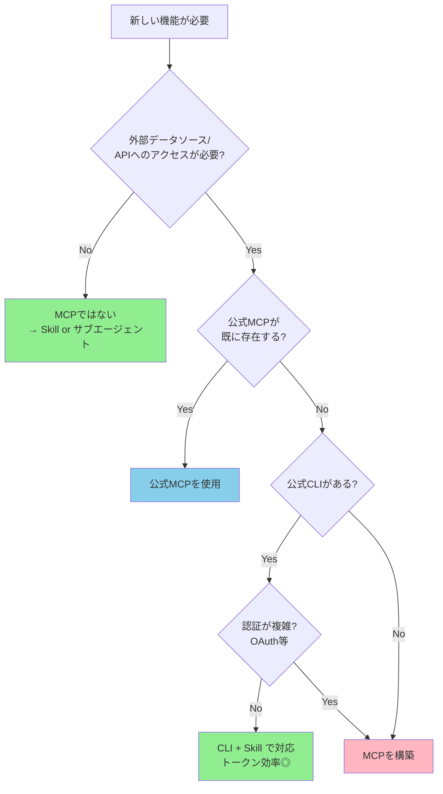
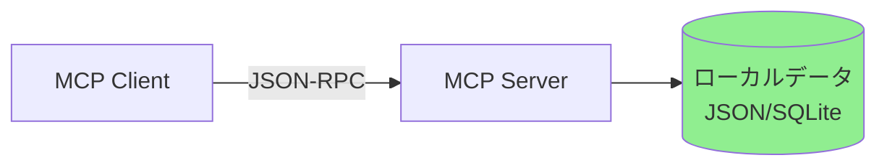
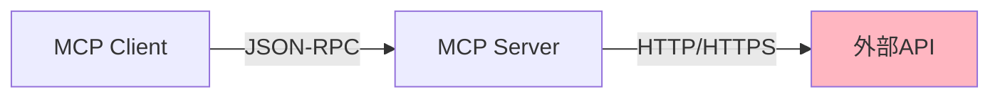
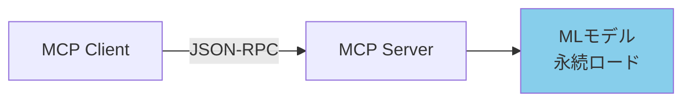
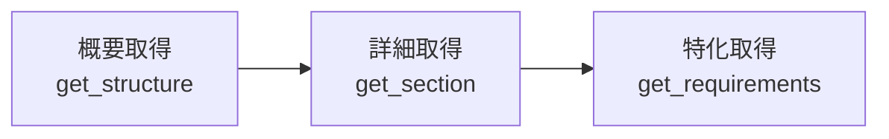
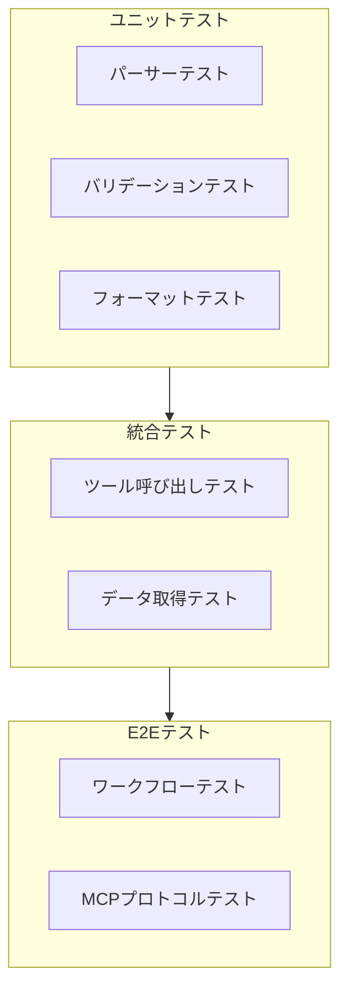
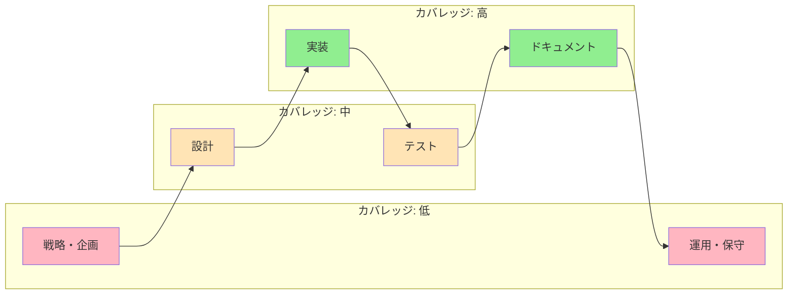

# MCP開発ガイド

> MCPサーバーの企画・設計・実装・公開までの実践的なガイド。

## このドキュメントについて

MCPサーバーを「使う」だけでなく「創る」ための実践ガイドである。7つのMCPサーバーの構築経験から得た知見を体系化し、企画段階での判断基準、設計時のアーキテクチャパターン、実装のベストプラクティス、npm公開までのフローをまとめている。

構築する前に「本当にMCPにすべきか？」という判断を行い、MCPにすべきと判断した場合に最短で高品質なサーバーを構築できるようにすることが目的である。

## 前提知識

このドキュメントを読む前に、以下を理解していることが望ましい。

- [MCP/Skills/Agentの構成論](../concepts/03-architecture.ja.md) — 三層アーキテクチャの全体像
- [MCP vs Skills 選択判断ガイド](../skills/vs-mcp.ja.md) — 何をMCPにすべきか
- [MCPセキュリティ](./security.ja.md) — OWASP MCP Top 10

## MCPにすべきかの判断

### 判断フロー

新しい機能が必要になったとき、MCPを構築すべきかどうかを以下のフローチャートで判断できる。



### 判断基準チェックリスト

フローチャートに加えて、以下のチェックリストでも判断できる。

```markdown
## MCP構築の判断

### MCP化すべき条件（すべて Yes なら構築を検討）
- [ ] 外部データソースまたはAPIへのアクセスが必要
- [ ] 公式MCPが存在しない
- [ ] 公式CLIでは不十分（認証が複雑、機能が足りない等）
- [ ] 繰り返し使用する（1回限りではない）

### MCP化すべきでない条件（いずれか Yes なら別の手段）
- [ ] チーム内のガイドライン → Skill
- [ ] 静的な知識・原則 → Skill
- [ ] 公式CLIで十分 → CLI + Skill
- [ ] 単純な1回限りの処理 → スクリプト
```

> 詳細は [MCP vs Skills 選択判断ガイド](../skills/vs-mcp.ja.md) を参照

## 「ブレない参照先」に基づくMCP設計

### 核心思想

MCPの最大の価値は、AIに**権威ある情報源**への構造化されたアクセスを提供することにある。

```
MCPの価値 = 「ブレない参照先」× 構造化 × アクセシビリティ

AIが単独で生成する情報 → ハルシネーションのリスク
AIが「ブレない参照先」を参照 → 正確・検証可能な情報
```

### 参照先の4層ヒエラルキーとMCP

参照先の4層ヒエラルキーの中で、MCPが特に効果を発揮するのは層1・2である。

| 層 | 参照先 | MCP例 | 構築優先度 |
| --- | --- | --- | --- |
| 1 | 国際標準・法規制 | rfcxml-mcp, pdf-spec-mcp | 最高 |
| 2 | 業界標準・デファクト | w3c-mcp, (OpenAPI MCP) | 高 |
| 3 | 組織・プロジェクト規約 | — (Skillで対応) | — |
| 4 | ベストプラクティス | — (Skillで対応) | — |

**重要**: 層1・2はMCPに適しており、層3・4はSkillに適している。

> 詳細は [「ブレない参照先」の体系](../concepts/02-reference-sources.ja.md) を参照

## 設計フェーズ

### アーキテクチャパターン

構築済みMCPの経験から、以下の3つのアーキテクチャパターンを推奨する。

#### パターン1: ローカルデータ型

データをパッケージに内蔵し、外部通信なしで動作する。



| 特徴 | 説明 |
| --- | --- |
| **通信** | なし（オフライン動作） |
| **データ** | パッケージに内蔵 |
| **利点** | 高速、認証不要、プライバシー |
| **適用例** | epsg-mcp、pdf-spec-mcp |

#### パターン2: 外部API型

外部APIを呼び出して結果を構造化して返す。



| 特徴 | 説明 |
| --- | --- |
| **通信** | 外部APIへのHTTPリクエスト |
| **データ** | リアルタイム取得 |
| **利点** | 常に最新、大規模データ対応 |
| **適用例** | rfcxml-mcp（RFC Editor XML）、w3c-mcp |

#### パターン3: モデルロード型

MLモデルをロードして推論を実行する。



| 特徴 | 説明 |
| --- | --- |
| **通信** | なし（ローカル推論） |
| **データ** | モデルに内蔵 |
| **利点** | 外部依存なし、高速推論（ウォームアップ後） |
| **適用例** | xcomet-mcp-server |

### ツール設計の原則

#### 1. 単一責任

1ツール = 1つの明確な責務。

```typescript
// ✅ 良い例：責務が明確
get_rfc_structure    // セクション階層のみ
get_requirements     // MUST/SHOULD要件のみ
validate_statement   // 準拠検証のみ

// ❌ 悪い例：責務が曖昧
get_rfc_everything   // 全部入り
```

#### 2. 段階的詳細化

概要 → 詳細 の順に情報を取得できるツール設計。



```typescript
// Step 1: 構造を把握
get_rfc_structure(6455)          // → セクション一覧

// Step 2: 特定セクションを深掘り
get_section(6455, "5.2")         // → セクション内容

// Step 3: 要件を抽出
get_requirements(6455, "MUST")   // → MUST要件のみ
```

#### 3. 入力検証

すべてのツール入力にバリデーションを実装する。

```typescript
const schema = {
  type: 'object',
  properties: {
    rfc: {
      type: 'number',
      minimum: 1,
      maximum: 99999,
      description: 'RFC番号'
    },
    level: {
      type: 'string',
      enum: ['MUST', 'SHOULD', 'MAY'],
      description: '要件レベル'
    }
  },
  required: ['rfc']
};
```

> セキュリティ面の詳細は [MCPセキュリティ](./security.ja.md) のMCP05（Command Injection）を参照

#### 4. レスポンス設計

構造化された出力と、人間に読みやすい出力の両方を提供する。

```typescript
// response_format パラメータで切り替え
tool: get_requirements
params:
  rfc: 6455
  response_format: "json"     // → 構造化データ
  // or
  response_format: "markdown" // → 人間向けMarkdown
```

### ツール数の目安

MCPサーバーの規模ごとのツール数の目安を以下に示す。

```
小規模MCP: 3-5 ツール（単一データソース）
中規模MCP: 5-10 ツール（複数のビュー提供）
大規模MCP: 10-15 ツール（3層構成など）

pdf-reader-mcp の例（15ツール）:
├── 基本操作層（5）: read_text, read_images, search_text, ...
├── 構造検査層（5）: inspect_structure, inspect_tags, ...
└── 検証・分析層（5）: validate_tagged, validate_metadata, ...
```

## 実装フェーズ

### 技術スタック

MCPサーバー開発で推奨する技術スタックは以下の通りである。

| 要素 | 推奨 | 理由 |
| --- | --- | --- |
| **言語** | TypeScript | 型安全性、MCP SDK対応 |
| **SDK** | `@modelcontextprotocol/sdk` | 公式SDK |
| **ビルド** | tsup / esbuild | 高速ビルド |
| **テスト** | Vitest | TypeScript親和性 |
| **パッケージ管理** | npm | MCP配布の標準 |

### プロジェクト構成

推奨するプロジェクトのディレクトリ構成を以下に示す。

```
my-mcp/
├── src/
│   ├── index.ts              # エントリポイント
│   ├── server.ts             # MCPサーバー定義
│   ├── tools/                # ツール実装
│   │   ├── search.ts
│   │   ├── get-detail.ts
│   │   └── validate.ts
│   ├── data/                 # データ・パーサー
│   │   ├── loader.ts
│   │   └── parser.ts
│   └── utils/                # ユーティリティ
│       └── format.ts
├── tests/
│   ├── unit/
│   └── e2e/
├── package.json
├── tsconfig.json
├── vitest.config.ts
└── README.md
```

### 実装チェックリスト

実装の各段階で確認すべき項目を以下のチェックリストにまとめる。

```markdown
## 実装前
- [ ] ツール一覧とスキーマを定義
- [ ] 入力バリデーションルールを決定
- [ ] レスポンス形式（JSON / Markdown）を設計
- [ ] エラーハンドリング方針を決定

## 実装中
- [ ] OWASP MCP Top 10 を確認（特にMCP01, MCP05）
- [ ] 入力検証を全ツールに実装
- [ ] 構造化エラーレスポンスを実装
- [ ] ログに機密情報を含めない

## 実装後
- [ ] ユニットテストを作成（カバレッジ80%以上）
- [ ] E2Eテストを作成（主要フロー）
- [ ] README.mdを作成（ツール一覧、使用例）
- [ ] CHANGELOG.mdを作成
```

## テストフェーズ

### テスト戦略

MCPサーバーのテストは、ユニットテスト・統合テスト・E2Eテストの3層で構成する。



### テスト実績（参考値）

構築済みMCPのテスト実績を参考値として以下に示す。

| MCP | ユニット | E2E | 合計 |
| --- | --- | --- | --- |
| pdf-reader-mcp | 39 | 146 | 185 |
| rfcxml-mcp | — | — | — |
| epsg-mcp | — | — | — |

### E2Eテストの重要性

MCPサーバーは「ツール呼び出し → レスポンス」のインターフェースが命。E2Eテストで実際のMCPプロトコル経由のテストを行うことが品質保証の要。

```typescript
// E2Eテスト例
describe('rfcxml-mcp E2E', () => {
  it('should get RFC structure', async () => {
    const result = await callTool('get_rfc_structure', { rfc: 6455 });
    expect(result.sections).toBeDefined();
    expect(result.sections.length).toBeGreaterThan(0);
  });

  it('should extract MUST requirements', async () => {
    const result = await callTool('get_requirements', {
      rfc: 6455,
      level: 'MUST'
    });
    expect(result.requirements.length).toBeGreaterThan(0);
  });
});
```

## 公開フェーズ

### npm公開フロー

MCPサーバーのnpm公開までの流れを以下に示す。


### package.json の設計

npm公開に適したpackage.jsonの設計例を以下に示す。

```json
{
  "name": "@shuji-bonji/my-mcp",
  "version": "0.1.0",
  "description": "MCP server for ...",
  "type": "module",
  "bin": {
    "my-mcp": "dist/index.js"
  },
  "files": ["dist"],
  "keywords": ["mcp", "model-context-protocol"],
  "engines": {
    "node": ">=18"
  },
  "scripts": {
    "build": "tsup src/index.ts --format esm",
    "test": "vitest",
    "prepublishOnly": "npm run build && npm test"
  }
}
```

### バージョニング方針

セマンティックバージョニングに基づくバージョン管理方針を以下に示す。

| バージョン変更 | タイミング | 例 |
| --- | --- | --- |
| **patch** (0.0.x) | バグ修正、ドキュメント更新 | 0.1.0 → 0.1.1 |
| **minor** (0.x.0) | 新ツール追加、機能拡張 | 0.1.1 → 0.2.0 |
| **major** (x.0.0) | 破壊的変更、ツールスキーマ変更 | 0.9.0 → 1.0.0 |

### README.md の構成

良いREADMEは利用者の第一印象を決める。以下の構成を推奨する。

```markdown
# my-mcp

> 一行の説明

## Features（特徴）

## Quick Start（クイックスタート）

## Available Tools（利用可能ツール）

| Tool | Description |
|------|-------------|

## Examples（使用例）

## Configuration（設定）

## Development（開発）

## License
```

## 構築済みMCPから学んだ教訓

### 教訓1: データの前処理が品質を決める

rfcxml-mcpでは、RFC EditorのXMLを直接パースするのではなく、事前に構造化してからツールに渡す設計にした。これにより、レスポンス速度と精度が大幅に向上した。

### 教訓2: response_format は最初から設計する

pdf-reader-mcpでは途中から `response_format` パラメータを追加した。最初から「JSON（プログラム向け）とMarkdown（人間向け）の両方を出力する」設計にしておくべきだった。

### 教訓3: ツールの粒度は「段階的詳細化」

epsg-mcpの9ツールは、`search → detail → recommend → validate` という段階的な情報取得フローを設計した。ユーザーが必要な深さまでだけ掘り下げられるため、トークン消費が最適化される。

### 教訓4: E2Eテストは初期から

pdf-reader-mcpの185テスト（うちE2E 146件）は品質の証明になった。E2Eテストは「MCPプロトコル経由で期待通りに動く」ことの保証であり、リファクタリング時の安心感につながる。

### 教訓5: モデルロード型は初期化戦略が重要

xcomet-mcp-serverではMLモデルの永続ロードを採用した。初回起動は遅いが、2回目以降は高速に推論できる。起動時のプログレス表示やタイムアウト設定が重要。

## 開発フェーズごとのMCPカバレッジ

現在のMCPは主に「実装」フェーズをカバーしている。今後のカバレッジ拡大の方向性は以下の通り。



> 詳細は [開発フェーズ × MCP対応](../workflows/development-phases.ja.md) を参照

## 関連ドキュメント

MCP開発に関連するドキュメントを以下に示す。

- [構築済みMCPカタログ](./catalog.ja.md) — 構築済みMCPの一覧と詳細
- [MCPセキュリティ](./security.ja.md) — OWASP MCP Top 10
- [MCP/Skills/Agentの構成論](../concepts/03-architecture.ja.md) — 三層アーキテクチャ
- [MCP vs Skills 選択判断ガイド](../skills/vs-mcp.ja.md) — 何をMCPにすべきか
- [連携パターン・ワークフロー](../workflows/patterns.ja.md) — MCPを活用したワークフロー
- [アンチパターン集](../skills/anti-patterns.ja.md) — 避けるべきパターン

## 参考リンク

MCP開発で参考になる外部リンクを以下に示す。

- [Model Context Protocol 公式](https://modelcontextprotocol.io/)
- [MCP TypeScript SDK](https://github.com/modelcontextprotocol/typescript-sdk)
- [MCP Inspector](https://github.com/modelcontextprotocol/inspector) — MCPサーバーのデバッグツール
- [npm: @shuji-bonji](https://www.npmjs.com/~shuji-bonji) — 公開済みパッケージ
