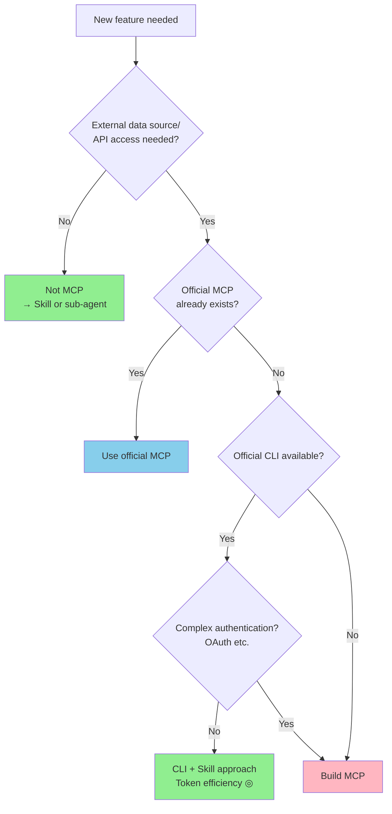
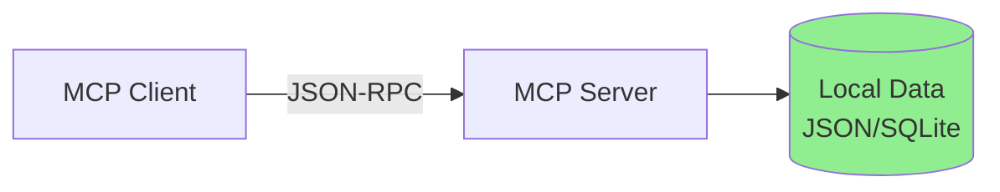
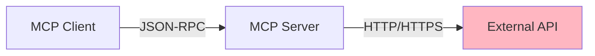
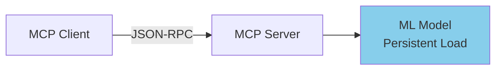
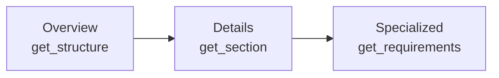
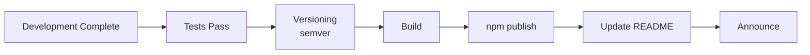
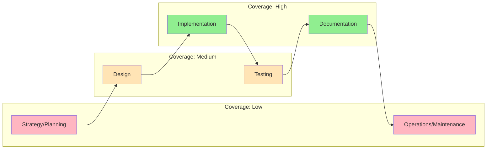

# MCP Development Guide

> A practical guide from planning and design through implementation to publishing MCP servers.

## About This Document

This is a practical guide for not just "using" MCP servers but "creating" them. Based on experience building 7 MCP servers, we have systematized the knowledge gained—including decision criteria at the planning stage, architectural patterns during design, best practices for implementation, and the workflow for npm publishing.

The goal is to make the decision of "should this really be an MCP?" before building, and if the answer is yes, to enable you to build a high-quality server in the shortest time possible.

## Prerequisites

Before reading this document, it is desirable to have an understanding of the following:

- [MCP/Skills/Agent Architecture](../concepts/03-architecture.md) — Overview of the three-tier architecture
- [MCP vs Skills Selection Guide](../skills/vs-mcp.md) — What should be MCP
- [MCP Security](./security.md) — OWASP MCP Top 10

## Decision: Should This Be MCP?

### Decision Flow



### Decision Criteria Checklist

```markdown
## MCP Development Decision

### Conditions When MCP Should Be Built (Consider building if all are Yes)
- [ ] Access to external data sources or APIs is required
- [ ] Official MCP does not exist
- [ ] Official CLI is insufficient (complex authentication, missing features, etc.)
- [ ] Used repeatedly (not just once)

### Conditions When MCP Should NOT Be Built (Use alternative if any is Yes)
- [ ] Team internal guidelines → Skill
- [ ] Static knowledge/principles → Skill
- [ ] Official CLI is sufficient → CLI + Skill
- [ ] Simple one-time processing → Script
```

> See [MCP vs Skills Selection Guide](../skills/vs-mcp.md) for details

## MCP Design Based on "Authoritative Reference Sources"

### Core Philosophy

The greatest value of MCP is providing AI with structured access to **authoritative information sources**.

```
MCP Value = "Authoritative Reference Sources" × Structured × Accessibility

Information generated by AI alone → Risk of hallucination
Information sourced from "authoritative reference sources" → Accurate, verifiable
```

### Four-Layer Hierarchy of Reference Sources and MCP

| Layer | Reference Source | MCP Example | Build Priority |
| --- | --- | --- | --- |
| 1 | International standards / Regulations | rfcxml-mcp, pdf-spec-mcp | Highest |
| 2 | Industry standards / De facto | w3c-mcp, (OpenAPI MCP) | High |
| 3 | Organization / Project guidelines | — (handled by Skill) | — |
| 4 | Best practices | — (handled by Skill) | — |

**Important**: Layers 1 and 2 are suited for MCP, while layers 3 and 4 are suited for Skills.

> See [Taxonomy of "Authoritative Reference Sources"](../concepts/02-reference-sources.md) for details

## Design Phase

### Architecture Patterns

Based on experience building MCPs, we recommend the following three architecture patterns.

#### Pattern 1: Local Data Type

Data is embedded in the package and operates without external communication.



| Characteristic | Description |
| --- | --- |
| **Communication** | None (offline operation) |
| **Data** | Embedded in package |
| **Advantages** | Fast, no authentication required, privacy |
| **Use Cases** | epsg-mcp, pdf-spec-mcp |

#### Pattern 2: External API Type

Calls external APIs and returns structured results.



| Characteristic | Description |
| --- | --- |
| **Communication** | HTTP requests to external APIs |
| **Data** | Fetched in real-time |
| **Advantages** | Always up-to-date, handles large-scale data |
| **Use Cases** | rfcxml-mcp (RFC Editor XML), w3c-mcp |

#### Pattern 3: Model Loading Type

Loads ML models and performs inference.



| Characteristic | Description |
| --- | --- |
| **Communication** | None (local inference) |
| **Data** | Embedded in model |
| **Advantages** | No external dependencies, fast inference (after warmup) |
| **Use Cases** | xcomet-mcp-server |

### Tool Design Principles

#### 1. Single Responsibility

One tool = One clear responsibility.

```typescript
// ✅ Good example: Clear responsibilities
get_rfc_structure    // Section hierarchy only
get_requirements     // MUST/SHOULD requirements only
validate_statement   // Compliance verification only

// ❌ Bad example: Ambiguous responsibilities
get_rfc_everything   // All-in-one
```

#### 2. Progressive Detail Discovery

Tool design that allows information retrieval in the order: overview → details.



```typescript
// Step 1: Understand structure
get_rfc_structure(6455)          // → List of sections

// Step 2: Deep dive into specific section
get_section(6455, "5.2")         // → Section content

// Step 3: Extract requirements
get_requirements(6455, "MUST")   // → MUST requirements only
```

#### 3. Input Validation

Implement validation for all tool inputs.

```typescript
const schema = {
  type: 'object',
  properties: {
    rfc: {
      type: 'number',
      minimum: 1,
      maximum: 99999,
      description: 'RFC number'
    },
    level: {
      type: 'string',
      enum: ['MUST', 'SHOULD', 'MAY'],
      description: 'Requirement level'
    }
  },
  required: ['rfc']
};
```

> For security details, see [MCP Security](./security.md) section MCP05 (Command Injection)

#### 4. Response Design

Provide both structured output and human-readable output.

```typescript
// Switch via response_format parameter
tool: get_requirements
params:
  rfc: 6455
  response_format: "json"     // → Structured data
  // or
  response_format: "markdown" // → Human-readable Markdown
```

### Tool Count Guidelines

```
Small MCP: 3-5 tools (single data source)
Medium MCP: 5-10 tools (multiple views)
Large MCP: 10-15 tools (3-tier structure)

Example: pdf-reader-mcp (15 tools)
├── Basic Operations Layer (5): read_text, read_images, search_text, ...
├── Structure Inspection Layer (5): inspect_structure, inspect_tags, ...
└── Validation/Analysis Layer (5): validate_tagged, validate_metadata, ...
```

## Implementation Phase

### Technology Stack

| Component | Recommended | Rationale |
| --- | --- | --- |
| **Language** | TypeScript | Type safety, MCP SDK support |
| **SDK** | `@modelcontextprotocol/sdk` | Official SDK |
| **Build** | tsup / esbuild | Fast builds |
| **Testing** | Vitest | TypeScript friendly |
| **Package Management** | npm | Standard for MCP distribution |

### Project Structure

```
my-mcp/
├── src/
│   ├── index.ts              # Entry point
│   ├── server.ts             # MCP server definition
│   ├── tools/                # Tool implementations
│   │   ├── search.ts
│   │   ├── get-detail.ts
│   │   └── validate.ts
│   ├── data/                 # Data and parsers
│   │   ├── loader.ts
│   │   └── parser.ts
│   └── utils/                # Utilities
│       └── format.ts
├── tests/
│   ├── unit/
│   └── e2e/
├── package.json
├── tsconfig.json
├── vitest.config.ts
└── README.md
```

### Implementation Checklist

```markdown
## Before Implementation
- [ ] Define tool list and schemas
- [ ] Determine input validation rules
- [ ] Design response format (JSON / Markdown)
- [ ] Decide on error handling policy

## During Implementation
- [ ] Review OWASP MCP Top 10 (especially MCP01, MCP05)
- [ ] Implement input validation for all tools
- [ ] Implement structured error responses
- [ ] Ensure logs don't contain sensitive information

## After Implementation
- [ ] Create unit tests (80%+ coverage)
- [ ] Create E2E tests (main flows)
- [ ] Create README.md (tool list, usage examples)
- [ ] Create CHANGELOG.md
```

## Testing Phase

### Test Strategy

```mermaid
graph TB
    subgraph Unit Tests
        PARSER[Parser Tests]
        VALIDATE[Validation Tests]
        FORMAT[Format Tests]
    end

    subgraph Integration Tests
        TOOL[Tool Call Tests]
        DATA[Data Retrieval Tests]
    end

    subgraph E2E Tests
        FLOW[Workflow Tests]
        MCP_PROTO[MCP Protocol Tests]
    end

    Unit Tests --> Integration Tests --> E2E Tests
```

### Test Results (Reference Values)

| MCP | Unit Tests | E2E | Total |
| --- | --- | --- | --- |
| pdf-reader-mcp | 39 | 146 | 185 |
| rfcxml-mcp | — | — | — |
| epsg-mcp | — | — | — |

### Importance of E2E Tests

The interface of an MCP server is everything—"tool call → response". Running E2E tests via actual MCP protocol is critical for quality assurance.

```typescript
// E2E test example
describe('rfcxml-mcp E2E', () => {
  it('should get RFC structure', async () => {
    const result = await callTool('get_rfc_structure', { rfc: 6455 });
    expect(result.sections).toBeDefined();
    expect(result.sections.length).toBeGreaterThan(0);
  });

  it('should extract MUST requirements', async () => {
    const result = await callTool('get_requirements', {
      rfc: 6455,
      level: 'MUST'
    });
    expect(result.requirements.length).toBeGreaterThan(0);
  });
});
```

## Publishing Phase

### npm Publishing Flow



### package.json Design

```json
{
  "name": "@shuji-bonji/my-mcp",
  "version": "0.1.0",
  "description": "MCP server for ...",
  "type": "module",
  "bin": {
    "my-mcp": "dist/index.js"
  },
  "files": ["dist"],
  "keywords": ["mcp", "model-context-protocol"],
  "engines": {
    "node": ">=18"
  },
  "scripts": {
    "build": "tsup src/index.ts --format esm",
    "test": "vitest",
    "prepublishOnly": "npm run build && npm test"
  }
}
```

### Versioning Policy

| Version Change | Timing | Example |
| --- | --- | --- |
| **patch** (0.0.x) | Bug fixes, documentation updates | 0.1.0 → 0.1.1 |
| **minor** (0.x.0) | New tools added, features enhanced | 0.1.1 → 0.2.0 |
| **major** (x.0.0) | Breaking changes, tool schema changes | 0.9.0 → 1.0.0 |

### README.md Structure

A good README determines first impressions of users. We recommend the following structure:

```markdown
# my-mcp

> One-line description

## Features

## Quick Start

## Available Tools

| Tool | Description |
|------|-------------|

## Examples

## Configuration

## Development

## License
```

## Lessons Learned from Built MCPs

### Lesson 1: Data Preprocessing Determines Quality

In rfcxml-mcp, instead of directly parsing RFC Editor XML, we designed it to structure the data first before passing it to tools. This significantly improved response speed and accuracy.

### Lesson 2: response_format Should Be Designed From the Start

In pdf-reader-mcp, we added the `response_format` parameter partway through. We should have designed it from the beginning to output both "JSON (for programs) and Markdown (for humans)".

### Lesson 3: Tool Granularity Should Enable Progressive Detail Discovery

The 9 tools in epsg-mcp were designed to follow a progressive information retrieval flow: `search → detail → recommend → validate`. This allows users to drill down only to the depth they need, optimizing token consumption.

### Lesson 4: E2E Tests From the Beginning

The 185 tests in pdf-reader-mcp (146 of which are E2E) serve as proof of quality. E2E tests guarantee that the tool "works as expected via the MCP protocol", providing confidence during refactoring.

### Lesson 5: Model Loading Type Requires Careful Initialization Strategy

xcomet-mcp-server uses persistent ML model loading. The first startup is slow, but subsequent inferences are fast. Progress display during startup and timeout settings are critical.

## MCP Coverage by Development Phase

Current MCPs mainly cover the "implementation" phase. The direction of future coverage expansion is as follows:



> See [Development Phases × MCP Support](../workflows/development-phases.md) for details

## Related Documents

- [Built MCP Catalog](./catalog.md) — List and details of built MCPs
- [MCP Security](./security.md) — OWASP MCP Top 10
- [MCP/Skills/Agent Architecture](../concepts/03-architecture.md) — Three-tier architecture
- [MCP vs Skills Selection Guide](../skills/vs-mcp.md) — What should be MCP
- [Integration Patterns and Workflows](../workflows/patterns.md) — Workflows utilizing MCP
- [Anti-patterns Collection](../skills/anti-patterns.md) — Patterns to avoid

## Reference Links

- [Model Context Protocol Official](https://modelcontextprotocol.io/)
- [MCP TypeScript SDK](https://github.com/modelcontextprotocol/typescript-sdk)
- [MCP Inspector](https://github.com/modelcontextprotocol/inspector) — Debugging tool for MCP servers
- [npm: @shuji-bonji](https://www.npmjs.com/~shuji-bonji) — Published packages
