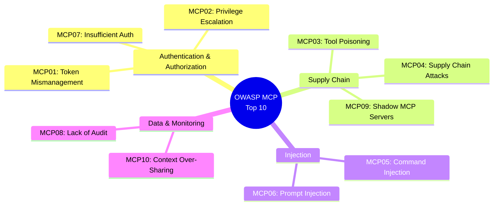
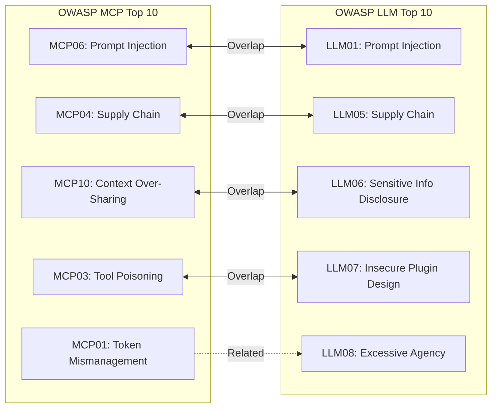
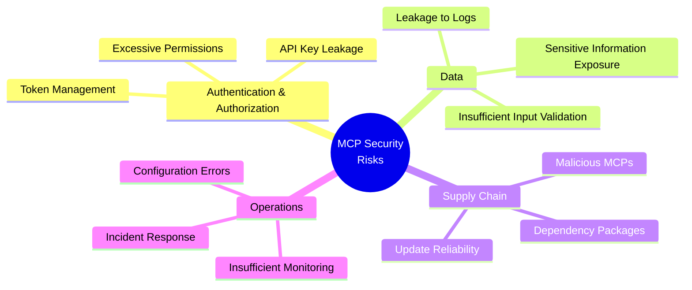
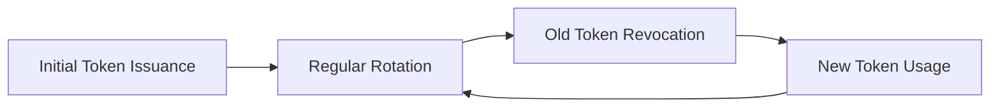
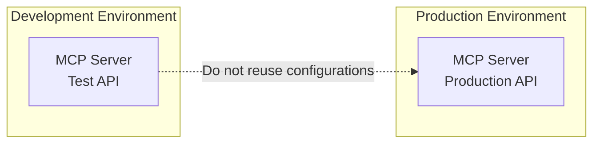
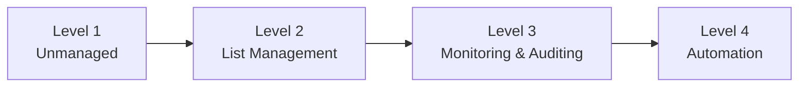

# Security Considerations for MCP Development

> Organizing security risks and countermeasures for MCP server development and operation.

## About This Document

MCP servers connect to external APIs and databases, which can lead to serious risks without proper security measures. According to LY Corporation's research, many MCPs rely on static API keys, indicating that security practices are still evolving.

This document organizes the main risk categories for MCP server development and operation, and provides specific countermeasures for each. It also leverages **OWASP MCP Top 10 (2025)** as a reliable reference and provides checklists that can be used during development.

## Reference: OWASP MCP Top 10

### Overview

We reference **OWASP MCP Top 10 (2025)** as the security guideline for MCP server development.

| Item           | Content                                   |
| -------------- | ----------------------------------------- |
| **URL**        | https://owasp.org/www-project-mcp-top-10/ |
| **Status**     | Phase 3 - Beta Release and Pilot Testing  |
| **License**    | CC BY-NC-SA 4.0                           |
| **Leaders**    | Vandana Verma Sehgal, Liran Tal           |

> **Note**: This is a separate project from the traditional "OWASP Top 10 (Web Application Vulnerabilities)" and is **a security guideline specifically for MCP server development**.

### Differences from OWASP Top 10

The following table highlights key differences between traditional OWASP Top 10 for web applications and the MCP-specific version.

| Item              | OWASP Top 10 (Traditional)  | OWASP MCP Top 10 (2025)             |
| ----------------- | --------------------------- | ----------------------------------- |
| **Target**        | Web Applications            | MCP Server Development              |
| **Vulnerability Examples** | SQLi, XSS, CSRF    | Token Mismanagement, Tool Poisoning |
| **Use Case**      | Web Security Audits         | Design Guidelines for MCP Development |

### OWASP MCP Top 10 List

The ten vulnerability categories are organized into thematic groups as illustrated below.



| ID        | Name                                        | Overview                                                                                          |
| --------- | ------------------------------------------- | ------------------------------------------------------------------------------------------------- |
| **MCP01** | Token Mismanagement & Secret Exposure       | Hardcoded credentials, long-lived tokens, credential leakage in logs                              |
| **MCP02** | Privilege Escalation via Scope Creep        | Privilege escalation through loose permission definitions, scope expansion                        |
| **MCP03** | Tool Poisoning                              | Context injection by malicious tools/plugins (rug pull, schema poisoning, tool shadowing)         |
| **MCP04** | Supply Chain Attacks & Dependency Tampering | Tampering with dependencies, modification of agent behavior                                       |
| **MCP05** | Command Injection & Execution               | System command execution through unvalidated input                                                |
| **MCP06** | Prompt Injection via Contextual Payloads    | Text-based injection attacks, attacks targeting the model                                         |
| **MCP07** | Insufficient Authentication & Authorization | Weak identity verification in multi-agent environments                                            |
| **MCP08** | Lack of Audit and Telemetry                 | Difficulty in incident response due to insufficient logging and monitoring                        |
| **MCP09** | Shadow MCP Servers                          | Unauthorized MCP deployment outside security governance (MCP version of Shadow IT)                |
| **MCP10** | Context Injection & Over-Sharing            | Sensitive information disclosure in shared context windows                                        |

### Detailed Vulnerabilities and Countermeasures

#### MCP01: Token Mismanagement & Secret Exposure

**Risk**: Credentials remain in source code, logs, and model memory

```typescript
// ❌ Bad example: Hardcoded
const API_KEY = 'sk-1234567890abcdef';

// ✅ Good example: Retrieved from environment variables
const API_KEY = process.env.DEEPL_API_KEY;
```

**Countermeasures**:

- Retrieve credentials from environment variables or secret management services
- Do not output credentials to logs
- Use short-lived tokens
- Implement token rotation

#### MCP02: Privilege Escalation via Scope Creep

**Risk**: Initially limited permissions expand over time

**Countermeasures**:

- Strictly follow the principle of least privilege
- Conduct regular permission reviews
- Explicitly define required permissions for each tool

#### MCP03: Tool Poisoning

**Risk**: Malicious MCP servers inject harmful information into the context

```
Attack patterns:
├── Rug Pull: Changes to malicious behavior after gaining trust
├── Schema Poisoning: Embedding malicious code in schema definitions
└── Tool Shadowing: Impersonating and replacing legitimate tools
```

**Countermeasures**:

- Only adopt MCPs from trusted sources
- Conduct source code reviews
- Manage through allowlists

#### MCP04: Supply Chain Attacks & Dependency Tampering

**Risk**: Dependencies are tampered with, modifying agent behavior

**Countermeasures**:

```bash
# Regular vulnerability checks
npm audit
pip-audit

# Use lock files
package-lock.json
poetry.lock
```

#### MCP05: Command Injection & Execution

**Risk**: Unvalidated input is executed as system commands

```typescript
// ❌ Bad example: Direct command execution
exec(`ls ${userInput}`);

// ✅ Good example: Input validation + escaping
const sanitizedInput = sanitize(userInput);
execFile('ls', [sanitizedInput]);
```

**Countermeasures**:

- Validate all inputs
- Use parameterized command execution
- Execute in sandbox environments

#### MCP06: Prompt Injection via Contextual Payloads

**Risk**: Malicious instructions embedded in text alter model behavior

**Countermeasures**:

- Input sanitization
- Context isolation
- Output validation

#### MCP07: Insufficient Authentication & Authorization

**Risk**: Weak identity verification in multi-agent environments

**Countermeasures**:

- Strong authentication mechanisms (OAuth 2.0 recommended)
- Mutual authentication between agents
- Principle of least privilege

#### MCP08: Lack of Audit and Telemetry

**Risk**: Insufficient logging and monitoring makes incident detection and response difficult

**Countermeasures**:

- Implement structured logging
- Configure monitoring and alerts
- Maintain audit trails

#### MCP09: Shadow MCP Servers

**Risk**: Unauthorized MCP servers operate outside security governance

**Countermeasures**:

- Maintain MCP server allowlists
- Conduct regular inventory audits
- Communicate security policies

#### MCP10: Context Injection & Over-Sharing

**Risk**: Sensitive information is unintentionally disclosed in shared context windows

**Countermeasures**:

- Minimize information added to context
- Mask sensitive information
- Consider context isolation

### Relationship with OWASP LLM Top 10

Since MCP works closely with LLMs, **OWASP LLM Top 10** (2025) is also an important reference.

> **Reference**: https://owasp.org/www-project-top-10-for-large-language-model-applications/

#### Overlapping and Related Vulnerabilities



| MCP Top 10                  | LLM Top 10                              | Relationship                                |
| --------------------------- | --------------------------------------- | ------------------------------------------- |
| MCP06: Prompt Injection     | LLM01: Prompt Injection                 | **Complete overlap** - Same threat          |
| MCP04: Supply Chain         | LLM05: Supply Chain Vulnerabilities     | **Complete overlap** - Dependency vulnerabilities |
| MCP10: Context Over-Sharing | LLM06: Sensitive Information Disclosure | **Highly related** - Sensitive information leakage paths |
| MCP03: Tool Poisoning       | LLM07: Insecure Plugin Design           | **Highly related** - Plugin/tool security   |
| MCP02: Privilege Escalation | LLM08: Excessive Agency                 | **Related** - Excessive permissions/autonomy |

#### LLM Top 10 Overview

The following table provides a summary of all ten LLM vulnerabilities and their relationship to MCP security concerns.

| ID    | Vulnerability                    | Overview                                      | MCP Related       |
| ----- | -------------------------------- | --------------------------------------------- | ----------------- |
| LLM01 | Prompt Injection                 | Manipulating model behavior through malicious input | MCP06             |
| LLM02 | Insecure Output Handling         | Improper handling of outputs                  | Tool output handling |
| LLM03 | Training Data Poisoning          | Contamination of training data                | -                 |
| LLM04 | Model Denial of Service          | Resource exhaustion attacks                   | Context exhaustion |
| LLM05 | Supply Chain Vulnerabilities     | Supply chain attacks                          | MCP04             |
| LLM06 | Sensitive Information Disclosure | Leakage of sensitive information              | MCP10             |
| LLM07 | Insecure Plugin Design           | Vulnerable plugin design                      | MCP03             |
| LLM08 | Excessive Agency                 | Excessive autonomy and permissions            | MCP02             |
| LLM09 | Overreliance                     | Excessive dependence on LLM outputs           | -                 |
| LLM10 | Model Theft                      | Theft of the model                            | -                 |

#### Why Both Should Be Referenced

Understanding both frameworks is essential for comprehensive security, as MCP development spans both MCP-specific concerns and broader LLM application security.

```
MCP server development requires both perspectives:

OWASP MCP Top 10
└── Security of the MCP server "itself"
    ├── Tool definition safety
    ├── Credential management
    └── Supply chain

OWASP LLM Top 10
└── Security of LLM applications "using" MCP
    ├── Prompt injection countermeasures
    ├── Output validation
    └── Permission restrictions
```

## Current State of MCP Security

### LY Corporation Research Findings

Results from LY Corporation's investigation of the MCP ecosystem are presented below, revealing important trends in authentication practices.

| Item                           | Percentage | Risk                                    |
| ------------------------------ | ---------- | --------------------------------------- |
| Requires some form of authentication | **88%**    | Credential management is necessary      |
| Relies on static API keys/PATs | **53%**    | Risk of long-lived token leakage        |
| Uses secure methods like OAuth | **8.5%**   | Most use legacy methods                 |

**Conclusion**: MCP server authentication is still evolving and requires careful management.

## Risk Categories (Traditional Organization)

MCP security risks can be organized into four major categories, as visualized in the following mind map.



## Risk 1: Authentication & Authorization

### Problems

- **Long-term use of static API keys** - High impact when leaked
- **Excessive permissions** - Requesting more scopes than necessary
- **Hardcoded credentials** - Written directly in source code

### Countermeasures

#### 1. Secure Credential Management

```bash
# ❌ Bad example: Hardcoded
export API_KEY="sk-1234567890abcdef"

# ✅ Good example: Environment variables (.env file in .gitignore)
# .env
DEEPL_API_KEY=${DEEPL_API_KEY}

# Even better: Secret management services
# AWS Secrets Manager, HashiCorp Vault, etc.
```

#### 2. Principle of Least Privilege

```markdown
## Permission Checklist for MCP Tool Design

- [ ] Is that permission really necessary?
- [ ] Don't request write permissions if read-only access is sufficient
- [ ] Minimize scope
```

#### 3. Token Rotation



## Risk 2: Data Security

### Problems

- **Sending sensitive information via MCP** - Unintended data exposure
- **Insufficient input validation** - Injection attacks
- **Sensitive information leakage to logs** - Credentials in debug logs

### Countermeasures

#### 1. Input Validation

```typescript
// Input validation example for MCP tool implementation
export const getRfcRequirements = {
	name: 'get_requirements',
	description: 'Get RFC requirements',
	inputSchema: {
		type: 'object',
		properties: {
			rfc: {
				type: 'number',
				minimum: 1,
				maximum: 99999, // Set reasonable range
				description: 'RFC number',
			},
			level: {
				type: 'string',
				enum: ['MUST', 'SHOULD', 'MAY'], // Limit allowed values
				description: 'Requirement level',
			},
		},
		required: ['rfc'],
	},
};
```

#### 2. Log Sanitization

```typescript
// ❌ Bad example
console.log(`API call: key=${apiKey}, query=${query}`);

// ✅ Good example
console.log(`API call: key=*****, query=${query}`);
```

#### 3. Sensitive Data Classification

```markdown
## Data Classification

### Data That Must Not Be Sent

- Credentials (API keys, passwords)
- Personal Identifiable Information (PII)
- Internal confidential information

### Data That May Be Sent

- Public specification references
- General technical information
- Anonymized data
```

## Risk 3: Supply Chain

### Problems

- **Malicious MCP servers** - Malware inclusion
- **Dependency package vulnerabilities** - npm/pip dependencies
- **Update reliability** - Compromised packages

### Countermeasures

#### 1. MCP Allowlist

Referencing LY Corporation's approach:

```markdown
## Approved MCP Server List

### Official / Trusted Sources

- @modelcontextprotocol/\* (Anthropic official)
- DeepL official MCP

### Self-developed (Internally audited)

- @shuji-bonji/rfcxml-mcp
- @shuji-bonji/xcomet-mcp-server

### Pending Approval

- (Under security review)

### Prohibited

- MCPs of unknown origin
- MCPs that send credentials externally
```

#### 2. Dependency Auditing

```bash
# Check vulnerabilities with npm audit
npm audit

# Regular updates
npm update

# Address critical vulnerabilities immediately
npm audit fix
```

#### 3. Source Code Review

```markdown
## Pre-deployment Checklist for MCP Servers

- [ ] Is the source code publicly available?
- [ ] Are credentials handled appropriately?
- [ ] Are there any suspicious external communications?
- [ ] Are the dependencies trustworthy?
- [ ] Is maintenance ongoing?
```

## Risk 4: Operational Security

### Problems

- **Configuration errors** - Misconfigurations in production
- **Insufficient monitoring** - Delayed anomaly detection
- **Incident response** - Inadequate response procedures

### Countermeasures

#### 1. Environment Isolation



#### 2. Logging & Monitoring

```markdown
## Items to Monitor

- [ ] Abnormal increase in API call volume
- [ ] Rising error rates
- [ ] Frequent authentication failures
- [ ] Access to unexpected endpoints
```

#### 3. Incident Response Procedures

```markdown
## MCP Security Incident Response

### 1. Detection

- Monitoring alerts
- User reports
- External notifications

### 2. Initial Response

- Immediately disable the affected MCP
- Revoke API keys/tokens
- Identify scope of impact

### 3. Investigation

- Log analysis
- Identify intrusion path
- Identify leaked data

### 4. Recovery

- Issue new credentials
- Fix configurations
- Re-enable the MCP

### 5. Prevention

- Root cause analysis
- Implement countermeasures
- Update procedures
```

## Security Checklist for MCP Development

### Design Phase

```markdown
- [ ] Is the principle of least privilege applied?
- [ ] Is the authentication method appropriate? (OAuth recommended)
- [ ] Is handling of sensitive data defined?
- [ ] Has OWASP MCP Top 10 been reviewed?
```

### Implementation Phase

```markdown
- [ ] Is input validation implemented? (MCP05 countermeasure)
- [ ] Are credentials not hardcoded? (MCP01 countermeasure)
- [ ] Are sensitive information not output to logs? (MCP01 countermeasure)
- [ ] Do error messages not contain internal information?
- [ ] Have dependencies been audited? (MCP04 countermeasure)
```

### Testing Phase

```markdown
- [ ] Has security testing been performed?
- [ ] Have dependency vulnerabilities been checked?
- [ ] Has behavior against abnormal input been verified?
- [ ] Has resistance to prompt injection been confirmed? (MCP06 countermeasure)
```

### Operations Phase

```markdown
- [ ] Is there a credential rotation plan?
- [ ] Are monitoring and alerts configured? (MCP08 countermeasure)
- [ ] Are incident response procedures in place?
- [ ] Are regular security reviews conducted?
- [ ] Is an MCP server allowlist maintained? (MCP09 countermeasure)
```

## Security Policy Example for CLAUDE.md

```markdown
# Security Policy

## References

- OWASP MCP Top 10: https://owasp.org/www-project-mcp-top-10/

## Prohibited MCPs

- MCP servers of unknown origin
- MCPs that send credentials externally

## Credential Handling

- Retrieve API keys from environment variables
- Do not output credentials to logs
- Do not hardcode credentials in code

## Data Handling

- Do not send personal information via MCP
- Anonymize internal confidential information before processing
```

## Summary

### Key Principles

These seven key principles form the foundation of MCP security best practices.

1. **Reference OWASP MCP Top 10** - The reliable reference for MCP server development
2. **Use only trusted MCPs** - Manage through allowlists
3. **Least privilege** - Grant only necessary permissions
4. **Secure credential management** - No hardcoding, implement rotation
5. **Input validation** - Validate all inputs
6. **Monitoring and logging** - Anomaly detection, but exclude sensitive information
7. **Incident response** - Prepare procedures in advance

### MCP Security Maturity

MCP security can be assessed through different maturity levels, with progression indicated in the following diagram.



Currently, aiming for **Level 2 (List Management)** is realistic.

## Reference Links

### OWASP Related

- [OWASP MCP Top 10](https://owasp.org/www-project-mcp-top-10/) - MCP Server Development Security
- [OWASP LLM Top 10](https://owasp.org/www-project-top-10-for-large-language-model-applications/) - LLM Application Security
- [OWASP API Security Top 10](https://owasp.org/API-Security/) - API Security
- [OWASP Top 10](https://owasp.org/www-project-top-ten/) - Web Application Security

### Other References

- [NIST AI Risk Management Framework](https://www.nist.gov/itl/ai-risk-management-framework) - AI Risk Management Framework
- [MITRE ATLAS](https://atlas.mitre.org/) - AI Threat Matrix
- [LY Corporation's MCP Use Cases](https://techblog.lycorp.co.jp/) - Enterprise MCP Operations
