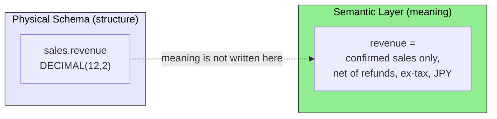
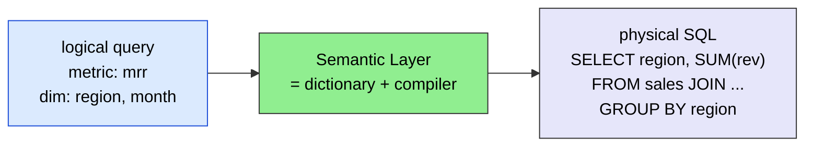
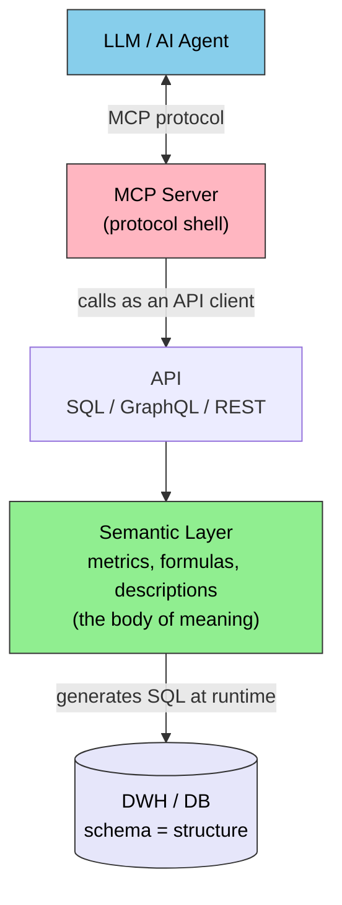
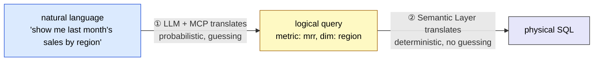
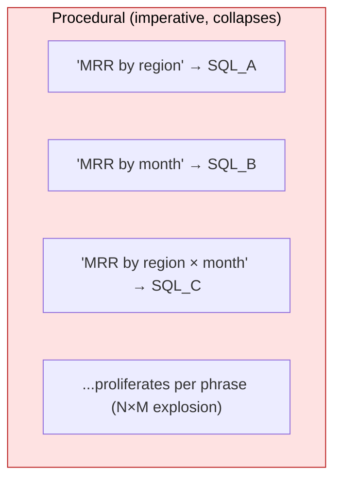
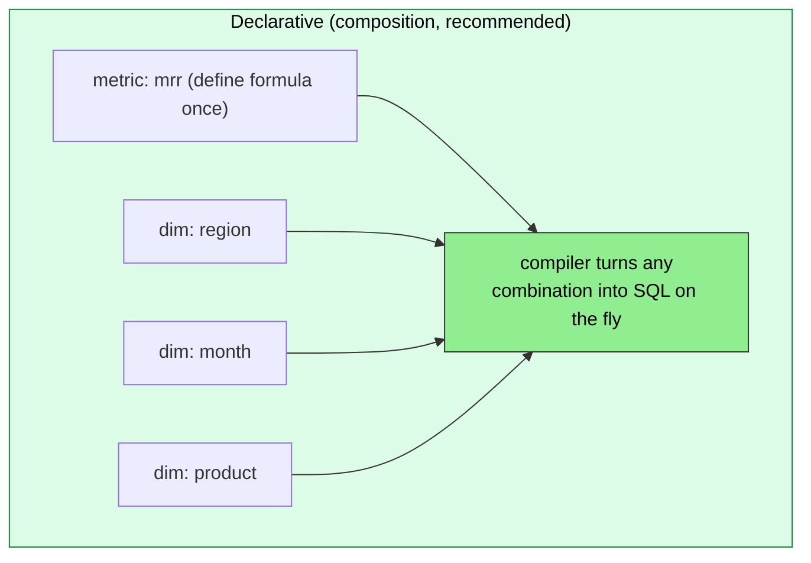
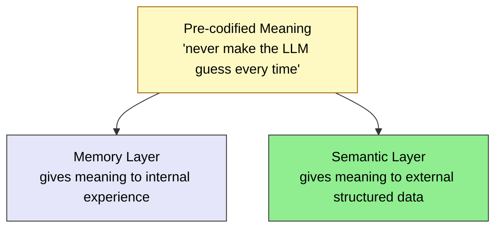

# Semantic Layer — Who Guarantees the Meaning of Structured Data

> A layer that guarantees "what the connected data means" from definitions, not from guesses

> [!NOTE]
> This page extends [`mcp/what-is-mcp`](./what-is-mcp) and [`mcp/security`](./security): once MCP has "connected" to an external DB / DWH, **who guarantees the meaning (business definitions) of that data, and how?**
>
> The Semantic Layer is **not a new layer in the 5-layer model**. It is a design discipline inserted at the boundary between the MCP layer and the external data source.

## Where This Page Sits

- **What it fixes**: the single source of truth for business definitions (metrics, dimensions, joins) over structured data
- **Out of scope**: search over unstructured data (PDFs, documents) — that is handled by Reference-type MCPs ([`mcp/what-is-mcp`](./what-is-mcp))
- **Depends on**: the existence of a schema (physical structure). The Semantic Layer paints a "map of meaning" on top of it
- **Common misuse**: treating it as "a collection of procedures, one SQL per phrase" (see "Declarative Composition" below)

## The Problem

[`mcp/what-is-mcp`](./what-is-mcp) defined MCP as "**a common protocol for AI agents to safely access external tools and data**." But "being able to access" and "**being able to query correctly with an understanding of meaning**" are two different problems.

When MCP connects raw to a DB / DWH, what is handed to the AI is only the **physical schema (tables and types)**.



Questions the schema cannot answer:

- Is `revenue` **gross or net of tax**? Are refunds deducted?
- Does "active user" mean someone who logged in within the **last how many days** (7? 30?)
- By **what formula** is "churn rate" computed (denominator = contracts at month start? average?)
- Through **which join path** should tables be combined, and what is the aggregation grain?

These **business definitions** usually live in engineers' heads or in SQL scattered across the codebase. **The schema describes structure but not meaning.** If you let the LLM guess here, it returns "whichever definition of revenue it finds first" — without knowing whether refunds, FX conversion, or prior-year accounting adjustments are accounted for.

> [!IMPORTANT]
> The mere fact that "MCP could connect to the DB" does not guarantee the correctness of the numbers the AI returns. Unless someone codifies the **layer of business definitions** that the schema lacks, all interpretation of meaning is left to the LLM's probabilistic guessing. This is the gap the Semantic Layer fills.

## What Is a Semantic Layer — A Logical-to-Physical Compiler

The Semantic Layer translates the user's **logical query (business vocabulary)** into **physical SQL (joins, aggregations, filters)** — essentially a **dictionary + compiler**.



The "dictionary" is the **semantic model** (a mapping of `mrr` → which columns, how to join, how to aggregate). It works in both directions:

- **Inbound**: business vocabulary → physical SQL (query rewriting)
- **Outbound**: physical column `rev_jpy_net` → logical label `MRR (JPY)`

A flavor of the definition (dbt MetricFlow):

```yaml
metrics:
  - name: mrr
    description: "Monthly recurring revenue (ex-tax, confirmed, net of refunds, JPY)"
    type: simple
    type_params:
      measure: subscription_revenue
```

## Relationship to MCP — MCP Is the Outer Shell, the Semantic Layer Is Inside

The **outermost** thing, closest to the LLM, is MCP. MCP is merely "a protocol shell for talking to the LLM." **Inside** that shell, MCP calls an API, and behind that sits the Semantic Layer.



So the path is **LLM → MCP (outer shell) → API → Semantic Layer (body of meaning) → DB (structure)**. Taking the dbt MCP Server as an example, it is a nested structure where `dbt MCP Server` (outer) calls the API of `dbt Semantic Layer` (inner).

> [!WARNING]
> It is a mistake to see the Semantic Layer as being "outside MCP." Precisely, it is **inserted between MCP and the DB**. If you wire MCP directly to a raw DB, the AI has no choice but to guess the meaning — so the design point is to interpose a layer of meaning in between.

## Two-Stage Translation — Dividing Probabilistic Interpretation and Deterministic Compilation

In an AI agent context there are two translation points. Separating them is the Semantic Layer's greatest benefit.



| Stage | Owner | Nature |
| --- | --- | --- |
| ① natural language → logical query | **LLM (+ MCP)** | Probabilistic, variable. But grounded by the Semantic Layer's metadata (metric list, descriptions) |
| ② logical query → physical SQL | **Semantic Layer** | **Deterministic.** The same logical query always produces the same SQL |

**Leave only the interpretation of meaning to the LLM, and fix SQL generation to a deterministic compiler.** That is the sweet spot. If you let the LLM write raw SQL directly, stage ② also becomes probabilistic and breaks — but the Semantic Layer makes ② deterministic.

> [!IMPORTANT]
> The effect is quantified. Grounding an LLM in a governed Semantic Layer raises accuracy on data questions from roughly **40% to over 83%**. With a layer on top, text-to-SQL goes from **32.7% to 64.5%**, and for questions within the Semantic Layer's scope it reaches **100%**. Looker's internal testing likewise reports that LookML cuts data errors in generative-AI natural-language queries by about **two-thirds versus raw SQL**.

## Declarative Composition — Not "a Collection of Per-Phrase Procedures"

It is a mistake to view the Semantic Layer as "a collection of procedures that register one SQL per specific phrase (a stored-procedure mindset)." That way, procedures proliferate with every combination of phrasing and collapse.

In reality, you **declare atomic building blocks (metrics, dimensions, joins) once**, and at query time they are **composed into SQL**. It is closer to a **grammar** than to per-phrase procedures.





Define `mrr` once and `region` / `month` / `product` once each, and "by region," "by month," "by region × month," "by product × month"... are all generated without adding definitions. You get **M metrics × D dimensions × filters** worth of combinations for free.

> [!TIP]
> For frontend developers, NgRX's `createSelector` is the closest analogy. You define `selectMrr` and `selectRegion` separately and **compose** them via `createSelector(...)` to build a new view. Instead of writing a procedure per screen, you **declare composable minimal units**. The Semantic Layer's metric / dimension is that selector idea brought into the SQL world. It is the same "composition of small declarative parts" as chaining RxJS operators with `pipe()`.

## Implementation Approaches

Implementations can be organized along two axes: "**what you write definitions in**" and "**how you expose them to AI / BI**."

| Approach | How definitions are written | Exposure | Characteristics |
| --- | --- | --- | --- |
| **dbt Semantic Layer (MetricFlow)** | YAML metrics on top of dbt models | SQL / GraphQL API | The most widely adopted vendor-neutral approach; layers on existing dbt assets |
| **Cube** | `*.cube.js` / YAML | SQL / REST / GraphQL / MDX | OSS, code-first; strong for embedded analytics |
| **LookML (Looker / Google)** | LookML language | Looker API / Looker Agents | Gemini integration enables LookML generation and querying from natural language |
| **Warehouse-native** | the DWH's own definition features | the DWH's query interface | Databricks Unity Catalog metrics, Snowflake semantic definitions, etc. |

### Exposure to AI Agents = MCP

Each platform has begun providing an **MCP Server**. This is the key touchpoint in this site's context.

- **dbt MCP Server** — translates natural language into governed MetricFlow requests
- **Cube / AtScale** also provide MCP implementations, exposing the Semantic Layer as a governed layer for AI agents
- **Microsoft Power BI Modeling MCP Server** — public preview released in November 2025; a move to open up to external agents

### Toward Standardization

**Open Semantic Interchange (OSI) v1.0** was published in January 2026 (a consortium of Snowflake, Databricks, AtScale, Qlik, and others). It is a standard that makes semantic definitions **portable across tools**, moving away from single-vendor lock-in.

## When to Adopt a Semantic Layer

| Situation | Judgment |
| --- | --- |
| The agent aggregates / analyzes **structured tabular data** (DWH / DB) | **SHOULD** adopt. Structurally prevents drift in meaning and [hallucination](../glossary#structural-problems) |
| Multiple teams / agents reference **the same metrics** | **SHOULD** adopt (the single source of truth guarantees consistency) |
| The main purpose is referencing unstructured data (documents, PDFs, specs) | **Not needed.** Handled by Reference-type MCPs ([`mcp/what-is-mcp`](./what-is-mcp)) |
| One-off, throwaway small queries where definition drift is harmless | **MAY** adopt (optional; beware over-engineering) |

> [!CAUTION]
> Avoid the over-application of "every DB access should go through a Semantic Layer." This is the same pitfall as "over-MCP-ification" in [`mcp/what-is-mcp`](./what-is-mcp). Focus on **analytical / aggregation queries** where drift in meaning causes real harm.

## Relationship to the Memory Layer — The Structured-Data Version of "Fixing Meaning"

The Semantic Layer is a **sibling concept** of the Memory layer discussed in [`part-3/memory`](../part-3/memory). Both derive from the same parent concept — **Pre-codified Meaning** — and diverge by whether the target is "internal experience" or "external structured data."



### Commonalities — Why They Are "Siblings"

| Shared structure | What it means |
| --- | --- |
| **Eliminating guessing** | Instead of making the LLM guess meaning every time, have it reference pre-codified definitions |
| **Overcoming scatter-gather** | Overcome the limits of a "fetch the data every time and let the LLM interpret it" design by fixing definitions up front |
| **Deterministic reference** | A fixed definition returns the same result no matter who queries it, or how many times |
| **Separation of concerns** | Separate "definition of meaning" from "LLM inference," so the definition side can be maintained independently |

### Differences — Where They Diverge

| Aspect | Memory Layer | Semantic Layer |
| --- | --- | --- |
| What it gives meaning to | the agent's experience, dialogue, relationships (**internal**) | external structured data, tables, metrics (**external**) |
| Definitions it fixes | what to remember and how to relate it | metrics, dimensions, join rules |
| Typical embodiment | Knowledge Graph / memory files | semantic model (YAML / code) |
| Problem it mainly solves | loss of context, re-fetch cost | drift in meaning, hallucination |
| Placement | between the Agent and the persistent store | between MCP and the external DB |
| Probabilistic judgment left to the LLM | deciding what to recall | interpreting natural language → logical query (only stage ① above) |

> [!TIP]
> In a phrase: **Memory fixes "the meaning to recall," while the Semantic Layer fixes "the meaning to aggregate."** Both belong to the same lineage in that they take the uncertain job of "interpreting meaning" away from the LLM and delegate it to deterministic definitions.

## Related Documents

- [What is MCP](./what-is-mcp) — the MCP fundamentals this page builds on
- [MCP Security](./security) — safety at the connection boundary
- [Memory and Knowledge](../part-3/memory) — the sibling concept of persisting meaning
- [II.1 Five layers](../part-2/layers) — choosing between CLI / MCP / Skills

## Going deeper: why does the LLM guess meaning?

This page covered the **structure (What / How)** of the Semantic Layer. To understand **why** an LLM guesses (fabricates) meaning it was never given, from the structural constraints of LLMs, see the sister site.

- [understanding-llm / Part 1: Hallucination](https://shuji-bonji.github.io/understanding-llm-through-claude-code/part1/hallucination) — the structural reason LLMs produce "plausible but wrong definitions"
- [understanding-llm / Part 1: Knowledge Boundary](https://shuji-bonji.github.io/understanding-llm-through-claude-code/part1/knowledge-boundary) — the boundary problem of trying to fill in business definitions absent from training data

## References

- dbt Labs (2026). "Semantic Layer vs. Text-to-SQL: 2026 Benchmark Update." dbt Developer Blog. [docs.getdbt.com](https://docs.getdbt.com/blog/semantic-layer-vs-text-to-sql-2026) — quantitative comparison of text-to-SQL accuracy with a Semantic Layer (32.7%→64.5%, 100% within scope)
- dbt Labs (2025). "Introducing the dbt MCP Server." dbt Developer Blog. [docs.getdbt.com](https://docs.getdbt.com/blog/introducing-dbt-mcp-server) — an MCP server that translates natural language into governed MetricFlow requests
- Cube (2024). "Semantic Layer and AI: The Future of Data Querying with Natural Language." Cube Blog. [cube.dev](https://cube.dev/blog/semantic-layer-and-ai-the-future-of-data-querying-with-natural-language) — the design philosophy of using a Semantic Layer as the foundation for natural-language queries
- VentureBeat (2026). "Headless vs. native semantic layer: The architectural key to unlocking 90%+ text-to-SQL accuracy." [venturebeat.com](https://venturebeat.com/ai/headless-vs-native-semantic-layer-the-architectural-key-to-unlocking-90-text) — accuracy gains from a governed layer (roughly 40%→83%+)
- Databricks (2026). "Semantic Layer Architecture: Components, Design Patterns, and AI Integration." Databricks Blog. [databricks.com](https://www.databricks.com/blog/semantic-layer-architecture-components-design-patterns-and-ai-integration) — Semantic Layer components and AI integration patterns
- Atlan (2026). "Best Semantic Layer Tools For BI and AI Agents." [atlan.com](https://atlan.com/know/best-semantic-layer-tools/) — comparison of major tools and the OSI standard (Snowflake, Databricks, AtScale, Qlik; January 2026)

---

> **Next**: [MCP Development Guide](./development)
> **Previous**: [MCP Security](./security)

**Last updated**: June 2026
