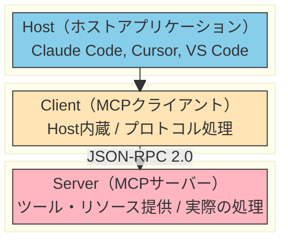
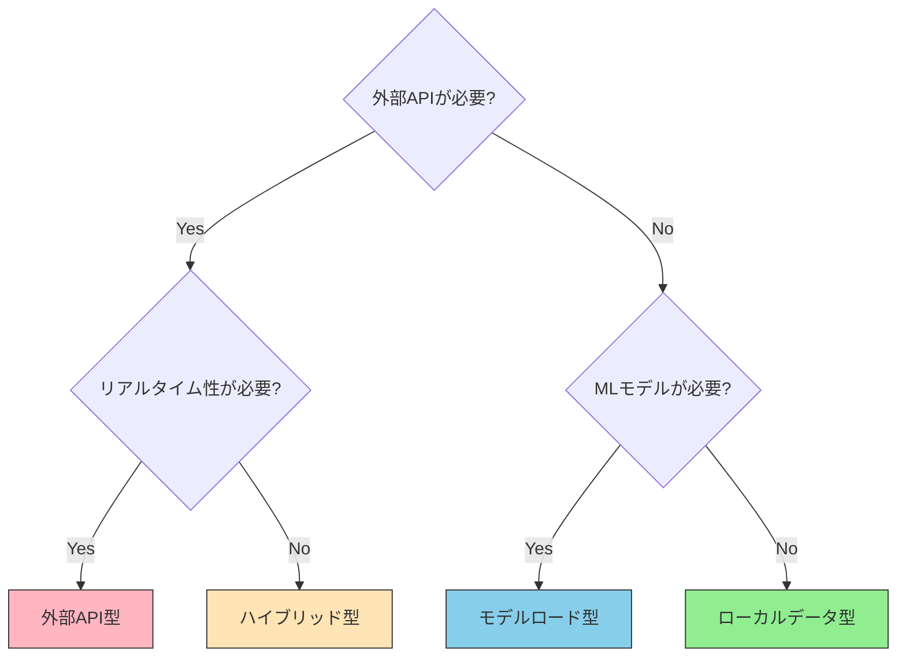

# MCPとは何か

> AIエージェントが外部ツールやデータに安全にアクセスするための標準プロトコル

## このドキュメントについて

MCPの基本概念、種類、メリット・デメリットを包括的に解説する。MCPを初めて学ぶ場合はここから始め、具体的な構築方法は [development.md](./development.md) を参照してください。

## MCPとは何か

**MCP（Model Context Protocol）** は、Anthropicが主導するオープン標準プロトコルである。

一言で言うなら、「**AIエージェントが外部ツール・データに安全にアクセスするための共通プロトコル**」である。

### USB-Cの比喩

USB-Cが様々なデバイス（マウス、キーボード、外付けドライブ等）とPCを1つの規格で接続するように、MCPは様々なツール・サービス（RFC仕様、翻訳API、法令DB等）とAIを1つのプロトコルで接続する。

### 本質：AIに「手」を与える仕組み

AIはテキスト入出力に優れているが、デフォルトではネットワークアクセスやファイル操作といった「外部とのインタラクション」ができない。MCPはこの制限を標準化された方法で解決し、AIに「手」を与える仕組みである。

## なぜMCPが必要か

### 課題：AIの知識限界と動的データへのアクセス不可

AIは学習データの範囲内でしか回答できない。

例えば、

- 最新のRFC仕様（RFC 6455以降）を知らない
- DeepLやGoogleTranslateなどの翻訳サービスを使えない
- 法令DBや特定の知識ベースを検索できない

### MCP以前：N×M問題

MCP以前は、各AIツール（Claude Code、Cursor、VS Code等）が各サービス（RFC、翻訳、法令等）と個別に統合する必要があった。

```
N個のAIツール × M個のサービス = N×M個の統合が必要
```

### MCP以後：N+M問題に削減

MCPの標準化により、各サービスが1つのMCPサーバーを公開すれば、すべてのAIツールで自動的に利用可能になる。

```
N個のAIツール + M個のMCPサーバー = N+M個の実装で完結
```

## MCPの3層構造

MCPは3層の明確な役割分担で構成される。



### 各層の役割と開発者の関わり

各層がどのような役割を担い、開発者としてどこに関わるかを以下にまとめる。

| 層         | 役割                                        | 例                           | 開発者の関わり   |
| ---------- | ------------------------------------------- | ---------------------------- | ---------------- |
| **Host**   | UI、セッション管理、ユーザーインタフェース  | Claude Code, Cursor, VS Code | 使う側           |
| **Client** | JSON-RPC通信処理、リクエスト/レスポンス変換 | Host内蔵                     | 通常は意識しない |
| **Server** | ツール/リソース提供、実際の処理実装         | rfcxml-mcp, deepl-mcp        | **作る側**       |

### 重要なポイント

**MCPサーバーを開発する立場では、Serverレイヤーのみを実装する。** ClientはHostに内蔵されているため、プロトコル詳細を意識する必要はない。

## MCPの種類・カテゴリ分類

MCPサーバーは、データ取得方法や処理パターンにより4つのカテゴリに分類される。

| パターン             | 特徴                                   | 例                                 |
| -------------------- | -------------------------------------- | ---------------------------------- |
| **ローカルデータ型** | 外部通信なし、データをパッケージに内包 | epsg-mcp, pdf-spec-mcp             |
| **外部API型**        | HTTP/HTTPSで外部APIと通信              | rfcxml-mcp, w3c-mcp, hourei-mcp    |
| **モデルロード型**   | 機械学習モデルをロードしてローカル推論 | xcomet-mcp-server                  |
| **ハイブリッド型**   | 複数パターンの組み合わせ               | pdf-reader-mcp（ローカル+URL取得） |

### 選定フローチャート

新しいMCPサーバーを構築する際、どのカテゴリに当てはまるかは以下のフローチャートで判断できる。



## MCPサーバーが提供する主要機能

MCPサーバーは3つのコア機能を提供する。

### Tools（ツール）- 最も一般的

AI が呼び出せる関数。リモートプロシージャコール（RPC）的な仕組み。

**例：**

- `rfcxml:get_rfc_structure` - RFC仕様の構造を取得
- `deepl:translate-text` - テキストを翻訳
- `xcomet:xcomet_evaluate` - 翻訳品質を評価

### Resources（リソース）

AIが読み取れるデータソース。URIベースでアクセス可能。

**例：**

- `file:///path/to/data` - ファイルシステムのデータ
- `rfc://6455` - RFC仕様書本体

### Prompts（プロンプトテンプレート）

再利用可能なプロンプト定義。一連の作業フローをテンプレート化。

**例：**

- 翻訳品質評価用テンプレート
- コードレビュー用テンプレート

### 機能比較表

これら3つの機能の違いを以下の表に整理する。

| 機能          | データ方向  | 説明                           | 利用頻度       |
| ------------- | ----------- | ------------------------------ | -------------- |
| **Tools**     | AI → Server | AIがサーバーの関数を呼ぶ       | ★★★ 最も一般的 |
| **Resources** | Server → AI | サーバーがUIなしでデータを提供 | ★★ 中程度      |
| **Prompts**   | Server → AI | テンプレート提供               | ★ 限定的       |

## 追加ユーティリティ機能

MCPプロトコルには、コア機能（Tools/Resources/Prompts）に加えて以下のユーティリティ機能が定義されている。すべてが必須ではないが、高度なユースケースで有用になる。

### Sampling

サーバーが逆方向でAIに推論を依頼する機能。複雑な判断をAIに委譲したい場合に有用。

### Roots

サーバーがアクセスできるファイルシステムの範囲を制限する機能。セキュリティの観点から重要。

### Logging

構造化ログ出力。デバッグやモニタリング用。

### Progress

長時間処理の進捗報告。ユーザーエクスペリエンス向上のため。

### 実装のポイント

多くのMCPサーバーは **Toolsのみで十分機能する。** 追加機能は必要に応じて段階的に追加するアプローチが効率的。

## メリット

MCPを採用することで、以下のメリットが得られる。

- ✅ **標準化**  
  一度作れば複数のAIホスト（Claude Code, Cursor, VS Code等）で利用可能。プロトコルの統一により、各ツール側の統合コストが大幅削減。

- ✅ **再利用性**  
  npmで公開すれば誰でも `npx` で即座に利用開始可能。デプロイと運用が非常に簡単。

- ✅ **動的処理**  
  リアルタイムのデータ取得・処理が可能。AIの知識の古さを補完。

- ✅ **権威性**  
  RFC原文、法令DB等の「ブレない参照先」に直接アクセス。AIの幻覚を低減。

- ✅ **関心の分離**  
  ツール側のロジックとAI側のロジックが明確に分離。両者の変更の影響が限定的。

## デメリット・リスク

一方で、MCPには注意すべきデメリットとリスクもある。

- ❌ **コンテキスト消費**
  ツール定義の読み込みだけでトークンを消費。特にツール数が多い場合、コンテキストウィンドウを圧迫する可能性あり。

- ❌ **起動コスト**
  サーバープロセスの起動・管理が必要。シンプルなケースでは過剰複雑度を招く。

- ❌ **セキュリティリスク**
  入力検証不足や権限管理の誤りが深刻な被害に。詳細は [security.md](./security.md) 参照。

- ❌ **メンテナンスコスト**
  外部APIの変更への追従が必要。長期運用を考慮した設計が必須。

- ❌ **過剰MCP化**
  すべてをMCP化する誘惑に注意。CLI + Skillで十分なケースも多い。

### Key Insight

> 公式CLIがあるサービス（gh, aws, gcloud等）は MCPなし、**CLI + Skill** が効率的である。判断軸は [03-architecture.md](../concepts/03-architecture.md)「CLI vs MCP」を参照。

## このリポジトリでのMCP実績

このai-agent-toolkitリポジトリでは、MCPの実践的な開発と運用の知見を蓄積している。

### 自作MCP（npm公開済み）

7つのMCPサーバーを設計・実装・公開

- **rfcxml-mcp** - IETF RFC仕様の検索・取得
- **w3c-mcp** - W3C/WHATWG Web仕様の検索・参照
- **xcomet-mcp** - 翻訳品質評価（機械学習モデル利用）
- **rxjs-mcp** - RxJS操作ガイド・コード実行
- **epsg-mcp** - 座標参照系（CRS）の検索・変換
- **pdf-spec-mcp** - PDF仕様（ISO 32000）の検索
- **pdf-reader-mcp** - PDF読み込み・テキスト抽出

### 連携MCP（外部開発）

5つのMCPサーバーと連携・拡張

- **deepl-mcp** - DeepL翻訳API
- **hourei-mcp** - 日本法令データベース
- **mermaid-mcp** - Mermaid図生成
- **svelte-mcp** - Svelte 5ドキュメント
- **shadcn-svelte-mcp** - shadcn/ui v4コンポーネント

### さらに詳しく

MCP一覧・詳細仕様は [catalog.md](./catalog.md) を参照。

## 次に読むべきドキュメント

MCPについてさらに深く学ぶために、以下のドキュメントを参照してほしい。

| 目的                         | ドキュメント                                         |
| ---------------------------- | ---------------------------------------------------- |
| **MCPを作りたい**            | [development.md](./development.md)                   |
| **構築済みMCPを見たい**      | [catalog.md](./catalog.md)                           |
| **セキュリティを理解したい** | [security.md](./security.md)                         |
| **Skills/A2Aとの使い分け**   | [03-architecture.md](../concepts/03-architecture.md) |
| **Skillsについて知りたい**   | [what-is-skills.md](../skills/what-is-skills.md)     |

**最終更新:** 2026-02-12
**リポジトリ:** [ai-agent-toolkit](https://github.com/shuji/ai-agent-toolkit)
