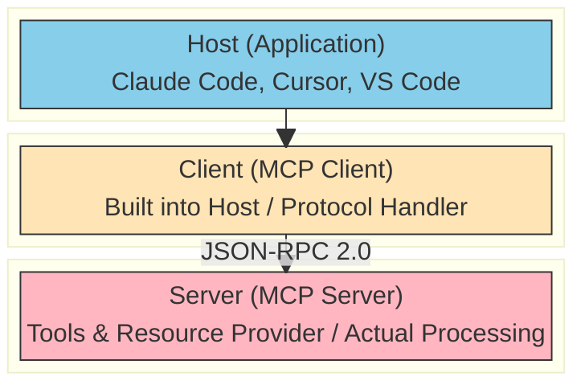
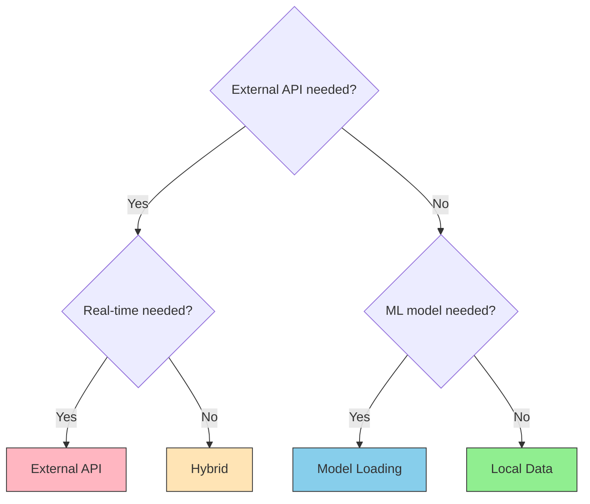

# What is MCP?

> A standard protocol for AI agents to safely access external tools and data

## About This Document

This guide covers the core concepts, categories, and trade-offs of MCP. If you're new to MCP, start here. For hands-on implementation details, see [development.md](./development.md).

## What is MCP?

**MCP (Model Context Protocol)** is an open standard protocol led by Anthropic.

In short: **a common protocol that enables AI agents to safely access external tools and data.**

### The USB-C Analogy

Just as USB-C connects various devices (mice, keyboards, external drives) to a PC with one standard, MCP connects various tools and services (RFC specifications, translation APIs, legal databases) to AI with one protocol.

### The Essence: Giving AI a "Hand"

AI excels at text input and output, but by default it cannot interact with the outside world—no network access, no file operations. MCP standardizes this gap and gives AI the tools it needs to act.

## Why MCP?

### The Problem: AI's Knowledge Cutoff and Dynamic Data

AI can only answer within its training data. For example:

- It doesn't know the latest RFC specifications (RFC 6455 and beyond)
- It cannot use translation services like DeepL or Google Translate
- It cannot search legal databases or proprietary knowledge bases

### Before MCP: The N×M Problem

Before MCP, each AI tool (Claude Code, Cursor, VS Code) had to individually integrate with each service (RFC, translation, legal databases).

```
N AI tools × M services = N×M integrations needed
```

### After MCP: Reduced to N+M

With MCP standardization, each service publishes one MCP server, and all AI tools automatically gain access to it.

```
N AI tools + M MCP servers = N+M implementations total
```

## MCP's Three-Layer Architecture

MCP has three clearly defined layers with distinct roles.



### Roles and Developer Involvement

The following table summarizes each layer's responsibilities and how developers interact with them.

| Layer      | Role                                              | Example                      | Developer Role      |
| ---------- | ------------------------------------------------- | ---------------------------- | ------------------- |
| **Host**   | UI, session management, user interface            | Claude Code, Cursor, VS Code | User                |
| **Client** | JSON-RPC communication, request/response handling | Built into Host              | Usually transparent |
| **Server** | Tool/resource provision, actual implementation    | rfcxml-mcp, deepl-mcp        | **You build this**  |

### Key Insight

**When developing an MCP server, you only implement the Server layer.** The Client is built into the Host, so you don't need to worry about protocol details.

## MCP Categories

MCP servers are classified into four categories based on data sourcing and processing patterns.

| Pattern           | Characteristics                                    | Examples                           |
| ----------------- | -------------------------------------------------- | ---------------------------------- |
| **Local Data**    | No external communication; data bundled in package | epsg-mcp, pdf-spec-mcp             |
| **External API**  | Communicates with external APIs via HTTP/HTTPS     | rfcxml-mcp, w3c-mcp, hourei-mcp    |
| **Model Loading** | Loads ML models for local inference                | xcomet-mcp-server                  |
| **Hybrid**        | Combination of multiple patterns                   | pdf-reader-mcp (local + URL fetch) |

### Selection Flowchart

When building a new MCP server, use the following flowchart to determine which category applies.



## Core Features of MCP Servers

MCP servers provide three core capabilities.

### Tools - The Most Common

Functions that AI can invoke, similar to Remote Procedure Calls (RPC).

**Examples:**

- `rfcxml:get_rfc_structure` - Fetch RFC specification structure
- `deepl:translate-text` - Translate text
- `xcomet:xcomet_evaluate` - Evaluate translation quality

### Resources

Data sources that AI can read, accessed via URI.

**Examples:**

- `file:///path/to/data` - File system data
- `rfc://6455` - RFC specification document

### Prompts

Reusable prompt templates, formalized as repeatable workflows.

**Examples:**

- Translation quality evaluation template
- Code review template

### Feature Comparison

The following table contrasts these three capabilities.

| Feature       | Data Direction | Description                     | Usage Frequency |
| ------------- | -------------- | ------------------------------- | --------------- |
| **Tools**     | AI → Server    | AI calls server functions       | ★★★ Most common |
| **Resources** | Server → AI    | Server provides data without UI | ★★ Moderate     |
| **Prompts**   | Server → AI    | Template provision              | ★ Limited       |

## Additional Utility Features

Beyond the core capabilities (Tools/Resources/Prompts), MCP defines several utility features. None are mandatory, but they become valuable for advanced use cases.

### Sampling

Server requests AI inference in reverse. Useful when delegating complex decisions to the AI.

### Roots

Limits the file system scope that the server can access. Critical for security.

### Logging

Structured log output for debugging and monitoring.

### Progress

Progress reporting for long-running operations to improve user experience.

### Implementation Note

Most MCP servers function perfectly with **Tools alone.** Add features incrementally as needed.

## Benefits

Adopting MCP provides the following advantages.

- ✅ **Standardization**  
  Once built, your server works with multiple AI hosts (Claude Code, Cursor, VS Code). Protocol unification drastically reduces integration costs.

- ✅ **Reusability**  
  Publish on npm and users can start using it instantly with `npx`. Deployment and maintenance are simple.

- ✅ **Dynamic Processing**  
  Enable real-time data fetching and processing. Complement AI's knowledge cutoff.

- ✅ **Authority**  
  Direct access to authoritative sources (RFC originals, legal databases). Reduces AI hallucinations.

- ✅ **Separation of Concerns**  
  Tool logic and AI logic are cleanly separated. Changes have limited scope.

## Drawbacks and Risks

MCP also comes with trade-offs and risks to be aware of.

- ❌ **Context Consumption**  
  Tool definitions consume tokens just to load. With many tools, context window pressure becomes real.

- ❌ **Startup Overhead**  
  Requires server process management. Overkill for simple cases.

- ❌ **Security Risks**  
  Input validation gaps or permission misconfigurations can cause serious damage. See [security.md](./security.md) for details.

- ❌ **Maintenance Cost**  
  You must track external API changes. Long-term sustainability requires careful design.

- ❌ **Over-MCP-ification**  
  Resist the temptation to MCP everything. CLI + Skills often suffice.

### Key Insight

> Services with official CLIs (gh, aws, gcloud) are better served by **CLI + Skills**, not MCP. See [03-architecture.md](../concepts/03-architecture.md) ("CLI vs MCP") for the decision framework.

## MCP Implementations in This Repository

The ai-agent-architecture repository accumulates practical knowledge from developing and operating MCPs.

### Custom MCPs (Published on npm)

Seven MCP servers designed, implemented, and released:

- **rfcxml-mcp** - Search and fetch IETF RFC specifications
- **w3c-mcp** - Search and reference W3C/WHATWG web specifications
- **xcomet-mcp** - Evaluate translation quality (uses machine learning models)
- **rxjs-mcp** - RxJS operator guide and code execution
- **epsg-mcp** - Search and transform coordinate reference systems (CRS)
- **pdf-spec-mcp** - Search PDF specifications (ISO 32000)
- **pdf-reader-mcp** - Read and extract text from PDFs

### Integrated MCPs (External Development)

Five MCP servers we integrate and extend:

- **deepl-mcp** - DeepL translation API
- **hourei-mcp** - Japanese legal database
- **mermaid-mcp** - Mermaid diagram generation
- **svelte-mcp** - Svelte 5 documentation
- **shadcn-svelte-mcp** - shadcn/ui v4 components

### Learn More

See [catalog.md](./catalog.md) for the complete list and detailed specifications.

## What to Read Next

To dive deeper into MCP, explore the following documents.

| Goal                          | Document                                             |
| ----------------------------- | ---------------------------------------------------- |
| **Build an MCP**              | [development.md](./development.md)                   |
| **Explore built MCPs**        | [catalog.md](./catalog.md)                           |
| **Understand security**       | [security.md](./security.md)                         |
| **Choose between Skills/A2A** | [03-architecture.md](../concepts/03-architecture.md) |
| **Learn about Skills**        | [what-is-skills.md](../skills/what-is-skills.md)     |

**Last Updated:** 2026-02-12
**Repository:** [ai-agent-architecture](https://github.com/shuji-bonji/ai-agent-architecture)
