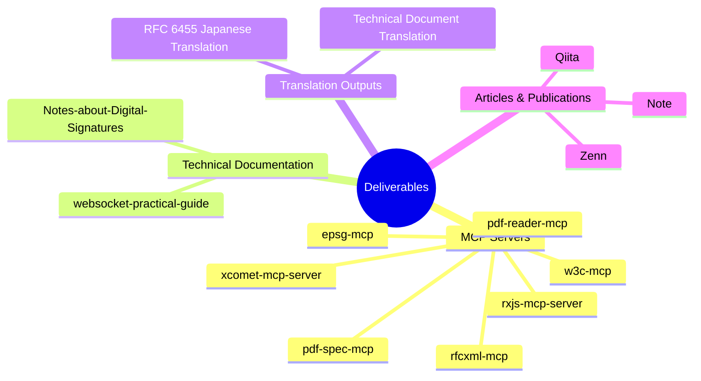
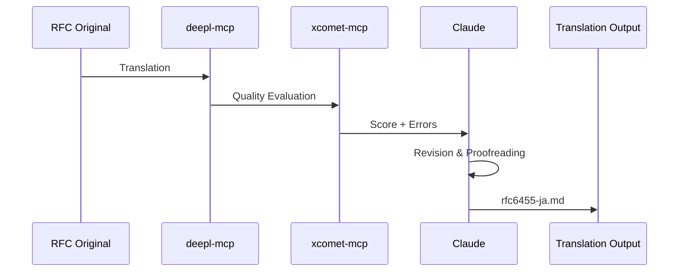
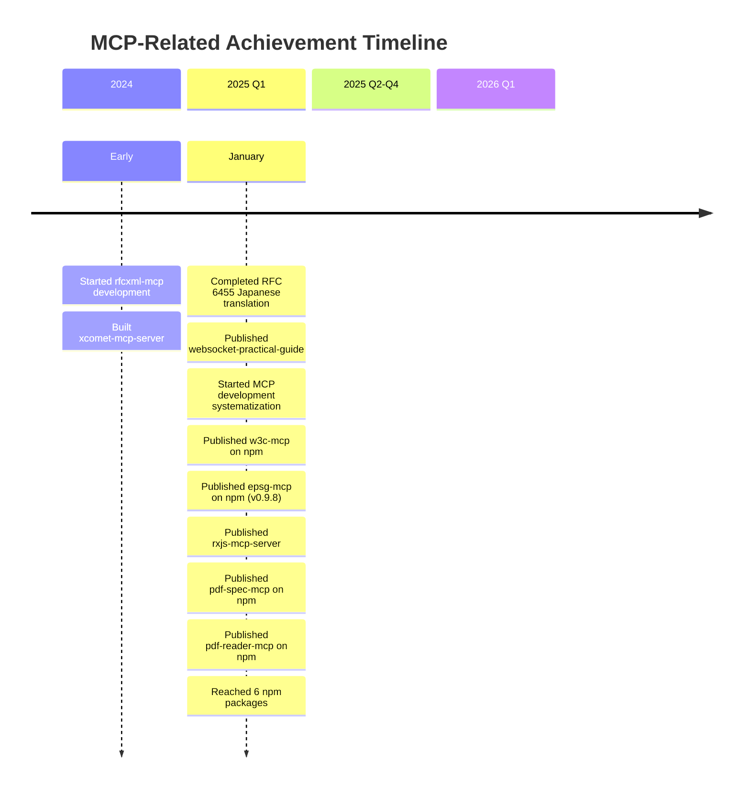

# Outputs and Achievements

[日本語版 (Japanese)](./outputs.ja.md)

> Documenting concrete deliverables from MCP development and utilization.

## About This Document

This document catalogs the concrete deliverables produced through MCP ecosystem development. It is organized into four categories: MCP servers, technical documentation, translation outputs, and technical articles, with each entry including an overview, repository URL, and quantitative metrics.

By visualizing "what was built" and "how much value was generated," this serves as a reference for future planning and as supporting material for external communications.

## Deliverable Categories



## 1. MCP Servers

### Public Repositories

| Repository                                                            | Description                        | Stars | npm                              | Version |
| --------------------------------------------------------------------- | ---------------------------------- | :---: | -------------------------------- | ------- |
| [rfcxml-mcp](https://github.com/shuji-bonji/rfcxml-mcp)               | IETF RFC Structured Reference      |   -   | `@shuji-bonji/rfcxml-mcp`        | v0.4.5  |
| [w3c-mcp](https://github.com/shuji-bonji/w3c-mcp)                     | W3C/WHATWG Web Standards           |   -   | `@shuji-bonji/w3c-mcp`           | v0.1.7  |
| [xcomet-mcp-server](https://github.com/shuji-bonji/xcomet-mcp-server) | Translation Quality Evaluation     |  ⭐1  | `xcomet-mcp-server`              | v0.3.6  |
| [rxjs-mcp-server](https://github.com/shuji-bonji/rxjs-mcp-server)     | RxJS Stream Execution & Analysis   |   -   | -                                | -       |
| [epsg-mcp](https://github.com/shuji-bonji/epsg-mcp)                   | EPSG Coordinate Reference Systems  |   -   | `@shuji-bonji/epsg-mcp`          | v0.9.8  |
| [pdf-spec-mcp](https://github.com/shuji-bonji/pdf-spec-mcp)           | PDF Specification (ISO 32000)      |   -   | `@shuji-bonji/pdf-spec-mcp`      | v0.2.2  |
| [pdf-reader-mcp](https://github.com/shuji-bonji/pdf-reader-mcp)       | PDF Internal Structure Analysis    |   -   | `@shuji-bonji/pdf-reader-mcp`    | v0.2.0  |

### MCP Server Features

#### rfcxml-mcp

```
Provided Functions:
├── get_rfc_structure    - Retrieve section hierarchy
├── get_requirements     - Extract MUST/SHOULD/MAY requirements
├── get_definitions      - Retrieve term definitions
├── get_rfc_dependencies - Retrieve reference relationships
├── generate_checklist   - Generate implementation checklist
└── validate_statement   - Verify specification compliance

Achievements:
- Requirements extraction from RFC 6455 (75 MUST, 23 SHOULD)
- Requirements extraction from RFC 3161
- Mapping correspondence with Japan's Electronic Signature Act
```

#### xcomet-mcp-server

```
Provided Functions:
├── xcomet_evaluate       - Quality score + error detection
├── xcomet_detect_errors  - Detailed error analysis
└── xcomet_batch_evaluate - Batch evaluation

Features:
- Persistent model loading (fast inference)
- GPU support
- Batch processing support

Achievements:
- Quality evaluation of 180-page technical document
- Completed at approximately $12 cost (less than 1/100 of conventional cost)
```

#### pdf-spec-mcp

```
Provided Functions:
├── list_specs        - List spec documents
├── get_structure     - Get section hierarchy
├── get_section       - Get section content
├── search_spec       - Full-text search
├── get_requirements  - Extract normative requirements (shall/must/may)
├── get_definitions   - Get term definitions
├── get_tables        - Extract table structures
└── compare_versions  - Compare PDF 1.7 vs 2.0

Features:
- Supports both ISO 32000-1 (PDF 1.7) and ISO 32000-2 (PDF 2.0)
- Section-level structured access
- Cross-version comparison
```

#### pdf-reader-mcp

```
Provided Functions:
├── Basic Operations
│   ├── read_text           - Text extraction
│   ├── read_images         - Image extraction
│   ├── search_text         - Text search
│   ├── get_metadata        - Metadata extraction
│   ├── get_page_count      - Page count
│   └── summarize           - Overview report
├── Structure Inspection
│   ├── inspect_structure   - Object structure
│   ├── inspect_tags        - Tag structure analysis
│   ├── inspect_fonts       - Font information
│   ├── inspect_annotations - Annotations
│   └── inspect_signatures  - Digital signature fields
└── Validation & Analysis
    ├── validate_tagged     - PDF/UA validation
    ├── validate_metadata   - Metadata validation
    ├── compare_structure   - Compare two PDFs
    └── read_url            - Fetch PDF from URL

Features:
- 15 tools across 3 tiers
- PDF/UA accessibility validation
- 185 tests (146 E2E tests)
```

## 2. Technical Documentation

### Notes-about-Digital-Signatures-and-Timestamps

Systematization of domain knowledge on digital signatures and timestamps.

| Repository | [shuji-bonji/Notes-about-Digital-Signatures-and-Timestamps](https://github.com/shuji-bonji/Notes-about-Digital-Signatures-and-Timestamps) |
| ---------- | ----------------------------------------------------------------------------------------------------------------------------------------- |
| Status     | Public                                                                                                                                    |
| File Count | 20+ files                                                                                                                                 |

#### Main Content

| File                         | Content                            |
| ---------------------------- | ---------------------------------- |
| `DigitalSignature.md`        | Digital Signature Fundamentals     |
| `TimeStamps.md`              | Timestamp Mechanisms               |
| `PublicKeyCertificate.md`    | Public Key Certificates            |
| `CertificationAuthority.md`  | Certificate Authorities            |
| `LongTermSignature.md`       | Long-term Signatures (PAdES-LTV)   |
| `EncryptionAndDecryption.md` | Encryption and Decryption          |
| `JWT.md` / `JWS.md`          | JSON Web Token/Signature           |
| `PKCS.md`                    | Public Key Cryptography Standards  |

#### MCP Utilization

- Retrieved legal text from Japan's Electronic Signature Act using `hourei-mcp`
- Extracted requirements from RFC 3161 (Timestamps) using `rfcxml-mcp`
- Mapped legal requirements to technical specifications

### websocket-practical-guide

A practical guide to WebSocket API and RFC 6455 translation.

| Repository    | [shuji-bonji/websocket-practical-guide](https://github.com/shuji-bonji/websocket-practical-guide) |
| ------------- | ------------------------------------------------------------------------------------------------- |
| Status        | Public                                                                                            |
| License       | CC-BY-4.0                                                                                         |
| Published at  | [GitHub Pages](https://shuji-bonji.github.io/websocket-practical-guide/)                          |
| Contributors  | shuji-bonji, Claude                                                                               |

#### Main Content

| Directory                   | Content                         |
| --------------------------- | ------------------------------- |
| `docs/`                     | WebSocket Practical Guide       |
| `rfc-translations/rfc6455/` | RFC 6455 Japanese Translation   |
| `src/`                      | Demo Code                       |
| `tests/e2e/`                | E2E Tests (Playwright)          |

#### Technology Stack

```
Svelte 40.9% | MDsveX 34.4% | TypeScript 21.5% | JavaScript 2.2%
```

## 3. Translation Outputs

### RFC 6455 Japanese Translation

Complete Japanese translation of the WebSocket Protocol (RFC 6455).

| Item                 | Details                                                                                                                    |
| -------------------- | -------------------------------------------------------------------------------------------------------------------------- |
| Original             | [RFC 6455](https://www.rfc-editor.org/rfc/rfc6455)                                                                         |
| Translation          | [rfc6455-ja.md](https://github.com/shuji-bonji/websocket-practical-guide/blob/main/rfc-translations/rfc6455/rfc6455-ja.md) |
| Character Count      | Approximately 150,000 characters                                                                                           |
| Translation Workflow | DeepL + xCOMET + Claude                                                                                                    |

#### MCP Utilization Workflow



### Large-scale Technical Document Translation

| Item         | Details                              |
| ------------ | ------------------------------------ |
| Scale        | 180 pages (approx. 1.5M characters)  |
| Duration     | 1 day                                |
| Cost         | Approximately $12                    |
| Comparison   | Less than 1/100 of conventional cost |

#### Key Success Factors

1. **DeepL API** - High-quality machine translation
2. **xCOMET MCP** - Automated quality evaluation
3. **Batch Processing** - Efficient large-volume processing
4. **Quality Feedback Loop** - Re-translation of low-score sections

## 4. Articles and Publications

### Platforms

| Platform   | URL                                                      | Purpose                      |
| ---------- | -------------------------------------------------------- | ---------------------------- |
| **Note**   | [note.com/shuji396](https://note.com/shuji396)           | Concepts, analysis, opinions |
| **Qiita**  | [qiita.com/shuji-bonji](https://qiita.com/shuji-bonji)   | Technical tips               |
| **Zenn**   | [zenn.dev/shuji_bonji](https://zenn.dev/shuji_bonji)     | Technical articles           |
| **GitHub** | [github.com/shuji-bonji](https://github.com/shuji-bonji) | Source code                  |

### Publication Strategy

```
Note   = Conceptual and opinion-based content
       (MCP philosophy, knowledge democratization, AI-driven development theory)

Qiita  = Technical tips and tool introductions
       (though the SEO culture raises some concerns)

Zenn   = Detailed technical articles and tutorials
       (though it can feel one-directional)

GitHub = Implementation and source code
       (the substance of deliverables)
```

## 5. Other Achievements

### MCP Ecosystem Research and Analysis

- Analysis of LINE Yahoo's MCP use cases
- Feature analysis of everything-claude-code
- Research on A2A (Agent-to-Agent) protocol

### Knowledge Systematization

- Vision organization for AI-driven development
- MCP/A2A/Skill/Agent composition theory
- Systematization of "reliable reference sources"

## Achievement Timeline



## Achievement Metrics

### Quantitative Metrics

| Metric                       | Current        | Target (Phase 2) | Status      |
| ---------------------------- | -------------- | ---------------- | ----------- |
| Published MCP Servers        | 7              | 7+               | ✅ Achieved |
| Total GitHub Stars           | 1              | 10+              | 🔄 Ongoing |
| npm Packages                 | 6              | 4+               | ✅ Achieved |
| Translated Characters        | 1.5M+          | -                | ✅ Achieved |
| Technical Documentation      | 2 repositories | 3+               | 🔄 Ongoing |

### Qualitative Metrics

- [x] Started MCP ecosystem development
- [x] Established translation workflow
- [x] Demonstrated legal requirements to technical specification mapping
- [ ] Recognition from the community
- [ ] External inquiries and contributions

## Related Links

### GitHub

- [shuji-bonji](https://github.com/shuji-bonji) - Main Profile
- [shuji-bonji/shuji-bonji](https://github.com/shuji-bonji/shuji-bonji) - Activity Log

### npm

- [@shuji-bonji](https://www.npmjs.com/~shuji-bonji) - npm Packages

### Publications

- [Note](https://note.com/shuji396)
- [Qiita](https://qiita.com/shuji-bonji)
- [Zenn](https://zenn.dev/shuji_bonji)
