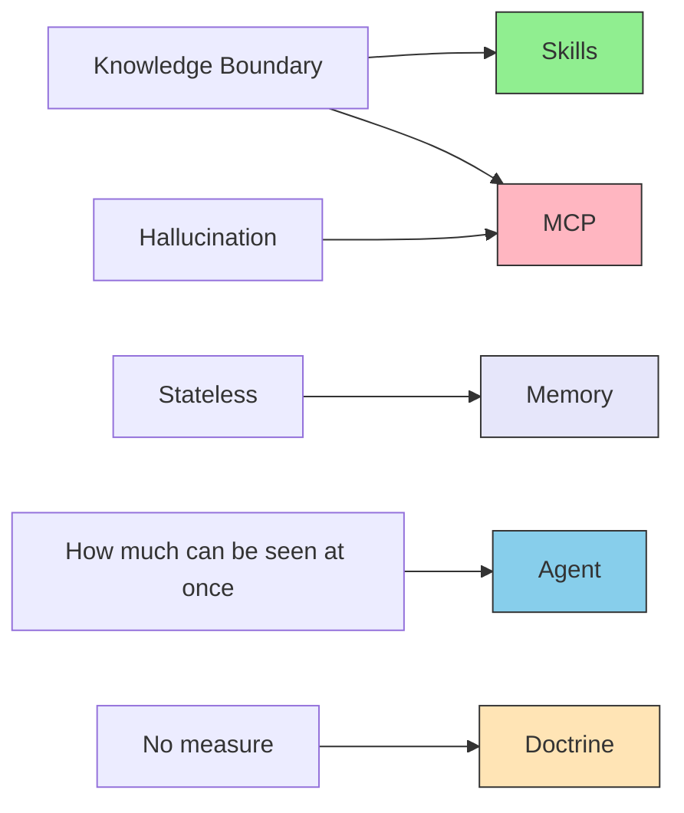

# I.1 Constraint summary

> [!NOTE] Where Part I sits
> The preface defined what the book covers. Part I summarises the limits design must assume. How those limits arise inside the model is left to the sister site [understanding-llm-through-claude-code](https://shuji-bonji.github.io/understanding-llm-through-claude-code/).

The limits do not go away. This book does not promise to erase them. Design treats them as conditions and answers them with layers.

## 1.1 Premises of inference

Ask Claude what Close code 1006 means in RFC 6455, and a correct account may come back. The neighbouring code may be mixed in. A section that does not exist may be pointed to with a plausible number. The model is not "knowing". It is predicting the next word.

The AI this book treats is primarily an LLM (large language model). An LLM picks the next [token](../glossary#token) from learned text, by probability, and joins them. When the name must cover more than LLMs, this book says [foundation model](../glossary#foundation-model).

The following are not guaranteed.

- That the answer is a fact
- That the answer is newer than the training day
- That the answer is an official reading
- That the model can bear responsibility for the answer

The container has properties of its own.

- An LLM is [stateless](../glossary#stateless). It does not hold the previous inference by itself.
- The amount of text you can pass in at once has a ceiling ([context window](../glossary#context-window)).
- Changing the wording of a prompt does not remove these properties.

## 1.2 Structural limits

The sister site defines these limits as eight items. Here only the minimum meaning for design is kept.

| Name | Short meaning | What design does |
| --- | --- | --- |
| **Knowledge Boundary** | Knowledge stops at training time. The model rarely says "I do not know" | Put team procedures and current facts outside the model |
| **Hallucination** | Writes what is not a fact as if it were grounded | Separate guesswork from pointers to source text |
| **Context Rot** | As more text is passed in, answer quality falls | Do not keep growing what is always loaded |
| **Lost in the Middle** | The middle of a long input is less often used | Do not bury important conditions in the middle |
| **Priority Saturation** | The more instructions at once, the weaker each is followed | Split instructions across layers |
| **Instruction Decay** | As the conversation lengthens, early instructions are followed less | Do not put the measure of judgment only in chat history |
| **Sycophancy** | Agreement with the user is easier to prefer than correctness | Do not let the model mark its own work as done |
| **Prompt Sensitivity** | The same meaning, worded differently, changes the output | Do not rewrite every condition into every prompt |

The full list is in the [Glossary](../glossary#structural-problems) and in the sister site [Part 1: Structural problems of LLMs](https://shuji-bonji.github.io/understanding-llm-through-claude-code/01-llm-structural-problems/).

For design, the eight collapse into four.

| Design name | Meaning | Main items among the eight |
| --- | --- | --- |
| **Accuracy** | The answer need not be a fact | Hallucination |
| **Freshness** | Nothing after the training cutoff is held | Knowledge Boundary |
| **Authority** | The model cannot claim an official reading | Also institutional. Connection to source text answers it |
| **Accountability** | The model does not hold legal or ethical grounds by itself | Also institutional. Connection is not enough |

Authority and accountability do not reduce to "how the model works inside". How far technology reaches is Part IV. Here only this split is fixed: some things connection can fill, and some it cannot.

## 1.3 Mapping to the five layers

The five layers are answers to the limits above. They are not a catalogue of connectors. Definitions and placement are Part II.

| Layer | Limit it answers | What belongs here |
| --- | --- | --- |
| **Doctrine** | No measure of judgment. Part of accountability | Purpose, prohibitions, priority |
| **Agent** | Cannot see everything at once. Priority Saturation, Instruction Decay | Understanding the work and assigning it |
| **Skills** | Knowledge Boundary (procedures and rules) | Stable knowledge and procedures |
| **Memory** | Statelessness | Memory and relations you want to keep |
| **MCP** | The part of accuracy, freshness, and authority that connection can fill | Connections to outside systems |

Connecting to the source text of a statute or an RFC is MCP's job. Accountability is not enough with MCP alone. Combine Doctrine, Skills, and human review.

## 1.4 What connection can fill, and what it cannot

Connecting to a place that has source text separates guesswork from fact. Statutes, RFCs, and W3C specifications are examples. Data whose values change can still be an endpoint if the source at the time of fetch remains.

Connection does not guarantee the following.

- That the answer is always correct
- That the model has authority to give an official reading
- That the system bears legal or ethical responsibility

Ethics and values that belong only to an organisation live in knowledge written as Skills, the measure written as [Doctrine](../part-3/doctrine), and human review. Final judgment and responsibility remain on the human side.

## 1.5 Where responsibility sits

As the machinery becomes more abstract, responsibility does not vanish. Who holds it changes.

| When | Who holds it | What they hold |
| --- | --- | --- |
| **At design time** | A human | What to reference, which layer to use, how to write the measure |
| **At run time** | The agent | Inference from references, and doing the work |
| **Structural limits** | The system | Consistency, who may touch what, a record that can be followed later |

Checks **SHOULD** (should) be split into two stages.

| Stage | Nature | Role |
| --- | --- | --- |
| **Guardrail** | Must not be crossed | Decide "this line is not crossed" |
| **Evaluation** | Read as probability | Decide "this range may pass" |

Whether the work is done **MUST NOT** (must not) be left to the agent's own claim. It **MUST** (must) be decided by a condition a machine can check, such as tests passing.

## 1.6 What this chapter does not decide

| It does decide | It does not decide | What is placed instead |
| --- | --- | --- |
| Treat limits as design conditions | That technology erases the limits | Answer them with layers |
| Separate connection from responsibility | That human review becomes unnecessary | Boundaries at design time, records at run time |
| Name who holds responsibility | That the system bears legal responsibility | Final judgment remaining with humans |

How far each limit can be reached today is Part IV. Where to put what is Part II.

## 1.7 Summary

An LLM predicts the next word inside a bounded amount of text. It holds no state of its own. It does not guarantee fact, freshness, official reading, or responsibility. Design places five layers on that premise. What connection can fill is separated from what it cannot. Final judgment and responsibility remain with humans.

## Related pages

- [Preface](../preface) — questions and scope
- [II.1 Five layers](../part-2/layers) — Part II
- [Glossary](../glossary#structural-problems) — short definitions of the eight items
- [understanding-llm / Part 1](https://shuji-bonji.github.io/understanding-llm-through-claude-code/01-llm-structural-problems/) — origin of the limits

---

> **Previous**: [Preface](../preface)
>
> **Next**: [II.1 Five layers](../part-2/layers)
