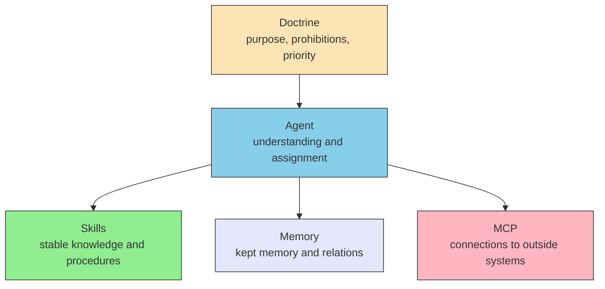

# II.1 Five layers

> [!NOTE] Where Part II sits
> Part I summarised the model's limits. Part II places layers as answers to those limits. This chapter fixes what each of the five owns. Which items go in which layer is [II.2 Placement](./placement). How to write the files is Part III.

## 2.1 A split of ownership

The five layers are a split of who owns what. They are not Claude Code's screens. They are not a diagram of how many servers to run.

One file may mix more than one layer. Placement follows ownership of the content, not the file name.

## 2.2 What each layer owns

| Layer | Owns | Does not own |
| --- | --- | --- |
| **Doctrine** | Purpose, prohibitions, priority. The measure for the other layers | Lists of steps. How to call a tool |
| **Agent** | Understanding the work and combining the other layers | The body of knowledge. The insides of outside systems |
| **Skills** | Stable knowledge and procedures, readable when needed | Execution. The value of this instant |
| **Memory** | Memory and relations that last across conversations | One-off prompts. Source text itself |
| **MCP** | Connecting to outside systems, fetching facts and actions | The measure of judgment. Static procedure manuals |

In a translation job, for example, the quality floor is Doctrine, assignment is Agent, term rules are Skills, last time's habits are Memory, and the dictionary service is MCP.

Earlier drafts put Agent / Skills / MCP first and added Doctrine and Memory later. This book treats the five as one row from the start. Memory is not left "outside the model".

## 2.3 How they combine

The user's request is received by Agent. Whether to proceed is read against Doctrine. Stable procedures are read from Skills. Earlier relations are read from Memory. Current facts and actions are taken through MCP. Combining the result is also Agent's job.

Sub-agents may sit inside Agent, with roles split. A sub-agent is not a substitute for MCP. It is a unit for splitting work. Detail is in Part III, Agent.

When agents talk to each other, A2A (Agent-to-Agent Protocol) is used. MCP connects to tools and data. A2A connects to other agents. One does not replace the other.

## 2.4 Easy mix-ups

| Mix-up | Treatment |
| --- | --- |
| Reading the five layers as a server diagram | Read them as a split of ownership |
| Treating Host / Client / Server as the five layers | That is inside the MCP protocol. Part III covers it |
| Treating a sub-agent as a substitute for MCP | A sub-agent is how Agent splits work |
| Treating Memory as a mere cache | Memory's point is keeping relations |
| Treating a product name (Claude Code, and so on) as a layer name | The product is a host. The layer is ownership |

Work that needs no judgment need not go on MCP. Operations a human judges may stay on the official CLI. When the model judges, connection is MCP, knowledge is Skills, a split of roles is Agent. Detail of the test is [II.2](./placement).

## 2.5 What this chapter does not decide

Host how-tos are out. How to build an MCP server is out. Where to put Skill files is out. Those belong to each layer in Part III.

Which pattern to pick, how far the work can reach, and how to extend into the physical world are Part IV.

## 2.6 Summary

The five layers are answers to LLM limits. Doctrine is the measure, Agent combines, Skills / Memory / MCP hold knowledge, memory, and connections. Layers are ownership, not product layout. Where to put what is the next chapter.

## Related pages

- [I.1 Constraint summary](../part-1/constraints) — limits being answered
- [II.2 Placement](./placement) — which layer receives which item
- [Skills](../skills/what-is-skills) / [MCP](../mcp/what-is-mcp) / [Agents](../agents/) — current Part III landings
- [understanding-llm / Part 2: Context window](https://shuji-bonji.github.io/understanding-llm-through-claude-code/02-context-window/) — why the split exists

---

> **Previous**: [I.1 Constraint summary](../part-1/constraints)
>
> **Next**: [II.2 Placement](./placement)
