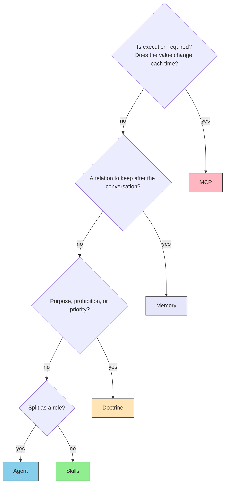

# II.2 Placement

> [!NOTE] Where this chapter sits
> [II.1 Five layers](./layers) fixed what each layer owns. This chapter decides which layer receives a given piece of knowledge or a given connection. Limits are not restated. How to build MCP servers and how to write Skills go to Part III.

## 2.1 Questions that decide placement

When a new rule, procedure, connection, or memory appears, ask the following.

1. Is execution required? Does the value change each time?
2. Can you follow official source text?
3. Is it a relation to keep after the conversation ends?
4. Is it purpose and priority, or procedure and examples?
5. Is it better split as a role?

The answers choose the layer. Where to put the file is not first.

## 2.2 Sources you can check

Do not leave the model's output as guesswork. Place sources that can later be checked against the original.

Earlier drafts called this an "unshakable reference". This book writes the properties in sentences.

| Property | Meaning |
| --- | --- |
| **Authority** | The author is in a position to decide in that field, or is recognised as an expert |
| **A surviving edition** | After publication the text does not change in silence. When it changes, the edition remains |
| **Structure** | You can point to "this place", as in chapter, section, or article |
| **Checkability** | The answer can be set against the source text |
| **Readable by a program** | A form exists that tools can fetch, not only human eyes |

Not every property needs to be perfect. A source with neither authority nor an edition **MUST NOT** (must not) stand in for source text. A source that is weakly structured and hard for a program to fetch **SHOULD** (should) be valued for MCP separately.

For a working check, use the [reference-selection checklist](../reference-selection-checklist).

## 2.3 Strength of the source, and the layer

Sources differ in how strongly they bind. Strength words follow [RFC 2119](https://www.rfc-editor.org/rfc/rfc2119).

| Level | Content | How it binds | Main layer |
| --- | --- | --- | --- |
| 1 | International standards and statutes | **MUST** (must) | MCP (connection to source text) |
| 2 | De facto industry standards | **SHOULD** (should) | MCP. Skills, depending on how it is obtained |
| 3 | Organisation or project rules | Bind locally | Skills. Priority is Doctrine |
| 4 | Examples of good practice | Recommended | Skills |

Statutes, RFCs, and W3C specifications are not filled by guesswork. Connect to the source text through MCP. Organisation rules and work procedures are not inside the model. Write them as Skills. What comes first is Doctrine.

## 2.4 The placement test

Whether you can follow source text is not the layer choice itself. It is the quality of what may sit in MCP. Quality is 2.2 and 2.3.

| What to place | Layer | What not to do |
| --- | --- | --- |
| Connection to statutes, RFCs, W3C, and other source text | MCP | Copy the source into Skills and stop |
| Translation rules, coding conventions, procedures | Skills | Write them only in an MCP tool description |
| Purpose, prohibitions, priority | Doctrine | Write them only in each prompt |
| Relations among customers, cases, earlier decisions | Memory | Leave them only in chat history |
| Split of roles, delegation, combining results | Agent | Embed the role in an MCP server and stop |

Work that runs on the spot and outside APIs are MCP. Stable knowledge is Skills. Work that must run as code is also MCP. A split of roles is Agent.

Work that needs no judgment may sit in ordinary programs. Operations a human judges may stay on the official CLI. Not everything **MUST NOT** (must not) become MCP.

## 2.5 Conflict and citation

When sources disagree, take the stronger bind first. Statute beats industry habit. The RFC now in force beats the RFC it replaced. The citation **MUST** (must) keep the edition and the place.

Guesswork and reference **SHOULD** (should) be written apart in the output. Where you cannot reference, write that you cannot.

## 2.6 What this chapter does not decide

How to cut MCP tools is Part III. How to write a Skill is Part III. Which product to use for Memory is Part III. How far the work can reach is Part IV.

## 2.7 Summary

Placement follows whether execution is required, whether source text can be followed, how long memory must last, whether the item is purpose or procedure, and whether a role should be split. Connect sources you can check through MCP, write procedures as Skills, put priority in Doctrine, keep relations in Memory, and let Agent combine them. Guesswork **MUST NOT** stand in for source text.

When the choice of means is unclear, three axes also help: freshness, amount of judgment, and state of the data. The resource-and-access map is on the [Architecture Map](../information/architecture-map).

## Related pages

- [II.1 Five layers](./layers) — what each layer owns
- [Architecture Map](../information/architecture-map) — resources, access, and circulation (a different axis from the five layers)
- [Reference-selection checklist](../reference-selection-checklist) — whether a source may be used
- [MCP vs Skills](../skills/vs-mcp) — current split in detail
- [understanding-llm / Part 6: Tool context](https://shuji-bonji.github.io/understanding-llm-through-claude-code/06-tool-context/) — why not to load every MCP tool always

---

> **Previous**: [II.1 Five layers](./layers)
>
> **Next**: [Skills](../skills/what-is-skills)
