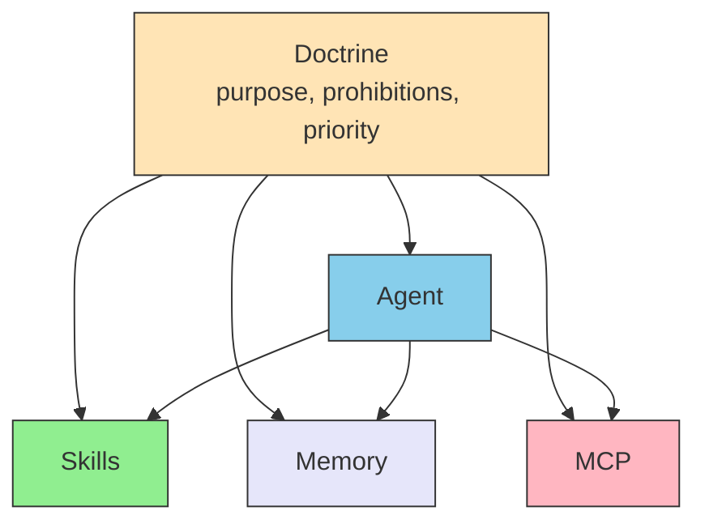

# III.3 Doctrine

> [!NOTE] Where this chapter sits
> Skills hold knowledge. MCP holds connections. Neither holds what matters. Doctrine is the layer for purpose, prohibitions, and priority. Where to put the files on a given host is left to that product's docs and to the how-tos in Part III.

## 3.1 Purpose and bounds, not a list of steps

"Search the spec for digital signature and extract Section 12.8" breaks the moment the heading changes.

"Check whether our implementation follows the official requirements for digital signatures in PDF" lets the model choose the path. In return you need a definition of success and a line that must not be crossed.

Doctrine holds the latter. The list of how to do it sits in Skills or Agent.

In translation work, Doctrine looks like this.

- Purpose: a published translation **MUST** (must) not fall below xCOMET 0.85
- Prohibition: machine translation **MUST NOT** (must not) ship as-is
- Priority: consistent terms come before speed

The glossary itself and the order of tool calls belong to Skills and MCP.

## 3.2 Three elements

| Element | Question | Example |
| --- | --- | --- |
| **Purpose** | What counts as success? | APIs follow RFC 7231. Translations score 0.85 or above on xCOMET |
| **Constraints** | Which line is not crossed? | Code that has not passed tests is not committed. Destructive operations wait for a human |
| **Judgment criteria** | When purposes collide, which comes first? | Safety before speed. When unsure, ask a human; do not guess |

Only when all three are present can the other layers move. If any one lives only in each prompt, it thins as the conversation lengthens (Instruction Decay). The measure **MUST** (must) sit outside the conversation.

Doctrine is not another name for the [system prompt](../glossary#system-prompt). A prompt is input for that turn. Doctrine is the measure common to every turn. In Claude Code it often lives in `CLAUDE.md` or `.claude/rules/`. The path differs by product. Ownership is the same.

## 3.3 Relation to the other layers

Agent reads Doctrine to see whether to proceed. Skills take priority from Doctrine inside a procedure. MCP takes the line for whether a connection is allowed from Doctrine. What Memory may keep follows the same line.

The less you can ask on the spot, the more a shared measure is needed. Examples in the physical world are Part IV. Here only this is held: if they move apart when they cannot ask, the design has failed.

## 3.4 What must not live here

| Must not live here | Instead |
| --- | --- |
| Order of tool calls, checklist steps | Skills |
| How to connect an outside API | MCP |
| The body of last time's case | Memory |
| Who does this job | Agent |

Strength words are the same as Preface 0.7. If MUST and SHOULD are mixed in one block, the model tends to keep both at the same weight. Lines **SHOULD** (should) be MUST; recommendations **SHOULD** be SHOULD.

## 3.5 What this chapter does not decide

Eval design is not cut here. A list of file names on a given host is not cut here. How many steps of autonomy to allow is decided per job. How far the work can reach is Part IV.

## 3.6 Summary

Doctrine holds purpose, prohibitions, and priority, not procedures. The other layers move inside that measure. It **MUST NOT** live only in each prompt.

## Related pages

- [II.1 Five layers](../part-2/layers) / [II.2 Placement](../part-2/placement)
- [III.4 Memory](./memory) — memory that is kept
- [III.5 Agent](../agents/) — assignment
- [understanding-llm / Part 3: Always-loaded context](https://shuji-bonji.github.io/understanding-llm-through-claude-code/03-always-loaded-context/) — why the measure is always loaded

---

> **Previous**: [MCP](../mcp/what-is-mcp)
>
> **Next**: [III.4 Memory](./memory)
