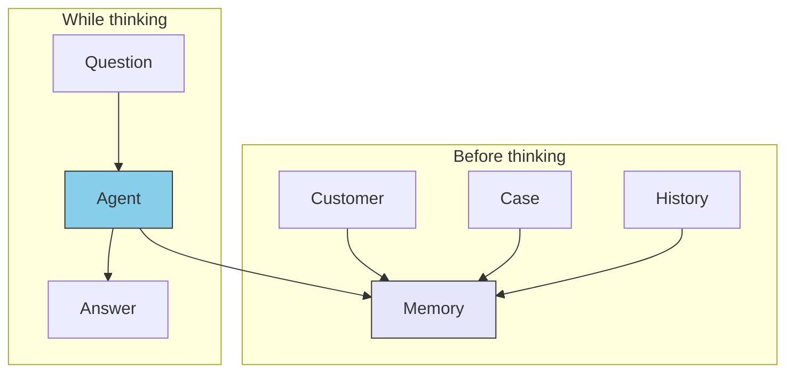

# III.4 Memory

> [!NOTE] Where this chapter sits
> An LLM does not see outside the text you pass in. Last time's continuation and links across systems become guesswork on the spot unless they live somewhere. This chapter fixes what the Memory layer owns. It does not pick a product.

## 4.1 Limits of fetching every time

Ask who owns Company A and how the current case stands. If you hit the customer system, the case system, and the history system in turn, the answer is assembled on the spot. The slowest call holds up the whole. The text you pass in grows from zero each time. Relations across systems are joined by the model then and there. Guessing the join, it drifts.

That way of fetching is called scatter-gather. Adding tools does not always make the agent wiser. Without a layer that keeps relations, hard questions do not improve.

## 4.2 Hold relations before you think

The answer is to gather relations before inference. At inference time, ask the gathered memory. Do not build the relation on the spot.

Values taken through MCP can flow into Memory, ordinary lookup can finish in Memory, and MCP can be hit only when this instant is required. MCP is source text and action. Memory is relation. They are not the same.

Memory **MUST NOT** be treated as a mere fast cache. Its point is keeping relations.

## 4.3 Where what you keep comes from

What you keep splits by origin.

| | Outside, official | Your own work history |
| --- | --- | --- |
| Example | Statutes, RFCs, specifications | Customer work, cases, promises |
| What you want | Reproduction of the source | Last time's continuation |
| On failure | The statute is wrong | Context breaks |
| Endpoint | Mainly MCP | Mainly Memory |

Practice walks both. "We agreed X with Company A last time (Memory). Still, check this article of the subcontracting act (MCP)" is that shape.

Someone who builds a domain MCP may think of a small bundle of relations inside that MCP. Articles and notices for a statute. Dependent RFCs for an RFC. That is not a substitute for Memory. It is a proxy on the source-text side.

## 4.4 Scale in outline

There is no need to build a large graph first. Raise the stage when the pain appears.

| Stage | Outline | Fits |
| --- | --- | --- |
| Files and Markdown | One person, tens to hundreds | Project notes, last decisions |
| Tabular DB | A team, thousands to tens of thousands | One or two hops between case and owner |
| Graph DB | Several systems, three hops or more | A net such as customer—case—fault—fix |
| Sync across systems | Production memory | Integration including identity resolution and permissions |

Signals to raise the stage: fetching the same data again and again; treating "Company A" and its English name as different people; being asked three-hop relations often; "last time's continuation" being a requirement of the work.

If the domain is one, one or two hops suffice, and past context is not a requirement, there is no need to add a Memory layer in a hurry.

## 4.5 What must not live here

| Must not live here | Instead |
| --- | --- |
| Source text of a statute or RFC itself | MCP |
| Team procedure manuals | Skills |
| Purpose and prohibitions | Doctrine |
| One-off task instructions | Agent / the prompt |

Who acts, and on whose behalf, is identity in Agent. See [Agent identity](../agents/agent-identity).

## 4.6 Summary

Memory holds memory and relations that remain after the conversation. Fetching through a row of MCP calls every time produces delay and drift. Hold relations before you think. It is not a cache. It is how relations remain. For small work, files often suffice.

## Related pages

- [II.1 Five layers](../part-2/layers) / [II.2 Placement](../part-2/placement)
- [III.3 Doctrine](./doctrine) — the measure
- [Agent identity](../agents/agent-identity) — on whose behalf
- [understanding-llm / Why memory becomes a problem](https://shuji-bonji.github.io/understanding-llm-through-claude-code/08-session-management/memory-problem)

---

> **Previous**: [III.3 Doctrine](./doctrine)
>
> **Next**: [Agents](../agents/)
