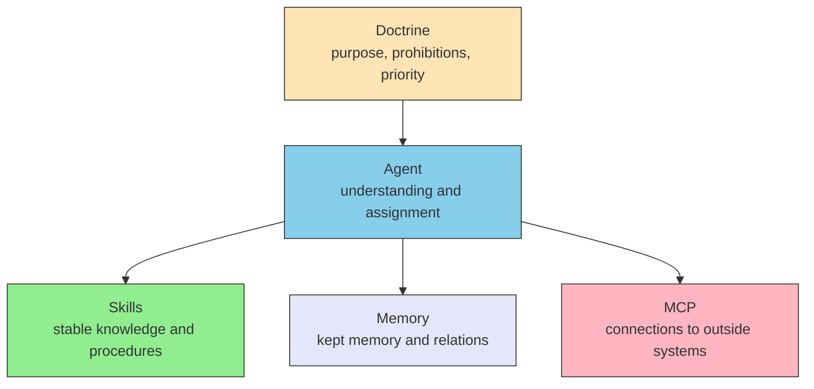

# Preface — Questions and scope

> [!NOTE] Where this book sits
> The English title is **LLM Agent Design Architecture**. The Japanese title is **LLMエージェントの設計**. This book is about assembling agents around an LLM such as Claude so they remain usable over time. It does not cover product how-tos.

Ask Claude whether a given article of a statute is still in force, and a plausible answer comes back. There is no guarantee that the answer matches the source text. Yesterday's conversation is also gone unless you pass it in again. This book starts from that premise.

The AI this book treats is primarily an [LLM](./glossary#llm). LLM stands for Large Language Model. It reads a large amount of text and predicts the next word to produce prose. That is the core of Claude and of ChatGPT. How that works inside the model is left to the sister site [understanding-llm-through-claude-code](https://shuji-bonji.github.io/understanding-llm-through-claude-code/).

When the name must cover more than LLMs, this book says [foundation model](./glossary#foundation-model). A foundation model is trained on large data and reused for many tasks. Vision-Language-Action (VLA) models, which handle image and action, sit in that set.

The story starts from limits the model already has. Protocols that connect tools come later, as one answer to those limits.

## 0.1 Questions this book answers

The book answers three questions.

1. Given the model's limits, which layers should an agent be split into?
2. What belongs in each layer, and what does not?
3. What must be decided first so those choices can be revised and handed on?

An LLM can see only a bounded amount of text at once ([context](./glossary#context)). It does not remember the previous turn by itself. It does not know what happened after training. It does not hold priorities of its own. Changing the wording of a prompt does not remove these properties.

Design therefore places layers on top of the limits. Layers are answers to limits. They are not a catalogue of connectors.

To finish today's task, a [harness](./glossary#harness) is often enough. A harness is the runtime around the model. This book is about what comes after the run: where to put what, how strict to write it, and what to leave when you hand the work on.

## 0.2 What this book covers

The subject is the design of agents built around a foundation model. The content splits into five layers. Layer names stay in English.

| Layer | What belongs here | Limit it answers |
| --- | --- | --- |
| **Doctrine** | Purpose, prohibitions, priority | The model does not hold what matters by itself |
| **Agent** | Understanding the work and assigning it | It cannot see everything at once ([context window](./glossary#context-window)) |
| **Skills** | Stable knowledge and procedures | Team rules are not in the model's [weights](./glossary#weights) |
| **Memory** | Memory and relations you want to keep | Nothing remains when the conversation ends ([stateless](./glossary#stateless)) |
| **MCP** | Connections to outside systems | Facts and freshness. [Hallucination](./glossary#structural-problems) and the training cutoff |

MCP stands for Model Context Protocol. It is a shared rule for connecting a model to outside tools and data. Anthropic published it. This book uses MCP both for that protocol and for the layer that owns connections. Which one is meant should be clear from the surrounding sentences.

The five layers are a split of who owns what. They are not a diagram of how many servers to run. They are not a screen layout.

Doctrine is the measure the other layers follow. Agent combines Skills, Memory, and MCP. Skills are read; they do not call outside APIs themselves. Memory holds relations before inference. MCP fetches outside facts and actions.

This book treats how to place those five layers, and how to leave judgments that can be revised later.

## 0.3 What this book does not cover

The following are out of scope.

| Out of scope | Boundary |
| --- | --- |
| Reinforcement learning such as game-playing agents, classical rule bases, control theory itself | Designs whose core is not an LLM are not the subject |
| How an LLM works inside | "Why it is so" goes to the sister site. This book only summarises the limits design needs |
| How-tos for a given product | See each product's own docs for Claude Code and the like |
| Information-governance regimes themselves | Ownership and access rights exist without an LLM. They sit outside the five layers |

Non-LLM parts such as vision or search show up in real systems. This book treats them as MCP endpoints. The side that assembles them is the foundation-model side.

## 0.4 Intended readers

The reader is someone who assembles agents to keep using them, not someone who runs a prototype once and stops.

Research experience in machine learning is not required. There is no need to follow derivations. It is enough to treat the model's limits as design conditions.

The work in view is design after the run, repair, extension, and hand-off. Procedures that finish today's task belong in harness docs.

## 0.5 Related materials

The split of concerns is as follows.

| Concern | Material | Role |
| --- | --- | --- |
| Understand (origin of limits) | [understanding-llm-through-claude-code](https://shuji-bonji.github.io/understanding-llm-through-claude-code/) | Why. LLM limits and their mechanisms |
| Design | This book | What / How. Layers, placement, how judgments are left |
| Apply in operations | Separate material (in preparation) | Application to operations |

Why belongs to the sister site. What / How belong here. The entrance of this book stands without reading the sister site first. Limits are summarised in Part I. Mechanisms stay on the sister site.

## 0.6 Structure of this book

The book has four parts. Spine chapters have moved. Skills / MCP / Agent landings kept their paths and were rewritten in place. Old URLs send readers to the new pages.

| Part | Content | Where to read it now |
| --- | --- | --- |
| **Part I Prerequisites** | A summary of limits. No mechanisms | [part-1/constraints](./part-1/constraints) |
| **Part II Model** | Layers and where to put what | [part-2/layers](./part-2/layers), [part-2/placement](./part-2/placement) |
| **Part III Layers** | Skills / MCP / Doctrine / Memory / Agent | [skills/](./skills/what-is-skills), [mcp/](./mcp/what-is-mcp), [part-3/doctrine](./part-3/doctrine), [part-3/memory](./part-3/memory), [agents/](./agents/) |
| **Part IV Composition** | Patterns, limits, the physical world, prompt decomposition | [part-4/patterns](./part-4/patterns), [part-4/limits](./part-4/limits), [part-4/physical](./part-4/physical), [part-4/prompt-decomposition](./part-4/prompt-decomposition) |

Worked examples of Skills, MCP, Doctrine, Memory, Agent, and A2A are not deleted. The reading order is rebuilt from limits to layers.

The FAQ page on scope remains. The definition of scope belongs to this preface.

## 0.7 Terms and notation

Layer names **Doctrine** / **Agent** / **Skills** / **Memory** / **MCP** are proper names and stay in English. Ordinary concepts prefer plain language. Terms are defined at first use. Look them up later in the [Glossary](./glossary).

LLM and foundation model are defined at the start of this chapter.

Normative words follow [RFC 2119](https://www.rfc-editor.org/rfc/rfc2119). Meaning is not left to the symbol alone.

| Keyword | Wording in the text | Meaning |
| --- | --- | --- |
| **MUST** / **SHALL** | must | A violation is a design defect |
| **MUST NOT** / **SHALL NOT** | must not | Forbidden |
| **SHOULD** | should | Deviate only with a sound reason |
| **SHOULD NOT** | should not | Adopt only with a sound reason |
| **MAY** | may | Optional |

The Japanese text uses the plain conclusive form. This English text is written as a technical book. Colloquial slogans, emoji, and claims made only with symbols are not used.

The former English title was AI Agent Architecture. The old subtitle is not used at the entrance.

## 0.8 Preface summary

This book is a design document for agents centred on an LLM. It starts from limits the model already has. The subject is the five layers Doctrine / Agent / Skills / Memory / MCP. The reader keeps using the agent after the first run. The sister site holds why. This book holds what to place and how. The structure is Parts I to IV.

## Related pages

- [I.1 Constraint summary](./part-1/constraints) — Part I
- [II.1 Five layers](./part-2/layers) — Part II
- [Glossary](./glossary) — definitions
- [understanding-llm-through-claude-code](https://shuji-bonji.github.io/understanding-llm-through-claude-code/) — origin of the limits (Why)

---

> **Next**: [I.1 Constraint summary](./part-1/constraints)
