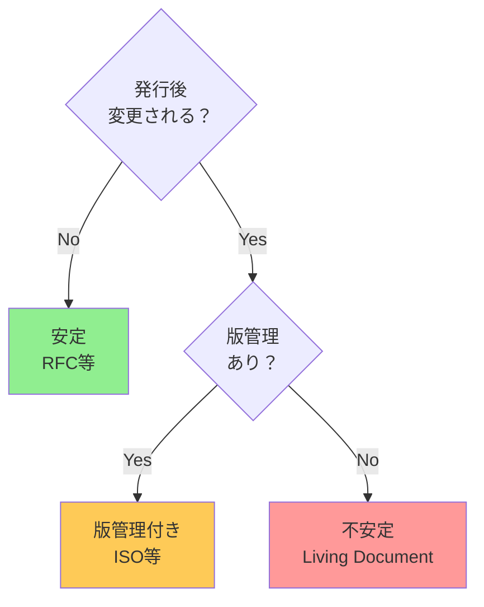
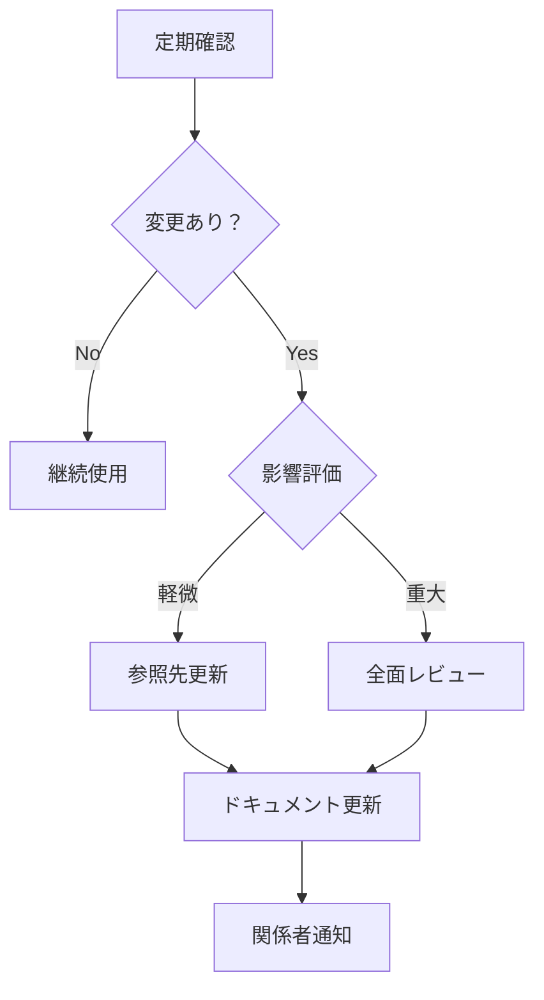

# 参照先選定チェックリスト

> 「ブレない参照先」を選定する際の実践的なチェックリスト

## 概要

このドキュメントは、AI駆動開発において参照すべき情報源を選定する際の判断基準をチェックリスト形式で提供する。新しい情報源を採用する前に、このリストで評価することで、「ブレない参照先」としての適格性を判断できる。

## 1. 権威性チェック

### 1.1 発信元の確認

```markdown
□ 発信元は公式機関・標準化団体か？

- IETF, W3C, ISO, IEEE, 政府機関 → ✅
- 個人ブログ、Stack Overflow → ⚠️ 補助的にのみ使用

□ 策定プロセスは公開されているか？

- 公開レビュー、コンセンサス形成 → ✅
- 一方的な発表 → ⚠️ 注意が必要

□ 専門家によるレビューを経ているか？

- WGでの議論、査読プロセス → ✅
- 未レビュー → ⚠️ 信頼性に注意
```

### 1.2 権威レベルの判定

| レベル | 説明                 | 例                 | 判定       |
| ------ | -------------------- | ------------------ | ---------- |
| **L1** | 法的拘束力あり       | 法令、条約         | MUST参照   |
| **L2** | 国際標準化機関       | IETF RFC, W3C, ISO | MUST参照   |
| **L3** | 業界標準・デファクト | OWASP, OpenAPI     | SHOULD参照 |
| **L4** | ベンダー公式         | MDN, 各SDK         | 補助参照   |
| **L5** | コミュニティ         | Stack Overflow     | 参考程度   |

## 2. 不変性・版管理チェック

### 2.1 版管理の確認

```markdown
□ 文書に版番号・発行日があるか？

- RFC 6455, ISO 27001:2022 → ✅
- 版表示なし → ❌ 参照不適格

□ 版の更新履歴が追跡可能か？

- obsoletes/updates 明示 → ✅
- 静かに更新される → ⚠️ 注意が必要

□ 旧版の参照が可能か？

- アーカイブ提供 → ✅
- 旧版消去 → ⚠️ 版固定が困難
```

### 2.2 安定性の評価



## 3. 構造化チェック

### 3.1 参照可能性の確認

```markdown
□ 一意なセクション番号があるか？

- Section 7.4.1, 第2条第1項 → ✅
- セクション番号なし → ⚠️ 曖昧な参照になる

□ 用語が定義されているか？

- 定義セクションあり → ✅
- 暗黙の用語使用 → ⚠️ 解釈のブレ

□ 要件レベルが明示されているか？

- MUST/SHOULD/MAY, 義務/努力義務 → ✅
- 曖昧な表現のみ → ⚠️ 解釈が必要
```

### 3.2 構造化レベル

| レベル | 特徴                    | 例                    |
| ------ | ----------------------- | --------------------- |
| **高** | XMLスキーマ、正式な構文 | RFC XML, OpenAPI YAML |
| **中** | 明確な章立て、番号付け  | 多くの仕様書          |
| **低** | 散文形式、曖昧な構造    | ブログ記事、FAQ       |

## 4. 検証可能性チェック

### 4.1 原典アクセスの確認

```markdown
□ 永続的なURLがあるか？

- https://www.rfc-editor.org/rfc/rfc6455 → ✅
- リンク切れリスクあり → ⚠️ アーカイブ必要

□ 無料でアクセス可能か？

- 無料公開 → ✅
- 有料 → ⚠️ ライセンス確認必要

□ 機械可読形式が提供されているか？

- XML, JSON, API → ✅ MCP化容易
- PDFのみ → ⚠️ パース必要
```

### 4.2 引用形式

```
推奨引用形式:

[仕様名] [版/番号], [セクション], [発行者], [発行日]

例:
- RFC 6455, Section 7.4.1, IETF, December 2011
- ISO/IEC 27001:2022, Clause 6.1.2, ISO, October 2022
- 電子署名法 第2条第1項, 平成12年法律第102号
```

## 5. アクセス可能性チェック

### 5.1 MCP化可能性の評価

```markdown
□ APIが提供されているか？

- REST API, GraphQL → ✅ 即MCP化可能
- なし → 独自パース必要

□ 構造化データ形式か？

- XML, JSON → ✅ パース容易
- HTML → ⚠️ スクレイピング必要
- PDF → ⚠️ OCR/パース困難

□ ライセンスはMCP化を許可するか？

- 引用・再配布可 → ✅
- 禁止・制限 → ❌ 確認必要
```

### 5.2 MCP化コスト見積もり

| 提供形式 | パース難易度 | MCP化コスト      |
| -------- | ------------ | ---------------- |
| REST API | なし         | 低（数時間）     |
| XML      | 低           | 低〜中（数日）   |
| HTML     | 中           | 中（1週間程度）  |
| PDF      | 高           | 高（要個別検討） |

## 6. 総合評価シート

### 評価テンプレート

```markdown
## 参照先評価: [情報源名]

### 基本情報

- 発行者:
- URL:
- 版/番号:
- 発行日:

### 5特性評価

| 特性           | 評価      | 備考 |
| -------------- | --------- | ---- |
| 権威性         | ○ / △ / × |      |
| 不変性         | ○ / △ / × |      |
| 構造化         | ○ / △ / × |      |
| 検証可能性     | ○ / △ / × |      |
| アクセス可能性 | ○ / △ / × |      |

### 総合判定

□ ブレない参照先として採用
□ 補助的な参照先として採用
□ 参照先として不適格

### MCP化

□ MCP化推奨（既存MCPあり: [名前]）
□ MCP化検討
□ MCP化困難
```

## 7. よくある判断例

### 7.1 採用すべき参照先

| 情報源             | 5特性 | 判定      |
| ------------------ | ----- | --------- |
| IETF RFC           | ◎◎◎◎◎ | ✅ 最優先 |
| W3C Recommendation | ◎◎◎◎○ | ✅ 採用   |
| ISO規格（最新版）  | ◎◎◎○△ | ✅ 採用   |
| 日本法令（e-Gov）  | ◎◎◎◎◎ | ✅ 採用   |
| OWASP Top 10       | ◎○◎◎◎ | ✅ 採用   |

### 7.2 注意が必要な参照先

| 情報源         | 問題点                      | 対応               |
| -------------- | --------------------------- | ------------------ |
| MDN Web Docs   | Living Document（随時更新） | 日付を明記して引用 |
| Stack Overflow | 個人回答、信頼性にバラつき  | 公式ソースで裏取り |
| GitHub Issues  | 非公式、流動的              | 正式リリースを待つ |
| ブログ記事     | 個人見解、古くなる可能性    | 補助参照にとどめる |

### 7.3 採用すべきでない参照先

| 情報源                     | 理由                     |
| -------------------------- | ------------------------ |
| 出典不明の記述             | 検証不能                 |
| 旧版の仕様                 | obsoletedされている      |
| 非公式翻訳                 | 原文との乖離リスク       |
| AI生成コンテンツ（未検証） | ハルシネーションの可能性 |

## 8. 参照先の更新管理

### 8.1 定期確認項目

```markdown
□ 新版が発行されていないか？
□ 廃止（obsolete）されていないか？
□ セキュリティ脆弱性の報告はないか？
□ 解釈の変更はないか？
```

### 8.2 更新時の対応フロー



## まとめ

### クイックチェック（最低限）

```markdown
□ 発信元は公式機関か？
□ 版番号があるか？
□ セクション番号で参照できるか？
□ URLで原典にアクセスできるか？
□ 無料で利用できるか？
```

上記すべてが「Yes」なら、**ブレない参照先として採用可能**。

### 判断に迷ったら

1. **上位レベルの参照先を優先**（法令 > 国際標準 > 業界標準）
2. **不明な点は人間に判断を委ねる**
3. **補助的な情報源は、必ず公式ソースで裏取り**
