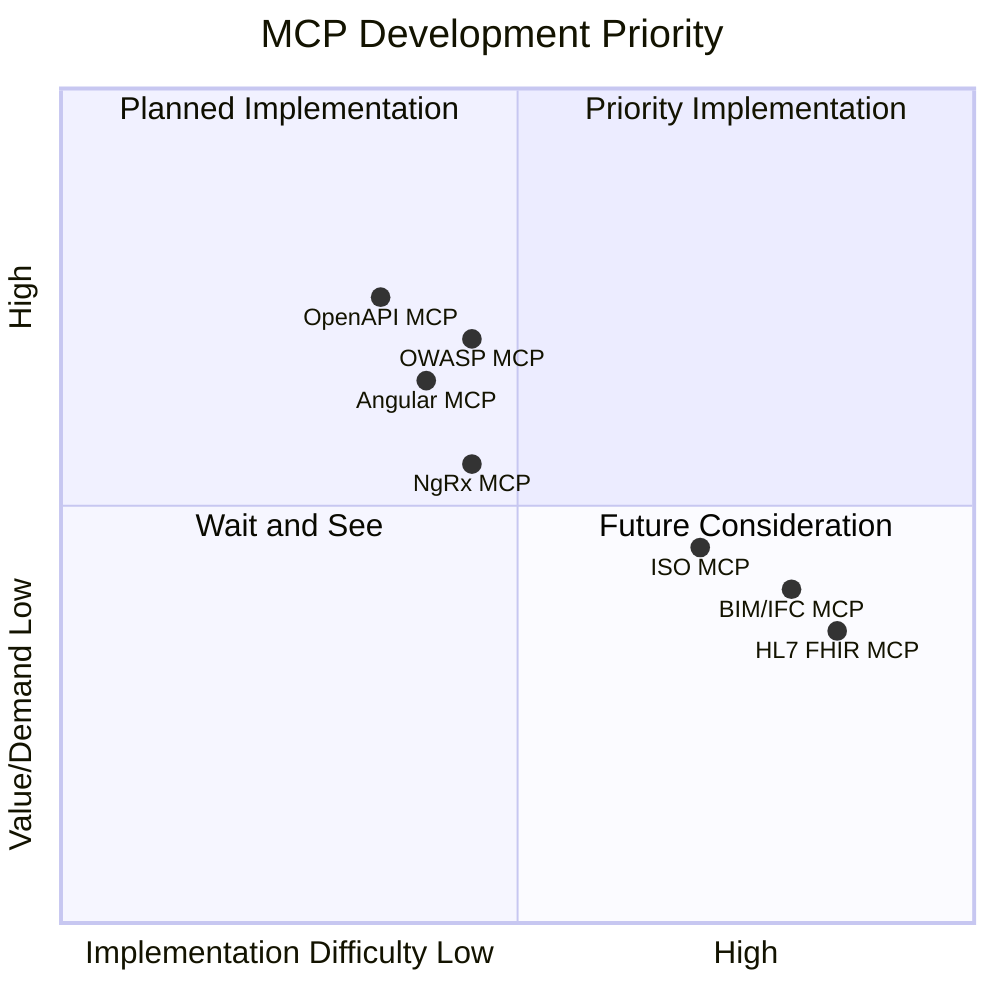
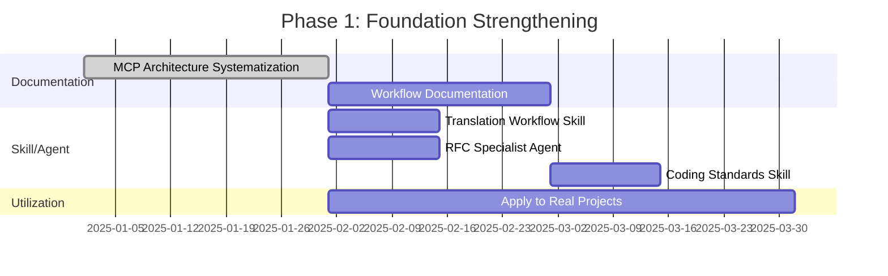
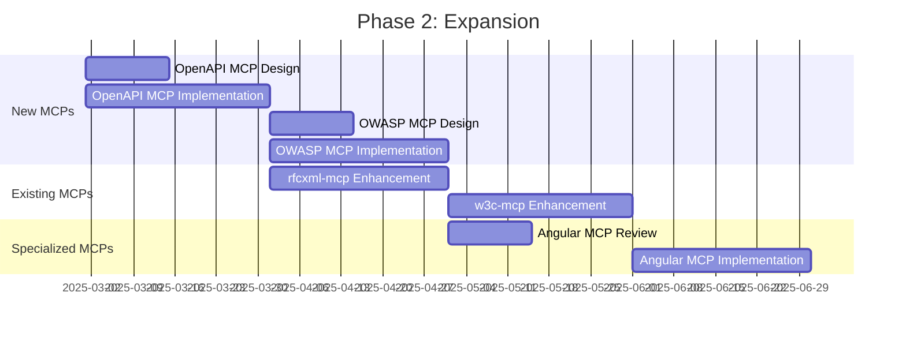

# Priority and Roadmap

[日本語版 (Japanese)](./roadmap.ja.md)

> Organizing priorities and timelines for MCP development.

## About This Document

To generate maximum value with limited resources, it is crucial to determine what to develop first. This document presents a priority matrix that considers current strengths, market demand, and implementation difficulty, and organizes short-term, medium-term, and long-term roadmaps.

Additionally, we discuss project evaluation by Grok and publishing strategies (Note/Qiita/Zenn/GitHub), outlining a growth strategy for the entire ecosystem beyond just technical development.

## Current Strengths

```mermaid
graph TB
    subgraph Built Assets
        RFC[rfcxml-mcp<br/>RFC Analysis]
        XCOMET[xcomet-mcp<br/>Translation Quality]
        RXJS[rxjs-mcp<br/>RxJS Support]
        W3C[w3c-mcp<br/>Web Standards]
        EPSG[epsg-mcp<br/>Coordinate Systems]
        PDFSPEC[pdf-spec-mcp<br/>PDF Specification]
        PDFREADER[pdf-reader-mcp<br/>PDF Analysis]
    end

    subgraph Expertise
        TS[TypeScript/Angular]
        WS[WebSocket/RFC]
        SIGN[Digital Signatures]
        TRANS[Translation Workflow]
        PDF[PDF Specification & Structure]
    end

    subgraph Unique Value
        CREATE["'Creating' not just 'Using'"]
        BRIDGE["Bridge to Japanese-speaking Community"]
        OPEN["Promoting Open Standards"]
    end

    Built Assets --> Unique Value
    Expertise --> Unique Value
```

## MCP Development Priority Matrix



## Phased Roadmap

### Phase 1: Foundation Strengthening (Short-term: 1-3 months)

**Goal**: Maximize utilization of existing MCPs, establish Skills/Agents

| Task                                    | Status        | Priority |
| --------------------------------------- | ------------- | -------- |
| Documentation for existing MCP usage    | In Progress   | 5 stars  |
| Create Translation Workflow Skill       | TODO          | 4 stars  |
| Define RFC Specialist Sub-agent         | TODO          | 4 stars  |
| Develop CLAUDE.md Templates             | TODO          | 3 stars  |

### Phase 2: Expansion (Medium-term: 3-6 months)

**Goal**: Build new MCPs, expand ecosystem

| Task                        | Status    | Priority |
| --------------------------- | --------- | -------- |
| Build OpenAPI MCP           | Concept   | 4 stars  |
| Build OWASP MCP             | Concept   | 4 stars  |
| Build Angular MCP           | Concept   | 3 stars  |
| Enhance rfcxml-mcp features | TODO      | 3 stars  |

### Phase 3: Deployment (Long-term: 6+ months)

**Goal**: Community contribution, expand specialized domains

| Task                          | Status  | Priority |
| ----------------------------- | ------- | -------- |
| ISO Standards MCP             | Concept | 2 stars  |
| BIM/IFC MCP                   | Concept | 2 stars  |
| Healthcare MCP (HL7 FHIR)     | Concept | 1 star   |
| Complete Note Article Series  | TODO    | 3 stars  |

## Detailed Roadmap

### Phase 1 Details



### Phase 2 Details



## Priority Decision Criteria

### Evaluation Axes

| Axis                       | Description                                      | Weight |
| -------------------------- | ------------------------------------------------ | ------ |
| **Fit with Strengths**     | Can we leverage existing knowledge/experience?   | 30%    |
| **Immediate Impact**       | Can it deliver value quickly?                    | 25%    |
| **Demand**                 | Are there expected users?                        | 20%    |
| **Implementation Difficulty** | Feasibility                                   | 15%    |
| **Uniqueness**             | Presence of competitors                          | 10%    |

### Evaluation Examples

| MCP         | Strengths | Immediate Impact | Demand | Difficulty | Uniqueness | Total  |
| ----------- | :-------: | :--------------: | :----: | :--------: | :--------: | :----: |
| OpenAPI MCP |     A     |        A         |   A    |     B      |     C      | **85** |
| OWASP MCP   |     B     |        A         |   A    |     B      |     B      | **80** |
| Angular MCP |     A     |        B         |   B    |     B      |     A      | **75** |
| ISO MCP     |     C     |        C         |   B    |     C      |     B      | **50** |
| BIM/IFC MCP |     C     |        C         |   C    |     C      |     A      | **45** |

## Utilization Plan for Existing MCPs

### rfcxml-mcp

| Initiative              | Details                                    | Timing  |
| ----------------------- | ------------------------------------------ | ------- |
| Documentation Enhancement | Add more usage examples to README        | Phase 1 |
| Feature Enhancement     | Cross-RFC search capability                | Phase 2 |
| Integration Enhancement | Integration workflow with w3c-mcp          | Phase 2 |

### xcomet-mcp-server

| Initiative               | Details                                    | Timing  |
| ------------------------ | ------------------------------------------ | ------- |
| Increase Awareness       | Publish translation workflow case studies  | Phase 1 |
| Performance              | Document GPU usage                         | Phase 1 |
| Integration              | Integration Skill with DeepL MCP           | Phase 1 |

### rxjs-mcp-server

| Initiative            | Details                                    | Timing  |
| --------------------- | ------------------------------------------ | ------- |
| Pattern Enhancement   | More use case patterns                     | Phase 2 |
| Angular Integration   | Integration with Angular MCP               | Phase 2 |

## Strategy Based on Grok's Evaluation

### Potential of xcomet-mcp-server

> "There is sufficient potential for this to take off within the next year" (Grok evaluation)

**Actions**:

- Publish translation workflow case studies (Note)
- Demo of DeepL + Claude + xCOMET
- Outreach to Japanese-speaking and European communities

### Potential of rfcxml-mcp

> "Could surge if the protocol-understanding agent boom arrives after 2027" (Grok evaluation)

**Actions**:

- Demos with hot RFCs (QUIC, HTTP/3, TLS 1.3)
- Expand checklist generation examples
- Establish implementation support workflow

## Publishing Strategy

### Note Article Plan

| Theme                      | Content                                  | Timing  |
| -------------------------- | ---------------------------------------- | ------- |
| **RFC x AI**               | Reading/interacting with RFCs via MCP    | Phase 1 |
| **Translation Workflow**   | DeepL + xCOMET in practice               | Phase 1 |
| **Democratization of Knowledge** | The essential value of MCP         | Phase 1 |
| **Agent Design**           | Distinguishing Skills/Agents/MCPs        | Phase 2 |

### Principles for Technical Publishing

1. Structure articles as **Concept -> Implementation -> Results**
2. Show **concrete deliverables** (code, checklists)
3. Clearly articulate **value to the Japanese-speaking community**

## Risks and Countermeasures

| Risk                    | Impact                        | Countermeasure                                           |
| ----------------------- | ----------------------------- | -------------------------------------------------------- |
| MCP Specification Changes | Modifications to existing MCPs | Monitor official specs, respond early                   |
| Emergence of Competing MCPs | Difficulty differentiating | Differentiate with unique value (Japanese, expertise)  |
| Time Constraints        | Schedule delays               | Adjust with Phase priorities                             |
| Misjudging Demand       | Build without adoption        | Build small and validate                                 |

## Success Metrics

### Short-term (Phase 1)

- [x] Complete documentation systematization
- [ ] Define 3+ Skills/Agents
- [x] Achieve usage in real projects

### Medium-term (Phase 2)

- [x] Release 2+ new MCPs → **4 released** (w3c-mcp, epsg-mcp, pdf-spec-mcp, pdf-reader-mcp)
- [ ] Reach 10+ total GitHub Stars
- [ ] Publish 5+ Note articles
- [x] Publish 4+ npm packages → **6 packages published**

### Long-term (Phase 3)

- [x] Establish MCP ecosystem → 6 npm packages published
- [ ] Gain community recognition
- [ ] Receive external inquiries/contributions

## Next Actions

### Immediate Tasks

1. **Reflect this document on GitHub**
2. **Create Translation Workflow Skill**
3. **Define RFC Specialist Sub-agent**

### Tasks for This Month

1. **Write Note article on xcomet use cases**
2. **Improve README for existing MCPs**
3. **Create CLAUDE.md template**
