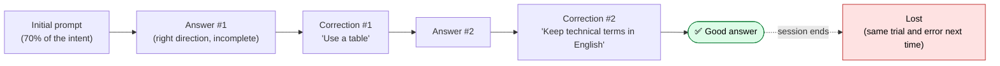
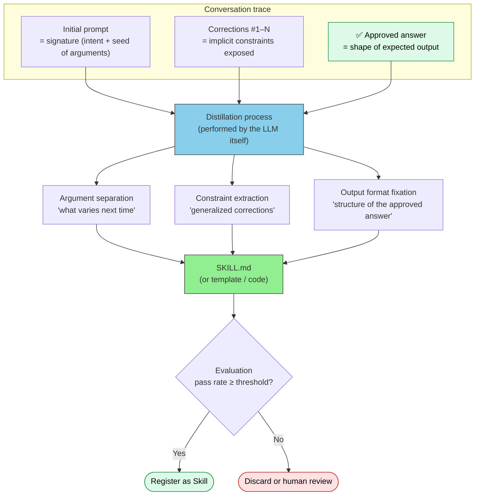
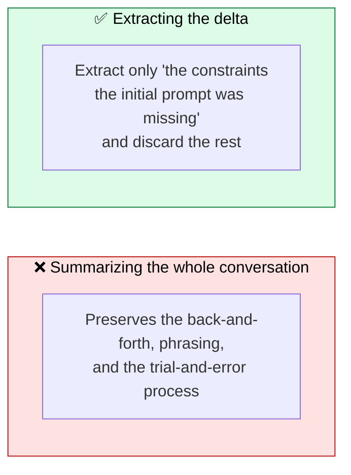
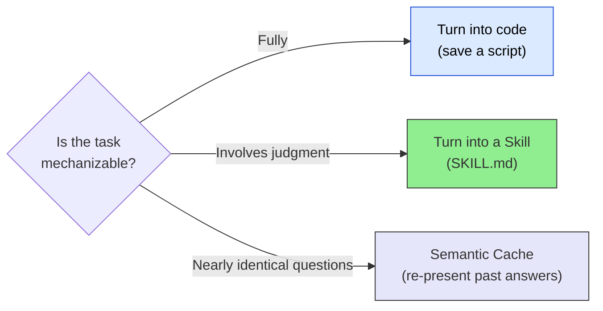

# Distilling Skills from Conversations — Turning Good Answers into Reusable Units

> Make "that was a good answer" reproducible with one button — while avoiding the fixation trap

## About This Document

Conversations that arrive at a good answer are usually discarded. Every time the same kind of task comes back, the same trial and error repeats: prompt → correction → re-correction. This page covers the design of **compressing a successful conversation trace (trajectory) into a reusable unit — a Skill, a prompt template, or code**.

While the [Skill Design Guide](./creating-skills) and the [Skill Creation Guide](./how-to-create-skills) cover how **humans** write Skills, this page covers the reverse path: generating Skills **from conversations**.

> **Audience**: Developers and teams who want to turn insights gained from agent interactions into assets. [What are Skills](./what-is-skills) is assumed as background.

::: warning Positioning of This Page
The "distillation" discussed here is **Trajectory Distillation at runtime (agent layer)** — distinct from Knowledge Distillation at training time (see "Untangling the Word 'Distillation'" below).
:::

::: details Meta Information

- **What this page fixes**: The three elements extracted from a successful conversation (arguments, constraints, expected output) and the criteria for promoting them to a Skill
- **Out of scope**: Distillation that changes model weights (Knowledge Distillation / Context Distillation), and how to write Skills per se (→ [Skill Creation Guide](./how-to-create-skills))
- **Depends on**: [What are Skills](./what-is-skills), [Memory and Knowledge](../concepts/08-memory-and-knowledge)
- **Common misuse**: Mistaking this for "saving conversation logs as-is." The essence of distillation is **throwing things away**

:::

## Untangling the Word "Distillation"

"Distillation" means different things in different contexts. Distinguish these three commonly confused kinds first.

| Kind | What is compressed into what | When | Layer |
| --- | --- | --- | --- |
| Knowledge Distillation | Large model's output distribution → small model's weights | Training time | Inside the LLM |
| Context Distillation | Prompt instructions → model weights | Training time | Inside the LLM |
| **Trajectory Distillation** | Conversation trace → reusable Skill / template / code | **Runtime** | **Agent layer** |

> [!NOTE]
> The first two are training techniques that modify model weights, closer to the territory of the sister site understanding-llm. This page covers only the third — an approach that **never touches weights and produces assets re-injectable as context**. No fine-tuning required, and the artifacts can be shared, version-controlled, and reviewed by a team, which makes this a good fit for agent operations.

## The Problem — Good Answers Are Thrown Away

A typical conversation proceeds like this.

What is lost here is not the answer itself. It is **the delta — what the initial prompt was missing**. Corrections #1 and #2 are constraints that will very likely be needed again for the same kind of task, yet they vanish with the session.

> [!IMPORTANT]
> A conversation trace exposes "implicit requirements specific to this user, this team, this task type." Distillation means **codifying those implicit requirements as explicit constraints**. This differs in purpose from saving conversation logs (Memory) — Memory records "what happened," distillation records "what to do next time."

## The Mechanism — From Button to Skill

As a user experience, this takes the form of "place a button at the **origin** of the conversation that produced a good answer (the initial prompt); pressing it triggers distillation."

There is a reason the button belongs on the initial prompt. The initial prompt corresponds to a **function signature** (intent + seed of arguments), and the subsequent exchanges are effectively debugging. Saving only the approved final answer loses the context of the corrections that led there, reducing reproducibility.

### Inside the Distillation Process

Distillation asks the LLM itself to perform this three-way separation.

| Extraction target | Source data | Where it goes in the Skill |
| --- | --- | --- |
| **Arguments (Inputs)** | The parts of the initial prompt that "will vary in the next task" | Inputs section |
| **Constraints** | Generalizations of the mid-conversation corrections | Constraints (MUST / SHOULD) |
| **Expected output (Outputs)** | Structure and format of the approved answer | Outputs + Examples |

The generated SKILL.md follows the required sections of the [Skill Design Guide](./creating-skills). Distillation only differs in **how the input is produced** — the quality bar is identical to human-written Skills.

## Compress the Delta, Not the Conversation

The most important principle of distillation: do not summarize all three rounds of the conversation.

Two reasons:

1. **Context Rot mitigation** — the distilled artifact will be re-injected into future sessions. A long Skill that includes the whole history pollutes the context by itself. Shorter Skills are stronger
2. **Generalizability** — "that time we rephrased it this way" is a one-off anecdote and cannot be reused, but generalized constraints like "output as a table" or "keep technical terms in English" can

> [!TIP]
> Developer analogy: summarizing the whole conversation is like "squashing the entire commit history and pasting it into the README." Extracting the delta is like "converting review comments into lint rules." Only the latter becomes an asset.

## Three Output Targets — A Spectrum of Reproducibility

There is more than one place to land the distilled result. Choose among three levels depending on the nature of the task.

| Output target | Reproducibility | Suited for | Examples |
| --- | --- | --- | --- |
| **Code (true "functionization")** | Deterministic | Fully mechanizable procedures (transform, aggregate, format) | Voyager's Skill Library, saving scripts the agent wrote |
| **Skill / prompt template** | High but probabilistic | Routine tasks that involve judgment | Agent Skills (SKILL.md), DSPy Signatures |
| **Semantic Cache (recommendation)** | Re-presents past answers | FAQ-style repeated questions | GPTCache, embedding search over past Q&A |

> [!IMPORTANT]
> When in doubt, aim for the top (code). The fewer places a probabilistic LLM judgment is involved, the higher the reproducibility. Gradual codification also works: "carve out the judgment-free parts of a Skill's procedure into a script." This principle belongs to the same lineage as [Semantic Layer](../mcp/semantic-layer) — delegating interpretation of meaning from LLM guesswork to deterministic definitions.

## The Single-Sample Problem — No Promotion Without Evaluation

"The button was pressed = it is good" is only **one sample**. Freezing an answer that merely happened to be good will reproduce biased behavior in later sessions.

- A distilled Skill **SHOULD** be tried on multiple similar tasks and its pass rate confirmed before registration
- Pass criteria **SHOULD** be codified as the Skill's Decision Criteria (e.g., matches the expected output structure in at least 4 of 5 runs)
- Distilled artifacts that fail evaluation **MUST NOT** be auto-registered

Research treats this as a central issue as well. ACE (Agentic Context Engineering) separates three roles — Generator / Reflector / Curator — where **the Reflector judges what deserves to be kept based on execution feedback** before the Curator applies delta updates. The common pattern is: never perform distillation (generation), evaluation (judgment), and registration (update) in a single step.

> [!WARNING]
> The other trap is **context collapse** — repeatedly "re-summarizing" the distilled artifact erodes detail with every iteration. This is why ACE adopts **delta updates** instead of wholesale rewriting. Skill updates should likewise be additions or modifications of constraints, not full rewrites.

## Mapping to Existing Implementations and Research

This design was rapidly systematized across research and products in 2025–2026.

| Implementation / research | Approach | Correspondence to this page |
| --- | --- | --- |
| Voyager (2023) | Accumulates successful behaviors as executable code in a Skill Library | Prototype of "turn into code" |
| ACE (2025) | Evolves context via Generator / Reflector / Curator with delta updates | Separation of distill / evaluate / register; delta updates |
| Trace2Skill (2026) | Distills trajectory-local lessons into transferable Skills | Research version of "extract the delta" |
| Skill-SD (2026) | Summarizes completed trajectories into compact natural-language skills as a self-teaching signal | Automation of trajectory → Skill |
| SoK: Agentic Skills (2026) | Systematization of skill-distillation approaches (human demos, the agent's own successes, etc.) | Academic backing for this page |
| Claude Code `/remember` | Promotes conversation content into memory files | Adjacent feature on the Memory side |
| skill-creator (Anthropic) | Creates, improves, and **runs evals on** Skills | Implementation example of evaluation |
| GPTCache | Re-presents past answers via embedding search | Implementation example of Semantic Cache |

## Anti-Patterns

| Anti-pattern | What happens | Countermeasure |
| --- | --- | --- |
| **Saving the whole conversation log** | Context Rot; re-injection cost exceeds re-derivation cost | Extract only the delta, discard the history |
| **Auto-registration from one sample** | An accidental success gets frozen, reproducing bias | Make the evaluation gate mandatory |
| **Unseparated arguments** | Last time's specifics (dates, project names) get baked in and misfire on other tasks | Explicitly ask "what varies next time" during distillation |
| **Re-distilling distilled artifacts** | Context collapse — detail erodes with repeated summarization | Update via deltas (add/modify constraints) |
| **Unbounded Skill proliferation** | Similar Skills pile up and discoverability drops | Consider merging with existing Skills before registration (→ [Anti-Patterns](./anti-patterns)) |

## Division of Labor with Memory

Distillation is easily confused with [Memory](../concepts/08-memory-and-knowledge). The criterion is: "**will the same procedure be followed next time?**"

| | Memory | Skill distillation |
| --- | --- | --- |
| What is kept | Facts, state, relationships (what happened) | Procedures, constraints, output formats (what to do next time) |
| How it is recalled | Injected when relevant | Triggered by task type |
| Update frequency | May be appended every conversation | Only after passing evaluation |
| Example | "This project uses Angular 20" | "Release notes are always generated with this procedure and format" |

Facts go to Memory; successes that could be turned into procedures go to Skills. Many conversations touch both — promote them separately.

## Related Documents

- [What are Skills](./what-is-skills) — Skill fundamentals
- [Skill Design Guide](./creating-skills) — quality bar the distilled artifact must meet (same as human-written Skills)
- [Skill Creation Guide](./how-to-create-skills) — how to write SKILL.md
- [Anti-Patterns](./anti-patterns) — pitfalls in Skill operations
- [Memory and Knowledge](../concepts/08-memory-and-knowledge) — the adjacent concept of "what to remember"
- [Semantic Layer](../mcp/semantic-layer) — a design discipline in the same lineage: delegating probabilistic guessing to deterministic definitions

## 🔗 Going Deeper: Why Keep Only the Delta

This page covered the **structure (What/How)** of distilling Skills from conversations. To understand from the LLM's structural constraints **why** you should keep only the delta rather than the whole conversation, see the sister site.

- [understanding-llm / Part 1: Context Rot](https://shuji-bonji.github.io/understanding-llm-through-claude-code/01-llm-structural-problems/context-rot) — the structural reason longer inputs degrade performance
- [understanding-llm / Part 8: What to Remember](https://shuji-bonji.github.io/understanding-llm-through-claude-code/08-session-management/what-to-remember) — criteria for selecting memories
- [understanding-llm / Part 5: Design Principles of Skills](https://shuji-bonji.github.io/understanding-llm-through-claude-code/05-on-demand-context/skills) — Skills as on-demand context

## References

- Zhang, Q. et al. (2025). "Agentic Context Engineering: Evolving Contexts for Self-Improving Language Models." arXiv. [arxiv.org/abs/2510.04618](https://arxiv.org/abs/2510.04618) — Generator / Reflector / Curator separation and delta updates; identifies brevity bias and context collapse
- Wang, G. et al. (2023). "Voyager: An Open-Ended Embodied Agent with Large Language Models." arXiv. [arxiv.org/abs/2305.16291](https://arxiv.org/abs/2305.16291) — prototype of a Skill Library accumulating successful behaviors as executable code
- "SoK: Agentic Skills — Beyond Tool Use in LLM Agents" (2026). arXiv. [arxiv.org/abs/2602.20867](https://arxiv.org/abs/2602.20867) — systematization of skill-distillation approaches
- "Trace2Skill: Distill Trajectory-Local Lessons into Transferable Agent Skills" (2026). arXiv. [arxiv.org/abs/2603.25158](https://arxiv.org/abs/2603.25158) — distilling trajectory-local lessons into transferable Skills
- "Skill-SD: Skill-Conditioned Self-Distillation for Multi-turn LLM Agents" (2026). arXiv. [arxiv.org/abs/2604.10674](https://arxiv.org/abs/2604.10674) — self-distillation using summaries of completed trajectories as a teacher signal
- Bang, F. (2023). "GPTCache: An Open-Source Semantic Cache for LLM Applications." NLP-OSS @ EMNLP. [github.com/zilliztech/GPTCache](https://github.com/zilliztech/GPTCache) — Semantic Cache implementation via embedding search
- Anthropic (2025). "Equipping agents for the real world with Agent Skills." Anthropic Engineering. [anthropic.com/engineering](https://www.anthropic.com/engineering/equipping-agents-for-the-real-world-with-agent-skills) — design philosophy of Agent Skills
- Snell, C. et al. (2022). "Learning by Distilling Context." arXiv. [arxiv.org/abs/2209.15189](https://arxiv.org/abs/2209.15189) — Context Distillation (referenced to distinguish it from the distillation in this page)

---

> **Next**: [Skill Usage Guide](./how-to-use-skills)
> **Previous**: [Skill Creation Guide](./how-to-create-skills)

**Last updated**: July 2026
