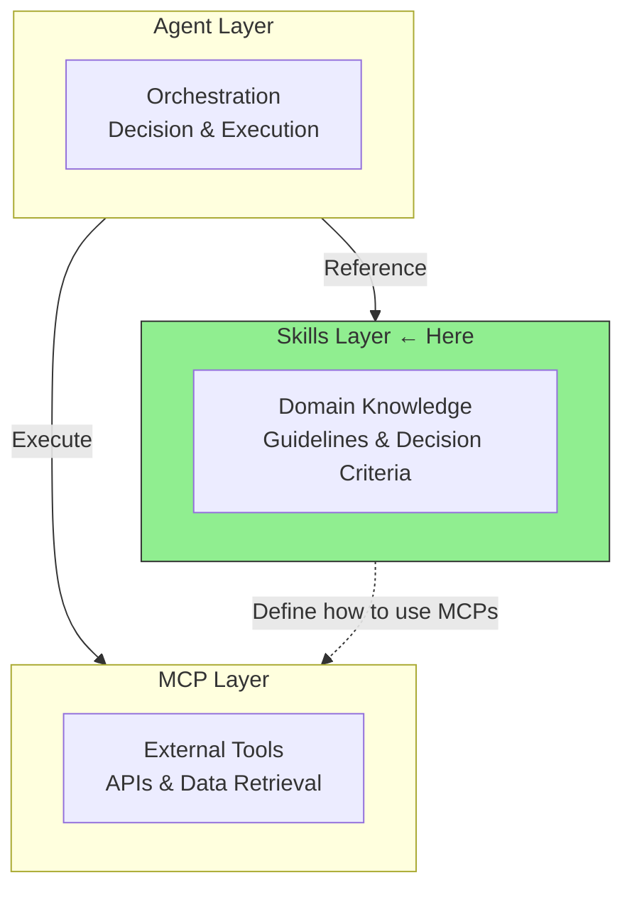
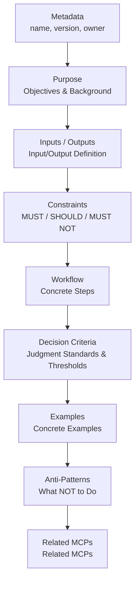
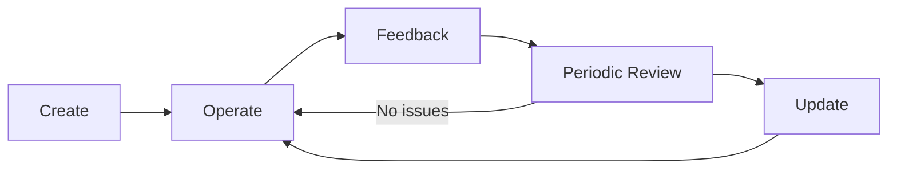

# Skill Design Guide

> When and how to design Skills — judgment criteria and quality standards.

## About This Document

This document covers the **design and decision-making** aspects of Skills: when to create a Skill, how to structure it for quality, and how to maintain it over time. For the hands-on step-by-step creation process, see [How to Create Skills](./how-to-create-skills).

## Positioning of Skills

### Role in Three-Layer Architecture

Skills occupy the middle layer of the AI agent architecture, sitting between the orchestration layer above and the MCP tool layer below. The following diagram illustrates this positioning:



### Cases Where Skills Are Appropriate

The following table identifies scenarios where defining a Skill is the correct choice:

| Case                      | Example                             | Reason                                          |
| ------------------------- | ----------------------------------- | ----------------------------------------------- |
| Defining quality criteria | Translation quality score ≥ 0.85    | Criteria are knowledge, not tools               |
| Workflow definition       | Translate → Evaluate → Fix sequence | Procedures are knowledge; MCPs handle execution |
| Coding conventions        | SOLID principles, naming rules      | Team knowledge is static                        |
| Review perspectives       | Security check items                | Check items are knowledge                       |

### Cases Where Skills Are Not Appropriate

The following table identifies when Skills should not be used and what alternative approach is better:

| Case                     | Better Approach | Reason                           |
| ------------------------ | --------------- | -------------------------------- |
| Calling external APIs    | MCP             | Dynamic execution is needed      |
| Real-time data retrieval | MCP             | External communication is needed |
| Complex orchestration    | Sub-agents      | Decision delegation is needed    |

> When unsure, refer to the [MCP vs Skills Decision Guide](./vs-mcp)

## Skill Structure

### File Organization

Skills are organized in a directory structure that groups related Skills by name:

```
.claude/skills/
├── translation-quality/       # ← Skill name directory
│   └── SKILL.md               # ← Body (required)
├── code-review/
│   └── SKILL.md
└── translation-workflow/
    └── SKILL.md
```

### Required Sections in SKILL.md

The following section structure is recommended to ensure Skill quality. This flow diagram shows the logical progression of content:



> **Ready to start building?** See [How to Create Skills](./how-to-create-skills) for the step-by-step walkthrough of writing each section.

## Skill Quality Checklist

A checklist to verify whether your created Skill is of high quality. Use this to validate completeness and effectiveness:

```markdown
## Basic Checks

- [ ] Metadata (name, version, owner, last_reviewed) is complete
- [ ] Purpose is specific and background is explained
- [ ] Inputs/Outputs are defined in table format

## Constraint Checks

- [ ] MUST/SHOULD/MUST NOT classification is appropriate
- [ ] Numeric criteria and specific conditions are included
- [ ] Vague expressions ("good", "appropriate") are avoided

## Workflow Checks

- [ ] Steps are numbered and clear
- [ ] Each step specifies what to do concretely
- [ ] Decision Criteria are defined in table format

## Example Checks

- [ ] At least one concrete usage example is provided
- [ ] Input → Process → Output flow is shown
- [ ] Anti-Patterns are included

## Design Principle Checks

- [ ] Single Responsibility (1 Skill = 1 responsibility) is maintained
- [ ] Does not depend on internal implementation of specific MCPs
- [ ] Related MCPs are explicitly listed
```

## Lifecycle Management

### Update Cycle

Skills should follow a continuous improvement cycle from creation through ongoing operation. The diagram below shows this process:



### Addressing Anti-Pattern: Unmaintained Skills

Prevent Skills from becoming stale by implementing these measures:

| Measure                   | Method                                     |
| ------------------------- | ------------------------------------------ |
| **Specify Owner**         | List responsibility owner in `owner` field |
| **Last Review Date**      | Regularly update `last_reviewed`           |
| **Review Cycle**          | Recommend quarterly review                 |
| **Operational Alignment** | Verify consistency with actual workflows   |

> For details, see [Anti-Patterns Guide](./anti-patterns) "6. Unmaintained Skill"

## Compatibility with Vercel Skills CLI

### Agent Skills Specification Support

By creating Skills in a format compatible with Vercel Skills CLI, they become usable with agents beyond Claude Code (Cursor, Windsurf, etc.). The following commands show how to integrate Skills with different agents:

```bash
# For Claude Code
npx skills add ./my-skills -a claude-code

# For multiple agents
npx skills add ./my-skills -a claude-code -a cursor -a windsurf
```

> For details, see [How to Use Skills](./how-to-use-skills) for the complete CLI guide and project integration steps.

## Roadmap Goals

Current status and targets:

This table shows the current state of Skill development and the targets for Phase 1:

| Metric            | Current                 | Goal (Phase 1) |
| ----------------- | ----------------------- | -------------- |
| Skill definitions | 1 (translation-quality) | 3+             |
| Templates         | ✅ Created              | —              |
| Documentation     | ✅ This document        | —              |

### Candidate Skills to Create Next

The following Skills are identified as high-priority candidates for future development:

| Skill Name           | Overview                             | Priority | Related MCP   |
| -------------------- | ------------------------------------ | -------- | ------------- |
| translation-workflow | Workflow: Translate → Evaluate → Fix | ⭐⭐⭐⭐ | deepl, xcomet |
| rfc-compliance       | RFC compliance check guidelines      | ⭐⭐⭐⭐ | rfcxml        |
| code-review          | TypeScript/Angular review guidelines | ⭐⭐⭐   | —             |

## What to Read Next

| Purpose                                    | Document                                                      |
| ------------------------------------------ | ------------------------------------------------------------- |
| Create a Skill step-by-step                | [How to Create Skills](./how-to-create-skills)                |
| Integrate Skills into your project         | [How to Use Skills](./how-to-use-skills)                      |
| Explore real use cases                     | [Skill Use Cases](./skill-use-cases)                          |
| Deciding between MCP vs Skills             | [MCP vs Skills Decision Guide](./vs-mcp)                     |
| Anti-patterns to avoid                     | [Anti-Patterns Guide](./anti-patterns)                        |
| See production examples                    | [Showcase](./showcase)                                        |
| Three-layer architecture overview          | [Architecture](../concepts/03-architecture)                   |
| Skill + MCP combination examples           | [Integration Patterns](../workflows/patterns)                 |

## Reference Links

- [Agent Skills Specification](https://agentskills.io) — Standard specification
- [Vercel Skills CLI](https://github.com/vercel-labs/skills) — CLI tool
- [templates/skill/](https://github.com/shuji-bonji/ai-agent-architecture/tree/main/templates/skill) — Template collection
- [.claude/skills/translation-quality/SKILL.md](https://github.com/shuji-bonji/ai-agent-architecture/blob/main/.claude/skills/translation-quality/SKILL.md) — Implementation example
