# Skill Creation Guide

> Creating high-quality Skill definitions and practical best practices.

## About This Document

A Skill is a static Markdown file that provides domain knowledge, guidelines, and decision criteria to AI agents. While MCPs provide "what you can do (tools)," Skills provide "how to execute (knowledge)."

This document explains the full lifecycle of Skills from design through creation, testing, and maintenance. It is based on existing Skills (like `translation-quality`) and templates.

## Positioning of Skills

### Role in Three-Layer Architecture

```mermaid
graph TB
    subgraph Agent["Agent Layer"]
        A[Orchestration<br/>Decision & Execution]
    end

    subgraph Skills["Skills Layer ← Here"]
        S[Domain Knowledge<br/>Guidelines & Decision Criteria]
    end

    subgraph MCP["MCP Layer"]
        M[External Tools<br/>APIs & Data Retrieval]
    end

    Agent -->|"Reference"| Skills
    Agent -->|"Execute"| MCP
    Skills -.->|"Define how to use MCPs"| MCP

    style Skills fill:#90EE90,stroke:#333
```



### Cases Where Skills Are Appropriate

| Case                      | Example                             | Reason                                          |
| ------------------------- | ----------------------------------- | ----------------------------------------------- |
| Defining quality criteria | Translation quality score ≥ 0.85    | Criteria are knowledge, not tools               |
| Workflow definition       | Translate → Evaluate → Fix sequence | Procedures are knowledge; MCPs handle execution |
| Coding conventions        | SOLID principles, naming rules      | Team knowledge is static                        |
| Review perspectives       | Security check items                | Check items are knowledge                       |

### Cases Where Skills Are Not Appropriate

| Case                     | Better Approach | Reason                           |
| ------------------------ | --------------- | -------------------------------- |
| Calling external APIs    | MCP             | Dynamic execution is needed      |
| Real-time data retrieval | MCP             | External communication is needed |
| Complex orchestration    | Sub-agents      | Decision delegation is needed    |

> When unsure, refer to the [MCP vs Skills Decision Guide](./vs-mcp.md)

## Skill Structure

### File Organization

```
.claude/skills/
├── translation-quality/       # ← Skill name directory
│   └── SKILL.md               # ← Body (required)
├── code-review/
│   └── SKILL.md
└── translation-workflow/
    └── SKILL.md
```

### Required Sections in SKILL.md

The following section structure is recommended to ensure Skill quality.


## Creation Steps

### Step 1: Define Metadata

Describe basic information using YAML Front Matter.

```yaml
---
name: code-review
description: Code review guidelines for TypeScript/Angular projects
version: 1.0.0
owner: @shuji-bonji
last_reviewed: 2026-02-11
---
```

| Field           | Required | Description                                                   |
| --------------- | -------- | ------------------------------------------------------------- |
| `name`          | ✅       | Skill identifier (kebab-case)                                 |
| `description`   | ✅       | One-line description                                          |
| `version`       | ✅       | Semantic versioning                                           |
| `owner`         | ✅       | Owner (person responsible for updates)                        |
| `last_reviewed` | ✅       | Last review date (prevents anti-pattern "unmaintained Skill") |

### Step 2: Write Purpose

Clearly explain why this Skill is needed. Vague descriptions are anti-patterns.

```markdown
## Purpose

Ensure quality and consistency of code reviews in TypeScript/Angular projects.

### Why This Skill?

- Reviewers often have inconsistent perspectives
- Want to auto-check compliance with SOLID principles and Angular best practices
- Enables consistent review quality even with new team members
```

### Step 3: Define Inputs / Outputs

Clearly specify what the Skill receives and what it produces.

```markdown
## Inputs

| Input          | Type             | Description           |
| -------------- | ---------------- | --------------------- |
| source_files   | TypeScript files | Files to be reviewed  |
| pr_description | Markdown         | PR description text   |
| changed_lines  | diff             | Diff of changed lines |

## Outputs

| Output          | Type     | Description                         |
| --------------- | -------- | ----------------------------------- |
| review_report   | Markdown | Review results report               |
| action_items    | List     | List of required fixes              |
| approval_status | enum     | approve / request-changes / comment |
```

### Step 4: Define Constraints

Define clear constraints using RFC 2119 keywords (MUST/SHOULD/MUST NOT).

```markdown
## Constraints

### MUST (Required)

- Verify ESLint errors are zero
- Validate type safety (no `any` type usage)
- Require test coverage ≥ 80%

### SHOULD (Recommended)

- Verify compliance with Single Responsibility Principle (SRP)
- Check RxJS subscription management
- Recommend Angular ChangeDetectionStrategy.OnPush usage

### MUST NOT (Prohibited)

- Do not skip security-related reviews
- Do not approve code without tests
- Do not leave console.log in production code
```

**Key Point**: Include numeric criteria and specific conditions. Vague descriptions like "write good code" are anti-patterns.

### Step 5: Write Workflow

Describe the concrete steps the agent will execute.

```markdown
## Workflow

### Step 1: Understand Changes

Review the PR description and changed file list to understand the goal and scope of the changes.

### Step 2: Static Analysis

Check ESLint and TypeScript compiler results.
If errors exist, immediately return `request-changes`.

### Step 3: Code Quality Check

Verify code from the following perspectives:

1. Compliance with SOLID principles
2. Angular best practices
3. RxJS patterns appropriateness
4. Test coverage

### Step 4: Generate Report

Output verification results as a Markdown report.
```

### Step 6: Define Decision Criteria

Clearly present quantitative decision criteria in a table.

```markdown
## Decision Criteria

| Condition               | Action                  | Rationale              |
| ----------------------- | ----------------------- | ---------------------- |
| ESLint errors > 0       | ❌ request-changes      | Basic quality not met  |
| `any` type usage found  | ❌ request-changes      | Type safety violation  |
| Coverage < 80%          | ⚠️ request-changes      | Insufficient tests     |
| Suspected SRP violation | 💬 comment              | Improvement suggestion |
| Minor style issues      | ✅ approve with comment | Do not block           |
```

### Step 7: Write Examples

Provide concrete input/output examples. Agents will use these as reference.

```markdown
## Examples

### Example 1: PR with ESLint Errors

**Input:**
PR contains 3 instances of `any` type usage

**Process:**

1. Check ESLint results → 3 errors found
2. Check type safety → violations found

**Output:**
❌ request-changes

- `src/service.ts:25` - `any` → change to appropriate type
- `src/service.ts:42` - `any` → recommend interface definition
- `src/component.ts:15` - `any` → recommend generic type usage
```

### Step 8: Write Anti-Patterns

```markdown
## Anti-Patterns

### Pattern: Style-Only Reviews

**Problematic Approach:**
Point out only indentation and naming issues without verifying logic correctness.

**Why It's a Problem:** Miss essential issues.

**Correct Approach:**
Verify in order: Logic → Design → Type Safety → Style.
```

## Template Usage

Templates are available in `templates/skill/`.

```bash
# Copy template
cp templates/skill/SKILL.ja.md.template .claude/skills/my-skill/SKILL.md
```

| Template                     | Path                                                  |
| ---------------------------- | ----------------------------------------------------- |
| Japanese template            | `templates/skill/SKILL.ja.md.template`                |
| English template             | `templates/skill/SKILL.md.template`                   |
| Code review example          | `templates/skill/examples/code-review.ja.md`          |
| Translation workflow example | `templates/skill/examples/translation-workflow.ja.md` |

## Real-World Examples of Existing Skills

### translation-quality (Implemented)

A Skill definition with 279 lines exists at `.claude/skills/translation-quality/SKILL.md`.

```
Structure:
├── Metadata (name, version, owner, last_reviewed)
├── Purpose + Why This Skill?
├── Inputs / Outputs (table format)
├── Constraints (MUST / SHOULD / MUST NOT)
├── Workflow (5 steps)
├── Decision Criteria (average score + segments)
├── Examples (2 patterns: single file / batch directory)
├── Anti-Patterns (2 patterns)
└── Related MCPs (xcomet, deepl)
```

**Learning Points**:

- Clear thresholds (0.85, 0.90, 0.95)
- Specific workflow (5 steps)
- Output examples in embeddable Markdown format
- Explicit MCP integration

## Skill Quality Checklist

A checklist to verify whether your created Skill is of high quality.

```markdown
## Basic Checks

- [ ] Metadata (name, version, owner, last_reviewed) is complete
- [ ] Purpose is specific and background is explained
- [ ] Inputs/Outputs are defined in table format

## Constraint Checks

- [ ] MUST/SHOULD/MUST NOT classification is appropriate
- [ ] Numeric criteria and specific conditions are included
- [ ] Vague expressions ("good", "appropriate") are avoided

## Workflow Checks

- [ ] Steps are numbered and clear
- [ ] Each step specifies what to do concretely
- [ ] Decision Criteria are defined in table format

## Example Checks

- [ ] At least one concrete usage example is provided
- [ ] Input → Process → Output flow is shown
- [ ] Anti-Patterns are included

## Design Principle Checks

- [ ] Single Responsibility (1 Skill = 1 responsibility) is maintained
- [ ] Does not depend on internal implementation of specific MCPs
- [ ] Related MCPs are explicitly listed
```

## Lifecycle Management

### Update Cycle


### Addressing Anti-Pattern: Unmaintained Skills

| Measure                   | Method                                     |
| ------------------------- | ------------------------------------------ |
| **Specify Owner**         | List responsibility owner in `owner` field |
| **Last Review Date**      | Regularly update `last_reviewed`           |
| **Review Cycle**          | Recommend quarterly review                 |
| **Operational Alignment** | Verify consistency with actual workflows   |

> For details, see [Anti-Patterns Guide](./anti-patterns.md) "6. Unmaintained Skill"

## Compatibility with Vercel Skills CLI

### Agent Skills Specification Support

By creating Skills in a format compatible with Vercel Skills CLI, they become usable with agents beyond Claude Code (Cursor, Windsurf, etc.).

```bash
# For Claude Code
npx skills add ./my-skills -a claude-code

# For multiple agents
npx skills add ./my-skills -a claude-code -a cursor -a windsurf
```

> For details, see [Skills Overview](./overview.md) "Vercel Skills CLI Integration"

## Roadmap Goals

Current status and targets:

| Metric            | Current                 | Goal (Phase 1) |
| ----------------- | ----------------------- | -------------- |
| Skill definitions | 1 (translation-quality) | 3+             |
| Templates         | ✅ Created              | —              |
| Documentation     | ✅ This document        | —              |

### Candidate Skills to Create Next

| Skill Name           | Overview                             | Priority | Related MCP   |
| -------------------- | ------------------------------------ | -------- | ------------- |
| translation-workflow | Workflow: Translate → Evaluate → Fix | ⭐⭐⭐⭐ | deepl, xcomet |
| rfc-compliance       | RFC compliance check guidelines      | ⭐⭐⭐⭐ | rfcxml        |
| code-review          | TypeScript/Angular review guidelines | ⭐⭐⭐   | —             |

## Related Documents

- [Skills Overview](./overview.md) — Vercel Skills / Agent Skills Specification
- [MCP vs Skills Decision Guide](./vs-mcp.md) — What should be a Skill?
- [Anti-Patterns Guide](./anti-patterns.md) — Patterns to avoid
- [MCP/Skills/Agent Architecture](../concepts/03-architecture.md) — Three-layer architecture
- [Integration Patterns & Workflows](../workflows/patterns.md) — Skill + MCP combination examples

## Reference Links

- [Agent Skills Specification](https://agentskills.io) — Standard specification
- [Vercel Skills CLI](https://github.com/vercel-labs/skills) — CLI tool
- [templates/skill/](../../templates/skill/) — Template collection
- [.claude/skills/translation-quality/SKILL.md](../../.claude/skills/translation-quality/SKILL.md) — Implementation example
