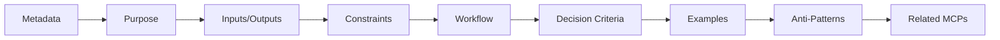

# How to Create Skills

> A hands-on guide to building SKILL.md from scratch — with real examples and templates.

## About This Document

This is a practical, step-by-step tutorial for creating a Skill. If you haven't decided whether your use case should be a Skill, start with the [Skill Design Guide](./creating-skills) first.

By the end of this guide, you will have created a complete `SKILL.md` file ready for use with Claude Code, Cursor, and 16+ other AI agents.

## SKILL.md Structure Overview

### Directory Layout

Every Skill lives in its own directory with a single required file:

```
.claude/skills/
├── translation-quality/       # ← Skill name (kebab-case)
│   └── SKILL.md               # ← Required: the Skill definition
├── code-review/
│   └── SKILL.md
└── my-new-skill/
    ├── SKILL.md               # ← Required
    ├── data/                   # ← Optional: embedded data files
    └── scripts/               # ← Optional: companion scripts
```

### Naming Conventions

| Rule | Example | Reason |
|------|---------|--------|
| Use kebab-case for directory names | `translation-quality` | Standard convention across all agents |
| File must be named `SKILL.md` | `SKILL.md` (not `skill.md`) | Agent Skills Specification requirement |
| Name reflects single responsibility | `code-review` not `code-tools` | One Skill = one domain |

### Section Flow

A well-structured SKILL.md follows this progression:



## Step-by-Step Creation

### Step 1: Define Metadata

Start with YAML Front Matter that identifies and tracks your Skill:

```yaml
---
name: code-review
description: Code review guidelines for TypeScript/Angular projects
version: 1.0.0
owner: @shuji-bonji
last_reviewed: 2026-02-11
---
```

**Field Reference:**

| Field           | Required | Description                                                   |
| --------------- | -------- | ------------------------------------------------------------- |
| `name`          | ✅       | Skill identifier (kebab-case)                                 |
| `description`   | ✅       | One-line description                                          |
| `version`       | ✅       | Semantic versioning                                           |
| `owner`         | ✅       | Owner (person responsible for updates)                        |
| `last_reviewed` | ✅       | Last review date (prevents anti-pattern "unmaintained Skill") |

### Step 2: Write Purpose

Clearly explain **why** this Skill is needed. Vague descriptions are anti-patterns.

```markdown
## Purpose

Ensure quality and consistency of code reviews in TypeScript/Angular projects.

### Why This Skill?

- Reviewers often have inconsistent perspectives
- Want to auto-check compliance with SOLID principles and Angular best practices
- Enables consistent review quality even with new team members
```

**Checklist:**
- ✅ Specific objective stated
- ✅ Background context provided
- ✅ Target audience/scenario clear
- ❌ Avoid: "Make code better" (too vague)

### Step 3: Define Inputs / Outputs

Clearly specify what the Skill receives and produces using table format:

```markdown
## Inputs

| Input          | Type             | Description           |
| -------------- | ---------------- | --------------------- |
| source_files   | TypeScript files | Files to be reviewed  |
| pr_description | Markdown         | PR description text   |
| changed_lines  | diff             | Diff of changed lines |

## Outputs

| Output          | Type     | Description                         |
| --------------- | -------- | ----------------------------------- |
| review_report   | Markdown | Review results report               |
| action_items    | List     | List of required fixes              |
| approval_status | enum     | approve / request-changes / comment |
```

### Step 4: Define Constraints

Use RFC 2119 keywords (MUST / SHOULD / MUST NOT) for clear guardrails:

```markdown
## Constraints

### MUST (Required)

- Verify ESLint errors are zero
- Validate type safety (no `any` type usage)
- Require test coverage ≥ 80%

### SHOULD (Recommended)

- Verify compliance with Single Responsibility Principle (SRP)
- Check RxJS subscription management
- Recommend Angular ChangeDetectionStrategy.OnPush usage

### MUST NOT (Prohibited)

- Do not skip security-related reviews
- Do not approve code without tests
- Do not leave console.log in production code
```

**Key Point**: Include numeric criteria and specific conditions. Vague descriptions like "write good code" are anti-patterns.

### Step 5: Write Workflow

Describe the concrete steps the agent will execute:

```markdown
## Workflow

### Step 1: Understand Changes

Review the PR description and changed file list to understand the goal and scope of the changes.

### Step 2: Static Analysis

Check ESLint and TypeScript compiler results.
If errors exist, immediately return `request-changes`.

### Step 3: Code Quality Check

Verify code from the following perspectives:

1. Compliance with SOLID principles
2. Angular best practices
3. RxJS patterns appropriateness
4. Test coverage

### Step 4: Generate Report

Output verification results as a Markdown report.
```

### Step 6: Define Decision Criteria

Present quantitative decision criteria in a table:

```markdown
## Decision Criteria

| Condition               | Action                  | Rationale              |
| ----------------------- | ----------------------- | ---------------------- |
| ESLint errors > 0       | ❌ request-changes      | Basic quality not met  |
| `any` type usage found  | ❌ request-changes      | Type safety violation  |
| Coverage < 80%          | ⚠️ request-changes      | Insufficient tests     |
| Suspected SRP violation | 💬 comment              | Improvement suggestion |
| Minor style issues      | ✅ approve with comment | Do not block           |
```

### Step 7: Write Examples

Provide concrete input/output examples. Agents use these as reference:

```markdown
## Examples

### Example 1: PR with ESLint Errors

**Input:**
PR contains 3 instances of `any` type usage

**Process:**

1. Check ESLint results → 3 errors found
2. Check type safety → violations found

**Output:**
❌ request-changes

- `src/service.ts:25` - `any` → change to appropriate type
- `src/service.ts:42` - `any` → recommend interface definition
- `src/component.ts:15` - `any` → recommend generic type usage
```

### Step 8: Write Anti-Patterns

Document common mistakes to avoid:

```markdown
## Anti-Patterns

### Pattern: Style-Only Reviews

**Problematic Approach:**
Point out only indentation and naming issues without verifying logic correctness.

**Why It's a Problem:** Miss essential issues.

**Correct Approach:**
Verify in order: Logic → Design → Type Safety → Style.
```

## Walkthrough: Dissecting `translation-quality`

Let's examine a real production Skill — the `translation-quality` Skill (279 lines) — to understand design decisions behind each section.

### Structure Map

```mermaid
graph TB
    subgraph SKILL["translation-quality SKILL.md (279 lines)"]
        META["Metadata<br/>name, version, owner, last_reviewed"]
        PURPOSE["Purpose<br/>+ Why This Skill?"]
        IO["Inputs / Outputs<br/>3 inputs, 3 outputs"]
        CONSTRAINTS["Constraints<br/>5 MUST / 4 SHOULD / 3 MUST NOT"]
        WORKFLOW["Workflow<br/>5 Steps"]
        CRITERIA["Decision Criteria<br/>Score-based (0.85-0.95)"]
        EXAMPLES["Examples<br/>2 patterns: single file / batch"]
        ANTI["Anti-Patterns<br/>2 patterns"]
        RELATED["Related MCPs<br/>xcomet-mcp, deepl-mcp"]
    end

    META --> PURPOSE --> IO --> CONSTRAINTS --> WORKFLOW --> CRITERIA --> EXAMPLES --> ANTI --> RELATED

    style SKILL fill:#f9f9f9,stroke:#333
```



### Key Design Decisions

| Section | Decision | Why |
|---------|----------|-----|
| **Constraints** | "MUST: score ≥ 0.85" | Clear numeric threshold eliminates ambiguity |
| **Workflow** | 5 concrete steps | Each step maps to a specific action the agent can execute |
| **Decision Criteria** | Score tiers (0.85/0.90/0.95) | Agents know exactly how to classify results |
| **Examples** | Single file + batch directory | Covers the two most common usage patterns |
| **Related MCPs** | xcomet-mcp, deepl-mcp | Explicitly declares MCP dependencies |

### What Makes It Effective

The `translation-quality` Skill works well because:

1. **Every threshold is numeric** — no room for interpretation
2. **The workflow is linear** — agents can follow steps sequentially
3. **Examples show both common patterns** — single file and batch processing
4. **Anti-patterns prevent common mistakes** — like skipping quality evaluation

## Using Templates

Templates provide a quick starting point. Copy one and customize:

```bash
# Copy the template
cp templates/skill/SKILL.md.template .claude/skills/my-skill/SKILL.md

# Or the Japanese version
cp templates/skill/SKILL.ja.md.template .claude/skills/my-skill/SKILL.md
```

**Available templates:**

| Template                     | Path                                                  |
| ---------------------------- | ----------------------------------------------------- |
| English template             | `templates/skill/SKILL.md.template`                   |
| Japanese template            | `templates/skill/SKILL.ja.md.template`                |
| Code review example          | `templates/skill/examples/code-review.ja.md`          |
| Translation workflow example | `templates/skill/examples/translation-workflow.ja.md` |

**Customization tips:**

1. Replace all `{{placeholder}}` values with your actual content
2. Add or remove sections based on your Skill's complexity
3. Start with MUST constraints — they're the most important
4. Write at least one Example before sharing with the team

## FAQ

### How granular should a Skill be?

Follow the **Single Responsibility Principle**: one Skill should address one domain. If you find yourself writing "and" in the description (e.g., "code review **and** deployment"), split it into two Skills.

### When should I combine a Skill with MCPs?

When your Skill's workflow involves external tool usage. The Skill defines **how** to use the tools; MCPs provide the tools themselves. See [Skill Use Cases](./skill-use-cases) for the "Knowledge-Providing vs Execution-Guiding" framework.

### Can I have multiple SKILL.md files in one directory?

No. Each Skill directory contains exactly one `SKILL.md`. For related Skills, create separate directories:

```
.claude/skills/
├── code-review/SKILL.md           # Review guidelines
├── code-review-angular/SKILL.md   # Angular-specific additions
└── code-review-rxjs/SKILL.md      # RxJS-specific additions
```

### How do I test my Skill?

1. Place it in `.claude/skills/your-skill/SKILL.md`
2. Start a new Claude Code session
3. Give the agent a task that should trigger the Skill
4. Verify the agent references and follows the Skill's guidelines
5. Iterate on the content based on the agent's behavior

## What to Read Next

| Purpose                        | Document                                                |
| ------------------------------ | ------------------------------------------------------- |
| Design decisions and planning  | [Skill Design Guide](./creating-skills)                 |
| Integrate into your project    | [How to Use Skills](./how-to-use-skills)                |
| Explore use cases              | [Skill Use Cases](./skill-use-cases)                    |
| Patterns to avoid              | [Anti-Patterns Guide](./anti-patterns)                  |
| See production examples        | [Showcase](./showcase)                                  |
