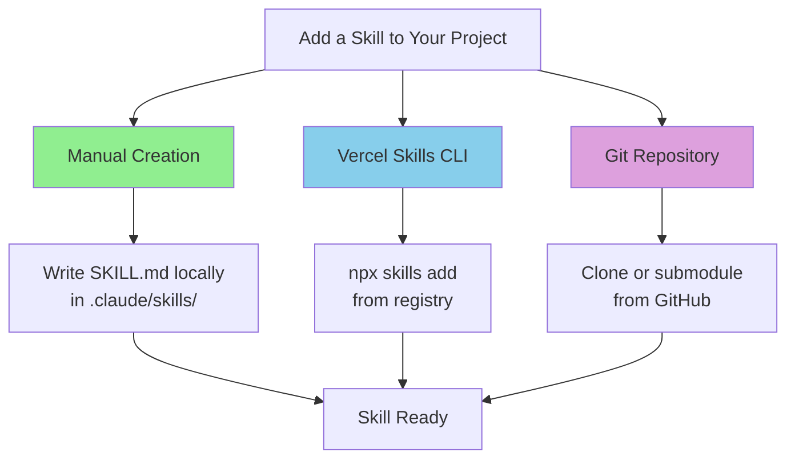
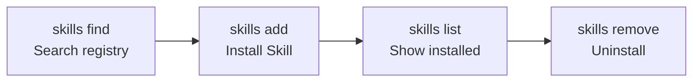
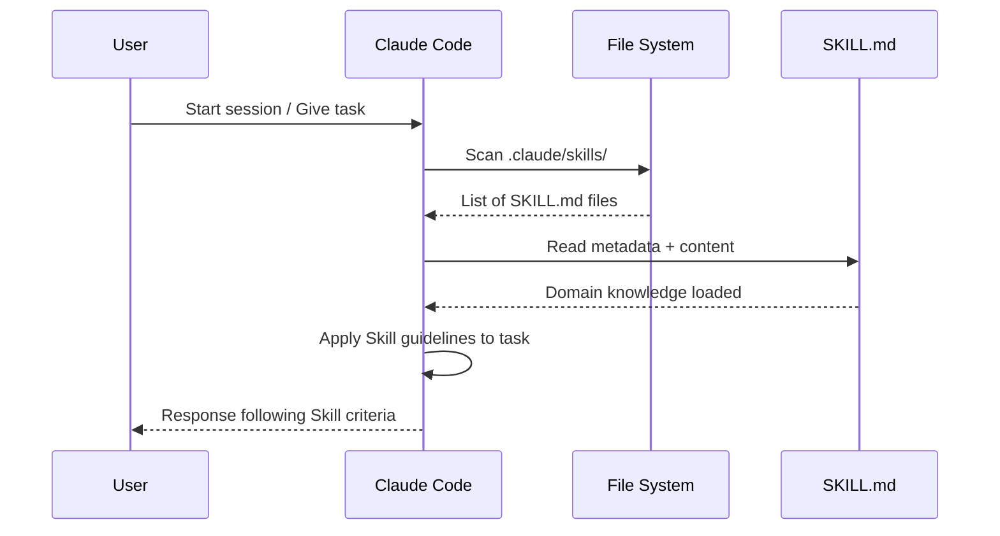
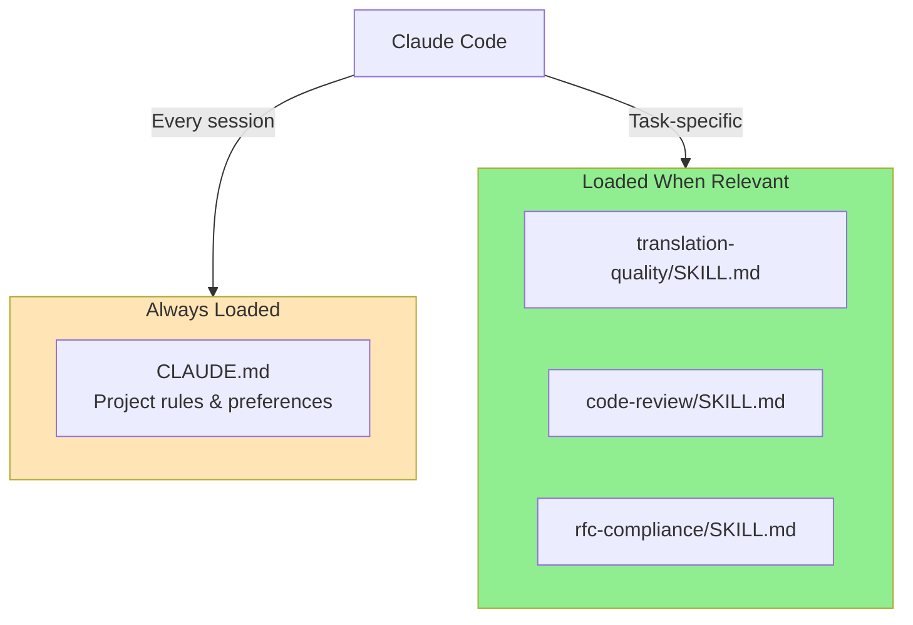
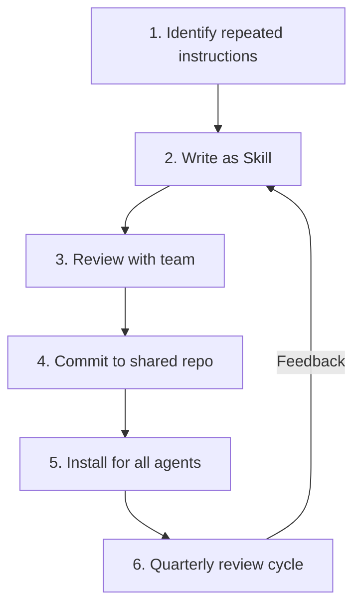

# How to Use Skills

> From installation to daily workflow — integrating Skills into your project and team.

## About This Document

This guide covers how to **install, configure, and use Skills** in real projects. Whether you're adding a community Skill from the registry or deploying your own to a team, this document walks through every integration pattern.

For creating new Skills, see [How to Create Skills](./how-to-create-skills). For deciding whether a Skill is the right approach, see [Skill Design Guide](./creating-skills).

## Three Ways to Add Skills



### Pattern 1: Manual Creation (Local)

The simplest approach — create the Skill directly in your project:

```bash
# Create directory and file
mkdir -p .claude/skills/my-skill
touch .claude/skills/my-skill/SKILL.md
```

Then write your SKILL.md content. See [How to Create Skills](./how-to-create-skills) for the step-by-step guide.

**Best for**: Project-specific Skills that won't be shared externally.

### Pattern 2: Vercel Skills CLI (Registry)

Install community Skills from the global registry:

```bash
# Search for Skills
npx skills find "code review"
npx skills search "translation"

# Add a specific Skill
npx skills add vercel-labs/agent-skills --skill frontend-design

# Add for multiple agents at once
npx skills add vercel-labs/agent-skills -a claude-code -a cursor

# Add a local Skill to the registry format
npx skills add ./local-skill
```

**Best for**: Leveraging community best practices and sharing Skills across projects.

### Pattern 3: Git Repository

Clone or reference Skills from a Git repository:

```bash
# Clone as a separate repo
git clone https://github.com/shuji-bonji/code-review-skill.git
cp -r code-review-skill/.claude/skills/* .claude/skills/

# Or add as a Git submodule
git submodule add https://github.com/shuji-bonji/code-review-skill.git .claude/skills/code-review
```

**Best for**: Team-maintained Skills with version control and collaborative updates.

## Vercel Skills CLI Complete Guide

### Installation

The CLI runs via `npx` — no global installation needed:

```bash
npx skills --help
```

### Core Commands



| Command | Description | Example |
|---------|-------------|---------|
| `npx skills find <query>` | Search the Skill registry | `npx skills find "code review"` |
| `npx skills search <query>` | Alias for `find` | `npx skills search "translation"` |
| `npx skills add <source>` | Install a Skill | `npx skills add vercel-labs/agent-skills` |
| `npx skills add <source> --skill <name>` | Install a specific Skill | `npx skills add vercel-labs/agent-skills --skill frontend-design` |
| `npx skills add <source> -a <agent>` | Install for a specific agent | `npx skills add ./my-skill -a cursor` |

### Agent Targeting

Use the `-a` flag to specify which agent(s) the Skill should be installed for:

```bash
# Single agent
npx skills add ./my-skill -a claude-code

# Multiple agents
npx skills add ./my-skill -a claude-code -a cursor -a windsurf

# All supported agents
npx skills add ./my-skill -a claude-code -a cursor -a codex -a opencode
```

Each agent stores Skills in a different directory:

| Agent | Install Path |
|-------|-------------|
| Claude Code | `.claude/skills/` |
| Cursor | `.cursor/skills/` |
| Windsurf | `.windsurf/skills/` |
| Codex | `.codex/skills/` |
| GitHub Copilot | `.github/skills/` |

## How Skills Are Loaded in Claude Code

Understanding how Claude Code discovers and applies Skills is key to effective usage.

### Auto-Discovery Mechanism



Claude Code automatically scans `.claude/skills/` at the start of each session. Any `SKILL.md` file found is loaded into the agent's context.

### Skills vs CLAUDE.md: Role Separation

A common question is "Should this go in CLAUDE.md or in a Skill?" Here's the distinction:

| Aspect | CLAUDE.md | Skills |
|--------|-----------|--------|
| **Scope** | Project-wide rules | Task-specific domain knowledge |
| **Content** | Coding style, project structure, tech stack | Workflows, quality criteria, decision thresholds |
| **Loaded** | Always (every session) | When relevant task is triggered |
| **Examples** | "Use TypeScript strict mode", "Follow Angular style guide" | "Translation quality must score ≥ 0.85", "Review in this order: Logic → Design → Style" |
| **Size** | Short and concise | Can be detailed (100-300 lines) |



**Rule of thumb**: If it applies to every task → CLAUDE.md. If it applies only to specific tasks → Skill.

## Multi-Agent Support

Skills following the Agent Skills Specification work across 16+ agents:

### Supported Agents

| Agent | CLI Argument | Project Path |
|-------|-------------|-------------|
| Claude Code | `claude-code` | `.claude/skills/` |
| Cursor | `cursor` | `.cursor/skills/` |
| Codex | `codex` | `.codex/skills/` |
| OpenCode | `opencode` | `.opencode/skills/` |
| GitHub Copilot | `github-copilot` | `.github/skills/` |
| Windsurf | `windsurf` | `.windsurf/skills/` |
| Cline | `cline` | `.cline/skills/` |
| Roo Code | `roo-code` | `.roo/skills/` |
| Gemini CLI | `gemini-cli` | `.gemini/skills/` |

Full list: https://github.com/vercel-labs/skills#supported-agents

### Cross-Agent Installation

To share Skills across multiple agents in your project:

```bash
# Install for all agents your team uses
npx skills add ./my-skill -a claude-code -a cursor -a windsurf
```

This creates copies of the Skill in each agent's designated directory.

## Project Integration Steps

### For Individual Developers

1. **Create your Skills directory**: `mkdir -p .claude/skills/`
2. **Add Skills**: Create manually or install via CLI
3. **Commit to Git**: Version control your Skills alongside code
4. **Iterate**: Refine Skills based on agent behavior

### For Teams



**Rollout steps:**

1. **Identify patterns**: What instructions do you repeat to the AI agent? Those are Skill candidates
2. **Start small**: Begin with one or two Skills for the most common workflows
3. **Share via Git**: Commit Skills to the project repository so all team members get them
4. **Set review cadence**: Schedule quarterly reviews to keep Skills aligned with actual workflows
5. **Track effectiveness**: Note when the agent follows Skill guidelines correctly vs when it doesn't

### Version Management

Since Skills are Markdown files in Git, you get version control for free:

```bash
# Track changes
git log --oneline .claude/skills/

# Compare versions
git diff HEAD~1 .claude/skills/code-review/SKILL.md

# Revert if needed
git checkout HEAD~1 -- .claude/skills/code-review/SKILL.md
```

**Semantic versioning** in the metadata (`version: 1.0.0`) helps communicate the nature of changes:
- **Major** (2.0.0): Breaking changes to workflow or criteria
- **Minor** (1.1.0): New sections or expanded examples
- **Patch** (1.0.1): Typo fixes, clarifications

## Troubleshooting

### Skills Not Being Loaded

| Symptom | Cause | Fix |
|---------|-------|-----|
| Agent ignores Skill | File not in correct directory | Verify path is `.claude/skills/<name>/SKILL.md` |
| Skill partially applied | File name is wrong | Must be `SKILL.md` (uppercase) |
| Skill not found after install | Wrong agent target | Check which agent you're using and its directory |

### Skill Not Working as Expected

| Symptom | Cause | Fix |
|---------|-------|-----|
| Agent doesn't follow workflow | Steps are too vague | Add specific actions to each workflow step |
| Wrong decisions made | Decision criteria are ambiguous | Add numeric thresholds and clear conditions |
| Inconsistent behavior | Missing examples | Add more input/output examples to the Skill |

### Common Mistakes

1. **Putting Skills in the wrong directory** — Must be `.claude/skills/`, not `.claude/skill/` or `skills/`
2. **Using lowercase `skill.md`** — The filename must be `SKILL.md` (uppercase)
3. **Overly broad Skills** — One Skill should focus on one domain (see [Anti-Patterns](./anti-patterns))
4. **No examples** — Agents rely heavily on examples for understanding expected behavior

## What to Read Next

| Purpose | Document |
|---------|----------|
| Create a new Skill | [How to Create Skills](./how-to-create-skills) |
| Explore use cases | [Skill Use Cases](./skill-use-cases) |
| Design decisions | [Skill Design Guide](./creating-skills) |
| Anti-patterns to avoid | [Anti-Patterns Guide](./anti-patterns) |
| See production examples | [Showcase](./showcase) |
| Compare MCP vs Skills | [MCP vs Skills](./vs-mcp) |
