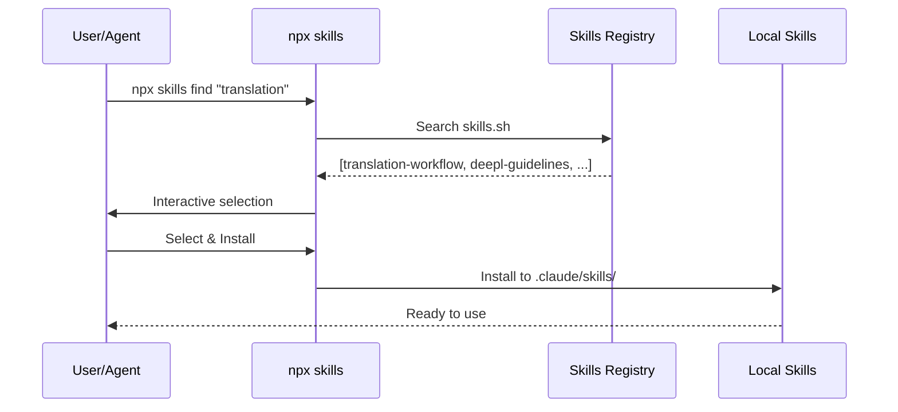
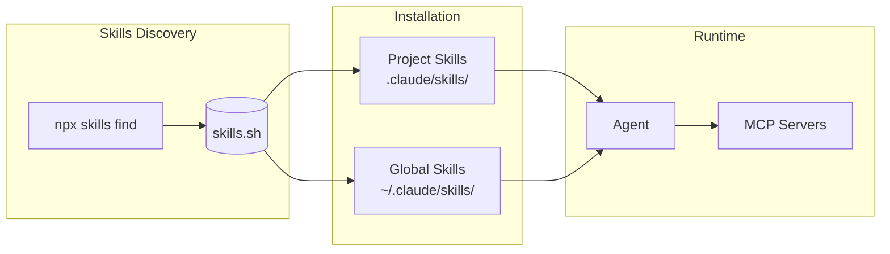

# Skills Overview

[日本語版 (Japanese)](./overview.ja.md)

## What are Vercel Skills?

Vercel Skills is a standardized domain knowledge representation framework for AI agents. Unlike MCP, it enables agents to acquire and utilize **executable know-how for specific domains and tasks**.

### Features

- **Systematized Domain Knowledge**: Structures expertise and best practices for specific fields
- **Interactive Discovery**: Agents can interactively explore available Skills
- **Standards Compliance**: Interoperability based on the Agent Skills Specification
- **Open Source**: [Vercel Skills v1.1.1](https://vercel.com/changelog/skills-v1-1-1-interactive-discovery-open-source-release-and-agent-support) has been released

## Agent Skills Specification

A specification standardized at [https://agentskills.io](https://agentskills.io).

## Supported Agents (27 types)

Vercel Skills CLI supports the following agents:

| Agent | CLI Argument | Project Path |
|-------|--------------|--------------|
| Claude Code | `claude-code` | `.claude/skills/` |
| Cursor | `cursor` | `.cursor/skills/` |
| Codex | `codex` | `.codex/skills/` |
| OpenCode | `opencode` | `.opencode/skills/` |
| GitHub Copilot | `github-copilot` | `.github/skills/` |
| Windsurf | `windsurf` | `.windsurf/skills/` |
| Cline | `cline` | `.cline/skills/` |
| Roo Code | `roo` | `.roo/skills/` |
| Gemini CLI | `gemini-cli` | `.gemini/skills/` |
| Others | ... | ... |

> For the complete list, see [Vercel Skills README](https://github.com/vercel-labs/skills#supported-agents)

## Skill Components

### 1. Metadata

```json
{
	"name": "frontend-design",
	"version": "1.0.0",
	"description": "Best practices for React/Next.js frontend design",
	"author": "example-org",
	"tags": ["frontend", "react", "design"]
}
```

### 2. Executable Guidelines

- Recommended directory structure patterns
- Component design principles
- Test coverage requirements
- Performance optimization guidelines

### 3. Real-time Learning

- Agents acquire Skills through dialogue
- Implementation within context during task execution

## Choosing Between MCP and Skills

| Aspect | MCP | Skills |
|--------|-----|--------|
| **Purpose** | External tool/API integration | Domain knowledge/executable know-how |
| **Target** | External systems | Implementation patterns/best practices |
| **Use Cases** | rfcxml-mcp, deepl-mcp | frontend-design, doc-coauthoring |
| **Operation Mode** | Server process | In-memory (Skill model) |

> For details, see [vs-mcp.md](./vs-mcp.md).

## Skills Creation and Utilization Patterns

1. **Documentation Phase**
   - Convert team best practices into Skills
   - Example: Figma design guide → `design-system-skill`

2. **Agent Acquisition Phase**
   - Agents acquire domain knowledge through Skills
   - Deepen understanding through interactive queries

3. **Operation and Improvement Phase**
   - Feedback from agent execution results
   - Continuously optimize Skill content

## Integration with Vercel Skills CLI

### Skills Discovery Flow with find-skills



### Dynamic Skills Extension Pattern



### Installation Command Examples

```bash
# Search for Skills
npx skills find "code review"

# Install a specific Skill
npx skills add vercel-labs/agent-skills --skill frontend-design

# Support multiple agents
npx skills add vercel-labs/agent-skills -a claude-code -a cursor

# Install at project scope (default)
npx skills add ./my-skills

# Install at global scope
npx skills add ./my-skills -g
```

## Reference Links

- [Agent Skills Specification](https://agentskills.io)
- [Vercel Skills Official Documentation](https://vercel.com/changelog/skills-v1-1-1-interactive-discovery-open-source-release-and-agent-support)
- [Related Links Collection](../../references/skills/links.md)
