# Skill Showcase

> Real-world examples of Skills in production. For those who want to see implementation, not just concepts.

## About This Document

After learning concepts in [What is Skills](./what-is-skills) and design methods in [Creating Skills](./creating-skills), this page presents **three production Skill implementations**. Each demonstrates a different design approach, MCP integration depth, and distribution format, providing a practical reference for Skill design patterns.

## Examples Overview

| Skill | Pattern | MCP Integration | Distribution |
|---|---|---|---|
| [deepl-glossary-translation](#deepl-glossary-translation) | MCP Orchestration | pdf-spec-mcp + DeepL MCP | `.claude/skills/` |
| [code-review-skill](#code-review-skill) | Checklist-based | None (static knowledge only) | `.claude/skills/` / Project Knowledge |
| [spec-compliance-skills](#spec-compliance-skills) | Data-driven Validation | None (pre-parsed data) | Cowork Plugin |

## deepl-glossary-translation

**Repository**: [shuji-bonji/deepl-glossary-translation](https://github.com/shuji-bonji/deepl-glossary-translation)

### Overview

A Skill that integrates pdf-spec-mcp and DeepL MCP Server to translate the PDF specification (ISO 32000-2) into Japanese with **consistent terminology**. MCP provides "what can be done" while the Skill defines "how to do it" — a quintessential example of the three-layer architecture.

### Architecture

### Design Highlights

**Multi-MCP Orchestration**: Chains pdf-spec-mcp (data extraction) → DeepL MCP (translation) → xcomet-mcp (quality evaluation). The Skill itself has no tools — it defines the "usage patterns" for existing MCPs.

**5-Step Workflow Definition**: Term extraction → Classification → Glossary registration → Translation → Quality verification. Clear steps in Markdown that agents follow autonomously.

**External Script Augmentation**: Glossary registration requires direct DeepL API calls, so shell scripts are bundled in `scripts/`. This pattern complements Skill's static knowledge with executable scripts.

### Classification

Maps to **Pattern 4: MCPs + Skills (Full Integration)** in [Composition Patterns](../strategy/composition-patterns).

---

## code-review-skill

**Repository**: [shuji-bonji/code-review-skill](https://github.com/shuji-bonji/code-review-skill)

### Overview

A Skill for conducting code reviews on TypeScript / MCP Server projects. Defines 10-category evaluation criteria and a 3-tier priority framework for consistent review quality.

### 10-Category Checklist

| Category | Example Checks |
|---|---|
| Bug Detection | Placeholder detection, null checks, async handling |
| User Messages | Language consistency, error actionability |
| Code Suppressions | `eslint-disable` / `@ts-ignore` necessity verification |
| Hardcoding | Magic numbers, embedded config values |
| Performance | N+1 problems, cache gaps, sequential async calls |
| Redundancy | Code duplication, unused variables, dead code |
| Type Safety | Eliminate `any` types, validate external data with Zod |
| Maintainability | Responsibility separation, dependency direction |
| Code Structure | File size >300 lines, function >50 lines, circular dependencies |
| Project-specific | MCP: tool descriptions, Zod `.strict()` / Angular: component separation |

### Priority Framework

| Level | Targets |
|---|---|
| 🔴 High | Runtime bugs, security issues, performance degradation |
| 🟡 Medium | Bug-prone structures, weakened type safety |
| 🟢 Low | Readability improvements, minor refactoring |

### Design Highlights

**Pure Skill (no MCP required)**: No external API calls needed. Works by combining with the agent's built-in code analysis capabilities. The simplest form of a Skill.

**Split Placement Design**: Recommends different detail levels for Claude.ai (Project Knowledge) vs Claude Code (`.claude/`). A `PLACEMENT-GUIDE.md` addresses context window constraints.

### Classification

A **Skills-only** pattern in the three-layer architecture. Demonstrates that Skills can be fully effective without MCP.

---

## spec-compliance-skills

**Repository**: [shuji-bonji/spec-compliance-skills](https://github.com/shuji-bonji/spec-compliance-skills)

### Overview

A Cowork Plugin that validates document compliance against W3C/IETF specifications. Ships with pre-parsed normative requirements (MUST/SHOULD/MAY) as embedded data, generating structured validation reports.

### Included Skills

```mermaid
graph LR
    subgraph Plugin["spec-compliance-skills"]
        E["epub-quality<br/>✅ Available"]
        P["pdf-quality<br/>🔧 In Progress"]
        R["rfc-compliance<br/>🔧 In Progress"]
    end

    E --> E1["EPUB 3.3<br/>135 requirements"]
    E --> E2["Accessibility 1.1<br/>31 requirements"]
    P --> P1["PDF/A"]
    P --> P2["PDF/UA"]
    R --> R1["Various IETF RFCs"]

    style E fill:#90EE90,color:#333
    style P fill:#FFD700,color:#333
    style R fill:#FFD700,color:#333
```

### epub-quality Validation Flow

### Design Highlights

**Data-driven Validation**: Pre-parses normative requirements from specifications into JSON, bundled within the Skill. Enables validation without real-time MCP server access.

**Skill → Plugin Evolution**: Functions as a standalone Skill but distributes as a Cowork Plugin (`.plugin`) for easier installation and updates. An example of Skill distribution evolution.

**Incremental Expansion**: Released epub-quality first, with pdf-quality and rfc-compliance added progressively. A pattern for bundling multiple Skills in a single Plugin.

### Classification

A **Skills-only (data-embedded)** pattern in the three-layer architecture. Instead of real-time data from MCP, it embeds pre-parsed data within the Skill.

---

## Skill Design Space

Skills start with the simple definition of "knowledge written in Markdown," but in practice they encompass diverse design patterns: bundled data files, companion scripts, MCP integration definitions, and Plugin distribution. The key insight is that **the essence of a Skill (providing knowledge to agents) remains constant across all patterns**.
