# Skill Use Cases

> When, where, and how to apply Skills — use case patterns and role separation with MCP and CLAUDE.md.

## About This Document

This guide helps you identify **where Skills add value** in your workflow. It introduces two fundamental Skill types, walks through concrete use cases by category, and clarifies how Skills, MCPs, and CLAUDE.md each play their part.

For creating Skills, see [How to Create Skills](./how-to-create-skills). For integrating them into your project, see [How to Use Skills](./how-to-use-skills).

## Two Types of Skills

Every Skill falls into one of two fundamental types. Understanding this distinction is the key to designing effective Skills.

### Knowledge-Providing Type

**What it does**: Provides static criteria, checklists, and standards that the agent references during execution.

**Characteristics**:
- No external tools required
- Agent applies the knowledge using its built-in capabilities
- Works as a standalone reference

**Examples**: code-review-skill, spec-compliance-skills

```markdown
# Example: code-review Skill (Knowledge-Providing)
## Decision Criteria
| Condition            | Action              |
| -------------------- | ------------------- |
| ESLint errors > 0    | ❌ request-changes  |
| `any` type found     | ❌ request-changes  |
| Coverage < 80%       | ⚠️ request-changes  |
```

### Execution-Guiding Type

**What it does**: Defines a multi-step workflow that orchestrates one or more MCPs. The Skill provides the "how to use" while MCPs provide the "what can be done."

**Characteristics**:
- Requires MCP integration
- Defines step-by-step procedures the agent follows
- Coordinates multiple tools in sequence

**Examples**: deepl-glossary-translation

```markdown
# Example: translation-workflow Skill (Execution-Guiding)
## Workflow
1. Extract terms from source → pdf-spec-mcp
2. Classify and register glossary → DeepL MCP
3. Translate with glossary → DeepL MCP
4. Evaluate quality → xcomet-mcp
5. Fix issues if score < 0.85
```

### Comparison


| Aspect | Knowledge-Providing | Execution-Guiding |
|--------|--------------------|--------------------|
| **MCP Required** | No | Yes |
| **Complexity** | Low-Medium | Medium-High |
| **Agent Dependency** | Built-in capabilities | Specific MCP tools |
| **Best For** | Standards, reviews, checks | Workflows, orchestration |
| **Maintenance** | Update criteria as standards change | Update when MCP APIs or workflows change |

## Use Cases by Category

### Document Generation & Translation

**Scenario**: Your team regularly translates technical documentation and needs consistent terminology and quality.

**Skill Approach** (Execution-Guiding):


**Real implementation**: [deepl-glossary-translation](https://github.com/shuji-bonji/deepl-glossary-translation)

**Key Skill elements**:
- Terminology classification rules (acronyms vs translatable terms)
- Quality threshold: score ≥ 0.85
- Glossary registration workflow
- Post-evaluation fix cycle

### Code Quality & Review

**Scenario**: Your team wants consistent code reviews that don't miss critical issues regardless of who reviews.

**Skill Approach** (Knowledge-Providing):

The Skill defines 10 evaluation categories with a priority framework:

| Priority | Focus Areas |
|----------|-------------|
| 🔴 High | Runtime bugs, security issues, performance degradation |
| 🟡 Medium | Bug-prone structures, weakened type safety |
| 🟢 Low | Readability improvements, minor refactoring |

**Real implementation**: [code-review-skill](https://github.com/shuji-bonji/code-review-skill)

**Key Skill elements**:
- 10-category checklist (Bug Detection, Performance, Type Safety, etc.)
- 3-tier priority framework
- Project-specific rules (MCP: tool descriptions, Angular: component separation)
- Split placement design for different agent contexts

### Specification Compliance

**Scenario**: You produce documents (EPUB, PDF) that must comply with W3C/IETF specifications.

**Skill Approach** (Knowledge-Providing with Embedded Data):


**Real implementation**: [spec-compliance-skills](https://github.com/shuji-bonji/spec-compliance-skills)

**Key Skill elements**:
- Pre-parsed normative requirements (MUST/SHOULD/MAY) as JSON
- No MCP required — data is embedded in the Skill
- Incremental expansion: start with one spec, add more over time
- Distributed as a Cowork Plugin for easy installation

### Project-Specific Knowledge

**Scenario**: New team members keep asking the same questions about project conventions, architecture decisions, and deployment processes.

**Skill Approach** (Knowledge-Providing):

| Skill | Content | For |
|-------|---------|-----|
| `onboarding` | Project structure, key commands, coding conventions | New members |
| `architecture-decisions` | ADR summaries, why certain patterns were chosen | All members |
| `deployment-checklist` | Pre-deploy checks, staging verification steps | Deployers |
| `domain-glossary` | Business domain terms with correct usage | Everyone |

**Key Skill elements**:
- Written in Markdown that anyone can update
- Captures tribal knowledge that otherwise lives only in people's heads
- Agents reference these when answering project-specific questions

### CI/CD Integration

**Scenario**: You want the AI agent to follow specific procedures when working with your CI/CD pipeline.

**Skill Approach** (Execution-Guiding):

```markdown
## Workflow
1. Run tests locally before pushing
2. Check CI status after push
3. If CI fails, analyze logs and suggest fixes
4. Follow branch naming convention: feature/TICKET-xxx
5. PR description must include test plan section
```

**Key Skill elements**:
- Step-by-step procedures the agent follows when creating PRs
- Decision criteria for when to request human intervention
- Integration with project-specific tooling

## Role Separation: Skills vs MCP vs CLAUDE.md

Understanding which tool to use is critical. Use this decision flowchart:

```mermaid
flowchart TD
    Q["New knowledge to add"] --> Q1{"Does it apply to<br/>EVERY task?"}
    Q1 -->|Yes| CLAUDE["→ CLAUDE.md<br/>Project-wide rules"]
    Q1 -->|No| Q2{"Does it need<br/>external tools?"}
    Q2 -->|Yes, tools needed| Q3{"Are the tools<br/>already available as MCP?"}
    Q3 -->|Yes| SKILL_EXEC["→ Execution-Guiding Skill<br/>Orchestrate existing MCPs"]
    Q3 -->|No| MCP["→ Build MCP first<br/>Then create orchestrating Skill"]
    Q2 -->|No, static knowledge| SKILL_KNOW["→ Knowledge-Providing Skill<br/>Criteria, checklists, workflows"]

    style CLAUDE fill:#FFE4B5,color:#333
    style SKILL_EXEC fill:#90EE90,color:#333
    style SKILL_KNOW fill:#87CEEB,color:#333
    style MCP fill:#FFB6C1,color:#333
```



### Concrete Examples

| Knowledge | Best Placement | Why |
|-----------|----------------|-----|
| "Always use TypeScript strict mode" | CLAUDE.md | Applies to every task |
| "Translation quality must be ≥ 0.85" | Skill (Knowledge) | Task-specific threshold |
| "Translate using DeepL → evaluate with xCOMET → fix" | Skill (Execution) | Multi-step MCP workflow |
| "Call DeepL API to translate text" | MCP | External tool capability |
| "Project uses Angular 17 with standalone components" | CLAUDE.md | Project-wide context |
| "Review code in this order: Logic → Design → Style" | Skill (Knowledge) | Task-specific procedure |

### Combined Patterns

In practice, these three often work together:


## Discovering New Use Cases

### The "Repeated Instruction" Method

The easiest way to find Skill candidates:

1. **Track what you repeat**: Keep a list of instructions you give the AI agent more than once
2. **Group by domain**: Cluster similar instructions together
3. **Write as Skill**: Convert each cluster into a structured SKILL.md
4. **Validate**: Test with the agent and iterate

### Common Signals

You should create a Skill when:

- You find yourself saying "Remember to always..." to the AI agent
- Different team members give the agent conflicting instructions
- The agent keeps making the same type of mistake
- You have a checklist you mentally reference but haven't written down
- A workflow involves multiple tools that need to be used in a specific order

### From Implicit to Explicit Knowledge


The progression from implicit knowledge to shared Skills:

| Stage | Form | Problem |
|-------|------|---------|
| Implicit | "I know this, but haven't written it down" | Lost when people leave |
| Written | Chat messages, wiki pages, PR comments | Scattered, hard to find |
| Structured | SKILL.md with defined format | Agent can reference directly |
| Shared | Git-tracked, registry-published | Team-wide, version-controlled |

## What to Read Next

| Purpose | Document |
|---------|----------|
| Create a Skill | [How to Create Skills](./how-to-create-skills) |
| Integrate into project | [How to Use Skills](./how-to-use-skills) |
| See production examples | [Showcase](./showcase) |
| Anti-patterns to avoid | [Anti-Patterns Guide](./anti-patterns) |
| Design decisions | [Skill Design Guide](./creating-skills) |
| Compare MCP vs Skills | [MCP vs Skills](./vs-mcp) |
